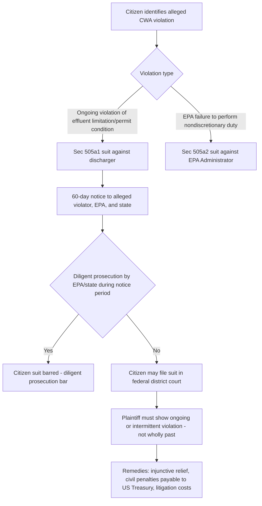

## Citizen Suits and Enforcement Mechanisms Under the Clean Water Act

### Overview of the CWA's Multi-Track Enforcement Structure

The Clean Water Act relies on a layered enforcement architecture combining federal administrative and judicial enforcement, state enforcement (in states with approved NPDES programs), and citizen suit enforcement, reflecting Congress's judgment that agency enforcement resources alone would be insufficient to ensure widespread compliance with the Act's permitting and effluent limitation requirements.

**Key Points**

- **Federal enforcement**: EPA may pursue administrative penalty orders, civil judicial enforcement actions (through the Department of Justice), and, for knowing or negligent violations, criminal referral.
- **State enforcement**: States with EPA-approved NPDES programs have primary enforcement responsibility within their programs, subject to EPA oversight and residual federal enforcement authority.
- **Citizen suit enforcement**: CWA § 505, 33 U.S.C. § 1365, authorizes private citizens to bring civil actions against alleged violators, functioning as a critical supplement to (and, in practice, a significant driver of) overall CWA compliance.

### Citizen Suit Provision: Structure and Scope

CWA § 505(a) authorizes any citizen to commence a civil action on their own behalf against:

1. **§ 505(a)(1)**: Any person (including the United States and other governmental instrumentalities) alleged to be in violation of an effluent standard or limitation, or an order issued by EPA or a state with respect to such a standard or limitation.
2. **§ 505(a)(2)**: The EPA Administrator, where there is an alleged failure to perform any nondiscretionary act or duty under the Act.

### The 60-Day Notice Requirement

**Key Points**

- Before filing a citizen suit under § 505(a)(1), a prospective plaintiff must provide 60 days' written notice of the alleged violation to the EPA Administrator, the state in which the violation occurs, and the alleged violator itself.
- The notice requirement serves two purposes: giving the alleged violator an opportunity to achieve compliance without litigation, and giving federal/state enforcement authorities an opportunity to initiate their own enforcement action, which (if diligently prosecuted) would bar the citizen suit.
- Strict compliance with notice content and timing requirements has historically been treated as a jurisdictional prerequisite by many courts, making notice defects a frequent basis for dismissal in citizen suit litigation.

### The Diligent Prosecution Bar

§ 505(b) bars a citizen suit if EPA or the state has already commenced and is diligently prosecuting a civil or criminal action in a court to require compliance with the same standard, limitation, or order. This provision is designed to prevent duplicative litigation while preserving the citizen suit as a backstop where government enforcement is absent or inadequate.

**Key Points**

- "Diligent prosecution" has been the subject of substantial litigation regarding how much government enforcement activity is sufficient to trigger the bar — courts generally require an actual pending judicial (not merely administrative) enforcement action, prosecuted with genuine diligence rather than pro forma or token engagement.
- A settled consent decree resulting from government enforcement, if it addresses the same violations comprehensively, can similarly preclude a later or concurrent citizen suit addressing those same violations.
- Some courts have distinguished purely administrative enforcement (which does not trigger the § 505(b) bar in most circuits) from judicial enforcement (which does), reflecting the statutory text's specific reference to an action "in a court."

### The "Ongoing Violation" Requirement: *Gwaltney*

A foundational limitation on citizen suit jurisdiction comes from *Gwaltney of Smithfield, Ltd. v. Chesapeake Bay Foundation, Inc.*, 484 U.S. 49 (1987), in which the Supreme Court held that § 505 citizen suits require an allegation of an ongoing or intermittent violation — a citizen suit may not be based on a wholly past violation with no reasonable likelihood of recurrence.

**Key Points**

- *Gwaltney* requires plaintiffs to allege, in good faith, that the violation is continuing at the time the complaint is filed, or that there is a reasonable likelihood the violation will recur.
- A defendant that has ceased the violating conduct and can demonstrate no reasonable likelihood of recurrence may defeat citizen suit jurisdiction on this ground, though courts have generally required a high showing (akin to mootness doctrine's stringent voluntary cessation standard) before dismissing on this basis.
- This requirement distinguishes the citizen suit mechanism from a purely retrospective penalty-seeking mechanism; its core purpose is to compel ongoing or future compliance, though civil penalties (discussed below) remain an available remedy once suit is properly filed.

### Remedies Available in Citizen Suits

- **Injunctive relief**: Courts may order the defendant to comply with applicable permit conditions, effluent limitations, or other CWA requirements, including cessation of unpermitted discharges.
- **Civil penalties**: Courts may impose civil penalties for violations, payable to the U.S. Treasury (not to the citizen plaintiff), calculated per day of violation up to a statutory maximum, subject to inflation adjustment under the Federal Civil Penalties Inflation Adjustment Act.
- **Litigation costs and attorney's fees**: § 505(d) authorizes courts to award litigation costs, including reasonable attorney and expert witness fees, to any party (though in practice predominantly to prevailing or substantially prevailing citizen plaintiffs) whenever the court determines such an award is appropriate — a significant fee-shifting provision that helps make citizen enforcement economically viable for environmental organizations and affected individuals.
- Because penalties are paid to the Treasury rather than the plaintiff, citizen suits are understood as vindicating a public regulatory interest rather than functioning as a private damages remedy, consistent with their structural role as a supplement to government enforcement.

### Standing Requirements for Citizen Plaintiffs

Citizen suit plaintiffs must satisfy Article III standing requirements, generally analyzed under the CWA context through *Friends of the Earth, Inc. v. Laidlaw Environmental Services (TOC), Inc.*, 528 U.S. 167 (2000):

**Key Points**

- **Injury in fact**: Plaintiffs must show a concrete and particularized injury, which in the environmental citizen suit context is typically satisfied by demonstrating reduced recreational, aesthetic, or economic use/enjoyment of the affected water body by the specific individual plaintiffs (not merely a generalized environmental harm).
- **Causal connection**: The injury must be fairly traceable to the defendant's alleged violation.
- **Redressability**: A favorable judicial decision (injunctive relief and/or civil penalties, which can deter future violations) must be likely to redress the injury — *Laidlaw* held that civil penalties payable to the Treasury can still redress a plaintiff's injury through their deterrent effect on future violations, even though the plaintiff receives no direct monetary benefit.
- *Laidlaw* also clarified that a defendant's post-complaint compliance does not necessarily moot a citizen suit already properly filed, distinguishing mootness analysis from the *Gwaltney* ongoing-violation pleading requirement at the time of filing.

### Discharge Monitoring Reports as a Common Evidentiary Basis

**Key Points**

- Because NPDES permittees must self-report compliance data through Discharge Monitoring Reports (DMRs), these publicly available records are a frequent and legally significant evidentiary basis for citizen suits — a permittee's own self-reported exceedances can establish a prima facie violation without the citizen plaintiff needing to conduct independent sampling.
- This self-reporting architecture, combined with citizen suit enforcement, creates a powerful compliance incentive: permittees know that DMR data is both the primary compliance verification tool and potential litigation evidence, reinforcing accurate self-monitoring practices (though also creating documented tension in cases involving alleged underreporting or falsification).

### Comparison: Federal/State Enforcement Versus Citizen Suits

| Dimension | Federal/State Agency Enforcement | Citizen Suit Enforcement |
| --- | --- | --- |
| Who may bring action | EPA, DOJ, state agencies (approved programs) | Any citizen with Article III standing |
| Prerequisite | None (agency discretion) | 60-day notice; no diligent prosecution by government |
| Penalty recipient | U.S. Treasury or state fund | U.S. Treasury (not the plaintiff) |
| Available remedies | Administrative penalties, civil penalties, injunctive relief, criminal penalties | Injunctive relief, civil penalties, litigation costs/fees |
| Primary evidentiary basis | Inspections, DMRs, agency investigation | Often DMRs; sometimes independent sampling/investigation |
| Role of prosecutorial discretion | Central — agency decides whether/how to pursue | Largely absent — citizen plaintiff drives the litigation directly |

### Interaction with Enforcement Discretion and the "Gap-Filling" Function

[Inference] A recurring theme in coursework and commentary is that citizen suits function as a check on both underenforcement (where an agency lacks resources or political will to pursue a violation) and non-enforcement of nondiscretionary duties (where EPA itself fails to perform a statutorily mandated action, actionable under § 505(a)(2)) — giving citizen suits a dual role as both a compliance-forcing mechanism against private/public dischargers and an accountability mechanism against EPA's own performance of its statutory obligations.

### Example

An environmental organization discovers, through publicly available DMR data, that a permitted industrial facility has repeatedly exceeded its BOD effluent limitation over the preceding several months, with the most recent exceedance occurring within the last reporting period. After providing 60 days' written notice to the facility, EPA, and the state agency, and confirming that neither has commenced a diligent judicial enforcement action addressing those specific exceedances, the organization may file a § 505(a)(1) citizen suit in federal district court, seeking injunctive relief requiring future compliance, civil penalties payable to the Treasury for the established violations, and an award of litigation costs and attorney's fees under § 505(d) given the strong DMR-based evidentiary record.

**Related Topics**

- NPDES permitting program structure and effluent limitations
- Discharge Monitoring Reports (DMRs) and self-reporting compliance architecture
- *Friends of the Earth v. Laidlaw* and environmental standing doctrine
- *Gwaltney v. Chesapeake Bay Foundation* and the ongoing-violation requirement
- Administrative and civil penalty structures under CWA § 309
- Citizen suit provisions across other environmental statutes (CAA § 304, RCRA § 7002)