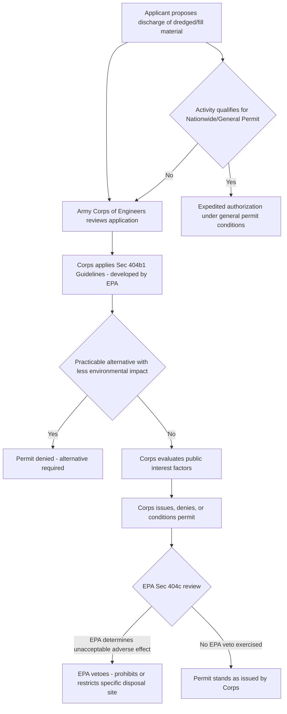

## Section 404 Dredge and Fill Permitting and the Corps/EPA Division of Authority

### Statutory Basis

CWA § 404, 33 U.S.C. § 1344, establishes a separate permitting track from § 402's NPDES program, governing the discharge of dredged or fill material into waters of the United States, including many wetlands. Unlike NPDES, which addresses pollutant discharges generally, § 404 specifically targets physical alteration of aquatic environments through the placement of dredged material (excavated material) or fill material (material used to replace an aquatic area with dry land or change the bottom elevation).

**Key Points**

- "Dredged material" and "fill material" are terms of art defined in EPA/Corps regulations, distinguishing § 404-regulated activities (physical placement of material) from § 402-regulated activities (discharge of pollutants in the traditional effluent sense), though the two programs can overlap for certain activities.
- § 404 permitting reaches activities such as wetlands filling for development, construction of dams and levees, mining overburden disposal, and infrastructure projects (roads, pipelines, utility crossings) that require material placement in jurisdictional waters.
- Because wetlands provide significant flood control, water filtration, and habitat functions, § 404 has historically been one of the CWA's most consequential and litigated programs for land use and development regulation.

### The Bifurcated Administrative Structure

**Key Points**

- **Army Corps of Engineers**: Serves as the primary permitting authority, responsible for reviewing individual permit applications, issuing (or denying) permits, and administering the nationwide and regional general permit programs.
- **EPA**: Retains several distinct but significant authorities layered onto the Corps' primary permitting role, despite not being the primary permit-issuing agency.
- This bifurcated structure — Corps as primary permittor, EPA retaining substantive standard-setting and override authority — is a distinctive feature of § 404 not replicated in the NPDES program's more unified EPA/state administrative structure.

### EPA's Role: The § 404(b)(1) Guidelines

Although the Corps issues individual permits, EPA developed and retains authority over the substantive environmental review criteria the Corps must apply: the § 404(b)(1) Guidelines, codified at 40 C.F.R. Part 230. These Guidelines function as the environmental "law" of § 404 permitting, even though the Corps administers the permit process itself.

**Key Points**

- **Practicable alternatives analysis**: The Guidelines' central requirement — no permit may be issued if a practicable alternative exists that would have a less adverse impact on the aquatic ecosystem, so long as the alternative does not have other significant adverse environmental consequences.
- **Presumption against non-water-dependent activities in special aquatic sites**: For activities not requiring access or proximity to water to fulfill their basic purpose (i.e., not "water-dependent"), located in or near a special aquatic site (including wetlands), practicable alternatives are presumed to exist unless clearly demonstrated otherwise — a significant substantive hurdle for many wetland-filling development proposals.
- **Minimization and mitigation requirements**: Even where a practicable alternative does not exist, the Guidelines require appropriate steps to minimize adverse impacts, and typically require compensatory mitigation (restoration, creation, enhancement, or preservation of aquatic resources, often through mitigation banking) for unavoidable impacts.
- **No significant degradation requirement**: The Guidelines prohibit permit issuance if the discharge would cause or contribute to significant degradation of waters of the United States, considering cumulative effects.

### EPA's Veto Authority: § 404(c)

CWA § 404(c) grants EPA an extraordinary and rarely used authority: even after the Corps has issued (or proposes to issue) a § 404 permit, EPA may prohibit, deny, restrict, or withdraw the use of any defined area as a disposal site if EPA determines, after notice and opportunity for public hearing, that the discharge would have an unacceptable adverse effect on municipal water supplies, shellfish beds and fishery areas, wildlife, or recreational areas.

**Key Points**

- § 404(c) authority may be exercised before, during, or after Corps permit issuance, giving EPA a genuine veto power over specific disposal sites independent of the Corps' own permitting decision.
- This authority has been exercised sparingly across the program's history, reflecting both its political sensitivity (directly overriding another federal agency's permitting decision) and the significant procedural requirements (notice, hearing, formal findings) attached to its exercise.
- Notable historic exercises of § 404(c) veto authority have involved large-scale, high-profile projects with significant aquatic ecosystem impacts, illustrating the authority's function as a backstop for cases where the Corps' ordinary permitting process is viewed by EPA as insufficiently protective.

### Permit Types: Individual Versus General Permits

| Permit Type | Scope | Review Process | Typical Use Case |
| --- | --- | --- | --- |
| Individual Permit | Project-specific, case-by-case review | Full public notice/comment, § 404(b)(1) Guidelines analysis, potential EIS under NEPA | Larger or more environmentally significant projects |
| Nationwide Permit (NWP) | Pre-authorized categories of activities with minimal individual/cumulative impact | Streamlined; activity must meet specific NWP conditions; may require pre-construction notification | Utility line crossings, minor road crossings, residential developments below specified impact thresholds |
| Regional General Permit | Similar to NWPs but tailored to specific Corps districts/regions | Streamlined, district-specific conditions | Activities common to a particular geographic region with predictable, minor impacts |

### Jurisdictional Scope: "Waters of the United States"

**Key Points**

- § 404 permitting requirements apply only to discharges into "waters of the United States" (WOTUS), a jurisdictional term whose precise scope has been the subject of extensive and evolving litigation, most significantly *Rapanos v. United States*, 547 U.S. 715 (2006), and *Sackett v. EPA*, 598 U.S. 651 (2023).
- The WOTUS jurisdictional question is analytically distinct from, but foundational to, the § 404 permitting process: an activity affecting a water body outside CWA jurisdiction requires no § 404 permit at all, regardless of the Corps/EPA authority structure described above.
- Wetlands jurisdiction specifically turns on whether a wetland has a sufficient connection (historically debated in terms of "significant nexus" versus "continuous surface connection" standards) to a traditionally navigable water to fall within WOTUS.

### Enforcement Authority

Both the Corps and EPA hold enforcement authority for unpermitted § 404 discharges, though their roles are again somewhat distinct:

- **Corps enforcement**: Primary responsibility for enforcement actions related to permit compliance and unpermitted activities, including administrative orders and referral for civil/criminal prosecution.
- **EPA enforcement**: Concurrent authority to pursue enforcement, particularly significant in cases EPA views as having substantial environmental consequences or where coordination with the Corps' civil works mission creates institutional friction (since the Corps also has civil works construction responsibilities that can create an inherent tension with its regulatory permitting role).
- **Citizen suits**: § 505 citizen suit enforcement, discussed in the broader CWA enforcement context, extends to unpermitted § 404 discharges as violations of the Act's general discharge prohibition.

### Mitigation and Compensatory Mitigation Hierarchy

For unavoidable wetland/aquatic resource impacts authorized under a § 404 permit, applicants must generally provide compensatory mitigation following a preference hierarchy established in the 2008 Mitigation Rule (40 C.F.R. Part 230, Subpart J):

1. **Mitigation bank credits**: Purchasing credits from an approved, already-established mitigation bank (preferred, due to greater ecological reliability and reduced temporal loss of function).
2. **In-lieu fee program credits**: Paying into an approved in-lieu fee program that pools funds for later, planned mitigation projects.
3. **Permittee-responsible mitigation**: The applicant directly restores, creates, enhances, or preserves aquatic resources, typically as a lower preference given greater implementation and long-term performance uncertainty.

### Example

A developer proposing to fill 5 acres of wetland to construct a shopping center would need to demonstrate to the Corps, applying EPA's § 404(b)(1) Guidelines, that no practicable alternative exists with less adverse impact on the aquatic ecosystem — a significant hurdle given the presumption against practicable alternatives for non-water-dependent activities in wetlands. If the Corps issues the permit despite EPA's concerns about impacts to an adjacent shellfish bed, EPA could, in a rare and significant exercise of authority, invoke its § 404(c) veto to prohibit use of the site, even after Corps issuance — illustrating the practical significance of the bifurcated Corps/EPA authority structure in cases of genuine interagency disagreement over a project's environmental acceptability.

**Related Topics**

- Waters of the United States (WOTUS) jurisdictional scope and *Sackett v. EPA*
- *Rapanos v. United States* and the plurality/concurrence jurisdictional tests
- Wetlands mitigation banking and the compensatory mitigation hierarchy
- Nationwide Permit program structure and specific NWP categories
- NEPA environmental impact statement requirements for individual § 404 permits
- Citizen suit enforcement of unpermitted § 404 discharges