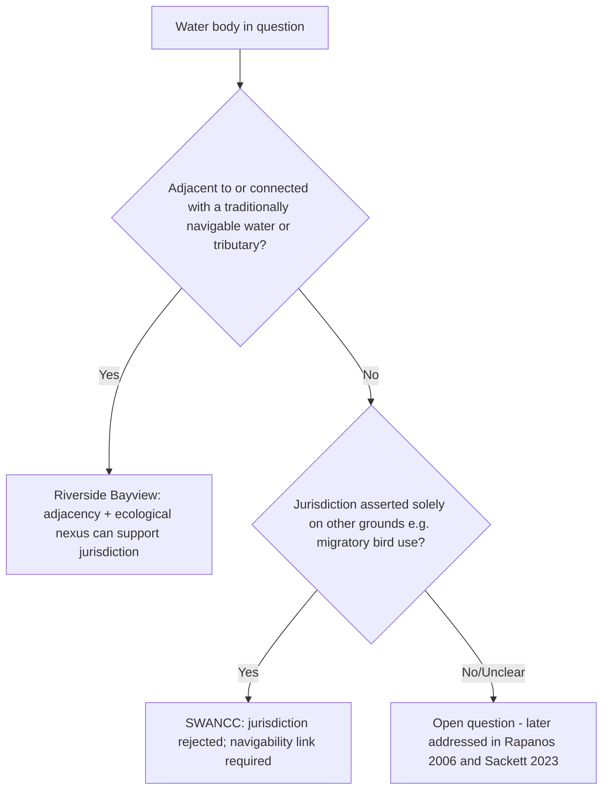

## Early Jurisdictional Tests: Riverside Bayview Homes and SWANCC

### Overview

The Clean Water Act (CWA) prohibits the discharge of pollutants into "navigable waters," defined by the statute as "waters of the United States" (WOTUS) (33 U.S.C. §1362(7)). Congress never defined the outer boundary of that phrase, leaving the U.S. Army Corps of Engineers (Corps) and the Environmental Protection Agency (EPA) to define it by regulation, and the Supreme Court to police the limits of that regulatory authority. *United States v. Riverside Bayview Homes, Inc.*, 474 U.S. 121 (1985), and *Solid Waste Agency of Northern Cook County v. U.S. Army Corps of Engineers* (SWANCC), 531 U.S. 159 (2001), are the first two major Supreme Court decisions addressing how far CWA jurisdiction extends over wetlands and isolated waters. They bookend a period of expansive administrative interpretation and mark the beginning of judicial pushback that later produced *Rapanos v. United States* (2006) and *Sackett v. EPA* (2023).

### Statutory and Regulatory Background

- **CWA §404** requires a permit from the Corps for the discharge of dredged or fill material into "navigable waters."
- **CWA §502(7)** defines "navigable waters" simply as "waters of the United States," without further elaboration.
- The Corps' 1977 regulations defined WOTUS broadly to include not only traditionally navigable waters but also their tributaries and adjacent wetlands, on the theory that pollution of any part of a connected hydrological system affects water quality generally.
- Adjacent wetlands were defined as those "bordering, contiguous to, or neighboring" other jurisdictional waters, even without a continuous surface connection.

This backdrop set up the central legal question in both cases: does the phrase "waters of the United States" extend beyond waters that are navigable-in-fact, and if so, how far?

### Riverside Bayview Homes (1985)

**Facts**

Riverside Bayview Homes owned property near the shores of Lake St. Clair in Michigan. The property contained wetlands hydrologically connected to the lake by saturated soil conditions, even though there was no continuous open-water surface connection at all times. The company began filling the wetlands to develop the property without a §404 permit. The Corps sued to enjoin the filling, asserting the wetlands were "adjacent" to navigable waters and therefore jurisdictional.

**Legal Question**

Does the Corps' authority under §404 extend to wetlands that are adjacent to navigable waters, even though the wetlands themselves are not "navigable" in any traditional sense?

**Holding**

The Supreme Court unanimously upheld the Corps' regulatory definition, holding that wetlands adjacent to navigable waters or their tributaries fall within CWA jurisdiction.

**Reasoning**

- The Court deferred to the Corps' interpretation under *Chevron*-style reasoning (pre-dating but consistent with *Chevron U.S.A. v. NRDC*, 1984), finding the agency's ecological rationale reasonable.
- **Ecological Interdependence**: The Court accepted the scientific premise that wetlands adjacent to waterways perform functions integral to the aquatic ecosystem — filtering pollutants, retaining floodwaters, and providing habitat — such that filling them can degrade water quality in the adjacent water body itself.
- **Ambiguity of "Waters of the United States"**: Because Congress used a broad, undefined term and stated the CWA's objective as restoring "the chemical, physical, and biological integrity of the Nation's waters" (§101(a)), the Court found it reasonable for the agency to interpret "waters" to include ecologically important wetlands, not just open water.
- **No Requirement of Continuous Surface Connection**: The Court rejected the argument that jurisdiction requires the wetland to be flooded by the adjacent water body with a continuous surface connection; saturation and hydrological proximity sufficed under the agency's reasonable construction.

**Key Points**

- Established that "adjacency" to a navigable water (or, by extension, a tributary of one) is sufficient for wetland jurisdiction.
- Applied deference to the agency's technical and scientific judgment on hydrological connectivity.
- Did **not** address wetlands that are physically isolated from any navigable water — that question was left open, and became the crux of *SWANCC*.

### SWANCC (2001)

**Facts**

A consortium of Illinois municipalities (the Solid Waste Agency of Northern Cook County) sought to use an abandoned sand and gravel pit, containing seasonal and permanent ponds, as a solid waste disposal site. The ponds had no connection — surface or otherwise — to any navigable water or interstate waterway. The Corps asserted jurisdiction solely under its **"Migratory Bird Rule"**, a 1986 interpretive rule extending WOTUS coverage to isolated waters that provide habitat for migratory birds, on the theory that such use implicates interstate commerce (since migratory birds cross state lines and support billions of dollars in birdwatching/hunting activity).

**Legal Question**

Does CWA jurisdiction extend to isolated, non-navigable, intrastate waters and ponds whose only connection to interstate commerce is their use as habitat by migratory birds?

**Holding**

The Court held 5-4 that the Migratory Bird Rule exceeded the Corps' authority under the CWA. Isolated waters with no hydrological connection to navigable waters are not "waters of the United States" merely because migratory birds use them.

**Reasoning**

- **Statutory Text**: The Court emphasized that "navigable waters" must retain some connection to actual navigability, or at least some nexus to waters that are navigable-in-fact or their tributaries. Reading the statute to reach any pond used by migratory birds would read the word "navigable" out of the statute entirely.
- **Distinguishing Riverside Bayview**: The Court characterized *Riverside Bayview* as resting on the **significant nexus** between adjacent wetlands and an open body of navigable water — the wetlands there were physically abutting and hydrologically connected to a water plainly within the Corps' jurisdiction. SWANCC's ponds had no such connection.
- **Avoidance of Constitutional Concerns**: The Court invoked the canon of constitutional avoidance, expressing concern that reading the CWA to reach isolated, non-navigable intrastate waters based solely on migratory bird use would push the statute to (or past) the outer limits of Congress's Commerce Clause power, raising the kind of federalism concerns flagged in *United States v. Lopez*, 514 U.S. 549 (1995).
- **Federalism**: The majority stressed that regulation of land and water use is a traditional state and local function, and that Congress must speak clearly if it intends to alter the federal-state balance in that area; the Migratory Bird Rule reflected no such clear statement.

**Key Points**

- Rejected federal jurisdiction over waters based solely on a "hydrological connection" as tenuous as shared migratory bird habitat.
- Reaffirmed that "navigable" retains independent meaning — jurisdiction cannot be untethered entirely from geographic and hydrological proximity to actual navigable-in-fact waters.
- Introduced (or crystallized) the constitutional avoidance and federalism concerns that would dominate later WOTUS litigation.

### Comparing the Two Decisions

| Dimension | Riverside Bayview (1985) | SWANCC (2001) |
| --- | --- | --- |
| Water type at issue | Wetlands adjacent to a navigable lake | Isolated, non-navigable ponds/pits |
| Physical/hydrological connection | Adjacent, saturated soil connection | None |
| Basis asserted for jurisdiction | Adjacency + ecological function | Migratory Bird Rule (interstate commerce via bird habitat) |
| Vote | Unanimous (9-0) | 5-4 |
| Outcome | Corps jurisdiction upheld | Corps jurisdiction rejected |
| Doctrinal contribution | Adjacency/ecological nexus sufficient | Navigability-linked nexus required; isolated waters excluded |

### Diagram: Jurisdictional Reasoning Flow

### Doctrinal Significance and Aftermath

- **Riverside Bayview** established the floor of CWA wetland jurisdiction: physically adjacent, hydrologically connected wetlands are covered.
- **SWANCC** established a ceiling by rejecting jurisdiction over wholly isolated waters, and signaled that agencies could not rely on Commerce Clause theories untethered from the statutory term "navigable."
- Together, they created an unresolved middle ground: what about wetlands or waters that are neither directly adjacent to a navigable water (Riverside Bayview) nor completely isolated (SWANCC), but connected only through tributaries, ditches, or intermittent channels?
- This gap produced the fractured plurality/concurrence in ***Rapanos v. United States***, 547 U.S. 715 (2006), where Justice Scalia's plurality proposed a "relatively permanent" surface-water-connection test, while Justice Kennedy's concurrence proposed a case-by-case "**significant nexus**" test drawing on *Riverside Bayview*'s ecological reasoning.
- Post-*Rapanos* agency guidance and litigation applied Kennedy's significant-nexus test as the operative standard in most circuits, until ***Sackett v. EPA***, 598 U.S. 651 (2023), adopted Scalia's continuous-surface-connection test as controlling, substantially narrowing wetland jurisdiction and effectively abrogating the "significant nexus" approach for adjacency purposes. [Inference: characterizing *Sackett*'s full downstream regulatory effects involves some claims that remain subject to ongoing agency rulemaking and litigation as of this writing.]

### Practical / Exam-Oriented Example

**Example**

A farmer owns a low-lying field that floods seasonally and drains, via a series of natural swales, into a creek that empties into a navigable river three miles away.

- Under **Riverside Bayview** alone, jurisdiction would likely attach if the field were directly adjacent to the creek or river with a continuous saturation/adjacency relationship.
- Under **SWANCC**, if the field had no connection whatsoever to any tributary system — for example, a landlocked depression with no outflow — jurisdiction would be rejected even if ducks used it seasonally.
- The intermediate case (seasonal, indirect, tributary-mediated connection) is precisely the fact pattern that neither case resolves, and that later required *Rapanos* and *Sackett* to address.

### Related Topics

- *Rapanos v. United States* (2006) — Scalia plurality "relatively permanent waters" test vs. Kennedy's "significant nexus" test
- *Sackett v. EPA* (2023) — adoption of the continuous surface connection standard, narrowing WOTUS
- The 2015, 2020 (Navigable Waters Protection Rule), and 2023 WOTUS rulemakings and their litigation history
- Chevron deference and its post-*Loper Bright* status in environmental agency rulemaking
- Commerce Clause limits on federal environmental regulation (*United States v. Lopez*, *United States v. Morrison*)
- CWA §404 permitting process and nationwide permits
- Migratory Bird Treaty Act and its interaction with CWA jurisdiction
- Tributary and adjacency definitions in the Corps/EPA regulatory history (1977, 1986, 2015, 2020, 2023 rules)