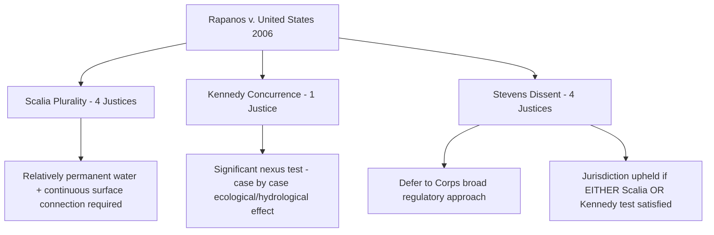

## Rapanos v. United States and the Competing Plurality and Kennedy Tests

### Overview

*Rapanos v. United States*, 547 U.S. 715 (2006), is the Supreme Court's most consequential — and most fractured — attempt to define "waters of the United States" (WOTUS) under the Clean Water Act (CWA) prior to *Sackett v. EPA* (2023). No opinion commanded a majority. The result was a 4-1-4 split that produced two competing legal tests — Justice Scalia's plurality "relatively permanent waters" test and Justice Kennedy's concurring "significant nexus" test — that lower courts, agencies, and litigants had to reconcile for the following seventeen years.

### Procedural and Factual Background

*Rapanos* actually consolidated two cases: *Rapanos v. United States* and *Carabell v. United States Army Corps of Engineers*.

- **Rapanos**: John Rapanos backfilled wetlands on his Michigan property to prepare it for a shopping center, without obtaining a §404 permit. The wetlands were connected to navigable waters only through a series of ditches and man-made drains that eventually reached traditional navigable waters, several miles distant. The government prosecuted Rapanos both civilly and criminally.
- **Carabell**: The Carabells sought to fill a wetland for a condominium development. The wetland was separated from a man-made drainage ditch (itself tributary to navigable waters) by a berm, meaning there was no direct surface water connection at all, only a hydrological linkage during flooding events.

Both cases reached the Sixth Circuit, which upheld CWA jurisdiction in both instances under the Corps' broad post-*Riverside Bayview* regulations. The Supreme Court granted certiorari to resolve how far jurisdiction over "adjacent" wetlands and tributary-connected waters extends.

### The Fractured Disposition

| Opinion | Author | Joined by | Vote |
| --- | --- | --- | --- |
| Plurality | Scalia | Roberts, Thomas, Alito | 4 |
| Concurrence in judgment | Kennedy | (alone) | 1 |
| Dissent | Stevens | Souter, Ginsburg, Breyer | 4 |

Five Justices (the plurality of four plus Kennedy) agreed the Sixth Circuit's judgments should be vacated and the cases remanded, but for **different legal reasons**, producing no single controlling rule. This 4-1-4 split is the central doctrinal puzzle of the case.

### The Scalia Plurality Test: "Relatively Permanent Waters"

**Reasoning**

Justice Scalia's plurality (four Justices) read "waters of the United States" narrowly, tying it closely to the ordinary meaning of "waters" as relatively permanent, standing, or continuously flowing bodies of water — not any conveyance where water occasionally or intermittently flows.

**Test Elements**

For CWA jurisdiction to attach to a wetland, the plurality required:

1. **The adjacent body of water** must be a "relatively permanent" body of water — a stream, river, lake, or similar feature with continuous or seasonal (but not merely occasional/ephemeral) flow — not a dry wash, ditch, or intermittent channel that carries water only after rainfall.
2. **The wetland itself** must have a **continuous surface connection** with that relatively permanent water, making it difficult to determine where the water ends and the wetland begins.

**Key Points**

- Excludes wetlands connected only via ditches, culverts, or intermittent drainage unless those conveyances themselves qualify as "relatively permanent" waters.
- Excludes wetlands separated from a jurisdictional water by any barrier (e.g., a berm, as in *Carabell*), since a continuous surface connection is required.
- Explicitly rejects the Corps' broader hydrological-connection approach as inconsistent with the statutory text and as raising the same federalism/Commerce Clause concerns flagged in *SWANCC*.
- Scalia criticized the Corps' existing regulatory practice as an "immense expansion of federal regulation of land use" undertaken without clear congressional authorization.

### The Kennedy Concurrence: The "Significant Nexus" Test

**Reasoning**

Justice Kennedy agreed the Sixth Circuit applied an overly broad standard and that the cases should be remanded, but he rejected Scalia's categorical "relatively permanent waters" framework as inconsistent with *Riverside Bayview*, which had upheld jurisdiction over wetlands without requiring a continuous surface connection or permanent flow in the adjacent water body.

**Test Elements**

Kennedy's standard, drawn from and extending *Riverside Bayview*'s ecological reasoning, asks:

- Whether the wetland, **either alone or in combination with similarly situated lands in the region**, **significantly affects the chemical, physical, and biological integrity** of a traditional navigable water.
- This is a **case-by-case, fact-intensive** ecological and hydrological inquiry, not a bright-line categorical rule.
- Wetlands with only a "speculative or insubstantial" effect on downstream water quality fall outside jurisdiction; wetlands with a demonstrable, non-trivial ecological or hydrological effect fall within it.

**Key Points**

- Explicitly a **case-specific standard**, requiring scientific and factual development (e.g., through agency findings, expert testimony) rather than a fixed physical/geographic rule.
- More closely tracks the CWA's stated purpose of restoring "chemical, physical, and biological integrity" of the nation's waters (§101(a)).
- Criticized by Scalia's plurality as unworkable, vague, and productive of case-by-case litigation and regulatory uncertainty.
- Criticized in turn by Kennedy for the plurality's rule being both under-inclusive (excluding ecologically important wetlands with indirect connections) and inconsistent with *Riverside Bayview* precedent.

### The Stevens Dissent

Justice Stevens, writing for four dissenting Justices, would have upheld the Corps' broad, pre-existing regulatory approach in both cases, deferring to the agency's technical judgment consistent with *Riverside Bayview*. Notably, the dissent stated that on remand, jurisdiction should be upheld if **either** the plurality's test **or** Kennedy's significant-nexus test were satisfied — a strategic positioning that later courts relied on to justify applying Kennedy's test as an independent basis for jurisdiction.

### Diagram: The Three-Way Split

### Post-Rapanos Circuit Split and Agency Response

Because no test commanded a majority, lower courts had to determine which opinion controlled under *Marks v. United States*, 430 U.S. 188 (1977) (the "narrowest grounds" rule for fractured decisions).

- **Majority approach**: Most circuits (e.g., First, Third, Seventh, Eighth, Ninth, Eleventh) held that **Kennedy's significant-nexus test controls**, either as the narrowest ground or applied alongside the plurality test per the Stevens dissent's either/or framing.
- **Minority approach**: At least one circuit (the Eleventh, in some panels) and certain agency practices treated jurisdiction as established if **either** test was satisfied, following Stevens' dissent.
- **Agency guidance**: EPA and the Corps issued joint guidance (2007, revised 2008) directing field staff to assert jurisdiction under the significant-nexus standard, generally treating it as the operative test nationwide, while also considering the plurality test where clearly satisfied.
- This fragmented landscape persisted through the 2015 Clean Water Rule, its repeal, the 2020 Navigable Waters Protection Rule, and the 2023 WOTUS rule, until the Supreme Court definitively resolved the split in **Sackett v. EPA**, 598 U.S. 651 (2023).

### Sackett's Resolution [Note: Downstream Development]

In *Sackett*, a majority of the Court adopted **Scalia's plurality test** from *Rapanos* as the controlling standard, holding that:

- Wetlands are covered only if they have a **continuous surface connection** to a relatively permanent body of water, making it difficult to determine where the water ends and the wetland begins.
- The "significant nexus" test was rejected as inconsistent with the CWA's text and as exceeding the Corps' and EPA's statutory authority.

This effectively resolved the seventeen-year circuit split in favor of the narrower plurality approach, though **[Inference]** the precise downstream scope of *Sackett*'s holding for tributaries (as opposed to wetlands specifically) continues to be worked out in subsequent agency rulemaking and litigation.

### Comparative Table: Scalia Plurality vs. Kennedy Concurrence

| Element | Scalia Plurality | Kennedy Concurrence |
| --- | --- | --- |
| Nature of test | Categorical, bright-line | Fact-specific, case-by-case |
| Adjacent water requirement | Must be "relatively permanent" | May include intermittent/tributary systems |
| Wetland connection requirement | Continuous surface connection | Significant ecological/hydrological nexus |
| Treatment of *Riverside Bayview* | Narrowly cabined | Extended and reaffirmed |
| Predictability | High (clear physical test) | Low (requires case-specific factual record) |
| Federal jurisdiction scope | Narrower | Broader |
| Ultimate fate | Adopted by *Sackett* (2023) | Effectively displaced by *Sackett* |

### Practical / Exam-Oriented Example

**Example**

A wetland is separated from a navigable river by an intermittent drainage ditch that carries water only during heavy rainfall, several times a year.

- **Under Scalia's plurality test**: Jurisdiction likely fails — the ditch is not a "relatively permanent" water, and there is no continuous surface connection between the wetland and the river.
- **Under Kennedy's significant-nexus test**: Jurisdiction could still attach if evidence shows the wetland — alone or combined with similarly situated wetlands in the watershed — significantly affects the chemical, physical, or biological integrity of the river (e.g., substantial pollutant filtration or flood attenuation function).
- **Post-*Sackett***: The plurality's continuous-surface-connection requirement now controls, so this wetland would likely fall **outside** federal jurisdiction absent a continuous surface connection to a relatively permanent water.

### Related Topics

- *Sackett v. EPA* (2023) — adoption of the Scalia test as controlling law
- *United States v. Riverside Bayview Homes* (1985) and *SWANCC* (2001) — doctrinal predecessors
- *Marks v. United States* (1977) — rule for determining the controlling opinion in fractured decisions
- The 2015 Clean Water Rule, 2020 Navigable Waters Protection Rule, and 2023 WOTUS Rule
- Post-*Sackett* agency implementation and revised WOTUS regulatory definitions
- Chevron deference, *Loper Bright Enterprises v. Raimondo* (2024), and its effect on WOTUS rulemaking authority
- Commerce Clause constraints on federal wetlands regulation
- CWA §404 permitting and jurisdictional determinations (JDs) practice before the Corps