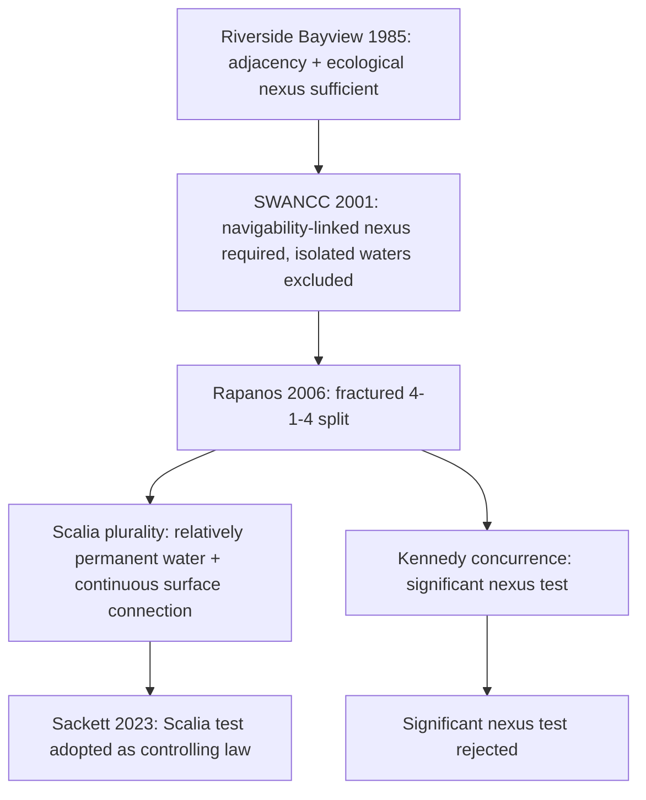

## Sackett v. EPA and the Continuous Surface Connection Standard

### Overview

*Sackett v. Environmental Protection Agency*, 598 U.S. 651 (2023) ("*Sackett II*," distinguishing the 2012 procedural decision in the same litigation), is the Supreme Court's definitive resolution of the seventeen-year circuit split created by *Rapanos v. United States* (2006). The Court held that only wetlands and permanent bodies of water with a "continuous surface connection" to "traditional interstate navigable waters" are covered by the Clean Water Act. The decision adopts Justice Scalia's *Rapanos* plurality test as controlling law and rejects Justice Kennedy's "significant nexus" test, substantially narrowing the geographic scope of federal wetlands jurisdiction. [Wikipedia](https://en.wikipedia.org/wiki/Sackett_v._Environmental_Protection_Agency_(2023))

### Factual and Procedural Background

Michael and Chantell Sackett purchased a 0.63-acre residential lot in a platted subdivision near Priest Lake, Idaho. The lot contained soggy ground and seasonal wetlands but was separated from Priest Lake by a road and other developed parcels. In 2004, the Sacketts began backfilling land on their property to prepare for building a home. [Casebriefly](https://www.casebriefly.com/case-brief/sackett-v-epa)[Remy Moose Manley](https://www.rmmenvirolaw.com/sackett-v-epa-2023/)

The EPA issued a compliance order asserting the lot contained jurisdictional wetlands because they were "adjacent" to Priest Lake and to tributaries leading to the lake via roadside ditches and a creek, threatening substantial civil penalties for noncompliance. The Sacketts' property contained wetlands that were separated by a road from a tributary that eventually fed into a traditionally navigable intrastate lake. [Casebriefly](https://www.casebriefly.com/case-brief/sackett-v-epa)[Gibson Dunn](https://www.gibsondunn.com/supreme-court-adopts-continuous-surface-connection-test-for-whether-wetlands-are-covered-by-the-clean-water-act/)

**Procedural History**

- After nearly a decade of litigation over the compliance order itself — including a prior trip to the Supreme Court in *Sackett v. EPA* (2012), which established the Sacketts' right to immediate judicial review of an EPA compliance order without waiting for an enforcement action — the case returned to the lower courts on the merits.
- The district court granted summary judgment to the EPA, and the Ninth Circuit affirmed, applying the test set forth in Justice Kennedy's opinion concurring in the judgment in Rapanos v. United States. The Ninth Circuit determined that the wetlands on the Sacketts' property, together with wetlands across the road, were "waters of the United States" because they had a "significant nexus" to a traditionally navigable water. [Gibson Dunn](https://www.gibsondunn.com/supreme-court-adopts-continuous-surface-connection-test-for-whether-wetlands-are-covered-by-the-clean-water-act/)
- The Supreme Court granted certiorari on the question whether the Ninth Circuit set forth the proper test for determining whether wetlands are "waters of the United States" under the Clean Water Act. [Gibson Dunn](https://www.gibsondunn.com/supreme-court-adopts-continuous-surface-connection-test-for-whether-wetlands-are-covered-by-the-clean-water-act/)

### The Holding

The Court held that only wetlands and permanent bodies of water with a "continuous surface connection" to "traditional interstate navigable waters" are covered by the Clean Water Act. The majority opinion, authored by Justice Alito, held that the CWA extends to only those wetlands with a continuous surface connection to bodies that are "waters of the United States" in their own right, so that they are "indistinguishable" from those waters. [Wikipedia](https://en.wikipedia.org/wiki/Sackett_v._Environmental_Protection_Agency_(2023))[Pacific Legal Foundation](https://pacificlegal.org/case/sackett-v-environmental-protection-agency/)

**Vote alignment:**

Majority: Alito, joined by Roberts, Thomas, Gorsuch, Barrett. Concurrence: Thomas, joined by Gorsuch. Concurrence in judgment: Kagan, joined by Sotomayor, Jackson. Concurrence in judgment: Kavanaugh, joined by Sotomayor, Kagan, Jackson. [Wikipedia](https://en.wikipedia.org/wiki/Sackett_v._Environmental_Protection_Agency_(2023))

While the outcome (rejecting the significant-nexus test and ruling for the Sacketts) was unanimous in result, the reasoning was not unanimous — the Kagan and Kavanaugh concurrences agreed the Ninth Circuit erred but disagreed with the majority's textual approach and its rejection of *Riverside Bayview*'s broader ecological reasoning.

### The Majority's Reasoning

**Statutory Interpretation**

The Court held that the CWA's use of "waters" in §1362(7) refers only to "geographic[al] features that are described in ordinary parlance as 'streams, oceans, rivers, and lakes'" and to adjacent wetlands that are "indistinguishable" from those bodies of water due to a continuous surface connection. [Justia](https://supreme.justia.com/cases/federal/us/598/21-454/)

**The Two-Part Test**

CWA jurisdiction over an adjacent wetland requires that the adjacent body of water constitutes waters of the United States (a relatively permanent body of water connected to traditional interstate navigable waters) and a continuous surface connection between that water and the wetland such that it is difficult to determine where the water ends and the wetland begins. This is functionally identical to the two-pronged approach Justice Scalia articulated in his *Rapanos* plurality opinion. [Justia](https://supreme.justia.com/cases/federal/us/598/21-454/)

**Application to the Sacketts' Property**

Because the Sacketts' wetlands were separated from the nearest jurisdictional water by a road, and lacked any continuous surface connection to Priest Lake or its tributary system, the Court held the wetlands fell outside CWA jurisdiction — reversing the Ninth Circuit.

**Rejection of the Significant-Nexus Test**

The Court rejected the long-used "significant nexus" test for determining whether wetlands are part of the "waters of the United States." The majority reasoned that: [Casebriefly](https://www.casebriefly.com/case-brief/sackett-v-epa)

- The significant-nexus standard, drawn from Kennedy's *Rapanos* concurrence, has no grounding in the statutory text, which uses the word "waters" — not "significant hydrological or ecological connection."
- A test requiring case-by-case scientific determinations of ecological effect creates significant vagueness, burdening regulated parties (including ordinary landowners) with the risk of severe civil and criminal penalties for guessing wrong about jurisdiction.
- Broad assertions of federal jurisdiction over land use — a traditionally state and local function — require a clear congressional statement, a federalism principle traceable to *SWANCC* (2001) and *Rapanos*.

### The Concurring Opinions

**Thomas Concurrence (joined by Gorsuch)**

Argued the majority's test was still too permissive and that "waters of the United States" should perhaps be read even more narrowly, questioning whether "adjacent" wetlands should be covered at all absent a more searching textual analysis; also raised broader concerns about the constitutional basis for federal wetlands regulation generally.

**Kagan Concurrence in Judgment (joined by Sotomayor, Jackson)**

Agreed the Ninth Circuit's significant-nexus application was flawed on the facts but criticized the majority for rewriting the statute under the guise of interpretation, arguing that *Riverside Bayview*'s ecological-function rationale (unanimously adopted in 1985) was effectively overruled without acknowledgment. Kagan warned the majority's approach substitutes the Court's own policy preferences for Congress's stated purpose of restoring the chemical, physical, and biological integrity of the nation's waters.

**Kavanaugh Concurrence in Judgment (joined by Sotomayor, Kagan, Jackson)**

Focused specifically on the word "adjacent": Kavanaugh argued that the CWA and decades of agency practice recognize jurisdiction over wetlands "adjacent to" (i.e., next to, bordering, or in reasonable proximity to) covered waters — not only those with a continuous surface connection — and that the majority's new continuous-surface-connection requirement is inconsistent with the statutory text Congress actually enacted, potentially stripping protection from many wetlands that provide flood control and pollutant filtration for adjacent waterways.

### Diagram: Doctrinal Lineage to Sackett

### The Continuous Surface Connection Standard in Detail

**Key Points**

- **Adjacent water requirement**: The water body to which the wetland connects must itself independently qualify as "waters of the United States" — i.e., a relatively permanent, standing, or continuously flowing body such as a stream, river, lake, or ocean.
- **Connection requirement**: There must be a continuous surface water connection between the wetland and that water body, such that the two are practically "indistinguishable."
- **Physical barriers defeat jurisdiction**: A road, berm, dike, or other barrier separating the wetland from the adjacent water — as existed in *Sackett* itself — breaks the continuous surface connection and removes the wetland from federal jurisdiction, regardless of any subsurface or periodic hydrological connection.
- **Ephemeral and intermittent connections excluded**: Tributaries or ditches that carry water only seasonally or after precipitation do not satisfy the "relatively permanent" requirement for the adjacent water body.
- **Effective abrogation of Kennedy's test**: Lower courts applying the significant-nexus standard post-*Rapanos* must now apply the continuous-surface-connection standard instead.

### Practical Consequences

**Regulatory Aftermath**

On June 26, 2023, EPA announced that it would redefine "waters of the United States" by September 1, 2023 to conform to the Sackett v. EPA jurisdictional limitations. This produced a further round of WOTUS rulemaking narrowing the 2023 pre-*Sackett* rule to align with the continuous-surface-connection standard. [Beveridge & Diamond](https://www.bdlaw.com/publications/supreme-court-narrows-cwa-jurisdiction-over-waters-of-the-u-s/)

**Practical Effects**

- **[Inference]** Substantially reduces the universe of wetlands subject to federal §404 permitting, particularly those separated from jurisdictional waters by roads, levees, or other constructed barriers, or connected only through non-permanent tributaries.
- Increases the relative importance of **state wetland protection programs**, since wetlands losing federal CWA coverage may still be regulated (or not) depending on state law — creating significant interstate variation in wetland protection.
- Increases litigation and permitting uncertainty in the short term as landowners, regulators, and courts apply the new standard to varied factual patterns (e.g., wetlands connected via subsurface flow, wetlands connected only during flood events).
- **[Unverified]** The precise treatment of "relatively permanent" tributaries themselves (as opposed to adjacent wetlands) under post-*Sackett* agency practice continues to be litigated and is subject to ongoing rulemaking as of this writing.

### Practical / Exam-Oriented Example

**Example**

A wetland sits fifty feet from a perennial (year-round) stream that flows into a navigable river, separated from the stream only by a narrow strip of unsaturated upland with no continuous surface water linkage — water reaches the wetland only via periodic subsurface seepage and occasional flood overflow.

- **Pre-*Sackett* (Kennedy test)**: Likely jurisdictional if evidence showed the wetland significantly affected the stream's water quality (e.g., pollutant filtration, flow attenuation).
- **Post-*Sackett* (continuous surface connection test)**: Likely **not jurisdictional** — because there is no continuous surface connection making the wetland and stream "indistinguishable," the periodic or subsurface hydrological connection is insufficient, regardless of ecological significance.

### Comparative Table: Kennedy Test vs. Sackett Standard

| Element | Kennedy "Significant Nexus" (Rapanos, displaced) | Sackett "Continuous Surface Connection" (controlling) |
| --- | --- | --- |
| Nature of inquiry | Case-by-case ecological/hydrological | Categorical, physical/geographic |
| Basis | Ecological function and CWA purpose | Ordinary meaning of "waters" |
| Subsurface/periodic connections | Can support jurisdiction | Insufficient |
| Physical barriers (roads, berms) | Not necessarily dispositive | Defeat jurisdiction |
| Predictability | Low | High |
| Scope of federal jurisdiction | Broader | Narrower |

### Related Topics

- *Rapanos v. United States* (2006) — origin of the competing plurality and Kennedy tests
- *United States v. Riverside Bayview Homes* (1985) and *SWANCC* (2001) — doctrinal predecessors
- EPA/Army Corps post-*Sackett* WOTUS rulemaking (2023 conforming rule)
- State wetland protection programs and the post-*Sackett* federalism gap
- CWA §404 permitting process and jurisdictional determinations (JDs)
- *Sackett v. EPA* (2012) — the earlier procedural decision on judicial review of compliance orders
- Major Questions Doctrine and its relationship to WOTUS rulemaking authority
- *Loper Bright Enterprises v. Raimondo* (2024) and the end of *Chevron* deference in environmental rulemaking