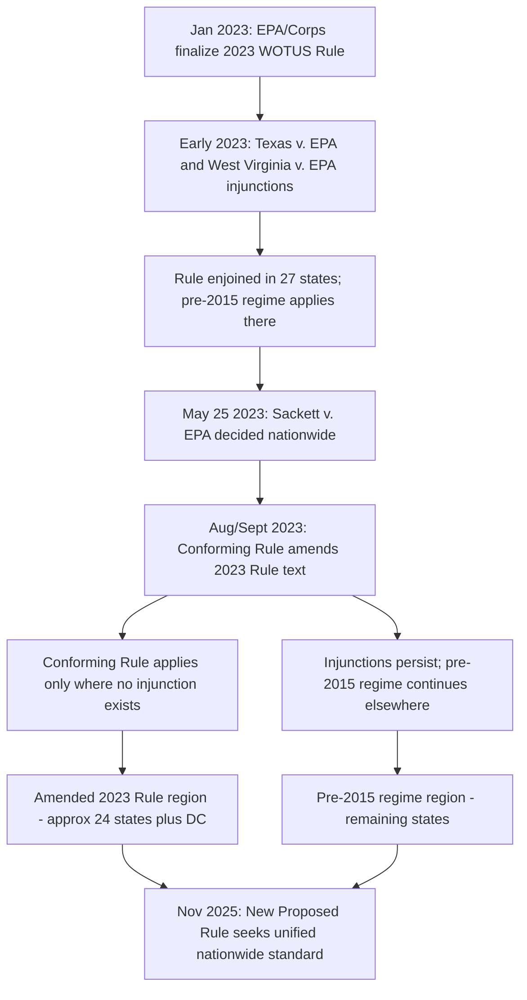

## The 2023 Conforming Rule and the Resulting Split in State-by-State Implementation

### Overview

Following *Sackett v. EPA*, 598 U.S. 651 (2023), the EPA and the U.S. Army Corps of Engineers were required to revise their existing "waters of the United States" (WOTUS) regulation to comply with the Court's continuous-surface-connection standard. Rather than starting an entirely new notice-and-comment rulemaking, the agencies issued a **conforming rule** that amended their pre-existing January 2023 WOTUS Rule. Because that January 2023 Rule was already enjoined by federal courts in a substantial number of states at the time *Sackett* was decided, the conforming rule did not achieve uniform nationwide implementation — it produced a **bifurcated regulatory landscape** in which different legal standards applied in different states simultaneously, a condition that persisted for roughly two years until further rulemaking in late 2025.

### Background: The January 2023 Rule and Pre-*Sackett* Litigation

**The January 2023 Rule**

On January 18, 2023, the EPA and Army Corps had finalized a WOTUS definition (the "2023 Rule") that largely codified the significant-nexus approach associated with Justice Kennedy's *Rapanos* concurrence, while also asserting jurisdiction over interstate waters and interstate wetlands regardless of navigability.

**Pre-*Sackett* Injunctions**

The 2023 Rule was challenged almost immediately in multiple federal district courts by coalitions of states and industry groups, well before the Supreme Court decided *Sackett*:

- In *State of Texas v. EPA*, a Texas federal court found the plaintiff states were likely to succeed on the merits.
- In *State of West Virginia v. EPA*, No. 3:23-cv-00032 (D.N.D.), decided April 12, 2023, the District of North Dakota granted a preliminary injunction, finding the plaintiffs were likely to succeed on their claim that the 2023 WOTUS rule went beyond the jurisdiction granted to EPA under the CWA because the rule incorrectly granted jurisdiction to all interstate waters regardless of navigability and misinterpreted Justice Kennedy's significant nexus test. This injunction applied to 24 states.
- Combined with the Texas-based injunction and related rulings, the 2023 WOTUS rule was enjoined in 27 states by the time *Sackett* was decided, with the remaining states continuing to operate under the 2023 Rule as originally written.

This meant that even before *Sackett*, the country was already operating under **two different regulatory regimes simultaneously**: the 2023 Rule in non-enjoined states, and the pre-2015 regulatory regime (the Reagan-era 1977 definitions, as subsequently modified by guidance) in enjoined states.

### The Conforming Rule (September 8, 2023)

**What It Did**

On August 29, 2023 (published in the Federal Register on September 8, 2023, 88 Fed. Reg. 61964), the EPA and Army Corps issued a final rule amending the January 2023 Rule to conform it to *Sackett*. The conforming rule:

- **Removed the "significant nexus" standard** from the regulatory text entirely.
- **Redefined "adjacent"** to mean "having a continuous surface connection," implementing the Court's holding that a wetland must be "indistinguishably part of a body of water that itself constitutes 'waters' under the Clean Water Act."
- **Removed "interstate waters" and "interstate wetlands"** as freestanding, independently jurisdictional categories, since *Sackett* rejected jurisdiction untethered from the relatively-permanent-water/continuous-surface-connection framework regardless of a water's interstate character.
- Left the remainder of the January 2023 Rule's structure in place, with the agencies stating that they would continue to interpret the remainder of the definition consistent with the *Sackett* decision.

**What It Did Not Do**

Critically, the conforming rule did not resolve or lift the pre-existing state-specific injunctions against the January 2023 Rule. Although *Sackett* is binding nationwide as a matter of constitutional interpretation, the decision did not itself provide a full regulatory framework — it invalidated specific features of the 2023 Rule and left the agencies to determine how to implement the Court's narrower test, but district court injunctions entered against the 2023 Rule (as originally written) remained in effect as a procedural matter even after the underlying rule was amended.

### The Resulting Split: Two Regulatory Regimes

Because the injunctions predated and were not automatically dissolved by the conforming rule, implementation split geographically:

| Regime | Where Applied | Governing Standard |
| --- | --- | --- |
| **Amended 2023 Rule** | States without an operative injunction | 2023 Rule's structure and categories, as narrowed by the conforming rule's continuous-surface-connection standard |
| **Pre-2015 regulatory regime** | States covered by the West Virginia/Texas-line injunctions | The pre-2015 (1977-derived) regulatory text and guidance documents, likewise constrained by *Sackett*'s continuous-surface-connection holding as a matter of controlling constitutional interpretation |

As of the November 2025 agency guidance, the agencies implement the amended 2023 Rule in 24 states (including California) and D.C. where no injunction applies, while the remaining states continue to apply the pre-2015 regulations as constrained by *Sackett*.

**Key Points**

- Both regimes are legally required to apply *Sackett*'s continuous-surface-connection test as the controlling constitutional floor — the split is about which **regulatory text and definitional categories** apply, not about whether *Sackett* itself applies (it applies everywhere).
- The agencies' own guidance to states and Tribes expressly cautions that jurisdictional determinations remain case-specific, and that determinations under either regime must be consistent with *Sackett*.
- This dual-track approach created significant compliance complexity for regulated parties (developers, agricultural operations, infrastructure projects) operating across state lines, since the same physical wetland feature could be evaluated under different definitional text depending on which side of a state line it fell.

### Diagram: Regulatory Bifurcation Timeline

### The November 2025 Proposed Rule: Toward Reunification

**Rationale**

On November 17, 2025, the EPA and Army Corps released a sweeping proposed rule to revise the federal WOTUS definition, explicitly seeking to implement *Sackett*'s holding that federal jurisdiction is limited to "relatively permanent" waters and wetlands with a continuous surface connection to those waters, and to end the multi-year state-by-state bifurcation.

**Key Features**

- The Proposed Rule borrows exclusion concepts from the 2020 Navigable Waters Protection Rule (NWPR), reflecting a more categorical, bright-line approach consistent with the Scalia/*Sackett* framework rather than case-by-case ecological assessment.
- Proposes removing "interstate waters" as a category entirely (building on the conforming rule's removal of "interstate wetlands"), and removing "intrastate" from the lakes-and-ponds category, so that the "relatively permanent" standard applies uniformly regardless of a water body's interstate or intrastate character.
- The agencies explicitly disclaimed reliance on ecological-importance rationales in justifying jurisdictional scope, noting that the Supreme Court in *Sackett* explained that the CWA does not define the EPA's jurisdiction based on ecological importance — a direct rejection of the *Riverside Bayview*/Kennedy-style reasoning that had driven prior rulemakings.
- If finalized, the Proposed Rule would substantially narrow federal permitting obligations, primarily under CWA §404 (dredge/fill permitting) and §402 (NPDES point-source discharge permitting).

**[Unverified]** As of this content's generation, the November 2025 proposal remains subject to notice-and-comment rulemaking, and its final form, effective date, and treatment of the outstanding state-by-state injunctions had not yet been conclusively resolved; further litigation challenging any final rule should be anticipated regardless of its content, consistent with the pattern following every WOTUS rulemaking since 2015.

### Practical Consequences of the Split

**Key Points**

- **Permitting uncertainty**: A landowner or developer with property near a state line, or an entity operating in multiple states, faced different jurisdictional determination procedures depending on which regulatory text applied, even though the underlying constitutional standard (*Sackett*) was uniform.
- **Agency workload**: The Army Corps' ability to resume issuing approved jurisdictional determinations (JDs), paused during the immediate aftermath of *Sackett*, depended on which regime's procedural framework governed a given district.
- **State law gap-filling**: In states where federal jurisdiction contracted under either regime, state-level wetland protection statutes (where they exist) became the primary or exclusive source of regulatory protection for wetlands losing CWA coverage — with substantial variation in stringency across states.
- **Litigation risk**: Entities that received a JD or completed a permitting process under one regime faced potential exposure if litigation later altered which regime applied to their location, particularly during the multi-year period when injunctions and conforming amendments operated in parallel.

### Practical / Exam-Oriented Example

**Example**

A wetland straddles the border of a state within the injunction-covered pre-2015 regime and a neighboring state operating under the amended 2023 Rule.

- In the amended-2023-Rule state, the permitting authority applies the amended 2023 Rule's definitional categories (as narrowed to remove the significant-nexus standard and interstate-water categories) to determine jurisdiction, filtered through *Sackett*'s continuous-surface-connection requirement.
- In the pre-2015-regime state, the permitting authority applies the older 1977-derived regulatory text and associated guidance, likewise filtered through *Sackett*.
- **[Inference]** In most fact patterns, the practical jurisdictional outcome should converge because both regimes are bound by the same *Sackett* floor — but the procedural path, documentation requirements, and agency guidance a permit applicant must follow differ meaningfully depending on which side of the line the property sits.

### Related Topics

- *Sackett v. EPA* (2023) — the substantive continuous-surface-connection standard driving the conforming rule
- *Rapanos v. United States* (2006) — origin of the significant-nexus standard removed by the conforming rule
- The 2015 Clean Water Rule, the 2020 Navigable Waters Protection Rule, and their litigation histories
- *West Virginia v. EPA* (2022) (the Clean Air Act major-questions-doctrine case) and its broader relevance to agency rulemaking authority
- The November 2025 Proposed WOTUS Rule and its public comment process
- State wetland protection statutes and the post-*Sackett* federalism gap
- CWA §404 jurisdictional determination (JD) procedures under dual regulatory regimes
- Administrative Procedure Act standards for "conforming" versus full notice-and-comment rulemaking