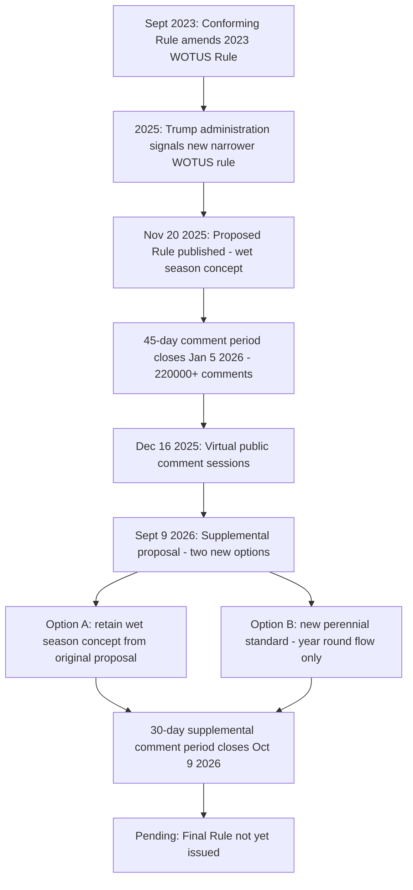

## The 2025 to 2026 WOTUS Rulemaking Proceedings and Proposed Definitional Options

### Overview

Beginning in November 2025, the EPA and U.S. Army Corps of Engineers initiated the fifth major regulatory overhaul of the "waters of the United States" (WOTUS) definition since 2015. This rulemaking is the Trump administration's effort to fully implement *Sackett v. EPA* (2023) with a narrower, more categorical definition than the September 2023 Conforming Rule provided. The process has unfolded in multiple stages — an initial November 2025 proposal, a large public comment response, and a September 2026 supplemental proposal offering additional narrowing options — and remained unresolved as of this content's generation, with a second comment period running into October 2026.

### Background: Why a New Rulemaking Was Needed

**Key Points**

- The September 2023 Conforming Rule (discussed separately in this chapter) represented a relatively broad approach to the definition of WOTUS while attempting to be consistent with the Court's holding in *Sackett*, but it retained much of the pre-*Sackett* 2023 Rule's structure and remained tied up in litigation and injunctions in a substantial number of states.
- Shortly following his 2025 inauguration, the Trump administration signaled it would issue its own WOTUS rule, taking a much narrower view of *Sackett* than the Conforming Rule reflected.
- The agencies determined that a full, unified nationwide notice-and-comment rulemaking — rather than another conforming amendment — was necessary both to resolve the state-by-state regulatory split and to implement a categorical, bright-line standard more closely aligned with the *Sackett* majority's textualist reasoning.

### The November 2025 Proposed Rule

**Publication and Procedural Posture**

The proposed rule was published in the Federal Register on November 20, 2025, opening a 45-day public comment period that closed on January 5, 2026, generating more than 220,000 public comments. This proposal marks the fifth regulatory update of the WOTUS definition since 2015, and would revise the EPA and Corps' Clean Water Act implementing regulations found at 40 CFR §120.2 and 33 CFR §328.3.

The agencies also held two virtual public comment sessions on December 16, 2025, where stakeholders spoke both for and against the proposed changes.

**Core Definitional Approach**

The proposed rule focuses federal jurisdiction on "relatively permanent" waters — those standing or continuously flowing year-round or at least during the wet season — including streams and their adjacent wetlands connected by a continuous surface connection, consistent with *Sackett*'s two-part test.

**Key Definitional Changes Proposed**

1. **"Wet season" concept**: The original November 2025 proposal introduced a "wet season" concept, under which waters flowing continuously during the period when precipitation exceeds evapotranspiration — and wetlands with surface water during that period — would qualify as "relatively permanent" and thus jurisdictional, even without year-round flow.
2. **Removal of "interstate waters" as an automatic jurisdictional category**: The proposal would remove "interstate waters" from automatic jurisdiction, instead requiring such waters to be evaluated under the other jurisdictional categories and the two-prong test set forth in *Sackett* — extending the approach the 2023 Conforming Rule had already begun for interstate wetlands.
3. **Refined "tributary" definition**: "Tributary" is defined to mean a body of water with relatively permanent flow, and a bed and bank, that connects to a downstream traditional navigable water or the territorial seas, either directly or through one or more waters or features that convey relatively permanent flow. This definition would explicitly exclude features such as wetlands if they lack relatively permanent flow.
4. **Clarified exclusions**: The proposal clarifies which ditches, prior-converted cropland, and waste treatment systems are not covered under WOTUS, and explicitly excludes groundwater from the WOTUS definition entirely.
5. **Anticipated effect**: The Regulatory Impact Analysis accompanying the rule anticipates the proposed rule would drastically reduce the number of wetlands currently subject to CWA jurisdiction compared to both the pre-*Sackett* 2023 Rule and the 2023 Conforming Rule.

### Stakeholder Concerns During the Comment Period

**Key Points**

- Regulated industries (e.g., homebuilders, agricultural interests) emphasized the need for clear definitions of "relatively permanent" and "continuous surface connection," arguing that unclear jurisdictional standards delay residential and mixed-use construction and add to housing costs.
- Environmental and public health commenters generally argued the proposal reduces protection for wetlands and streams that perform significant flood-control and water-quality functions, consistent with concerns raised in the *Kagan* and *Kavanaugh* concurrences in *Sackett* itself.
- A specific point of contention was the **"wet season" concept**, which commenters on multiple sides found ambiguous — insufficiently protective for environmental commenters, and insufficiently precise/predictable for regulated-industry commenters.

### The September 2026 Supplemental Proposal

**Procedural Posture**

Responding to the volume and substance of comments on the November 2025 proposal — particularly criticism of the "wet season" concept — the EPA and Army Corps published a supplemental notice on September 9, 2026, offering two additional "supplemental options" for the regulatory definition, without withdrawing or replacing the original November 2025 proposal. A further 30-day comment period was opened, closing October 9, 2026.

**Key Points**

- The agencies emphasized that the supplemental proposal does not withdraw or replace the November 2025 proposal; EPA and the Corps will consider the new alternatives alongside the original proposal and all previously submitted comments before issuing a final rule.
- The supplemental proposal asks commenters to consider the potential utility of a new defined term, **"perennial,"** to help clarify the terms "relatively permanent waters" and "continuous surface connection," as an alternative to the "wet season" concept originally proposed.
- Under this alternative, "relatively permanent" waters would be limited to **perennial bodies of water** — meaning those with standing or continuously flowing water every day of the year during ordinary conditions — eliminating the wet-season concept's seasonal flexibility altogether.
- Commentators note the supplemental options would appear to limit the scope of WOTUS more than the agencies' original November 2025 proposal, because they would place jurisdictional thresholds much closer to year-round surface water presence rather than seasonal presence.
- **[Inference]** Because a perennial-only standard is more restrictive than even the original "wet season" alternative, some industry stakeholders may view the supplemental options favorably for predictability, while environmental stakeholders are likely to view them as a further narrowing of protections beyond what *Sackett* strictly requires.

### Diagram: 2025–2026 Rulemaking Timeline

### Comparative Table: Definitional Options Under Consideration

| Option | Standard for "Relatively Permanent" | Jurisdictional Scope | Predictability |
| --- | --- | --- | --- |
| November 2025 original proposal ("wet season") | Continuous flow during period when precipitation exceeds evapotranspiration | Broader — captures seasonally continuous waters | Moderate — depends on regional/hydrological wet-season determination |
| September 2026 supplemental option ("perennial") | Standing or continuously flowing water every day of the year under ordinary conditions | Narrower — excludes seasonal-only waters | High — bright-line, does not require seasonal modeling |
| 2023 Conforming Rule (superseded approach) | Continuous surface connection; no seasonal specification | Broadest of the three | Lower — retained more of pre-*Sackett* 2023 Rule structure |

### Anticipated Downstream Effects

**Key Points**

- **State jurisdiction expansion**: At least some states will likely respond to a narrower federal WOTUS definition by expanding state jurisdiction over intrastate waters under their independent regulatory authority, since waters losing federal CWA coverage remain subject to state law where states choose to fill the gap.
- **Permitting predictability**: A final rule adopting either the "wet season" or "perennial" standard would, once effective, likely supersede the current state-by-state bifurcation between the amended 2023 Rule and the pre-2015 regime, restoring a single nationwide definitional framework — though litigation challenging any final rule should be expected, consistent with the pattern following every WOTUS rulemaking since 2015.
- **[Unverified]** Because the rulemaking remains open as of the September 2026 supplemental comment period (closing October 9, 2026), the final definitional choice, its effective date, and its treatment of pending litigation over the 2023 Conforming Rule had not yet been determined at the time of this content's generation.

### Practical / Exam-Oriented Example

**Example**

A stream flows continuously from November through May (the regional wet season) but runs dry from June through October in an average year.

- **Under the November 2025 "wet season" proposal**: The stream would likely qualify as "relatively permanent" because it flows continuously during the period when precipitation exceeds evapotranspiration, potentially bringing adjacent wetlands with a continuous surface connection into federal jurisdiction.
- **Under the September 2026 "perennial" supplemental option**: The same stream would likely **fail** to qualify as "relatively permanent," because it does not have standing or continuously flowing water every day of the year under ordinary conditions — removing it (and any adjacent wetlands) from federal jurisdiction entirely, absent state-law protection.

### Related Topics

- *Sackett v. EPA* (2023) — the controlling constitutional standard driving all post-2023 rulemaking
- The 2023 Conforming Rule and the state-by-state implementation split (predecessor topic)
- The 2020 Navigable Waters Protection Rule — earlier precedent for a narrow, exclusion-heavy WOTUS approach
- Administrative Procedure Act notice-and-comment rulemaking requirements and judicial review standards
- *Loper Bright Enterprises v. Raimondo* (2024) and its effect on judicial deference to agency WOTUS interpretations
- State wetland and stream protection statutes as a gap-filling mechanism
- CWA §404 permitting practice under a narrowed federal jurisdictional baseline
- Tracking the finalization of the 2025–2026 WOTUS rule and subsequent litigation