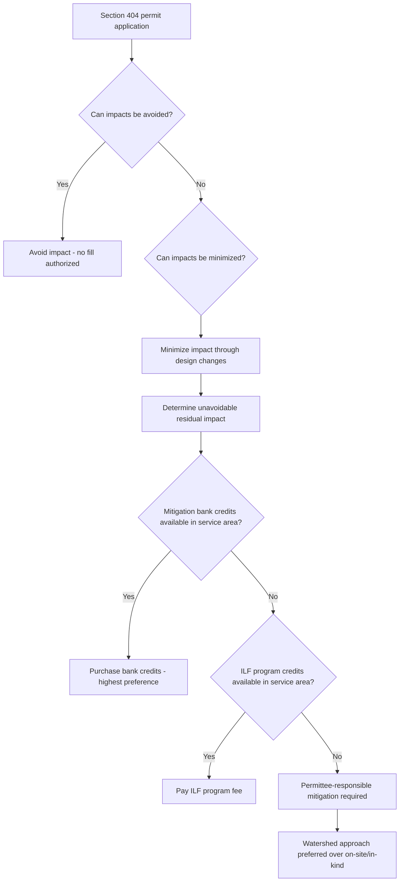

## Wetlands Mitigation Banking and In-Lieu Fee Programs

### Overview

When a Clean Water Act §404 permit authorizes the discharge of dredged or fill material into jurisdictional wetlands or other waters, the permittee is typically required to compensate for the resulting loss of aquatic resource functions. Compensatory mitigation is the mechanism by which this replacement occurs, and it can be accomplished through three principal mechanisms: **permittee-responsible mitigation**, **mitigation banking**, and **in-lieu fee (ILF) programs**. Mitigation banking and ILF programs are third-party compensatory mechanisms that allow a permittee to satisfy compensatory mitigation obligations by purchasing credits from an established program rather than personally constructing, monitoring, and maintaining replacement wetlands.

### Statutory and Regulatory Framework

- **CWA §404(b)(1) Guidelines** (40 C.F.R. Part 230) establish the substantive environmental criteria the Corps and EPA use to evaluate discharge permits, embodying a sequencing requirement: avoid impacts first, minimize unavoidable impacts second, and compensate for remaining unavoidable impacts third (the "mitigation sequence" or "avoid-minimize-mitigate" hierarchy).
- The **2008 Mitigation Rule** (33 C.F.R. Part 332; 40 C.F.R. Part 230, Subpart J), jointly issued by the Corps and EPA, is the primary regulatory framework governing compensatory mitigation for §404 permits. It established a preference hierarchy among mitigation mechanisms and standardized performance and accounting requirements across all three mechanisms.
- The rule was intended to improve the historically inconsistent ecological performance of permittee-responsible mitigation (which had high failure rates for wetland creation/restoration projects) by favoring pre-approved, professionally managed mitigation banks and ILF programs where available.

### The Mitigation Sequence

**Key Points**

1. **Avoidance**: The permit applicant must first demonstrate that discharge impacts to wetlands and other waters have been avoided to the extent practicable, including consideration of project alternatives (site location, design modifications) under the "practicable alternatives" analysis required by the §404(b)(1) Guidelines.
2. **Minimization**: Where some impact is unavoidable, the applicant must minimize the extent and severity of that impact through project design changes, construction techniques, or timing restrictions.
3. **Compensation**: Only after avoidance and minimization have been addressed does the compensatory mitigation requirement apply, intended to offset the unavoidable adverse impacts that remain.

### Mitigation Mechanisms Compared

**Permittee-Responsible Mitigation**

The permittee itself constructs, restores, enhances, or preserves wetlands (typically on- or near the impact site) to offset permitted impacts, and remains responsible for long-term performance, monitoring, and maintenance.

**Mitigation Banking**

A **mitigation bank** is a site (or suite of sites) where wetlands or other aquatic resources are restored, established, enhanced, or preserved in advance of development impacts, generating measurable ecological credits that are approved by an Interagency Review Team (IRT) and then sold to permittees needing to satisfy compensatory mitigation obligations for authorized impacts elsewhere within the bank's approved service area.

**In-Lieu Fee (ILF) Programs**

An ILF program involves a sponsor (typically a government agency or nonprofit organization) that collects fees from permittees in exchange for assuming responsibility for compensatory mitigation, then aggregates those fees to implement larger, often watershed-scale restoration projects, typically after the permitted impact has already occurred.

### Comparative Table: Mitigation Mechanisms

| Feature | Permittee-Responsible | Mitigation Banking | In-Lieu Fee Program |
| --- | --- | --- | --- |
| Who implements mitigation | The permittee | Bank sponsor (pre-established) | ILF program sponsor (post-fee) |
| Timing relative to impact | Concurrent or after | Before (credits pre-established) | After (fee paid at permit issuance, project built later) |
| Regulatory preference (2008 Rule) | Lowest preference | Highest preference | Middle preference |
| Financial assurance mechanism | Varies; often weaker | Required (bonds, escrow, etc.) | Required (fee held in program account) |
| Long-term management responsibility | Permittee | Bank sponsor, typically via conservation easement + long-term steward | ILF sponsor |
| Ecological performance track record | Historically inconsistent | Generally higher (professional management, IRT-approved) | Improving under 2008 Rule standardization |
| Scale of mitigation | Often small, dispersed sites | Larger, consolidated sites | Larger, watershed-scale, but temporally delayed |

### Regulatory Preference Hierarchy Under the 2008 Rule

The 2008 Mitigation Rule establishes an explicit order of preference the Corps must consider when evaluating available compensatory mitigation options for a given permit:

1. **Mitigation bank credits** (highest preference), if available with sufficient credits within the appropriate service area and having appropriate resource type.
2. **In-lieu fee program credits**, if available with sufficient credits within the appropriate service area and resource type.
3. **Permittee-responsible mitigation** under a watershed approach.
4. **Permittee-responsible mitigation** through on-site and in-kind mitigation.
5. **Permittee-responsible mitigation** through off-site and/or out-of-kind mitigation (lowest preference).

**[Inference]** The rationale for this hierarchy is that banks and ILF programs, being professionally managed, financially assured, and subject to IRT oversight, tend to produce more ecologically reliable and durable outcomes than dispersed, permittee-managed sites, though the Corps retains discretion to depart from this hierarchy where a district engineer determines another option is environmentally preferable for a specific permit.

### The Interagency Review Team (IRT) and Credit Approval Process

**Key Points**

- An IRT — typically chaired by the Corps district engineer and including EPA, the U.S. Fish and Wildlife Service, NOAA Fisheries (where applicable), and state resource agencies — reviews and approves mitigation bank and ILF program instruments.
- A **mitigation bank instrument (MBI)** or **ILF program instrument** is the formal, legally binding document establishing the bank or program, specifying its service area, credit release schedule, performance standards, monitoring requirements, financial assurances, and long-term management provisions.
- **Credits** are typically expressed in standardized units (often acres of restored/created/enhanced/preserved wetland, adjusted by functional assessment methodologies) and are released incrementally as performance milestones are achieved (e.g., a percentage of credits released at bank establishment, additional credits released upon demonstrating hydrology, vegetation establishment, etc.), rather than all at once.
- **Service areas** define the geographic area (often a watershed, HUC-8, or HUC-10 boundary) within which credits from a given bank or program may be used to offset permitted impacts, ensuring compensatory mitigation occurs reasonably close to (and within the same watershed as) the impact site.

### Diagram: Compensatory Mitigation Decision Process

### Financial Assurances and Long-Term Management

**Key Points**

- Both mitigation banks and ILF programs must provide **financial assurances** (e.g., performance bonds, letters of credit, escrow accounts) sufficient to ensure that, if the sponsor fails to complete or maintain the mitigation project, funds exist to complete corrective action.
- **Long-term management** of a completed mitigation site is typically secured through a **conservation easement** or equivalent real estate protection mechanism, combined with a **long-term management plan** and dedicated **non-wasting endowment** or other funding mechanism to fund perpetual stewardship (invasive species control, monitoring, boundary maintenance).
- Failure to establish adequate long-term financial mechanisms was a significant driver of ecological failure in mitigation projects prior to the 2008 Rule's standardization.

### Ecological Performance and Equivalency Issues

**Key Points**

- A persistent critique of compensatory mitigation generally — and one relevant across all three mechanisms — is the difficulty of achieving true **functional equivalency** between destroyed wetlands and replacement wetlands, particularly for wetlands with unique or slow-to-develop ecological functions (e.g., forested wetlands, which can take decades to generations to replicate structurally).
- **Temporal loss** is a specific concern with ILF programs: because compensation is often implemented after the permitted impact has already occurred, there is frequently a gap during which aquatic resource functions are lost without immediate offset — a concern the 2008 Rule attempted to address through requirements for ILF programs to complete a specified percentage of anticipated credit-generating activities within defined timeframes.
- **Out-of-kind and off-site mitigation** (replacing one wetland type with a different type, or mitigating in a different location within the watershed) raises additional equivalency concerns, which is part of why the regulatory hierarchy disfavors permittee-responsible off-site/out-of-kind mitigation as a last resort.
- **[Inference]** Post-*Sackett* narrowing of federal wetland jurisdiction may reduce the overall volume of impacts requiring compensatory mitigation under federal law, potentially affecting the financial viability of some existing mitigation banks that were established based on anticipated demand under broader pre-*Sackett* jurisdictional assumptions; however, the actual market effects would depend on state-level mitigation requirements filling any jurisdictional gap.

### Practical / Exam-Oriented Example

**Example**

A developer receives a §404 permit authorizing 2 acres of unavoidable wetland fill for a road project, after demonstrating that avoidance and minimization measures have been applied to the extent practicable.

- The Corps first checks whether an approved mitigation bank with an appropriate service area covering the project site has sufient available credits of the appropriate wetland type (e.g., palustrine emergent wetland credits, if that is the impacted type).
- If bank credits are available, the developer purchases the requisite number of credits (calculated using the bank's approved credit ratio, which may require, for example, 2:1 replacement acreage per acre impacted, depending on functional loss assessment) and the permit condition is satisfied upon proof of purchase.
- If no bank credits are available in the service area, the Corps next considers ILF program credits; only if neither is available does the Corps require the developer to perform permittee-responsible mitigation, generally preferring a watershed-based approach over simple on-site replacement.

### Related Topics

- CWA §404(b)(1) Guidelines and the avoid-minimize-mitigate sequencing requirement
- The 2008 Mitigation Rule (33 C.F.R. Part 332) — full regulatory text and preamble
- Interagency Review Team (IRT) composition and mitigation bank instrument approval process
- Watershed approach to compensatory mitigation planning
- *Sackett v. EPA* and its effect on the volume of federally jurisdictional impacts requiring mitigation
- State-level wetland mitigation programs and their interaction with federal requirements
- Conservation easements and perpetual stewardship funding mechanisms
- Functional assessment methodologies (e.g., Hydrogeomorphic Approach, Wetland Rapid Assessment Procedures) used to calculate credit ratios