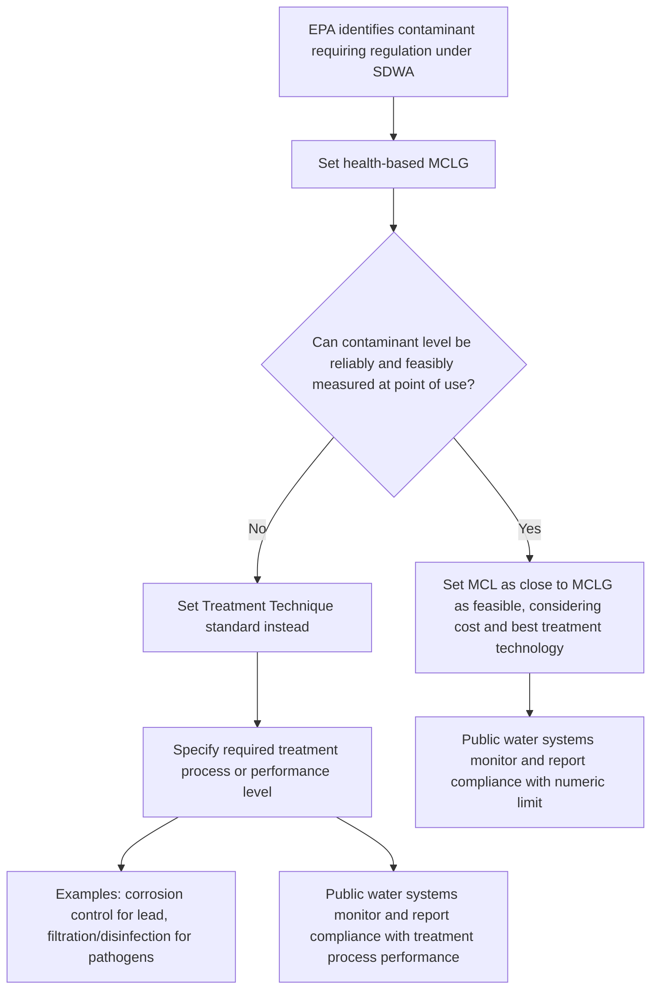

## Maximum Contaminant Levels and Treatment Technique Standards

### Overview

The Safe Drinking Water Act (SDWA), 42 U.S.C. §300f et seq., establishes the primary federal framework for regulating contaminants in public drinking water systems. At the core of that framework are **National Primary Drinking Water Regulations (NPDWRs)**, which the EPA sets using two principal regulatory mechanisms: **Maximum Contaminant Levels (MCLs)**, which are enforceable numeric limits on contaminant concentration, and **Treatment Technique (TT) standards**, which are enforceable procedural or technological requirements used when a numeric limit is not feasible to measure or enforce directly. Understanding the distinction between these two mechanisms — and the health-based goals that inform them — is foundational to SDWA compliance and enforcement.

### Statutory Framework

- **SDWA §1412(b)** directs EPA to establish NPDWRs for contaminants that may have adverse health effects, are known or likely to occur in public water systems at levels of health concern, and where regulation presents a meaningful opportunity for health risk reduction.
- For each regulated contaminant, EPA must first establish a **Maximum Contaminant Level Goal (MCLG)** — a non-enforceable health-based goal — and then set an enforceable standard (either an MCL or a TT) as close to the MCLG as is feasible.
- **"Feasible"** is defined by statute to mean feasible with the use of the best technology, treatment techniques, and other means which the Administrator finds are available (taking cost into consideration), and, for purposes of setting MCLs for contaminants for which a granular activated carbon or equally effective treatment method exists, feasibility is assessed considering that technology.

### Maximum Contaminant Level Goals (MCLGs)

**Key Points**

- MCLGs are set at the level at which no known or anticipated adverse health effects occur, allowing an adequate margin of safety, based purely on health considerations without regard to cost or technological feasibility.
- For known or probable human carcinogens, EPA typically sets the MCLG at **zero**, reflecting the conservative regulatory assumption (absent contrary scientific evidence) that there is no safe threshold of exposure for genotoxic carcinogens.
- MCLGs are **not enforceable** — they represent the aspirational health-based target that enforceable standards (MCLs or TTs) attempt to approach as closely as is feasible.

### Maximum Contaminant Levels (MCLs)

**Definition**

An MCL is the **enforceable maximum permissible level of a contaminant in water delivered to any user of a public water system**, expressed as a numeric concentration (e.g., milligrams per liter (mg/L) or micrograms per liter (µg/L)).

**Key Points**

- MCLs are set as close to the corresponding MCLG as is feasible, considering the best available treatment technology and cost.
- Where the MCLG is zero (as with many carcinogens), the MCL itself will be a non-zero number reflecting the lowest level that is technologically and economically feasible to achieve and reliably measure — since a numeric standard of exactly zero is not typically measurable or enforceable given analytical detection limits.
- MCLs apply as an average or as a specific sampling-point limit, depending on the contaminant-specific rule; monitoring frequency, sampling locations, and compliance calculation methods (e.g., running annual average, single-sample maximum) are specified in each contaminant-specific regulation.

**Illustrative Examples of MCLs**

| Contaminant | MCLG | MCL | Category |
| --- | --- | --- | --- |
| Arsenic | 0 | 0.010 mg/L (10 µg/L) | Inorganic chemical |
| Lead | 0 | Treatment technique (no numeric MCL) | Metal — see Lead and Copper Rule below |
| Total Trihalomethanes (TTHMs) | N/A (mixture) | 0.080 mg/L | Disinfection byproduct |
| Nitrate | 10 mg/L | 10 mg/L | Inorganic chemical |
| Benzene | 0 | 0.005 mg/L | Volatile organic chemical |
| Total Coliform | 0 | Treatment technique / presence-absence standard | Microbiological |

**[Inference]** Numeric values above reflect well-documented, long-standing EPA regulatory standards; exact figures should be verified against the current Code of Federal Regulations (40 C.F.R. Part 141) for any specific compliance or exam purpose, since periodic rule revisions can adjust individual contaminant standards.

### Treatment Technique (TT) Standards

**Definition**

A Treatment Technique is an **enforceable procedure or level of technological performance** which public water systems must follow to ensure control of a contaminant, used **in lieu of an MCL** when it is not economically or technologically feasible to ascertain the level of the contaminant through direct numeric measurement at the point of use.

**When TTs Are Used Instead of MCLs**

- **Difficulty of direct measurement**: Some contaminants (e.g., lead, which typically enters drinking water through corrosion of plumbing rather than being present at the water source) cannot be reliably regulated through a single numeric standard applied at the treatment plant, because the contaminant's concentration varies based on factors outside the water system's direct control (e.g., individual household plumbing materials).
- **Pathogen control**: For microbial contaminants and their surrogates, direct numeric measurement of every pathogen is often infeasible; instead, TT standards specify treatment processes (e.g., filtration and disinfection performance requirements) designed to achieve a target level of pathogen reduction.

**Key Examples of Treatment Technique Standards**

- **Lead and Copper Rule (LCR)**: Rather than an MCL, the LCR establishes **action levels** (0.015 mg/L for lead, 1.3 mg/L for copper) based on the 90th percentile of tap water samples; exceeding the action level triggers a treatment technique requirement — optimized corrosion control treatment — rather than an automatic MCL violation. The LCR also mandates lead service line inventory, replacement programs, and public education requirements as part of its treatment technique framework.
- **Surface Water Treatment Rule (SWTR) and its subsequent revisions** (Interim Enhanced SWTR, Long Term 1 and 2 Enhanced SWTR): Require systems using surface water (or groundwater under the direct influence of surface water) to achieve specified levels of removal/inactivation of *Giardia lamblia* cysts, viruses, and *Cryptosporidium* oocysts through filtration and disinfection treatment techniques, rather than through direct numeric contaminant measurement in finished water.
- **Total Coliform Rule / Revised Total Coliform Rule (RTCR)**: Uses a treatment-technique-style monitoring and response framework based on presence/absence of coliform bacteria and, where detected, following up with assessment and corrective action requirements, rather than a simple numeric concentration limit.

### Diagram: MCL vs. Treatment Technique Decision Logic

### National Primary vs. National Secondary Drinking Water Regulations

**Key Points**

- **National Primary Drinking Water Regulations (NPDWRs)** — which include both MCLs and TTs — are **legally enforceable** standards that apply to public water systems and are designed to protect public health by limiting levels of contaminants.
- **National Secondary Drinking Water Regulations (NSDWRs)** are **non-enforceable guidelines** regulating contaminants that primarily affect the aesthetic qualities of drinking water (taste, odor, color) — such as recommended limits for iron, manganese, and chloride — and are not part of the MCL/TT enforceable framework, though states may choose to make them enforceable under state law.

### Compliance Monitoring and Enforcement

**Key Points**

- Public water systems must conduct contaminant-specific monitoring according to schedules set in each NPDWR, which vary by system size, source water type, and contaminant category (e.g., annual monitoring for some inorganics, quarterly for others, continuous monitoring for certain disinfection byproducts or pathogen indicators).
- Violations are categorized primarily as either an **MCL violation** (numeric exceedance, calculated according to the contaminant-specific compliance formula) or a **treatment technique violation** (failure to properly operate or maintain required treatment processes, or failure to meet a specified performance criterion), each triggering specific public notification requirements under the SDWA's tiered notice framework.
- **Monitoring and reporting violations** (failure to test or report on schedule) are treated as a distinct violation category from actual contaminant or treatment technique violations, though they can still result in enforcement action and public notification obligations.
- States with EPA-approved "primacy" (primary enforcement authority) implement and enforce NPDWRs directly; EPA retains authority to enforce or take over enforcement where primacy states fail to act.

### Practical / Exam-Oriented Example

**Example**

A public water system serves a community using a groundwater source containing naturally occurring arsenic at a concentration of 0.015 mg/L.

- Because arsenic can be reliably measured and there is an established numeric MCL, the system compares its arsenic sample results directly to the enforceable MCL of 0.010 mg/L. Since 0.015 mg/L exceeds the MCL, this constitutes an MCL violation, triggering treatment requirements (e.g., installation of an approved arsenic removal technology such as coagulation/filtration, activated alumina, or reverse osmosis) and public notification obligations.
- By contrast, if the same system's tap water samples showed elevated lead due to old lead service lines, there is no numeric MCL to compare against directly; instead, the system evaluates its 90th-percentile tap sampling results against the lead action level. If exceeded, the system does not automatically "violate an MCL" — instead, it must implement (or optimize) corrosion control treatment as its treatment technique obligation, along with lead service line replacement planning and public education requirements under the Lead and Copper Rule.

### Related Topics

- The Lead and Copper Rule and its 2021/2024 revisions (Lead and Copper Rule Improvements)
- Surface Water Treatment Rule and its Long Term 2 Enhanced revision for *Cryptosporidium* control
- Disinfection byproduct regulation (Stage 1 and Stage 2 Disinfectants and Disinfection Byproducts Rules)
- SDWA primacy delegation to states and EPA oversight authority
- Public notification tiers and consumer confidence report (CCR) requirements
- PFAS regulation under the SDWA and EPA's 2024 PFAS NPDWR
- Underground Injection Control (UIC) program and groundwater protection under the SDWA
- Unregulated Contaminant Monitoring Rule (UCMR) and the contaminant candidate list process