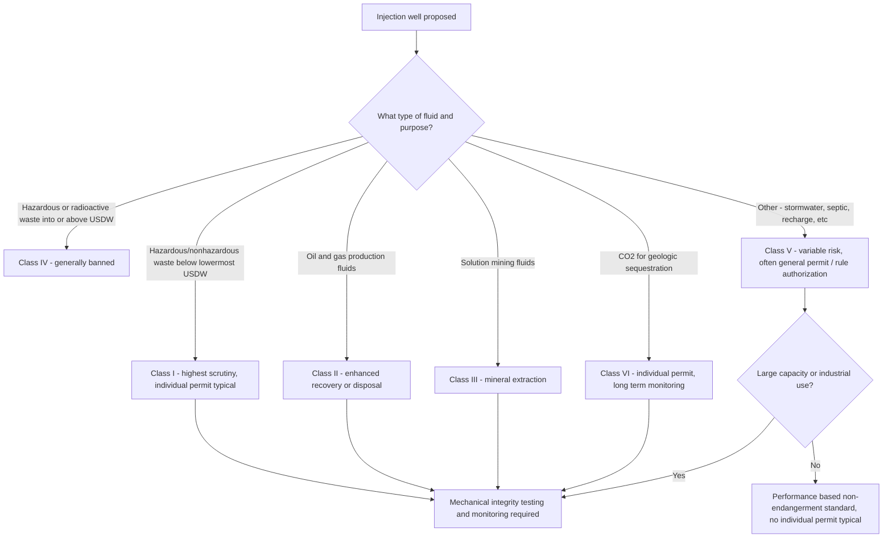

## The Underground Injection Control Program

### Overview

The Underground Injection Control (UIC) program is the regulatory framework established under Part C of the Safe Drinking Water Act (SDWA), 42 U.S.C. §300h et seq., to protect underground sources of drinking water (USDWs) from contamination caused by the subsurface injection of fluids. Unlike the SDWA's primary focus on treatment of water delivered to the public, the UIC program is preventive and source-protection oriented: it regulates the injection of fluids into wells to ensure they do not endanger drinking water aquifers, whether those aquifers are currently used for drinking water or merely have the potential to be used for that purpose in the future.

### Statutory and Regulatory Framework

- **SDWA §1421** directs EPA to promulgate regulations for state UIC programs containing minimum requirements for effective programs to prevent underground injection which endangers drinking water sources.
- **"Endangerment"** is defined broadly: an injection activity endangers drinking water sources if it may result in the presence of any contaminant in underground water which supplies (or could supply) a public water system, and if that presence may result in the system's failure to comply with a National Primary Drinking Water Regulation or may otherwise adversely affect public health.
- The implementing regulations are codified primarily at **40 C.F.R. Parts 144–148**, establishing the well classification system, permitting requirements, construction and operating standards, and state primacy procedures.
- **"Underground Source of Drinking Water" (USDW)** is defined to include aquifers (or portions of aquifers) that currently supply a public water system or contain a sufficient quantity of groundwater to supply a public water system, and which currently contain fewer than 10,000 mg/L total dissolved solids — a broad definition that captures many aquifers not presently in active use.

### The Well Classification System

The UIC program organizes injection wells into six classes based on the type of fluid injected and the associated risk to USDWs:

| Class | Description | Primary Use | Risk Profile |
| --- | --- | --- | --- |
| **Class I** | Wells injecting hazardous and non-hazardous wastes below the lowermost USDW | Industrial and municipal waste disposal | Highest regulatory scrutiny; deepest injection, most stringent construction standards |
| **Class II** | Wells associated with oil and natural gas production | Enhanced recovery, disposal of produced water, hydrocarbon storage | High volume; largest class by well count |
| **Class III** | Wells injecting fluids for solution mining | Extraction of minerals (e.g., salt, sulfur, uranium via in-situ leaching) | Moderate; localized to mining operations |
| **Class IV** | Wells injecting hazardous or radioactive waste directly into or above a USDW | Historically used for waste disposal | **Banned** — generally prohibited under the UIC program, except limited CERCLA/RCRA-authorized groundwater remediation wells |
| **Class V** | All injection wells not included in Classes I–IV | Wide variety: stormwater drainage wells, septic system leach fields (large-capacity), aquifer recharge/storage wells, geothermal return wells | Highly variable; ranges from low-risk to significant contamination risk depending on well type and fluid |
| **Class VI** | Wells injecting carbon dioxide for geologic sequestration | Carbon capture and storage (CCS) | Emerging class; specifically designed for long-term CO2 storage |

**Key Points**

- **Class IV wells are effectively banned** under the UIC program because of their direct threat to USDWs, with narrow exceptions for approved groundwater remediation activities conducted under CERCLA or RCRA corrective action authority.
- **Class II wells** are the most numerous category nationally due to the scale of oil and gas operations, and their regulation is frequently a focal point in debates over hydraulic fracturing wastewater disposal and induced seismicity.
- **Class V wells** encompass an extremely diverse category, including many wells (such as typical residential septic systems) that are not required to obtain individual permits but must comply with general performance-based non-endangerment standards; large-capacity or industrial Class V wells face greater regulatory scrutiny.
- **Class VI** was added specifically to accommodate the emerging carbon capture and sequestration industry, reflecting long-term site-specific geologic and monitoring requirements distinct from the other well classes.

### Permitting Approaches

**Key Points**

- Most injection wells are regulated under **general permits** (technically "rules" applicable to a class or subclass of wells meeting specified criteria) rather than individual permits, particularly for lower-risk categories like many Class V wells.
- Higher-risk well classes (particularly Class I and Class VI) typically require **individual permits**, involving site-specific geologic characterization, area-of-review analysis, and construction/monitoring plan review before a well may be authorized.
- **Area of Review (AoR)**: Applicants for higher-risk injection wells must typically define and analyze an area of review — the region around the well where the injected fluid could potentially migrate and where other wells (including abandoned or improperly plugged wells) could serve as conduits for fluid migration into a USDW.

### Construction, Operating, and Closure Standards

**Key Points**

- Construction standards generally require **mechanical integrity** — the well must be free of significant leaks in its casing, tubing, and packer (internal mechanical integrity) and must not have significant fluid movement outside the well casing into a USDW (external mechanical integrity).
- **Mechanical integrity testing** (e.g., pressure testing, radioactive tracer surveys) is required periodically to confirm the well continues to prevent fluid migration outside the intended injection zone.
- **Monitoring requirements** vary by well class but typically include injection pressure, volume, and rate monitoring, and for higher-risk classes, groundwater monitoring in the vicinity of the well.
- **Well closure (plugging and abandonment)** requires the well to be plugged with cement or other approved materials in a manner that prevents the well from serving as a future conduit for fluid movement into or between USDWs.

### Diagram: UIC Well Classification and Risk Hierarchy

### State Primacy and Federal Implementation

**Key Points**

- As with other SDWA programs, states may apply for and receive **primacy** (primary enforcement authority) over the UIC program within their borders, provided their state program meets or exceeds EPA's minimum federal requirements.
- Where a state has not received primacy for a particular well class, **EPA directly implements** the UIC program for that class within the state (a "direct implementation" or "federal program" state).
- Primacy determinations can vary by well class within the same state — a state may hold primacy for Class II wells (often delegated to state oil and gas regulatory agencies given their expertise) while EPA retains direct implementation for other classes.
- **[Inference]** Class II primacy is frequently delegated to state oil and gas commissions or similar agencies rather than state environmental agencies, reflecting the specialized technical overlap between UIC Class II regulation and conventional oil and gas regulatory expertise; the precise agency designation varies by state.

### Class VI and Carbon Capture and Sequestration (CCS)

**Key Points**

- Class VI wells were established through a dedicated rulemaking to address the unique long-term liability, monitoring, and geologic characterization needs of CO2 sequestration, which differs from other injection activities in its intended permanence (CO2 is meant to remain sequestered indefinitely, not be produced or recovered).
- Class VI permitting requires extensive **site characterization** (geologic and hydrogeologic modeling of the injection zone and confining zone), an **area of review and corrective action plan**, and long-term **post-injection site care and site closure** plans extending well beyond the active injection period.
- Given the growing federal policy interest in carbon capture technologies, **[Inference]** the pace of Class VI primacy delegation to individual states and permitting throughput may be an area of ongoing regulatory and legislative attention, though the precise trajectory depends on evolving federal energy and climate policy.

### Interaction with Other Environmental Statutes

**Key Points**

- UIC Class I and certain Class V wells intersect with **RCRA** (Resource Conservation and Recovery Act) hazardous waste regulation where the injected fluid is also a RCRA hazardous waste, requiring compliance with both regulatory frameworks.
- Groundwater remediation wells used to inject treatment agents (e.g., for in-situ bioremediation or chemical oxidation) under **CERCLA** or **RCRA corrective action** authority may require UIC authorization, sometimes through an "aquifer exemption" or specific remediation well provisions rather than standard Class IV prohibitions.
- **Aquifer exemptions**: EPA or a primacy state may exempt a specific aquifer (or portion thereof) from USDW classification where it meets defined criteria (e.g., it is not currently used as a drinking water source, is not reasonably expected to be used as such, and is either hydrocarbon-producing, too deep/isolated to be reasonably treated, or otherwise unsuitable), enabling injection activities (particularly Class II enhanced recovery) that would otherwise be prohibited.

### Practical / Exam-Oriented Example

**Example**

An oil and gas operator wishes to dispose of produced water (wastewater generated during oil extraction) by injecting it into a deep geologic formation that previously produced hydrocarbons but is not used and not reasonably expected to be used as a drinking water source.

- The operator would seek classification of the well as a **Class II** disposal well.
- Because the target formation may otherwise meet the technical definition of a USDW (based on total dissolved solids content), the operator or state agency may first need to establish that the formation qualifies for an **aquifer exemption**, given its hydrocarbon-bearing history and lack of drinking water use potential.
- The operator must demonstrate the well's mechanical integrity, define an area of review to identify any nearby wells that could serve as conduits for upward fluid migration, and comply with the applicable state (if the state holds Class II primacy) or EPA-administered permitting and monitoring requirements.

### Related Topics

- Maximum Contaminant Levels and Treatment Technique standards (predecessor topic)
- SDWA state primacy delegation procedures generally
- Hydraulic fracturing and induced seismicity concerns associated with Class II disposal wells
- RCRA hazardous waste regulation and its overlap with UIC Class I wells
- CERCLA groundwater remediation and its interaction with UIC well classification
- Class VI carbon capture and sequestration permitting and long-term stewardship requirements
- Aquifer exemption petitions and USDW redesignation procedures
- Sole Source Aquifer Program under SDWA §1424(e)