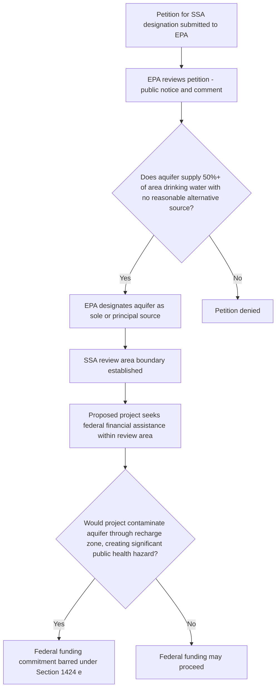

## Sole Source Aquifer Designation and Source Water Protection

### Overview

The Safe Drinking Water Act (SDWA) provides two distinct but related mechanisms aimed at protecting drinking water at its source, rather than only regulating contaminants after water reaches a treatment plant or tap: the **Sole Source Aquifer (SSA) Program** under §1424(e), and the **Source Water Assessment and Protection Program (SWAP)** established by the 1996 SDWA Amendments. Both reflect a preventive, watershed/aquifer-scale approach to drinking water protection that complements the technology-based and health-based standards (MCLs and treatment techniques) governing water once it enters a public water system.

### The Sole Source Aquifer Program

**Statutory Basis**

**SDWA §1424(e)**, 42 U.S.C. §300h-3(e), authorizes EPA to designate an aquifer as a "sole or principal source aquifer" if EPA determines that the aquifer is the **sole or principal drinking water source** for an area and, if contaminated, would create a significant hazard to public health.

**Designation Criteria**

**Key Points**

- An aquifer qualifies for SSA designation if it supplies **50 percent or more** of the drinking water consumed in the area overlying the aquifer, and if there is no reasonably available alternative drinking water source(s) should the aquifer become contaminated.
- Designation petitions may be submitted by any interested person or entity — states, local governments, tribes, water utilities, or citizen groups — and EPA reviews the petition through a public notice-and-comment process before making a final designation determination.
- Designation is a **geographically defined** action: EPA delineates a specific aquifer boundary (and often a corresponding "SSA review area," which may extend somewhat beyond the aquifer's recharge area) as the area subject to the program's requirements.

**Legal Effect of Designation**

**Key Points**

- Once an aquifer is designated, **SDWA §1424(e)** requires that **no commitment for federal financial assistance** (through a grant, contract, loan guarantee, or other financial assistance) may be provided for any project that EPA determines **may contaminate the aquifer through a recharge zone so as to create a significant hazard to public health**.
- This creates a **federal project review requirement**: proposed projects receiving federal funding within a designated SSA review area must undergo EPA review to assess potential contamination risk to the aquifer before federal funds may be committed.
- **Key limitation**: the SSA program's binding legal effect is narrow — it does **not** directly regulate private development, state-permitted activities, or projects lacking a federal funding nexus. Its primary lever is conditioning federal financial assistance, not imposing independent land-use or discharge controls.
- **[Inference]** Because the SSA program's enforceable mechanism depends on the presence of federal funding, its practical protective effect in a given area depends significantly on how much federally funded development activity occurs there; areas with little federal funding nexus may see limited direct regulatory benefit from SSA designation alone, even though the designation may still carry symbolic, planning, and public-awareness value.

### Diagram: Sole Source Aquifer Review Process

### Source Water Assessment and Protection Program (SWAP)

**Statutory Basis**

The **1996 SDWA Amendments** added §1453, requiring each state to develop a **Source Water Assessment Program (SWAP)**, approved by EPA, to assess the vulnerability of public water system sources (both surface water and groundwater) to contamination.

**Core Elements of a Source Water Assessment**

**Key Points**

1. **Delineation**: Defining the boundaries of the source water area for each public water system — for surface water systems, this is typically the contributing watershed; for groundwater systems, this is typically the wellhead protection area or contributing recharge zone.
2. **Contaminant inventory**: Identifying potential sources of contamination within the delineated source water area (e.g., industrial facilities, agricultural operations, underground storage tanks, septic systems, historic waste disposal sites, transportation corridors).
3. **Susceptibility analysis**: Assessing the susceptibility of each public water system's source to the identified contamination sources, based on factors such as the aquifer's hydrogeologic characteristics or the watershed's land use and hydrology.
4. **Public availability**: Assessment results must be made available to the public, providing transparency about source water vulnerability to inform local land-use planning, source water protection initiatives, and consumer awareness.

**Relationship to Wellhead Protection Programs**

**Key Points**

- SWAP builds upon and extends the earlier **Wellhead Protection Program** established by the 1986 SDWA Amendments (§1428), which required states to develop programs to protect the area surrounding public water supply wells from contaminants that could adversely affect human health.
- Wellhead protection areas (WHPAs) are typically delineated using hydrogeologic modeling to estimate the surface and subsurface area contributing recharge to a given well within a specified time-of-travel (e.g., a 5-year or 10-year time-of-travel boundary), providing a scientific basis for local protective land-use measures.

**Voluntary and Non-Regulatory Nature**

**Key Points**

- Unlike MCLs or treatment technique standards, source water assessments and wellhead protection programs are fundamentally **planning and disclosure tools** rather than independently enforceable regulatory limits — the SDWA does not directly mandate specific land-use restrictions within delineated source water protection areas.
- Implementation of actual protective measures (zoning overlays, conservation easements, agricultural best management practices, local ordinances restricting certain land uses) depends on **state and local government action**, often undertaken voluntarily in response to the assessment findings, or as a condition of other funding programs (e.g., Drinking Water State Revolving Fund set-asides for source water protection).
- **[Inference]** Because the SDWA relies on state and local implementation for the protective land-use component, actual on-the-ground protection varies substantially across jurisdictions depending on local political will, funding availability, and competing land-use pressures.

### Comparative Table: SSA Program vs. SWAP

| Feature | Sole Source Aquifer (SSA) Program | Source Water Assessment and Protection (SWAP) |
| --- | --- | --- |
| Statutory basis | SDWA §1424(e) | SDWA §1453 (1996 Amendments) |
| Scope | Specific designated aquifers meeting 50%+ supply criterion | All public water system sources nationwide (surface and groundwater) |
| Primary mechanism | Conditions federal financial assistance | Assessment, delineation, and public disclosure |
| Enforceability | Binding restriction on federal funding within review area | Non-regulatory; implementation depends on state/local follow-through |
| Initiating action | Petition-based designation | State-run program applicable to all systems |
| Typical follow-on protective measures | Federal project review | Local zoning, BMPs, wellhead protection ordinances (voluntary) |

### Interaction with the UIC Program and Aquifer Exemptions

**Key Points**

- Source water protection tools intersect with the **Underground Injection Control (UIC) program**: an aquifer's status as a designated SSA or its identification through source water assessment as a vulnerable drinking water source is relevant context when evaluating proposed injection well permits or aquifer exemption petitions in the same geographic area, even though the two programs operate under distinct statutory authorities (§1424(e) versus §1421/1422).
- **[Inference]** In practice, an aquifer that has been designated as a sole source aquifer would likely face heightened scrutiny in any related UIC permitting or aquifer exemption proceeding within the same area, given the shared underlying policy concern of protecting drinking water sources, though the SSA designation itself does not automatically alter UIC permitting standards.

### Practical / Exam-Oriented Example

**Example**

A rural community relies entirely on a single unconfined aquifer for its municipal drinking water supply, with no practical alternative source available given local geography and cost constraints.

- Local stakeholders successfully petition EPA to designate the aquifer as a sole source aquifer under §1424(e), and EPA establishes a review area encompassing the aquifer's recharge zone.
- Subsequently, a proposed federally funded highway interchange project is planned within the recharge zone. Under the SSA designation, EPA must review the project to determine whether it may contaminate the aquifer through the recharge zone so as to create a significant public health hazard; if EPA makes that determination, federal funding for the project may not be committed unless the project is modified to eliminate the contamination risk.
- Separately, the state's source water assessment program has already delineated the same recharge zone and identified septic systems and a nearby agricultural operation as potential contamination sources — information the state and local government can use to pursue voluntary local protective measures (e.g., septic system upgrade incentives, agricultural best management practice programs), independent of the SSA program's federal-funding-specific restriction.

### Related Topics

- The Underground Injection Control program and aquifer exemptions (predecessor topic)
- Maximum Contaminant Levels and Treatment Technique standards (predecessor topic)
- Wellhead Protection Program under SDWA §1428
- Drinking Water State Revolving Fund (DWSRF) and its source water protection set-asides
- State and local land-use regulation as a groundwater protection tool
- CERCLA and RCRA corrective action in source water protection areas
- Agricultural nonpoint source pollution and its regulation (or lack thereof) under federal law
- PFAS contamination of groundwater sources and emerging source water protection challenges