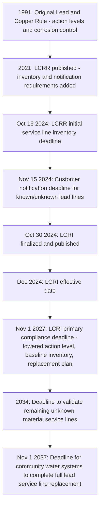

## The Lead and Copper Rule and Drinking Water Infrastructure

### Overview

The Lead and Copper Rule (LCR), first issued by EPA in 1991 under the Safe Drinking Water Act, is the National Primary Drinking Water Regulation governing lead and copper contamination in drinking water. Unlike most SDWA contaminant standards, the LCR does not use a Maximum Contaminant Level; instead, it relies on a **treatment technique** framework built around **action levels**, corrosion control treatment, and — following a series of major revisions culminating in the 2024 Lead and Copper Rule Improvements (LCRI) — a nationwide mandate to physically replace lead service lines. The rule sits at the intersection of drinking water regulation and aging infrastructure policy, since lead contamination in tap water typically originates not from the water source but from lead-containing plumbing materials and service lines connecting homes to water mains.

### Why Lead Is Regulated Through a Treatment Technique, Not an MCL

**Key Points**

- Lead most commonly enters drinking water through the corrosion of lead service lines, lead solder, and brass fixtures containing lead — infrastructure that is physically part of individual buildings and street connections rather than a contaminant present at the water source or treatment plant.
- Because lead levels vary enormously from tap to tap depending on individual plumbing materials, water chemistry, and stagnation time, a single numeric MCL applied at a centralized treatment point cannot reliably control or measure lead exposure at the point of consumption.
- EPA's Maximum Contaminant Level Goal (MCLG) for lead is **zero**, reflecting the scientific consensus, as summarized in industry and public health literature, that ingesting lead is unsafe at any level — it can cause slowed growth, behavioral problems, brain and nervous system damage in children, and reproductive, cognitive, and cardiovascular problems in adults.
- Given the zero MCLG and the infeasibility of controlling lead through a single treatment-plant numeric limit, EPA regulates lead through a treatment technique requiring corrosion control treatment and, most significantly, physical replacement of lead-bearing infrastructure.

### The Original Lead and Copper Rule (1991) Framework

**Key Points**

- **Action Levels**: Rather than an MCL, the LCR establishes action levels based on the 90th percentile of tap water samples collected from a representative sample of high-risk sites (historically, homes with lead service lines or lead solder) — 0.015 mg/L (15 parts per billion) for lead and 1.3 mg/L for copper.
- **Tap sampling**: Water systems collect tap samples according to a monitoring schedule (frequency dependent on system size and monitoring history) and calculate the 90th percentile value across all samples to compare against the action level.
- **Optimized corrosion control treatment (OCCT)**: If the action level is exceeded, the treatment technique requires the system to install or optimize corrosion control treatment (e.g., adjusting pH, alkalinity, or adding a corrosion inhibitor such as orthophosphate) designed to reduce the leaching of lead and copper from plumbing materials into the water.
- **Source water treatment and public education**: Additional treatment technique requirements can include source water treatment (where the source itself contributes lead or copper) and mandatory public education programs informing customers about lead risks and steps to reduce exposure.

### The 2021 Lead and Copper Rule Revisions (LCRR)

Published January 15, 2021, the LCRR was the first major overhaul of the original 1991 rule, introducing service line inventory and enhanced notification obligations while retaining the original 15 ppb action level.

**Key Requirements**

- **Initial service line inventory**: All Community Water Systems (CWS) and Non-Transient Non-Community Water Systems (NTNCWS) were required to submit an initial inventory of water service line materials to state primacy agencies by **October 16, 2024**, and to make that inventory publicly available. EPA reported nationally there were approximately 5.1 million service lines with known lead content, 1.7 million service lines classified as "galvanized requiring replacement" (GRR — galvanized lines that were or may have been downstream of a lead line and thus can accumulate lead), and 20.7 million lines with unknown material.
- **Customer notification**: Following the inventory deadline, systems have 30 days (until November 15, 2024, for the initial inventory cycle) to notify every customer served by a known lead service line, a GRR line, or a line of unknown material, with annual notices required thereafter for as long as the classification persists.
- **Tier 1 public notification**: Systems must distribute Tier 1 (most urgent) public notification to all customers within 24 hours following a lead action level exceedance.

### The 2024 Lead and Copper Rule Improvements (LCRI)

**Procedural History and Effective Dates**

EPA finalized the Lead and Copper Rule Improvements on October 8, 2024 (published in the Federal Register on October 30, 2024), replacing and building upon the LCRR. The rule became effective December 29–30, 2024, with a primary compliance deadline of **November 1, 2027**, for most substantive requirements, while public water systems must comply with both the original 1991 LCR and certain surviving LCRR provisions (such as the initial inventory) in the interim.

**Key Substantive Changes**

1. **Mandatory 100% lead service line replacement**: The LCRI's central mandate requires drinking water systems nationwide to replace essentially all lead service lines and galvanized-requiring-replacement (GRR) lines within **10 years**, with a nationwide compliance target of **November 1, 2037**, for community water systems to complete full replacement.
2. **Lowered lead action level**: The LCRI lowers the lead action level from **15 ppb to 10 ppb**, making the treatment technique trigger more protective and increasing the number of systems likely to exceed the action level and thus trigger corrosion control and replacement obligations.
3. **"Control" over service lines broadly defined**: A water system is considered to have control over a service line — and therefore responsible for replacing it — whenever it has legal or physical access to conduct a full replacement, which can include portions of lead service lines located on private property (homeowner-side lines), a significant expansion of utility responsibility compared to earlier practice, which often left the customer-owned portion of a lead service line unaddressed.
4. **Improved tap sampling protocol**: The rule requires collection of both **first-liter and fifth-liter samples** at sites with lead service lines, using the higher of the two values when determining compliance — a protocol change informed by state and local best practices (e.g., Michigan's post-Flint sampling protocol) designed to better capture lead levels representative of water that has been in contact with the lead service line itself, rather than only water that sat in interior plumbing.
5. **Updated and validated inventories**: Systems must develop a **baseline inventory** (an updated, more complete inventory building on the LCRR's initial inventory) by November 1, 2027, create a publicly available lead service line replacement plan, and validate any service lines still listed as "unknown material" by **2034**.
6. **Deferred deadlines for high-burden systems**: EPA included a provision allowing a small subset of systems with unusually high proportions of lead service lines to qualify for additional time beyond the standard 10-year replacement deadline, conditioned on demonstrating continued progress and commitment to replacement; EPA estimated approximately 1% of water systems would be eligible for this deferral.

### Diagram: LCR/LCRR/LCRI Compliance Timeline

### Compliance Mechanics: How a System Complies

**Key Points**

- **Step 1 — Inventory**: Compile and classify every service line in the system's distribution area by material (lead, galvanized requiring replacement, non-lead, or unknown), submit to the state primacy agency, and publish it publicly.
- **Step 2 — Notification**: Notify affected customers annually (and via Tier 1 notice within 24 hours of any action level exceedance).
- **Step 3 — Sampling**: Conduct tap sampling using the updated first-liter/fifth-liter protocol at representative high-risk sites, calculating the 90th percentile lead concentration.
- **Step 4 — Treatment technique response**: If the (now 10 ppb) action level is exceeded, implement or optimize corrosion control treatment, expand public education efforts, and, where applicable, accelerate lead service line replacement pace.
- **Step 5 — Replacement**: Develop and publicly post a lead service line replacement plan, and physically replace all lead and GRR service lines — including privately-owned portions where the utility has legal or physical access — on a schedule reaching full replacement by the applicable deadline (generally November 1, 2037, absent an approved deferral).

### Infrastructure Financing Context

**Key Points**

- The scale of the LCRI's replacement mandate — millions of documented and undetermined lead and GRR service lines nationwide — represents a substantial capital infrastructure undertaking for public water systems, particularly smaller and under-resourced utilities.
- **[Inference]** Because service line replacement, especially on private property, can be costly and logistically complex (requiring property access agreements, coordination with individual homeowners, and significant per-line replacement costs), full compliance by the 2037 deadline is likely to depend substantially on the availability of federal and state infrastructure funding mechanisms, such as the Drinking Water State Revolving Fund (DWSRF) and dedicated lead service line replacement funding streams, though the precise funding landscape is subject to ongoing legislative and appropriations developments.
- The requirement that utilities take responsibility for replacing privately-owned portions of lead service lines (where they have legal or physical access) represents a significant shift in the traditional utility/customer cost-and-responsibility boundary, with potential implications for utility rate structures and cost recovery mechanisms.

### Practical / Exam-Oriented Example

**Example**

A mid-sized community water system's baseline inventory identifies 3,000 service lines: 800 confirmed lead, 200 galvanized-requiring-replacement, and 2,000 of unknown material.

- Under the LCRI, the system must notify all 3,000 affected households annually until each line's status is resolved, and must validate the 2,000 unknown-material lines (through methods such as records review, visual inspection, or predictive modeling) by 2034.
- The system's replacement plan must set out a schedule to replace all 1,000 confirmed lead and GRR lines — and any additional lines later confirmed to contain lead among the "unknown" category — reaching full replacement by November 1, 2037, absent a qualifying deferral.
- If a tap sampling round shows a 90th percentile lead concentration of 12 ppb, this exceeds the LCRI's lowered 10 ppb action level, triggering treatment technique obligations: the system must review and likely adjust its corrosion control treatment, issue Tier 1 public notification within 24 hours, and consider accelerating its replacement schedule for the highest-risk service lines.

### Related Topics

- Maximum Contaminant Levels and Treatment Technique standards generally (predecessor topic)
- Optimized corrosion control treatment chemistry and orthophosphate dosing
- The Flint, Michigan water crisis and its influence on LCRR/LCRI sampling protocol reforms
- Drinking Water State Revolving Fund (DWSRF) and dedicated lead service line replacement funding
- Environmental justice considerations in lead service line replacement prioritization
- Sole Source Aquifer designation and Source Water Assessment and Protection Program (predecessor topic)
- PFAS regulation under the SDWA and its parallel treatment-technique and infrastructure funding dynamics
- State primacy implementation variability in LCRI enforcement and deferred deadline approvals