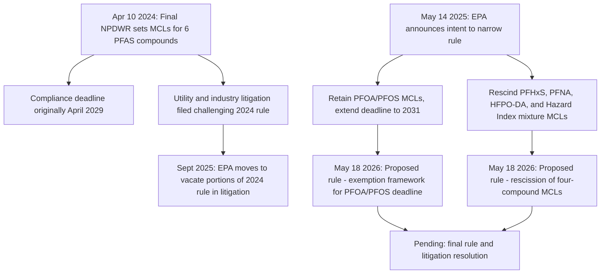

## Regulation of PFAS and Other Emerging Contaminants

### Overview

Per- and polyfluoroalkyl substances (PFAS) — a large class of synthetic chemicals sometimes called "forever chemicals" due to their extreme environmental persistence — represent the most significant emerging contaminant challenge facing the Safe Drinking Water Act (SDWA) regulatory framework in the current era. EPA's regulatory approach to PFAS has evolved rapidly and remains actively contested through litigation and successive rulemakings, making this one of the most dynamic areas of current environmental law. This topic also illustrates the SDWA's general regulatory process for identifying and controlling emerging contaminants that were not anticipated by the statute's original contaminant-specific standards.

### The SDWA Framework for Emerging Contaminants

**Key Points**

- **Contaminant Candidate List (CCL)**: EPA is required to periodically publish a list of contaminants that are not currently subject to any proposed or promulgated NPDWR, are known or anticipated to occur in public water systems, and may require regulation — the starting point for identifying emerging contaminants like PFAS.
- **Unregulated Contaminant Monitoring Rule (UCMR)**: EPA periodically requires a representative sample of public water systems to monitor for unregulated contaminants (including specific PFAS compounds in recent UCMR cycles) to generate nationwide occurrence data informing future regulatory determinations.
- **Regulatory determination**: Before EPA can establish an NPDWR for a new contaminant, it must make a formal regulatory determination that the contaminant meets the statutory criteria (adverse health effects, occurrence at levels of concern, and meaningful opportunity for health risk reduction through regulation) — a required predicate step in the process that later became a point of legal contention in PFAS rulemaking.

### The April 2024 PFAS National Primary Drinking Water Regulation

**Original Scope**

On April 10, 2024, EPA announced the final PFAS National Primary Drinking Water Regulation, establishing legally enforceable MCLs for six PFAS compounds:

| Compound | MCL | MCLG |
| --- | --- | --- |
| PFOA (perfluorooctanoic acid) | 4.0 ppt | 0 |
| PFOS (perfluorooctane sulfonic acid) | 4.0 ppt | 0 |
| PFHxS | 10 ppt | 10 ppt |
| PFNA | 10 ppt | 10 ppt |
| HFPO-DA ("GenX") | 10 ppt | 10 ppt |
| Mixtures (PFHxS, PFNA, HFPO-DA, and PFBS) | Hazard Index of 1 | Hazard Index of 1 |

**Key Points**

- The **Hazard Index** approach for the four-chemical mixture category is a departure from the traditional single-contaminant MCL format, reflecting EPA's determination that these PFAS compounds can produce combined health effects even when no single compound individually exceeds its own reference level — a regulatory design responsive to the reality that PFAS contamination frequently involves co-occurring compounds.
- The MCLGs of **zero** for PFOA and PFOS reflect EPA's determination that these compounds are likely human carcinogens with no safe threshold of exposure, consistent with the SDWA's general approach to carcinogens.
- The original rule required public water system compliance with all six-compound MCLs by **April 2029**, and mandated concurrent monitoring and public notification obligations.

### The 2025 Rollback and Rescission Proceedings

**May 2025 Announcement**

On May 14, 2025, following the change in federal administrations, EPA announced its intent to significantly narrow the 2024 rule's scope. The agency stated it would:

1. **Retain** the MCLs for PFOA and PFOS at 4 ppt each, while **extending the compliance deadline from 2029 to 2031** — two additional years, citing the need to allow public water providers, especially in rural and small communities, to meet requirements that in some cases require construction, installation, and operation of complex and costly treatment systems.
2. **Rescind and reconsider** the regulatory determinations and resulting MCLs for the four other PFAS — PFHxS, PFNA, HFPO-DA, and the Hazard Index mixture — asserting that the Biden administration's 2024 determinations for these compounds did not properly follow the SDWA's statutory rulemaking process.
3. Establish a **federal exemption framework** allowing systems to request additional compliance time for the retained PFOA/PFOS MCLs.

**The May 2026 Proposed Rules**

On May 18, 2026, EPA announced two proposed rules for public comment, formally implementing the May 2025 policy path:

1. A proposed rule upholding the NPDWR for PFOA and PFOS while providing an option for drinking water systems to request **two additional years (to 2031)** to comply with the enforceable limits through a federal exemption mechanism.
2. A proposed rule to **rescind** the drinking water regulations for PFHxS, PFNA, HFPO-DA, and the Hazard Index mixture of these three PFAS plus PFBS, on the stated basis that the prior administration's rulemaking failed to follow clear SDWA statutory requirements.

**Key Points**

- Under the proposed exemption mechanism, the underlying PFOA and PFOS MCLs of 4.0 ppt remain unchanged; only the compliance timeline is affected for systems that request and are granted the exemption, with monitoring and reporting obligations continuing on the original schedule regardless.
- EPA announced a "PFAS OUT" initiative to provide funding and technical assistance to help communities come into compliance, alongside exploration of broader regulatory strategies such as PFAS-specific effluent limitation guidelines (ELGs) and liability reform, framed by the agency as part of a "polluter pays" approach targeting PFAS manufacturers and industrial dischargers rather than only water utilities.

### The Anti-Backsliding Controversy

**Key Points**

- Environmental groups have criticized the rescission plan as potentially violating the SDWA's **"anti-backsliding" provision**, a statutory principle generally understood to restrict EPA's ability to weaken previously established drinking water standards once finalized, without meeting specific statutory conditions for revision.
- **[Unverified]** As of available information, the anti-backsliding provision's application to this specific rescission has not yet been definitively resolved through litigation; commentary notes it has yet to be tested in court in this context, meaning its ultimate legal effect on the PFAS rescission remains an open question.
- Industry and water utility groups have generally supported the compliance timeline extension and rescission approach as pragmatic, citing implementation costs and technical feasibility concerns, particularly for smaller and rural systems with limited infrastructure funding capacity.

### Ongoing Litigation

**Key Points**

- Water utility petitioners challenged the original April 2024 rule, arguing among other things that EPA did not rely on the best available science and the most recent occurrence data in setting the MCLs — litigation that predates and now intersects with the 2025–2026 rescission effort.
- On September 11, 2025, following the change in federal administrations, EPA moved to vacate portions of its own 2024 rule through the ongoing litigation, consistent with its announced rescission plans for the four non-PFOA/PFOS compounds, while stating it will continue to defend the rule with respect to PFOA and PFOS specifically.
- The U.S. Court of Appeals for the D.C. Circuit has granted multiple stays and abeyances in this litigation (including stays related to a 2025 lapse in federal appropriations) to allow the rulemaking process to proceed before the court resolves the underlying legal challenge — meaning the litigation's ultimate resolution remains pending as the parallel rulemaking continues.

### Diagram: PFAS NPDWR Regulatory Timeline

### Interaction with CERCLA Hazardous Substance Designation

**Key Points**

- Separate from the SDWA drinking water rulemaking, EPA designated PFOA and PFOS as **hazardous substances under CERCLA** effective July 8, 2024, a distinct regulatory action with implications for contaminated site cleanup liability rather than drinking water treatment standards.
- On September 17, 2025, EPA confirmed in litigation filings that it will **retain** the CERCLA hazardous substance designation for PFOA and PFOS, while initiating a new rulemaking under CERCLA §102(a) to establish a broader framework for future hazardous substance designations — indicating a divergence between EPA's approach to PFAS under the SDWA (narrowing) and under CERCLA (maintaining the existing designation while building a broader framework).
- **[Inference]** This divergence suggests the current administration's PFAS policy distinguishes between drinking water compliance costs borne by water utilities (where it has sought to narrow and delay obligations) and contaminated-site cleanup liability aimed at PFAS manufacturers and industrial polluters (where it has maintained the existing hazardous substance designation) — consistent with the "polluter pays" framing used in EPA's public statements, though the precise policy rationale has not been comprehensively detailed by the agency.

### State-Level PFAS Regulation

**Key Points**

- Several states have adopted independent PFAS drinking water standards, in some cases more stringent than federal requirements — for example, California's Division of Drinking Water has established notification/response levels for certain PFAS compounds (e.g., response levels at 10 ppt for PFOA and PFHxS, 40 ppt for PFOS, and 10,000 ppt for PFHxA) that, while not enforceable MCLs, trigger mandatory notification, public disclosure, and operational response requirements when exceeded.
- The overall state regulatory landscape for PFAS in drinking water is described by legal commentators as a widely varying patchwork of standards, meaning compliance obligations for multi-state water systems or industries can differ substantially depending on jurisdiction, independent of the federal rulemaking's ultimate outcome.
- **[Inference]** Continued federal rescission or delay of certain PFAS MCLs may increase the relative importance of state-level standards in jurisdictions that choose to maintain or strengthen their own requirements, mirroring the broader federalism dynamic seen in post-*Sackett* wetlands regulation.

### Practical / Exam-Oriented Example

**Example**

A mid-sized public water system detects PFOA at 6 ppt and PFHxS at 15 ppt in its source water.

- Under the original April 2024 rule (as it stood before any rescission took effect), both detections would exceed their respective MCLs (4 ppt for PFOA, 10 ppt for PFHxS), triggering treatment obligations for both compounds with an original 2029 compliance deadline.
- Under the 2025–2026 regulatory path as proposed, the PFOA exceedance remains subject to the enforceable 4 ppt MCL, but the system could apply for a federal exemption extending its compliance deadline to 2031; meanwhile, if the PFHxS MCL is rescinded as proposed, that compound would no longer carry an enforceable federal drinking water standard, though the system might still face independent obligations if its state has adopted its own PFHxS standard.
- **[Unverified]** Because both proposed rules remain in the public comment and rulemaking process (with related litigation ongoing) as of the most recent available information, the actual enforceable status of the PFHxS standard for this system depends on the outcome of rulemaking and litigation not yet finalized at the time of this content's generation.

### Related Topics

- Maximum Contaminant Levels and Treatment Technique standards generally (predecessor topic)
- The Lead and Copper Rule as a comparative treatment-technique regulatory model (predecessor topic)
- CERCLA hazardous substance designation and its interaction with SDWA drinking water rulemaking
- Contaminant Candidate List (CCL) and Unregulated Contaminant Monitoring Rule (UCMR) processes
- State PFAS regulation and the emerging federal-state regulatory patchwork
- PFAS effluent limitation guidelines (ELGs) under the Clean Water Act's NPDES program
- Administrative Procedure Act standards governing rule rescission ("anti-backsliding" and reasoned-decisionmaking requirements)
- PFAS liability and "polluter pays" cost-recovery policy proposals