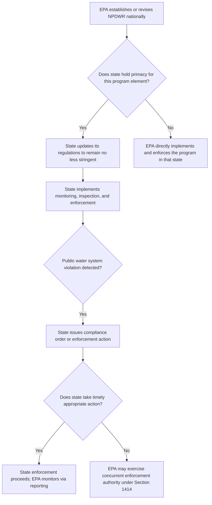

## State Primacy and Enforcement of Drinking Water Standards

### Overview

The Safe Drinking Water Act (SDWA) operates through a **cooperative federalism** structure in which EPA sets minimum national standards, but day-to-day implementation and enforcement of those standards is primarily conducted by states that have obtained "primacy" — primary enforcement authority — over their public water systems. This structure mirrors similar delegation frameworks under other major federal environmental statutes (e.g., the Clean Water Act's NPDES permitting delegation, the Clean Air Act's SIP process), but has distinctive features specific to the SDWA's program requirements and oversight mechanisms.

### Statutory Basis for Primacy

- **SDWA §1413**, 42 U.S.C. §300g-2, authorizes states to apply for and receive primary enforcement responsibility for public water systems within their jurisdiction.
- To obtain primacy for the general public water system supervision program, a state must demonstrate that it has adopted drinking water regulations that are **no less stringent** than the corresponding National Primary Drinking Water Regulations (NPDWRs), has adequate authority to enforce those regulations, maintains an inventory of public water systems and inspects them, maintains records and makes them available to EPA, and has adopted an adequate plan for providing safe drinking water under emergency circumstances.
- Primacy can be sought and granted **program-by-program** — a state may hold primacy for the general public water system program while separately applying for (and being granted or denied) primacy for the Underground Injection Control (UIC) program, and primacy determinations under UIC can even vary by injection well class within the same state.

### The Primacy Application and Approval Process

**Key Points**

1. **State program submission**: A state seeking primacy submits an application to EPA demonstrating its regulatory program meets the statutory "no less stringent" requirement and the associated administrative capacity requirements (enforcement authority, inspection and recordkeeping systems, emergency planning).
2. **EPA review and approval**: EPA reviews the submission and, upon finding the state program adequate, grants primacy, which then makes the state — rather than EPA directly — the primary implementing and enforcing authority for that program within its borders.
3. **Ongoing revision requirement**: Because EPA periodically revises or adds NPDWRs (e.g., new contaminant regulations, treatment technique updates), primacy states must **update their own state regulations** to remain no less stringent than the current federal baseline, typically within a specified timeframe (commonly two years, though this can vary and may be extended for state legislative cycles), or risk losing primacy for that specific requirement.
4. **Primacy withdrawal**: EPA retains authority to withdraw a state's primacy if the state fails to maintain an adequate program, though in practice this is a significant and relatively rare regulatory step, generally preceded by extensive EPA technical assistance and compliance escalation efforts.

### The "No Less Stringent" Standard

**Key Points**

- States retain authority to adopt **more stringent** standards than the federal NPDWRs (a floor, not a ceiling), and some states have done so for specific contaminants (as illustrated by state-level PFAS notification levels that are more protective, in some respects, than the current federal MCL framework).
- A state **cannot** adopt or maintain standards **less stringent** than the federal baseline and retain primacy for that program element — if EPA revises an NPDWR and a state's corresponding regulation becomes less stringent than the updated federal standard by comparison, the state must update its regulation to preserve primacy.
- This dynamic means that federal rulemaking changes (such as the evolving PFAS rulemaking, or the Lead and Copper Rule Improvements) create **downstream compliance obligations for primacy states themselves**, not just for individual public water systems — states must incorporate new or revised NPDWRs into their own state regulatory codes on an appropriate timeline.

### National Extent of State Primacy

**Key Points**

- The vast majority of states (as well as several U.S. territories) hold primacy for the general public water system supervision program, making direct federal implementation by EPA for that program the exception rather than the rule nationally.
- UIC program primacy is more variable, particularly for Class II (oil and gas-related) wells, where delegation is common but not universal, and where the designated state agency (often a state oil and gas commission rather than an environmental agency) can differ from the agency holding general public water system primacy.
- **[Inference]** Where a state lacks primacy for a specific SDWA program element, EPA implements that program directly within the state (a "direct implementation" jurisdiction for that program), which can create a bifurcated regulatory relationship in which the same state has primacy for some SDWA programs but not others.

### Roles and Responsibilities Under Primacy

**State Primacy Agency Responsibilities**

- Adopting and maintaining state drinking water regulations at least as stringent as current NPDWRs.
- Conducting **sanitary surveys** and inspections of public water systems.
- Reviewing and approving public water system compliance monitoring plans, treatment technique implementation, and (where applicable under specific rules such as the LCRI) service line inventories and replacement plans.
- Processing and reviewing violations, issuing compliance orders, and pursuing enforcement actions against non-compliant systems.
- Maintaining a public water system inventory and associated compliance data, and reporting this data to EPA through the Safe Drinking Water Information System (SDWIS) or its successor data systems.
- Approving and overseeing state-specific implementation elements, such as source water assessment programs, wellhead protection programs, and, where delegated, UIC well permitting.

**EPA's Ongoing Oversight Role Even Under Primacy**

- **Concurrent enforcement authority**: Even where a state holds primacy, SDWA §1414 preserves EPA's authority to take direct enforcement action against a public water system in certain circumstances, particularly where EPA determines a state has not commenced appropriate enforcement action within a specified period after notifying the state of a violation.
- **National rule development**: EPA continues to develop and revise NPDWRs, treatment techniques, and monitoring requirements nationally; primacy states implement and enforce these standards but do not independently set the underlying federal minimum.
- **Grant funding and technical assistance**: EPA provides funding (e.g., Public Water System Supervision program grants, Drinking Water State Revolving Fund capitalization grants) and technical assistance supporting state program implementation.
- **Program oversight and audits**: EPA periodically reviews state primacy program performance to confirm continued adequacy, which can include data quality reviews, program evaluations, and, in cases of significant deficiency, formal corrective action requirements.

### Diagram: Primacy Relationship and Enforcement Flow

### Public Water System Compliance and Violation Categories

**Key Points**

- **MCL/MCLG violations**: Numeric exceedances of an enforceable Maximum Contaminant Level, calculated according to the contaminant-specific compliance formula (e.g., running annual average, 90th percentile for lead/copper).
- **Treatment technique violations**: Failure to properly install, operate, or maintain a required treatment process, or failure to meet a specified performance criterion (e.g., inadequate corrosion control optimization, inadequate filtration/disinfection performance).
- **Monitoring and reporting violations**: Failure to conduct required sampling on schedule, or failure to submit required reports to the primacy agency — a distinct violation category that can occur even absent any actual contaminant exceedance.
- **Public notification violations**: Failure to provide legally required public notice of a violation within the applicable tiered timeframe (Tier 1 for the most urgent/immediate health risk situations, down through less urgent tiers).
- Violation data and enforcement actions are generally required to be tracked and reported through federal reporting systems, supporting EPA's national oversight function even in primacy states.

### Enforcement Tools Available to Primacy States and EPA

**Key Points**

- **Compliance orders / administrative orders**: Directing a system to take specific corrective actions within a defined timeframe.
- **Civil penalties**: Monetary penalties for violations, available to both state agencies (under state law) and EPA (under federal law) depending on the enforcement pathway pursued.
- **Judicial enforcement**: Referral to state or federal courts for injunctive relief or penalty assessment in cases of persistent or serious non-compliance.
- **Emergency powers**: SDWA §1431 grants EPA emergency authority to act directly (including issuing orders or commencing civil action) where a contaminant is present in or likely to enter a public water system and may present an imminent and substantial endangerment to public health, and where state or local authorities have not acted to protect public health — a backstop authority that can be exercised even in primacy states under sufficiently urgent circumstances.

### Practical / Exam-Oriented Example

**Example**

A state holds primacy for its general public water system supervision program and has traditionally maintained regulations mirroring the federal Lead and Copper Rule requirements.

- When EPA finalizes the 2024 Lead and Copper Rule Improvements (LCRI), lowering the lead action level from 15 ppb to 10 ppb and imposing new service line inventory, replacement planning, and sampling protocol requirements, the state must update its own state drinking water regulations to incorporate these more stringent requirements by the applicable compliance deadline in order to retain primacy for lead and copper regulation.
- If a public water system within the state fails to submit its baseline service line inventory by the November 2027 compliance deadline, the state primacy agency — not EPA directly — would typically be the first line of enforcement, issuing a compliance order or other enforcement action under state law.
- If the state fails to take timely and appropriate enforcement action against that non-compliant system after EPA has notified the state of the violation, EPA retains authority under SDWA §1414 to pursue direct federal enforcement against the system, notwithstanding the state's general primacy status.

### Related Topics

- Maximum Contaminant Levels and Treatment Technique standards (predecessor topic)
- The Underground Injection Control program and its variable primacy delegation by well class (predecessor topic)
- The Lead and Copper Rule and its state implementation obligations (predecessor topic)
- Regulation of PFAS and emerging contaminants and the resulting state-federal regulatory patchwork (predecessor topic)
- Drinking Water State Revolving Fund (DWSRF) capitalization grants and state program funding
- SDWA §1431 emergency powers and their relationship to state primacy
- Safe Drinking Water Information System (SDWIS) and federal-state compliance data reporting
- Cooperative federalism structures across environmental statutes (comparison to CWA NPDES and CAA SIP delegation)