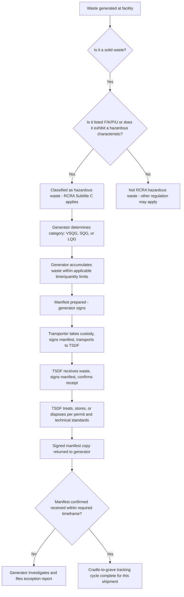

## The Cradle-to-Grave Regulatory Structure

### Overview

The Resource Conservation and Recovery Act (RCRA), 42 U.S.C. §6901 et seq., establishes a comprehensive "cradle-to-grave" regulatory system for hazardous waste — a framework designed to track and control hazardous waste from the moment it is generated through its ultimate treatment, storage, or disposal. Unlike CERCLA (which addresses cleanup of contamination from past waste management practices), RCRA is fundamentally **prospective and preventive**, imposing ongoing regulatory obligations on the full chain of parties who generate, transport, treat, store, or dispose of hazardous waste, at every stage of the waste's lifecycle.

### Statutory and Regulatory Framework

- **RCRA Subtitle C** (42 U.S.C. §§6921–6939g) establishes the hazardous waste management program, authorizing EPA to identify and list hazardous wastes and to establish standards for generators, transporters, and owners/operators of treatment, storage, and disposal facilities (TSDFs).
- The implementing regulations are codified primarily at **40 C.F.R. Parts 260–279**, covering waste identification, generator standards, transporter standards, TSDF permitting and technical standards, and the land disposal restrictions program.
- The "cradle-to-grave" concept is implemented operationally through a combination of (1) waste identification and classification rules, (2) a manifest tracking system following the waste through each transfer of custody, and (3) tiered regulatory obligations attaching to each category of handler (generator, transporter, TSDF).

### Step One: Identifying Hazardous Waste

**Key Points**

Before cradle-to-grave obligations attach, a material must first be classified as a **"solid waste"** and then, within that category, as a **"hazardous waste"** under RCRA's regulatory definitions.

- **Solid waste** is broadly defined to include discarded material, regardless of physical form (solid, liquid, semi-solid, or contained gaseous material), subject to numerous statutory and regulatory exclusions (e.g., certain recycled materials, domestic sewage, industrial wastewater discharges regulated under the Clean Water Act).
- A solid waste is a **hazardous waste** if it is either:
  - **Listed**: Specifically identified by EPA on one of four hazardous waste lists — the F-list (wastes from common/non-source-specific industrial processes), K-list (source-specific wastes from particular industries), and P-list and U-list (discarded commercial chemical products, off-specification species, container residues, and spill residues), or
  - **Characteristic**: Exhibits one or more of four hazardous characteristics through defined testing protocols — **ignitability**, **corrosivity**, **reactivity**, or **toxicity** (the latter assessed via the Toxicity Characteristic Leaching Procedure, or TCLP).
- The **"mixture rule"** and **"derived-from rule"** extend hazardous waste classification to mixtures containing listed hazardous waste and to residues derived from treating listed hazardous waste, preventing simple dilution or processing from removing regulatory status.

### The Three Categories of Regulated Handlers

**1. Generators**

The party that first produces a solid waste that is determined to be hazardous. Generator obligations scale according to the **quantity of hazardous waste generated per calendar month**:

| Generator Category | Monthly Generation Threshold | Key Obligations |
| --- | --- | --- |
| Very Small Quantity Generator (VSQG) | ≤100 kg/month (≤1 kg for acute hazardous waste) | Minimal — must identify waste, ensure proper delivery to an authorized facility |
| Small Quantity Generator (SQG) | Between 100 kg and 1,000 kg/month | Moderate — 180/270-day accumulation limits, manifest use, limited training/contingency requirements |
| Large Quantity Generator (LQG) | ≥1,000 kg/month (or >1 kg acute hazardous waste) | Most extensive — 90-day accumulation limit, full manifest and biennial reporting, personnel training, detailed contingency planning, financial responsibility for certain accumulation units |

**2. Transporters**

Any person engaged in the offsite transportation of hazardous waste, subject to RCRA transporter regulations as well as U.S. Department of Transportation (DOT) hazardous materials regulations governing packaging, labeling, and shipping.

- Transporters must obtain an **EPA identification number**, comply with the manifest system (signing and retaining copies at each transfer of custody), and adhere to specific requirements for handling discharges or spills during transport.

**3. Treatment, Storage, and Disposal Facilities (TSDFs)**

Facilities that treat, store, or dispose of hazardous waste, subject to the most comprehensive regulatory requirements under RCRA, generally requiring an operating permit.

- TSDFs must meet detailed technical standards for specific unit types (e.g., tanks, containers, surface impoundments, landfills, incinerators), covering design and construction, operating procedures, groundwater monitoring, closure and post-closure care, and financial assurance for closure/post-closure obligations.

### The Manifest System: Tracking Waste Through the Chain

**Key Points**

- The **Uniform Hazardous Waste Manifest** is the core tracking document implementing the "cradle-to-grave" concept in practice — it accompanies hazardous waste from the point of generation through transport to its ultimate treatment, storage, or disposal destination.
- The manifest requires signatures from the generator, each transporter, and the receiving TSDF, creating a documented chain of custody at every transfer.
- The generator retains responsibility for confirming that waste reaches its intended destination — if a **signed copy of the manifest is not returned** from the designated facility within a specified timeframe, the generator must investigate and, if necessary, file an **exception report** with the state or EPA, ensuring that lost or diverted waste shipments are identified and investigated.
- EPA has transitioned much of the manifest system to an electronic format (**e-Manifest**), streamlining data submission and improving national tracking capability while preserving the same fundamental chain-of-custody function.

### Diagram: The Cradle-to-Grave Flow

### Permitting of TSDFs

**Key Points**

- TSDFs generally must obtain a **RCRA permit** authorizing their specific waste management activities, issued either by EPA or by a state with authorized RCRA program primacy (RCRA, like the SDWA, allows for state program authorization in lieu of direct federal implementation).
- **Interim status**: Facilities that were already in existence and had submitted required notifications when new regulatory requirements took effect could continue operating under "interim status" pending final permit issuance, subject to compliance with applicable interim status standards.
- Permit applications require extensive information, including waste characterization, facility design specifications, groundwater monitoring plans, closure plans, and financial assurance demonstrations, and are subject to public notice and comment before issuance.

### Land Disposal Restrictions (LDRs)

**Key Points**

- RCRA's **Land Disposal Restrictions** program (sometimes called the "land ban") generally prohibits the land disposal of hazardous waste unless the waste meets specific treatment standards designed to reduce the waste's toxicity or mobility before disposal, or unless the disposal unit meets specified alternative requirements (such as a no-migration demonstration).
- LDR treatment standards are typically expressed either as specific technology-based treatment methods or as numeric concentration levels that treated waste (or an extract of it) must meet before land disposal is permitted.
- This program reflects a policy shift from RCRA's original focus on simply containing hazardous waste in land disposal units toward affirmatively reducing the hazard posed by waste before it is placed in the ground.

### Financial Assurance and Corrective Action

**Key Points**

- TSDFs (and in some cases LQGs with certain on-site accumulation units) must demonstrate **financial assurance** — through mechanisms such as trust funds, surety bonds, letters of credit, or corporate financial tests — sufficient to fund proper facility closure, post-closure care, and, where applicable, corrective action for releases of hazardous waste or constituents.
- **Corrective action** authority allows EPA or an authorized state to require a TSDF to investigate and remediate releases of hazardous waste or hazardous constituents from any solid waste management unit at the facility, not merely from units directly subject to permit conditions — extending RCRA's reach to address contamination from historical waste management practices at active, permitted facilities.

### Practical / Exam-Oriented Example

**Example**

A manufacturing facility generates 1,500 kg of spent solvent per month that exhibits the ignitability characteristic.

- Because the facility generates more than 1,000 kg/month, it is classified as a **Large Quantity Generator (LQG)**, triggering the most extensive generator obligations: 90-day on-site accumulation limits, mandatory personnel training, detailed contingency planning, and full manifest and biennial reporting requirements.
- When the facility ships the waste offsite for treatment, it must prepare a **Uniform Hazardous Waste Manifest**, which the transporter and receiving TSDF must each sign upon taking custody of the waste.
- If the facility does not receive a signed copy of the manifest back from the TSDF within the regulatory timeframe, it must investigate the shipment's status and, if the waste's location cannot be confirmed, file an **exception report**.
- Upon arrival, the TSDF must manage the waste consistent with its **RCRA permit** conditions and applicable technical standards for the specific unit type used (e.g., a permitted incinerator or hazardous waste landfill), and, if the waste is destined for land disposal, must ensure it first meets applicable **Land Disposal Restriction** treatment standards.

### Related Topics

- Hazardous waste identification: listed wastes (F, K, P, U lists) and hazardous characteristics in detail
- Generator category requirements (VSQG, SQG, LQG) and accumulation time/quantity limits
- The Uniform Hazardous Waste Manifest and e-Manifest system
- RCRA permitting process and interim status standards for TSDFs
- Land Disposal Restrictions program and treatment standards
- RCRA corrective action authority and its relationship to CERCLA cleanup
- State RCRA program authorization and primacy (comparison to SDWA and CWA delegation models)
- RCRA Subtitle D (non-hazardous solid waste) and Subtitle I (underground storage tanks) as related but distinct programs