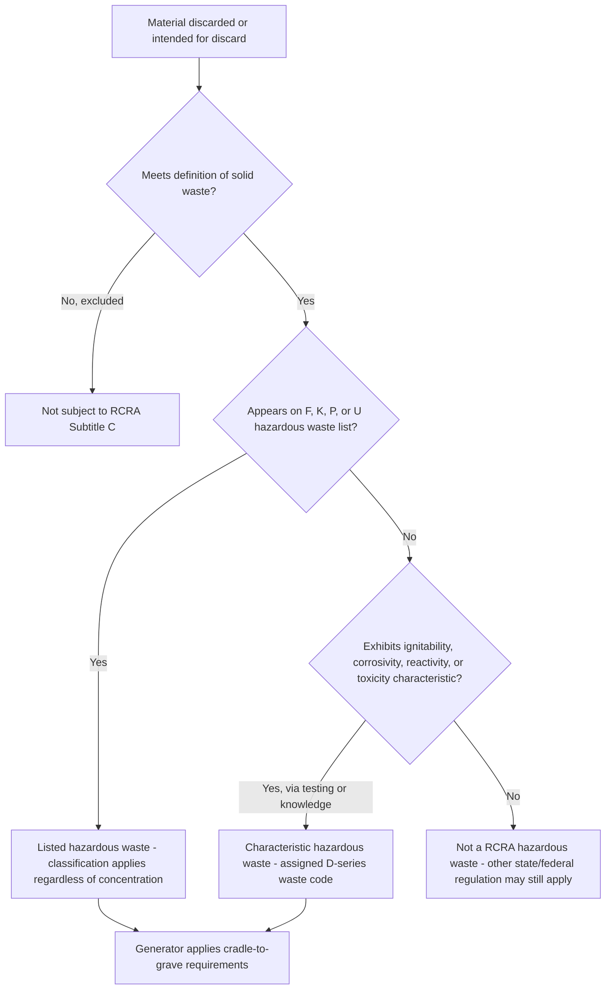

## Listed Wastes, Characteristic Wastes, and Waste Identification

### Overview

Before any of RCRA's cradle-to-grave regulatory obligations can attach, a material must first pass through a two-step classification analysis: it must qualify as a **"solid waste"** under RCRA's definitions, and then, if it is a solid waste, it must be evaluated to determine whether it is a **"hazardous waste"** — either because EPA has specifically **listed** it as hazardous, or because it exhibits one or more **characteristics** of hazardous waste. This waste identification process, codified primarily at 40 C.F.R. Part 261, is the threshold determination governing whether any subsequent RCRA Subtitle C requirement applies at all.

### Step One: Is It a "Solid Waste"?

**Key Points**

- RCRA defines "solid waste" broadly to include garbage, refuse, sludge, and other **discarded material**, in solid, liquid, semi-solid, or contained gaseous form, resulting from industrial, commercial, mining, agricultural, and community activities.
- The term "solid waste" is a **legal term of art**, not a physical-state description — liquids and even contained gases can be "solid wastes" under RCRA.
- **Key exclusions** from the solid waste definition include certain domestic sewage, industrial point source discharges regulated under the Clean Water Act's NPDES program, certain nuclear materials regulated under the Atomic Energy Act, and various recycled materials meeting specific regulatory conditions (e.g., materials used or reused as ingredients, materials returned to the original process, and certain materials meeting the definition of a legitimate recycling activity).
- **[Inference]** Recycling exclusions are a frequent area of regulatory complexity and litigation, since the line between "discarded" material subject to RCRA and "recycled" material exempt from it can turn on fact-specific analysis of whether the material is being legitimately reclaimed or is functionally being disposed of under the guise of recycling.

### Step Two: Is the Solid Waste "Hazardous"?

Once a material is confirmed to be a solid waste, it is a **hazardous waste** if it falls into either of two categories: **listed** or **characteristic**.

### Listed Hazardous Wastes

EPA has identified specific wastes as hazardous by placing them on one of four regulatory lists, based on the agency's determination that these wastes are hazardous regardless of whether they would independently exhibit a hazardous characteristic.

| List | Description | Example Waste Type |
| --- | --- | --- |
| **F-list** | Hazardous wastes from **non-specific sources** — common industrial processes used across many industries | Spent halogenated solvents used in degreasing |
| **K-list** | Hazardous wastes from **specific sources** — particular industries and processes | Wastewater treatment sludge from wood preserving processes |
| **P-list** | **Acutely hazardous** discarded commercial chemical products, off-specification species, container residues, and spill residues | Discarded unused pesticides meeting acute toxicity criteria |
| **U-list** | Discarded commercial chemical products, off-specification species, container residues, and spill residues that are hazardous but **not acutely hazardous** | Discarded unused chemical products such as certain solvents |

**Key Points**

- Listed wastes remain hazardous **regardless of concentration or whether the specific waste sample would independently test as hazardous under the characteristic tests** — listing is a categorical determination based on the waste's origin (source or process) or identity (commercial chemical product), not a case-by-case concentration analysis.
- The **P-list and U-list** apply specifically to **discarded commercial chemical products** — meaning the unused, off-specification, or spilled/contaminated form of a specific chemical — and generally do not apply to that same chemical once it has been used for its intended purpose and has become a spent material or process residue (which might instead fall under an F- or K-listing, or be evaluated under the characteristic tests).
- The **"mixture rule"** provides that a mixture of a listed hazardous waste and a non-hazardous solid waste is itself generally considered a listed hazardous waste (with certain regulatory exceptions), preventing dilution as a means of avoiding hazardous waste classification.
- The **"derived-from rule"** similarly provides that any solid waste generated from the treatment, storage, or disposal of a listed hazardous waste (such as ash from incinerating a listed waste, or leachate from a landfill containing listed waste) is itself generally considered a listed hazardous waste, unless specifically excluded (e.g., through the "delisting" process).

### Characteristic Hazardous Wastes

A solid waste that is not listed can still be a hazardous waste if it exhibits one or more of four defined hazardous characteristics, each with a specific regulatory testing protocol or definitional standard.

**1. Ignitability**

- Applies to wastes that pose a fire hazard, including liquids with a flash point below a specified threshold (generally below 60°C / 140°F), non-liquids capable of spontaneous combustion or causing fire through friction/moisture absorption/spontaneous chemical change, ignitable compressed gases, and oxidizers.

**2. Corrosivity**

- Applies to aqueous wastes with a pH ≤ 2 or ≥ 12.5, or liquids capable of corroding steel at a specified rate — reflecting the waste's potential to damage living tissue or containment materials on contact.

**3. Reactivity**

- Applies to wastes that are unstable and readily undergo violent change, react violently with water, generate toxic gases when mixed with water, or are capable of detonation or explosive reaction under normal handling conditions.

**4. Toxicity**

- Assessed using the **Toxicity Characteristic Leaching Procedure (TCLP)**, a standardized laboratory test simulating the leaching that could occur if the waste were disposed of in a landfill co-disposed with municipal solid waste, generating acidic leachate.
- The TCLP extract is analyzed for a specified list of 40 constituents (including certain heavy metals, pesticides, and organic compounds), each with a regulatory threshold concentration; exceeding the threshold for any listed constituent classifies the waste as exhibiting the toxicity characteristic (assigned waste codes in the D-series, e.g., D004 for arsenic, D008 for lead).

### Diagram: Waste Identification Decision Process

### Waste Codes and Their Function

**Key Points**

- Each hazardous waste is assigned one or more **EPA hazardous waste codes** — F-, K-, P-, and U-codes for listed wastes, and D-codes for characteristic wastes — which serve as the operative identifiers used throughout the manifest system, generator recordkeeping, and TSDF permit conditions.
- A single waste stream can carry **multiple waste codes simultaneously** — for example, a spent solvent might be listed under the F-list (based on its process origin) and also independently exhibit the ignitability characteristic (D001), requiring compliance with all applicable regulatory requirements associated with each code.
- Waste codes drive downstream regulatory consequences, including which **Land Disposal Restriction (LDR) treatment standards** apply, since LDR standards are generally established on a waste-code-specific basis.

### The "Contained-In" Policy and Mixed Media

**Key Points**

- **[Inference]** Environmental media (soil, groundwater) contaminated by a listed hazardous waste raise a distinct regulatory question addressed through EPA's "contained-in" policy: contaminated media is generally managed as if it contains the listed hazardous waste (and thus subject to hazardous waste management requirements) until it no longer contains the waste at levels of regulatory concern, at which point it may be "contained-out" and managed as non-hazardous — a policy tool developed to address remediation-related waste management without categorically classifying all contaminated soil and groundwater as hazardous waste indefinitely.

### Exclusions and Special Waste Categories

**Key Points**

- RCRA and its implementing regulations exclude or provide special, less stringent regulatory tracks for certain categories that would otherwise meet the hazardous waste definition, including (among others) certain household hazardous waste, certain agricultural waste returned to the ground as fertilizer, and specific categories subject to conditional exclusions when strict management conditions are met.
- **Universal wastes** (a specific regulatory category including batteries, certain pesticides, mercury-containing equipment, and lamps) are hazardous wastes subject to a streamlined, less burdensome management standard (40 C.F.R. Part 273) intended to encourage proper collection and recycling of these commonly generated waste types without the full weight of standard hazardous waste generator/TSDF requirements.

### Delisting Process

**Key Points**

- A facility that believes a specific waste stream, despite carrying a listed waste code, does not actually pose the hazards that justified the general listing, may petition EPA (or an authorized state) for a **site-specific delisting**, based on a demonstration that the waste does not meet any criteria for which it was listed and does not exhibit any hazardous characteristic.
- Delisting is a **formal rulemaking process** specific to the petitioning facility and waste stream — it does not alter the underlying general listing, which continues to apply to the same waste type generated by other facilities.

### Practical / Exam-Oriented Example

**Example**

A metal finishing facility generates a wastewater treatment sludge containing detectable levels of chromium and cadmium.

- The facility must first determine whether this sludge is specifically identified on the **K-list** as a source-specific listed waste associated with metal finishing operations; if so, it is a listed hazardous waste regardless of the actual concentration of chromium or cadmium present in this particular batch.
- Independently (or if no K-listing applies), the facility must evaluate whether the sludge exhibits the **toxicity characteristic** by subjecting a representative sample to the TCLP and comparing the resulting leachate concentrations of chromium, cadmium, and other regulated constituents against their respective regulatory thresholds.
- If the sludge is both K-listed and independently exceeds the TCLP threshold for cadmium, it would carry both the applicable K-code and the D-code for cadmium (D006), and the facility's compliance obligations — including applicable Land Disposal Restriction treatment standards before land disposal — would need to address both waste codes.

### Related Topics

- The cradle-to-grave regulatory structure and generator/transporter/TSDF obligations (predecessor topic)
- Generator category determination (VSQG, SQG, LQG) based on hazardous waste quantity generated
- Land Disposal Restrictions and waste-code-specific treatment standards
- The "contained-in" policy for contaminated environmental media
- Universal waste management standards (40 C.F.R. Part 273)
- Delisting petitions and site-specific waste determinations
- RCRA recycling exclusions and the legitimate recycling determination
- Mixture and derived-from rules and their role in preventing dilution-based avoidance of hazardous waste status