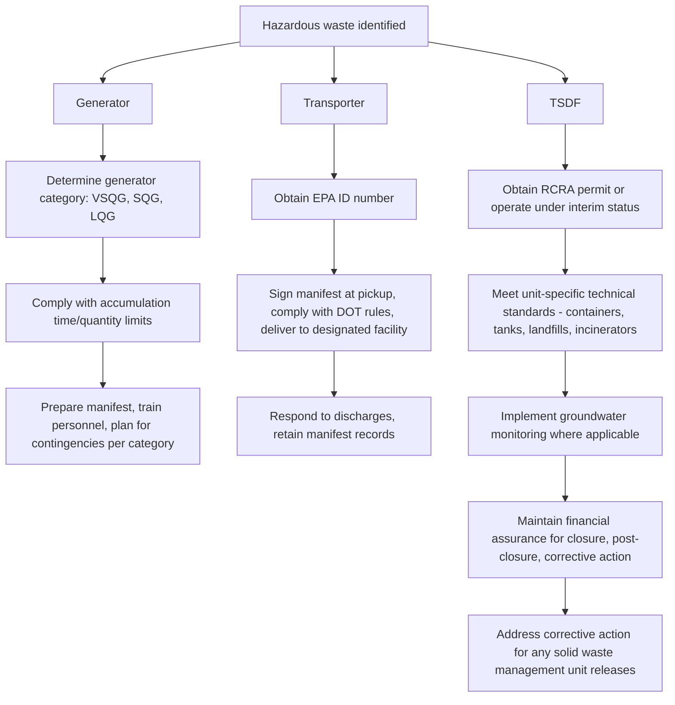

## Generator, Transporter, and Treatment Storage Disposal Facility Requirements

### Overview

Once a material has been identified as a RCRA hazardous waste, the specific regulatory obligations that attach depend on the role a given party plays in the waste's lifecycle. RCRA Subtitle C imposes three tiers of requirements, corresponding to the three categories of regulated "handlers": **generators**, who first produce the waste; **transporters**, who move it between locations; and **treatment, storage, and disposal facilities (TSDFs)**, which manage the waste's ultimate treatment, storage, or disposal. Each category carries distinct regulatory standards, codified respectively at 40 C.F.R. Parts 262 (generators), 263 (transporters), and 264/265/270 (TSDFs — permitted and interim status standards, and permitting procedures).

### Generator Requirements

**Generator Category Determination**

Generator obligations scale according to the quantity of hazardous waste generated per calendar month, creating three regulatory tiers:

| Category | Monthly Threshold | Acute Hazardous Waste Threshold |
| --- | --- | --- |
| Very Small Quantity Generator (VSQG) | ≤100 kg/month | ≤1 kg/month |
| Small Quantity Generator (SQG) | >100 kg to <1,000 kg/month | Between 1 kg and 100 kg/month |
| Large Quantity Generator (LQG) | ≥1,000 kg/month | >1 kg/month |

**Core Generator Obligations**

**Key Points**

1. **EPA identification number**: Generators (other than VSQGs in most circumstances) must obtain an EPA ID number before generating, transporting, treating, storing, or disposing of hazardous waste.
2. **Waste determination**: Generators bear the affirmative obligation to determine whether their solid waste is hazardous, using listing determinations, characteristic testing, or generator knowledge of the waste's composition.
3. **Accumulation time and quantity limits**: Generators may accumulate hazardous waste on-site without a permit only within specified time and quantity limits:
   - **VSQGs**: May accumulate up to 1,000 kg (or 1 kg acute hazardous waste) with no specific regulatory time limit, subject to other conditions.
   - **SQGs**: Generally subject to a **180-day** accumulation limit (270 days if waste must be transported more than 200 miles), and must not exceed 6,000 kg accumulated at any time.
   - **LQGs**: Subject to a **90-day** accumulation limit, with no specified quantity cap, but with more extensive facility standards for accumulation areas.
4. **Container and tank standards**: Accumulation areas must meet specific technical standards (e.g., proper container condition and compatibility, secondary containment for certain tank systems, weekly inspections).
5. **Personnel training**: LQGs (and, to a lesser extent, SQGs) must ensure personnel handling hazardous waste receive training appropriate to their responsibilities, including emergency response procedures.
6. **Contingency planning**: LQGs must maintain a written contingency plan describing actions to be taken in response to fires, explosions, or releases of hazardous waste, and must coordinate with local emergency responders.
7. **Manifest use**: Generators must prepare a Uniform Hazardous Waste Manifest for any offsite shipment, ensuring the waste is accompanied by proper tracking documentation through every subsequent transfer of custody.
8. **Biennial reporting**: LQGs must submit periodic reports to their state or EPA summarizing waste generation and management activities.
9. **Land Disposal Restriction (LDR) notifications**: Generators shipping waste subject to LDR treatment standards must provide notification of the applicable waste codes and treatment standards to the receiving facility.

### Transporter Requirements

**Key Points**

- **EPA identification number**: Transporters must obtain an EPA ID number before transporting hazardous waste.
- **Manifest compliance**: Transporters must not accept hazardous waste from a generator unless it is accompanied by a properly prepared manifest, must sign and date the manifest to acknowledge receipt, and must ensure the manifest accompanies the waste at all times during transport.
- **Delivery confirmation**: Transporters must deliver the entire quantity of waste to the designated facility identified on the manifest (or an alternate facility under specified emergency conditions) and obtain the receiving facility's signature.
- **Coordination with DOT regulations**: Hazardous waste transportation is subject to concurrent regulation under U.S. Department of Transportation hazardous materials regulations (49 C.F.R. Parts 171–180), governing packaging, labeling, placarding, and shipping paper requirements — RCRA transporter standards and DOT requirements operate as parallel, overlapping regulatory regimes for the same shipment.
- **Discharge response**: In the event of a hazardous waste discharge during transport, the transporter must take appropriate immediate action to protect human health and the environment (e.g., containing the discharge) and must comply with applicable notification requirements to authorities.
- **Recordkeeping**: Transporters must retain manifest copies for a specified retention period (generally three years).

### TSDF Requirements

TSDFs are subject to the most comprehensive regulatory requirements under RCRA, reflecting their role as the ultimate destination for hazardous waste management.

**Permitting Framework**

**Key Points**

- Facilities that treat, store (beyond generator accumulation limits), or dispose of hazardous waste generally require a **RCRA permit**, issued by EPA or an authorized state.
- **Interim status**: Facilities in existence when new regulatory requirements took effect could continue operating under interim status (compliance with a defined set of interim standards) while their permit application was pending, though interim status has become less common over time as most active facilities have transitioned to final permits.
- Permit applications require detailed information: waste characterization and volumes, facility and unit design specifications, groundwater monitoring plans, closure and post-closure plans, and financial assurance demonstrations — reviewed through a public notice-and-comment process before issuance.
- **Permits-by-rule** and other streamlined authorization mechanisms exist for certain lower-risk activities (e.g., certain wastewater treatment units already regulated under the Clean Water Act), reducing duplicative permitting burden.

**Technical Standards by Unit Type**

**Key Points**

- **Containers**: Must be in good condition, compatible with the waste stored, kept closed except when adding/removing waste, and inspected regularly for leaks or deterioration.
- **Tanks**: Subject to design standards (including secondary containment requirements for most tank systems), integrity assessment requirements, and monitoring for leaks.
- **Surface impoundments**: Subject to liner and leak detection system requirements, along with groundwater monitoring.
- **Landfills**: Subject to the most stringent design standards, including double liner systems, leachate collection and removal systems, groundwater monitoring, and, per the Land Disposal Restrictions program, generally may not accept waste that does not meet applicable treatment standards.
- **Incinerators and other treatment units**: Subject to performance standards (e.g., destruction and removal efficiency requirements for organic constituents) and operating parameter limits established through trial burns and permit conditions.
- **Groundwater monitoring**: TSDFs with land-based units are generally required to implement a groundwater monitoring program to detect releases of hazardous constituents to groundwater, with escalating response requirements (detection monitoring → compliance monitoring → corrective action) if contamination is identified.

**Closure, Post-Closure, and Financial Assurance**

**Key Points**

- **Closure**: TSDFs must develop and implement a closure plan describing how the facility will be closed to minimize the need for further maintenance and to control, minimize, or eliminate post-closure escape of hazardous waste or constituents.
- **Post-closure care**: Land disposal units (e.g., landfills, surface impoundments left in place) generally require a **30-year post-closure care period** (extendable), including continued groundwater monitoring, maintenance of the final cover system, and corrective action for any identified releases.
- **Financial assurance**: TSDFs must demonstrate financial capability to fund closure, post-closure care, and (where applicable) corrective action, using approved mechanisms such as trust funds, surety bonds, letters of credit, insurance, or a corporate financial test.

**Corrective Action Authority**

**Key Points**

- RCRA corrective action authority allows EPA or an authorized state to require investigation and remediation of releases of hazardous waste or hazardous constituents from **any solid waste management unit at the facility** — not limited to units specifically covered by permit conditions — extending regulatory reach to address historical contamination at active TSDFs.
- This authority functions as a RCRA-specific complement to CERCLA cleanup authority, allowing contamination at active hazardous waste facilities to be addressed within the RCRA permitting framework itself, rather than requiring a separate CERCLA action.

### Diagram: Regulatory Obligations by Handler Category

### Comparative Table: Regulatory Burden by Handler Type

| Feature | Generator | Transporter | TSDF |
| --- | --- | --- | --- |
| EPA ID number required | Yes (except most VSQGs) | Yes | Yes |
| Permit required | No (within accumulation limits) | No | Yes (or interim status) |
| Manifest role | Originates manifest | Signs at each custody transfer | Signs upon receipt, returns copy to generator |
| Technical unit standards | Limited (container/tank condition) | N/A (DOT packaging standards apply) | Extensive, unit-specific |
| Groundwater monitoring | No | No | Yes, for land-based units |
| Financial assurance | Limited (LQGs, certain accumulation units) | No | Yes, comprehensive |
| Closure/post-closure obligations | No | No | Yes |
| Corrective action exposure | No | No | Yes, facility-wide |

### Practical / Exam-Oriented Example

**Example**

A pharmaceutical manufacturer (an LQG generating 2,500 kg of hazardous waste per month) contracts with a licensed hazardous waste hauler to transport spent solvents to a permitted commercial incineration facility three states away.

- The generator must accumulate the waste on-site within its **90-day** LQG accumulation limit, using properly labeled and inspected containers, and must prepare a Uniform Hazardous Waste Manifest before the shipment departs.
- The transporter must obtain an EPA ID number (if it does not already have one), sign the manifest upon taking custody, comply with DOT packaging and placarding requirements for the specific waste codes involved, and ensure the waste reaches the designated incineration facility intact.
- The receiving incineration facility, as a permitted TSDF, must manage the waste according to its RCRA permit conditions and the technical performance standards applicable to hazardous waste incinerators (including destruction and removal efficiency requirements), sign the manifest to confirm receipt, and return a signed copy to the generator — completing the cradle-to-grave documentation chain.
- If the generator does not receive the signed manifest copy back within the required timeframe, it must investigate the shipment and, if necessary, file an exception report with its state or EPA.

### Related Topics

- The cradle-to-grave regulatory structure overview (predecessor topic)
- Listed wastes, characteristic wastes, and waste identification (predecessor topic)
- The Uniform Hazardous Waste Manifest and e-Manifest system in detail
- Land Disposal Restrictions and treatment standards by waste code
- RCRA permitting procedures and public participation requirements
- RCRA corrective action and its relationship to CERCLA cleanup authority
- Financial assurance mechanisms for closure, post-closure care, and corrective action
- State RCRA program authorization and primacy delegation