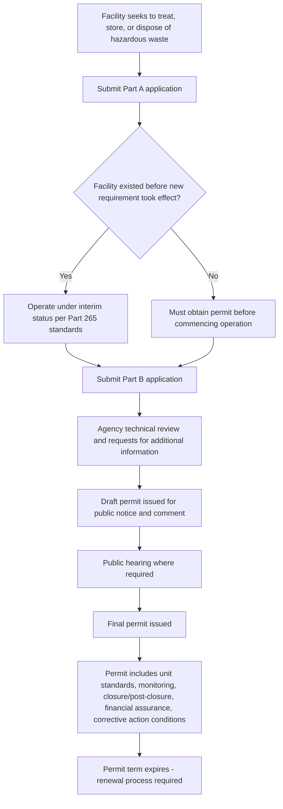
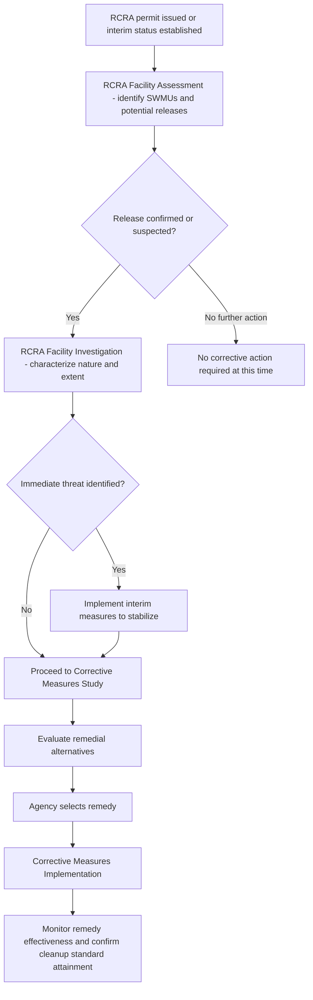

## Permitting and Corrective Action Obligations

### Overview

RCRA's permitting and corrective action framework governs how treatment, storage, and disposal facilities (TSDFs) obtain legal authorization to operate and how contamination at those facilities — whether from currently permitted units or from historical waste management practices — is investigated and remediated. While permitting establishes the forward-looking operational authorization for a facility's hazardous waste activities, corrective action addresses backward-looking contamination, and the two are structurally linked because corrective action obligations are typically imposed as conditions of the RCRA permit itself.

### The RCRA Permitting Framework

**Statutory and Regulatory Basis**

- **RCRA §3005** requires facilities that treat, store, or dispose of hazardous waste to obtain a permit, with implementing procedures and standards codified primarily at 40 C.F.R. Part 270 (permitting procedures) and Parts 264/265 (technical standards for permitted and interim status facilities, respectively).
- Permits may be issued by **EPA** directly or by a **state with RCRA program authorization**, mirroring the cooperative federalism structure seen in the SDWA and Clean Water Act.

**The Permit Application Process**

**Key Points**

1. **Part A application**: A relatively brief initial submission identifying the facility, its owner/operator, the general nature of its hazardous waste activities, and the specific units and processes involved.
2. **Part B application**: A comprehensive, highly detailed submission containing the substantive technical information needed for permit review — waste characterization and volumes, unit-specific design and engineering specifications, groundwater monitoring plans, closure and post-closure plans, contingency plans, personnel training programs, and financial assurance demonstrations.
3. **Agency technical review**: The permitting authority (EPA or the authorized state) reviews the application for completeness and technical adequacy, often through multiple rounds of requests for additional information.
4. **Draft permit and public comment**: The agency issues a draft permit (or a notice of intent to deny) for public notice and comment, including, where required, a public hearing.
5. **Final permit issuance**: After considering public comments, the agency issues a final permit, which may be appealed by the applicant or interested parties through applicable administrative and judicial review procedures.

**Interim Status**

**Key Points**

- Facilities that were already in existence and had submitted required notifications and a Part A application when new regulatory requirements took effect could continue operating under **interim status**, complying with a defined (though generally less detailed) set of interim status standards (40 C.F.R. Part 265) while their permit application was pending final review.
- Interim status is not itself a permit — it is a transitional regulatory status — and facilities operating under interim status remain obligated to eventually obtain a final permit or cease regulated activities.
- **[Inference]** Over the decades since RCRA's original implementation, most long-standing active TSDFs have transitioned from interim status to final permits, making interim status a comparatively less common operational category today than at earlier points in the program's history, though it remains a live regulatory mechanism for newly regulated facilities or newly regulated waste streams.

**Permit Content and Conditions**

**Key Points**

- A RCRA permit specifies the particular hazardous waste management units authorized at the facility, applicable technical design and operating standards for each unit, monitoring and reporting requirements, closure and post-closure care obligations, financial assurance requirements, and — critically — **corrective action requirements** where applicable.
- Permits are typically issued for a fixed term (commonly up to 10 years) and must be renewed, with the renewal process generally mirroring the original application and review process.
- **Permit modifications** may be required or requested during the permit term to reflect changes in facility operations, regulatory updates, or newly identified corrective action needs.

### Diagram: Permitting Process Flow

### Corrective Action: Statutory and Regulatory Basis

**Key Points**

- **RCRA §3004(u)** requires that permits for TSDFs address corrective action for releases of hazardous waste or hazardous constituents from **any solid waste management unit (SWMU)** at the facility, regardless of when the release occurred or whether the unit is currently an active, permitted unit.
- **RCRA §3004(v)** extends corrective action authority to releases that have migrated **beyond the facility boundary**, requiring the permittee to obtain necessary access or other legal authority to conduct corrective action off-site where required.
- **RCRA §3008(h)** provides EPA (or an authorized state) with independent corrective action authority applicable to **interim status facilities**, allowing corrective action orders to be issued even for facilities that have not yet received a final permit.

**Solid Waste Management Units (SWMUs)**

**Key Points**

- A SWMU is broadly defined to include any unit at a facility from which hazardous constituents might migrate, regardless of whether the unit was intended for waste management — this can include not only formally designated treatment, storage, or disposal units, but also areas such as spill sites, former waste piles, or other units not otherwise subject to permitting requirements.
- This broad definition means corrective action obligations can reach **historical contamination** from long-abandoned or informally used waste management areas at an active facility, not merely from units the facility currently operates under permit.

### The Corrective Action Process

**Key Points**

1. **RCRA Facility Assessment (RFA)**: An initial investigation, typically conducted or overseen by the regulatory agency, to identify SWMUs at the facility and determine whether releases have occurred or are likely, based on facility records, site visits, and sampling.
2. **RCRA Facility Investigation (RFI)**: A more detailed site investigation conducted by the facility (analogous to a CERCLA remedial investigation) to characterize the nature and extent of contamination associated with identified SWMUs.
3. **Corrective Measures Study (CMS)**: An evaluation of potential remedial alternatives to address identified contamination, analyzing effectiveness, implementability, and cost (analogous to a CERCLA feasibility study).
4. **Corrective Measures Implementation (CMI)**: Design, construction, and operation of the selected remedy, followed by monitoring to confirm remedy effectiveness and, where applicable, attainment of cleanup standards.
5. **Interim measures**: Where an immediate or significant threat to human health or the environment is identified, the facility may be required to implement interim measures to stabilize the situation while the longer-term investigation and remedy selection process proceeds.

### Comparison to CERCLA Cleanup Authority

**Key Points**

- RCRA corrective action and CERCLA response actions address overlapping subject matter (contamination from hazardous substances/waste) but operate under distinct statutory authorities, with RCRA corrective action generally applicable to **active, currently operating facilities** subject to RCRA permitting, while CERCLA more commonly addresses contamination at sites where the responsible operations have ceased or where the site is not otherwise subject to an active RCRA permit.
- **[Inference]** EPA has generally sought to avoid duplicative regulation by using RCRA corrective action authority for contamination at active TSDFs where the facility is already subject to RCRA permitting, reserving CERCLA authority primarily for other contaminated sites — though the precise choice between the two authorities in any given case can depend on site-specific factors, including facility status, the parties involved, and programmatic considerations by the implementing agency.
- Both frameworks generally follow a broadly similar investigation-to-remedy sequence (assessment/investigation, feasibility/measures study, remedy selection, implementation), reflecting a shared underlying approach to contaminated site management across federal environmental cleanup statutes.

### Financial Assurance for Corrective Action

**Key Points**

- Where a permit imposes corrective action obligations, the facility must generally demonstrate **financial assurance** for the estimated cost of completing the required corrective measures, using mechanisms similar to those required for closure and post-closure care (trust funds, surety bonds, letters of credit, insurance, or corporate financial tests).
- This financial assurance requirement ensures that corrective action can be completed even if the facility experiences financial distress or ceases operations before remediation is finished.

### Diagram: Corrective Action Process

### Practical / Exam-Oriented Example

**Example**

A chemical manufacturing facility holds an active RCRA permit for its hazardous waste storage tanks. During permit renewal review, the agency discovers facility records referencing a waste pile used decades earlier for temporary storage of process residues, located in an area not covered by the current permit's active units.

- Because this waste pile qualifies as a **solid waste management unit (SWMU)** under RCRA §3004(u), the agency requires the facility to address it as part of the corrective action conditions in the renewed permit, notwithstanding that the pile has not been used in decades and is not part of the facility's current active operations.
- The facility proceeds through a **RCRA Facility Investigation** to characterize whether hazardous constituents have migrated from the former waste pile into soil or groundwater.
- If contamination is confirmed and found to extend beyond the facility's property boundary, the facility must, under RCRA §3004(v), obtain necessary access to conduct corrective action on the affected off-site area.
- The facility must also demonstrate financial assurance sufficient to cover the estimated cost of the corrective measures ultimately selected, in addition to its existing financial assurance for closure and post-closure care of its currently permitted tank units.

### Related Topics

- Generator, transporter, and TSDF requirements generally (predecessor topic)
- The cradle-to-grave regulatory structure overview (predecessor topic)
- Listed wastes, characteristic wastes, and waste identification (predecessor topic)
- Closure and post-closure care requirements and financial assurance mechanisms
- CERCLA remedial investigation/feasibility study process as a comparative framework
- State RCRA program authorization and its role in permitting and corrective action implementation
- Land Disposal Restrictions and their interaction with permitted disposal units
- RCRA §7003 imminent hazard authority as an additional enforcement tool distinct from permit-based corrective action