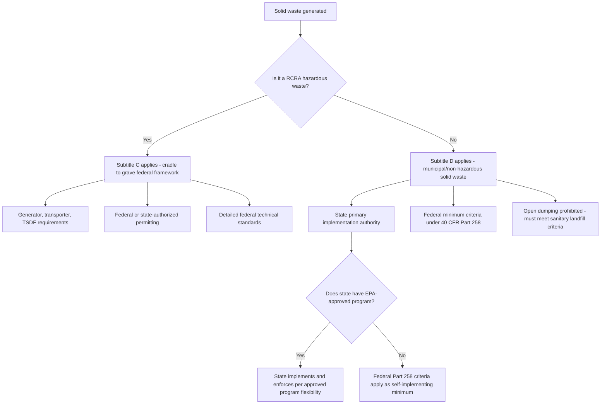

## Municipal Solid Waste Regulation Under Subtitle D

### Overview

While RCRA Subtitle C establishes the comprehensive federal "cradle-to-grave" program for hazardous waste, **RCRA Subtitle D**, 42 U.S.C. §§6941–6949a, governs **non-hazardous solid waste** — most significantly, municipal solid waste (MSW), the household and commercial refuse generated by everyday activity. Subtitle D reflects a fundamentally different regulatory philosophy than Subtitle C: rather than the direct, prescriptive federal permitting and technical standards applied to hazardous waste, Subtitle D operates primarily as a **cooperative federal-state framework** in which states retain primary regulatory and permitting authority over non-hazardous solid waste facilities, subject to federal minimum criteria.

### Statutory Framework and Objectives

**Key Points**

- Subtitle D's central objectives are to assist states in developing and implementing state solid waste management plans, to promote environmentally sound methods for solid waste disposal, and to prohibit future "open dumping" of solid waste — unlike Subtitle C's hazardous waste tracking and permitting mandate, Subtitle D's core enforceable prohibition is comparatively narrow: it bans open dumps and requires that solid waste be disposed of only in facilities that comply with applicable federal criteria.
- **RCRA §4004** establishes minimum federal criteria for facility classification, distinguishing between practices constituting prohibited "open dumping" and those qualifying as an approved "sanitary landfill."
- Unlike Subtitle C's detailed federal generator/transporter/TSDF requirements, Subtitle D primarily sets **minimum performance criteria**, leaving the specific design, permitting, and enforcement mechanisms largely to state discretion, provided state programs meet the federal floor.

### The Municipal Solid Waste Landfill (MSWLF) Criteria

The primary federal technical standards under Subtitle D are the Municipal Solid Waste Landfill (MSWLF) criteria, codified at **40 C.F.R. Part 258**, establishing minimum design and operating requirements for landfills accepting household and other non-hazardous solid waste.

**Key Regulatory Elements**

**Key Points**

1. **Location restrictions**: MSWLFs are subject to siting restrictions addressing factors such as proximity to airports (bird hazard to aircraft), floodplains, wetlands, fault areas, seismic impact zones, and unstable areas.
2. **Design criteria**: New MSWLF units and lateral expansions must meet minimum design standards, typically including a composite liner system (a geomembrane liner combined with a compacted soil or equivalent layer) and a leachate collection and removal system designed to keep the leachate head on the liner within specified limits.
3. **Operating criteria**: Requirements addressing procedures such as excluding regulated hazardous waste from acceptance, controlling disease vectors, controlling explosive gases (methane) generated by decomposing waste, controlling public access, periodic application of cover material, and other operational practices designed to minimize environmental and public health risks.
4. **Groundwater monitoring**: MSWLFs are generally required to implement a groundwater monitoring program, with an escalating structure similar in concept to the Subtitle C TSDF framework — detection monitoring, and if contamination is identified, more intensive assessment monitoring and, where necessary, corrective action.
5. **Corrective action**: Where groundwater monitoring or other evidence indicates a release of contaminants from the landfill has occurred, the facility may be required to undertake corrective action to address the contamination — conceptually parallel to, though a distinct regulatory mechanism from, RCRA Subtitle C corrective action for hazardous waste facilities.
6. **Closure and post-closure care**: MSWLFs must implement a closure plan upon ceasing operations (including a final cover system designed to minimize infiltration and erosion) and must maintain post-closure care (including continued groundwater monitoring and gas monitoring) for a specified period, generally **30 years**, subject to extension or reduction by the regulatory authority based on site-specific conditions.
7. **Financial assurance**: Owners/operators must demonstrate financial capability to fund closure, post-closure care, and corrective action, using mechanisms conceptually similar to those required under Subtitle C (trust funds, surety bonds, letters of credit, insurance, or a corporate financial test), though implemented through the state program rather than direct federal permitting.

### State Implementation and the "Approved State Program" Structure

**Key Points**

- Unlike Subtitle C's formal state primacy application process, states implementing Subtitle D generally develop their own solid waste management programs, and **EPA may approve** a state permit program as adequate to ensure MSWLFs meet the federal Part 258 criteria — a state with an EPA-approved program has flexibility in how it implements and enforces those criteria, provided the substantive federal minimum standards are met.
- States without an EPA-approved program remain subject to the federal Part 258 criteria as self-implementing minimum requirements, but generally without a federal Subtitle D permit program equivalent to the Subtitle C permitting structure — enforcement of Subtitle D requirements in non-approved states depends more heavily on state solid waste law and, secondarily, on RCRA's citizen suit and imminent hazard provisions.
- **[Inference]** This more decentralized structure reflects RCRA's original policy judgment that non-hazardous municipal solid waste management is a matter more appropriately and traditionally handled at the state and local level, reserving the more intensive federal Subtitle C framework for the comparatively greater risks posed by hazardous waste.

### Diagram: Subtitle C vs. Subtitle D Regulatory Comparison

### Comparative Table: Subtitle C (Hazardous Waste) vs. Subtitle D (Non-Hazardous Solid Waste)

| Feature | Subtitle C | Subtitle D |
| --- | --- | --- |
| Waste covered | Hazardous waste (listed or characteristic) | Non-hazardous solid waste (municipal, industrial non-hazardous) |
| Primary regulatory approach | Detailed federal cradle-to-grave tracking | Federal minimum criteria; state-driven implementation |
| Permitting authority | EPA or authorized state, formal application process | Primarily state; EPA approval of state program is optional |
| Federal technical standards | Extensive (Parts 260–270) | Comparatively narrower (Part 258 landfill criteria) |
| Manifest/tracking system | Yes (cradle-to-grave manifest) | No equivalent federal tracking requirement |
| Groundwater monitoring | Required for land-based hazardous waste units | Required for MSWLFs |
| Closure/post-closure care | Yes, extensive | Yes, generally 30-year post-closure period |
| Corrective action | RCRA §3004(u)/(v), facility-wide SWMU reach | Landfill-specific corrective action under Part 258 |
| Financial assurance | Required | Required |

### Industrial Non-Hazardous Waste and Other Subtitle D Facility Types

**Key Points**

- Subtitle D also encompasses **non-hazardous industrial waste** disposal facilities (as distinct from municipal solid waste specifically), which may be subject to separate or supplemental state and, in some cases, sector-specific federal standards (for example, EPA's regulation of coal combustion residuals, or "coal ash," under Subtitle D rather than Subtitle C, despite ongoing debate about whether certain coal ash constituents warrant more stringent hazardous waste treatment).
- **[Inference]** The regulation of coal combustion residuals under Subtitle D rather than Subtitle C has historically been, and in some respects remains, a subject of environmental policy debate, given the presence of heavy metals and other constituents of potential concern in coal ash, even though EPA has determined the waste stream does not meet Subtitle C hazardous waste criteria; the specific regulatory requirements applicable to coal ash disposal units continue to be an area of evolving federal rulemaking.
- **Open dumps**: Facilities that do not meet the Subtitle D criteria for a sanitary landfill (or another approved disposal method) are classified as prohibited "open dumps," and states are required to have a program prohibiting the establishment of new open dumps and requiring compliance or closure of existing ones.

### Interaction with State and Local Solid Waste Programs

**Key Points**

- Local governments frequently play a significant operational role in municipal solid waste management (collection, transfer stations, and often landfill ownership/operation), operating within the state regulatory framework that itself operates within the federal Subtitle D minimum criteria — creating a three-tiered practical implementation structure (federal minimum standards, state permitting and enforcement program, local operational management) distinct from Subtitle C's more directly federal-state permitting relationship.
- Recycling, composting, and waste reduction programs, while encouraged as a matter of policy under RCRA's broader waste management hierarchy (source reduction, recycling, treatment, disposal), are generally implemented through state and local initiatives, incentive programs, and, in some jurisdictions, mandatory diversion requirements, rather than through direct federal Subtitle D mandates.

### Practical / Exam-Oriented Example

**Example**

A regional landfill accepts household waste and non-hazardous commercial refuse from a multi-county area, operating in a state with an EPA-approved MSWLF permit program.

- The landfill must meet the federal Part 258 design criteria, including its composite liner and leachate collection system, and must comply with the location restrictions applicable to its site (e.g., confirming it is not situated within a restricted floodplain or unstable area).
- The state permitting agency, operating under its EPA-approved program, issues and enforces the facility's operating permit, incorporating the substantive federal minimum criteria along with any additional state-specific requirements.
- The facility must implement ongoing groundwater monitoring; if monitoring detects contaminant migration beyond regulatory thresholds, the facility would be required to move from routine detection monitoring into assessment monitoring and, if warranted, corrective action addressing the release.
- Upon eventual closure, the facility must implement its approved closure plan (including final cover installation) and maintain post-closure care — including continued groundwater and landfill gas monitoring — for the applicable post-closure period, generally 30 years absent an approved adjustment, backed by demonstrated financial assurance.

### Related Topics

- The cradle-to-grave regulatory structure under Subtitle C (predecessor topic)
- Listed wastes, characteristic wastes, and waste identification (predecessor topic)
- Permitting and corrective action obligations under Subtitle C (predecessor topic)
- RCRA §7002 citizen suit provisions and their role in Subtitle D enforcement
- RCRA §7003 imminent hazard authority as applied to open dumps and non-hazardous waste sites
- Coal combustion residuals (coal ash) regulation and its Subtitle D classification debate
- State solid waste management planning requirements under RCRA §4003
- Landfill gas (methane) control and its intersection with Clean Air Act regulation of MSWLFs