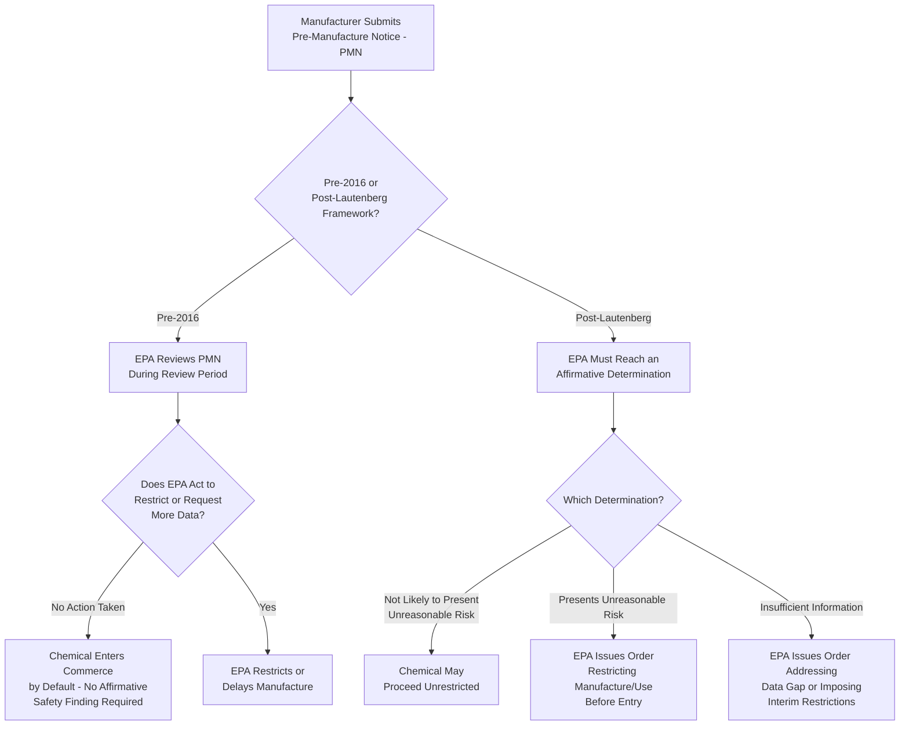

## The Toxic Substances Control Act Framework Before and After the Lautenberg Act Reforms

### Overview

The Toxic Substances Control Act (TSCA), enacted in 1976, is EPA's primary statutory authority for regulating the manufacture, processing, distribution, use, and disposal of chemical substances not otherwise regulated under other environmental statutes (e.g., pesticides under FIFRA, drugs under the FDCA). For nearly four decades, TSCA was widely criticized as one of the weakest major federal environmental statutes, hampered by an evidentiary and procedural structure that made it exceptionally difficult for EPA to restrict even well-documented toxic chemicals. The **Frank R. Lautenberg Chemical Safety for the 21st Century Act**, signed into law in June 2016, substantially overhauled TSCA's core operative provisions, fundamentally changing the safety standard, testing authority, and new-chemical review process. Understanding TSCA requires tracking both the original 1976 framework and the specific mechanisms the Lautenberg Act replaced or added.

### Statutory Basis

- **Toxic Substances Control Act of 1976** — 15 U.S.C. §§2601–2697 (original enactment)
- **Frank R. Lautenberg Chemical Safety for the 21st Century Act** — Pub. L. 114-182 (2016), amending TSCA
- **TSCA §5** — 15 U.S.C. §2604: new chemical/significant new use review (Pre-Manufacture Notice)
- **TSCA §6** — 15 U.S.C. §2605: regulation of hazardous chemical substances and mixtures
- **TSCA §4** — 15 U.S.C. §2603: testing authority

---

### The Original 1976 TSCA Framework

#### **Key Points**

- TSCA established the **TSCA Chemical Substance Inventory**, a master list of chemical substances already in commerce as of the statute's baseline date; new chemicals not on the Inventory require pre-market notice and review, while "existing chemicals" already on the Inventory were **grandfathered in without any initial safety review**.
- This grandfathering created a structural gap widely criticized in retrospect: the roughly 62,000 chemicals on the original Inventory were never affirmatively found safe — they were simply presumed to remain in commerce absent EPA action.
- Original §6 required EPA, before restricting a chemical, to find that it presented an **"unreasonable risk of injury to health or the environment"** and to select the **"least burdensome"** regulatory requirement adequate to protect against that risk.

#### The *Corrosion Proof Fittings* Problem

- ***Corrosion Proof Fittings v. EPA***, 947 F.2d 1201 (5th Cir. 1991), is the case most emblematic of original TSCA's practical unworkability. The Fifth Circuit vacated EPA's decade-in-the-making rule banning most uses of **asbestos**, holding that EPA had failed to adequately consider the costs and benefits of its chosen approach relative to less burdensome alternatives, and had not sufficiently demonstrated that a full ban (versus more limited restrictions) was the least burdensome adequate option for each individual use category.
- The practical consequence was that **EPA restricted only a handful of chemicals** under original §6 in TSCA's entire pre-2016 history (widely cited examples include PCBs — restricted directly by statute in §6(e) rather than through the general §6 process — plus a small number of other substances), despite the statute nominally covering tens of thousands of chemicals in commerce.
- The "least burdensome" requirement combined with a cost-benefit-inflected reading of "unreasonable risk" created an evidentiary and procedural burden that courts interpreted as requiring EPA to essentially prove its regulatory choice was superior to every conceivable alternative — an exceptionally difficult standard to satisfy given typical resource and data constraints.

#### Original §4 Testing Authority Limitations

- EPA could compel chemical testing under original §4 only after making a **threshold finding** that the chemical "may present an unreasonable risk" or that it was being produced in substantial quantities with potential for substantial environmental release or human exposure — essentially requiring EPA to already have some risk evidence before it could compel manufacturers to generate the testing data that would establish that very risk.
- This created a widely recognized "catch-22": EPA often lacked the data needed to justify testing requirements, and lacked testing authority sufficient to generate that data without first satisfying a threshold showing that the missing data was itself needed to establish.

#### Original §5 New Chemical Review

- Manufacturers were required to submit a **Pre-Manufacture Notice (PMN)** at least 90 days before manufacturing a new chemical substance.
- EPA reviewed the PMN but, absent EPA action to restrict or request more data within the review period, the chemical could enter commerce **by default** even with limited underlying safety data — critics characterized this as review process, rather than an affirmative safety determination, for new chemicals.

---

### The Lautenberg Act Reforms (2016)

#### **Key Points**

The Lautenberg Act made several structural changes widely regarded as substantially strengthening TSCA:

1. **New risk-based safety standard replacing cost-benefit balancing**
2. **Mandatory, deadline-driven prioritization and risk evaluation of existing chemicals**
3. **Expanded testing authority no longer contingent on a pre-existing risk finding**
4. **Affirmative safety determination requirement for new chemicals before entering commerce**
5. **New framework for confidential business information (CBI) claims**
6. **Preemption provisions affecting state chemical regulation**

#### New Safety Standard (Amended §6)

- EPA must now determine whether a chemical presents an **"unreasonable risk of injury to health or the environment"** using a standard that explicitly **excludes consideration of costs and other non-risk factors** at the risk-determination stage — cost and other factors are considered only later, at the risk-management (regulatory response) stage, not when determining whether an unreasonable risk exists in the first place.
- This bifurcation was designed specifically to overcome the *Corrosion Proof Fittings* problem, in which cost-benefit balancing had been folded into the threshold risk determination itself.
- The "least burdensome requirement" standard was replaced with a directive that EPA apply requirements to the extent necessary to address the identified unreasonable risk, considering costs and reasonably available information in selecting among adequate options, but without requiring EPA to affirmatively rule out every less-restrictive alternative before acting.
- Critically, the amended standard also requires EPA to evaluate a chemical's risk to **potentially exposed or susceptible subpopulations** — such as pregnant women, children, or workers with elevated exposure — rather than assessing risk only for the general population.

#### Mandatory Prioritization and Risk Evaluation (New §6(b))

- EPA must designate existing chemicals as either **high-priority** (warranting a full risk evaluation) or **low-priority** (no immediate further evaluation) substances, using a structured, criteria-based prioritization process.
- EPA must maintain a **minimum number of ongoing chemical risk evaluations** at all times (reflecting Congress's intent to move away from the prior system's near-total inaction on existing chemicals) and complete risk evaluations within statutorily defined timeframes (generally within three years, with a possible six-month extension).
- **Manufacturer-requested risk evaluations** are also available, allowing a manufacturer to request EPA evaluate a specific chemical (subject to fee payment), which can be useful for chemicals facing state-level restriction pressure where a manufacturer prefers a single federal evaluation.

#### Expanded Testing Authority (Amended §4)

- EPA's authority to require testing is no longer conditioned on first making a threshold "may present an unreasonable risk" finding; EPA can require testing where needed to inform hazard, exposure, use, or other characterization or assessment activities under the statute, including specifically to support a risk evaluation.
- EPA gained authority to require testing through a simplified **order** process (in addition to the traditional, more cumbersome rulemaking process), reducing the procedural burden of compelling manufacturers to generate missing data.

#### New Chemical Review — Affirmative Determination Requirement (Amended §5)

- The Lautenberg Act eliminated the prior default-entry mechanic. EPA must now make an **affirmative determination** for every new chemical PMN before it may enter commerce, choosing among several determinations:
  1. The chemical **is not likely to present an unreasonable risk** — may proceed without restriction.
  2. The chemical **presents an unreasonable risk** — EPA must issue an order restricting the chemical's manufacture, processing, or use before it may enter commerce.
  3. **Insufficient information** exists to make a "not likely" determination, and without restrictions the chemical may present an unreasonable risk, or the chemical is or may be produced in substantial quantities with substantial exposure/release potential — in either case, EPA must issue an order to address the data gap or otherwise regulate pending further information, rather than allowing the chemical into commerce by default.
- This closed the pre-2016 "default entry" gap by requiring an affirmative EPA action (of one of these three types) before manufacture may proceed, rather than allowing silence to function as approval.

#### Confidential Business Information (CBI) Reforms

- The Lautenberg Act imposed new substantiation requirements for CBI claims (requiring companies to justify confidentiality claims rather than assert them without support), time limits on the duration of certain claims, and provisions allowing EPA to share CBI with state, tribal, and local governments and health/environmental professionals under specified confidentiality protections — intended to increase transparency relative to the prior regime, which critics viewed as allowing overbroad and largely unchallenged confidentiality assertions.

#### Preemption Provisions

- The Lautenberg Act added express preemption provisions limiting states' ability to impose their own chemical restrictions once EPA has made certain determinations or completed a risk evaluation for a given chemical and use, subject to exceptions (e.g., for state actions in effect before a specified date, and certain state reporting/notification/warning requirements that fall outside the scope of preemption).
- This preemption framework reflected a negotiated compromise addressing industry interest in a more uniform national regulatory framework and states' interest (particularly states like California, which had built extensive independent chemical regulation programs) in retaining meaningful regulatory authority — the precise preemption scope has been a continuing subject of interpretation and dispute since 2016. **[Unverified]** — practitioners should confirm current interpretive guidance and any subsequent litigation refining preemption scope, given the provision's continued evolution.

---

### **Example**

Consider a hypothetical new industrial solvent a manufacturer wishes to introduce to the U.S. market, alongside an existing, decades-old flame retardant chemical already on the TSCA Inventory.

**Pre-2016 treatment:**

- The new solvent would be submitted via **PMN** under original §5; absent EPA action within the 90-day review window, it could enter commerce even with sparse toxicity data, since the statute did not require an affirmative "safe" finding.
- The existing flame retardant, having been grandfathered onto the Inventory in 1976, would face **no EPA safety review at all** unless EPA affirmatively initiated a §6 rulemaking — which, per the *Corrosion Proof Fittings* experience, would face a steep cost-benefit and "least burdensome" evidentiary hurdle likely to result in years of litigation even with strong risk evidence.

**Post-Lautenberg treatment:**

- The new solvent's PMN now requires EPA to reach one of the three **affirmative determinations** before manufacture may proceed — if data is insufficient, EPA must issue an order addressing that gap (e.g., requiring testing or imposing interim restrictions) rather than allowing default entry.
- The existing flame retardant would be evaluated through the mandatory **prioritization process**; if designated high-priority, EPA must complete a **risk evaluation** within the statutory deadline, applying the risk-only safety standard (excluding cost-benefit balancing at the risk-determination stage) and explicitly considering exposure to susceptible subpopulations such as children or pregnant women.

---

### Comparative Table: Pre- vs. Post-Lautenberg TSCA

| Feature | Original 1976 TSCA | Post-Lautenberg TSCA (2016+) |
| --- | --- | --- |
| Safety standard for §6 action | "Unreasonable risk," with cost-benefit and "least burdensome" balancing folded into the determination | "Unreasonable risk" determined **without** cost consideration; costs considered only at risk-management stage |
| Existing chemical review | No mandatory review; grandfathered chemicals presumed acceptable absent EPA action | Mandatory prioritization and risk evaluation on statutory deadlines |
| Testing authority trigger | Required prior threshold risk finding | No prior risk finding required; available to support risk evaluation generally |
| New chemical (PMN) default | Default entry into commerce absent EPA action within review period | Affirmative EPA determination required before manufacture |
| Subpopulation consideration | Not explicitly required | Explicitly required (e.g., children, pregnant women, workers) |
| CBI claims | Minimal substantiation required | Substantiation, time limits, and expanded government/professional sharing |
| State preemption | Limited express preemption | Expanded express preemption tied to EPA determinations, with negotiated exceptions |

---

### Diagram: TSCA New Chemical Review — Before and After Lautenberg (svg_diagram)

---

### **Related Topics**

- *Corrosion Proof Fittings v. EPA* and the asbestos ban litigation in full case analysis
- TSCA §6 risk evaluation methodology and prioritization criteria in technical depth
- TSCA preemption scope and post-2016 state-federal chemical regulation disputes
- Confidential Business Information (CBI) substantiation requirements and EPA disclosure procedures
- PFAS regulation under TSCA reporting rules and significant new use rules (SNURs)
- Comparison of TSCA reform to the EU's REACH chemical regulation framework
- Manufacturer-requested risk evaluations and associated TSCA fee structures
- Persistent, bioaccumulative, and toxic (PBT) chemical designations under amended §6(h)