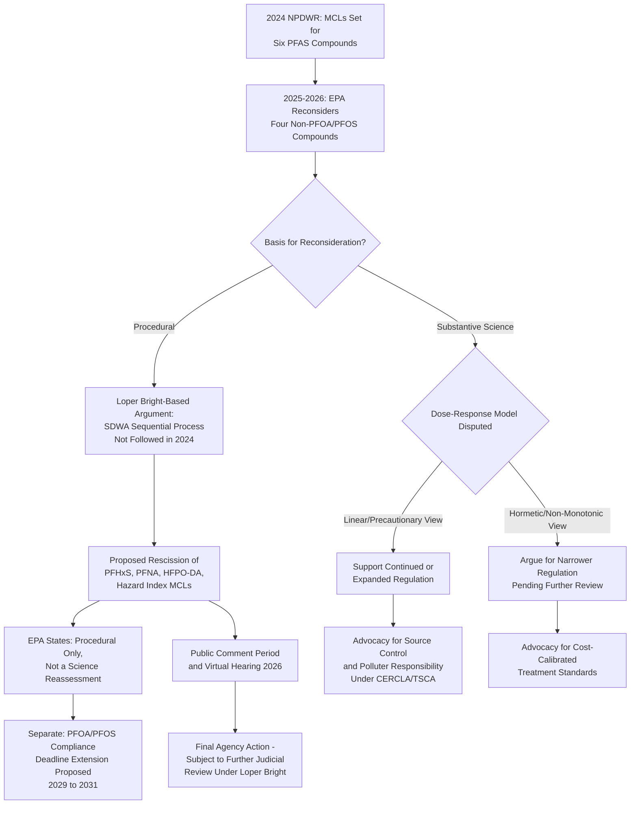

## Regulatory Science Controversies Over Emerging Chemical Contaminants

### Overview

Emerging chemical contaminants — substances increasingly detected in the environment, drinking water, and human tissue but not historically subject to comprehensive regulation — present a distinct category of legal and scientific challenge that cuts across TSCA, the Safe Drinking Water Act (SDWA), CERCLA, and FIFRA. **Per- and polyfluoroalkyl substances (PFAS)**, often called "forever chemicals," are the paradigmatic current example, and the regulatory science disputes surrounding them illustrate broader, recurring controversies in environmental law: how to regulate under scientific uncertainty, how to weigh low-dose and non-monotonic toxicological effects, how much deference administrative risk determinations receive after *Loper Bright*, and how procedural requirements interact with substantive public health goals.

### Legal and Regulatory Basis

- **Safe Drinking Water Act (SDWA) §1412** — 42 U.S.C. §300g-1: National Primary Drinking Water Regulations (NPDWR) and Maximum Contaminant Level (MCL) setting process
- **TSCA §4/§6** — 15 U.S.C. §§2603, 2605: testing and risk evaluation authority applicable to PFAS as a chemical class
- **CERCLA designation authority** — used to designate specific PFAS (e.g., PFOA/PFOS) as CERCLA hazardous substances, triggering §107 liability exposure
- ***Loper Bright Enterprises v. Raimondo***, 603 U.S. 369 (2024): overruled *Chevron* deference, now central to litigation over EPA's procedural and substantive authority in contaminant rulemaking

---

### Background: The PFAS Regulatory Trajectory

#### **Key Points**

- In April 2024, EPA finalized the first **PFAS National Primary Drinking Water Regulation (NPDWR)**, establishing legally enforceable MCLs for six PFAS compounds: **PFOA and PFOS individually**, plus **PFHxS, PFNA, HFPO-DA (GenX), and a Hazard Index approach for mixtures** of PFHxS, PFNA, HFPO-DA, and PFBS. Public water systems were required to comply by April 2029. [US EPA](https://www.epa.gov/sdwa/proposed-pfas-rescission-rule)
- In May 2025, EPA announced its intent to rescind the regulations for the four non-PFOA/PFOS compounds and reconsider the underlying regulatory determinations to ensure the SDWA's required process was followed, while separately announcing intent to extend PFOA/PFOS compliance deadlines and establish a federal exemption framework. [US EPA](https://www.epa.gov/sdwa/proposed-pfas-rescission-rule)

#### The 2026 Procedural Rescission Controversy

- Citing *Loper Bright Enterprises v. Raimondo*, EPA concluded that the agency had followed an unlawful process by simultaneously proposing and finalizing regulatory determinations and drinking water standards for the four non-PFOA/PFOS compounds, rather than following the SDWA's required sequential notice-and-comment process. [DLA Piper](https://www.dlapiper.com/en-us/insights/publications/2026/06/2026-mid-year-pfas-update-how-federal-and-state-regulation-is-shaping-compliance-and-litigation-risk)
- On May 18–20, 2026, EPA published two proposed rules: one to rescind the regulatory determinations and MCLs for PFHxS, PFNA, HFPO-DA, and the Hazard Index mixtures; and a second to extend the compliance deadline for the PFOA and PFOS MCLs from April 2029 to April 2031 for water systems that request an extension. [Harvard](https://eelp.law.harvard.edu/tracker/epa-issued-first-national-drinking-water-standard-to-protect-against-pfas-exposure/)
- EPA emphasized that the proposed rescission is procedural only and does not reflect a reassessment of the underlying science, and does not affect the current MCLs for PFOA and PFOS. [DLA Piper](https://www.dlapiper.com/en-us/insights/publications/2026/06/2026-mid-year-pfas-update-how-federal-and-state-regulation-is-shaping-compliance-and-litigation-risk)
- The comment periods for both rules closed July 20, 2026, with a virtual public hearing held July 7, 2026. [Harvard](https://eelp.law.harvard.edu/tracker/pfas-in-drinking-water/)
- This action illustrates a recurring pattern in contaminant regulation: a rule can be challenged (or unwound) on **pure administrative-procedure grounds** — here, a *Loper Bright*-driven concern about statutory sequencing — entirely independent of any dispute about the underlying toxicological science, yet the practical effect is identical to a science-based rollback from the perspective of affected communities.

#### **[Inference]** Why the Procedural/Substantive Distinction Matters Practically

Because EPA characterized the rescission as procedural rather than scientific, a subsequent, properly sequenced regulatory determination could in principle reimpose similar or identical standards for the four non-PFOA/PFOS compounds — meaning the controversy centers as much on **process and administrative law** (post-*Loper Bright* scrutiny of agency procedure) as on any genuine scientific disagreement about PFAS toxicity for those specific compounds.

---

### The Underlying Scientific Dispute: Dose-Response and Threshold Controversies

#### **Key Points**

- A body of research emerging in 2026, associated with University of Massachusetts Amherst findings, has been invoked to argue that PFAS may exhibit non-monotonic, hormetic dose-response effects at very low concentrations. [American Council on Science and Health](https://www.acsh.org/news/2026/07/15/americas-pfas-policy-faces-scientific-reckoning-50225)
- Under this contested framing, some low-dose effects are characterized as potentially beneficial biological adaptations (such as extended lifespan or anti-inflammatory responses in animal studies), while others are characterized as potentially harmful, such as promotion of tumor cell line progression. [American Council on Science and Health](https://www.acsh.org/news/2026/07/15/americas-pfas-policy-faces-scientific-reckoning-50225)
- Proponents of this view argue that at parts-per-trillion levels, PFAS may act as mild cellular stressors triggering protective antioxidant pathways, and contend that current regulation treats a "zone of biological adaptation" as though it were a "zone of toxic injury." [American Council on Science and Health](https://www.acsh.org/news/2026/07/15/americas-pfas-policy-faces-scientific-reckoning-50225)
- This position has been used to argue for pausing PFAS rulemaking pending independent Science Advisory Board review, and to characterize current regulatory approaches as resting on outdated toxicological assumptions. [American Council on Science and Health](https://www.acsh.org/news/2026/07/15/americas-pfas-policy-faces-scientific-reckoning-50225)

#### The Opposing Scientific and Regulatory Position

- PFAS have been linked by EPA and public health researchers to cancer, liver and heart impacts, and immune and developmental harm to infants and children. [Harvard](https://eelp.law.harvard.edu/tracker/epa-issued-first-national-drinking-water-standard-to-protect-against-pfas-exposure/)
- EPA's own 2026 risk assessment reportedly found that even at extremely low levels, two types of PFAS in sewage sludge applied to farmland could result in elevated cancer risk, though the administration subsequently scrapped the associated regulatory review process addressing PFAS-contaminated sewage sludge spread on farmland. [The New Lede](https://www.thenewlede.org/2026/08/the-epa-says-they-want-pfas-out-their-policies-are-allowing-more-of-them-in/)
- A nonpartisan organization of former EPA career scientists has argued that reduced scientific capacity within the agency undermines the government's ability to conduct the very research and detection work needed to properly evaluate PFAS risk, and has emphasized that source control and polluter responsibility, rather than downstream treatment costs borne by water customers, represent the more durable long-term solution. [Environmentalprotectionnetwork](https://www.environmentalprotectionnetwork.org/20260518_epa-pfas-announcement_release/)

#### **[Inference]** The Core Regulatory Science Tension

This dispute exemplifies a classic environmental law controversy: whether regulatory standards should be driven toward the **lowest technologically feasible detection/treatment threshold** (a precautionary, "as low as reasonably achievable" orientation reflected in the original 2024 NPDWR) or should instead be calibrated to a **demonstrated harm threshold** informed by dose-response modeling that accounts for possible non-linear or hormetic effects. Both positions claim scientific grounding, and resolving the dispute requires engaging with contested toxicological modeling questions that are, as of this writing, genuinely unsettled in the peer-reviewed literature — this should be treated as an active area of scientific and regulatory contestation rather than a settled question. **[Unverified]** — the UMass Amherst findings and their broader scientific reception should be independently verified against peer-reviewed literature, as characterizations of contested emerging research vary significantly depending on the source's regulatory or industry position.

---

### Competing Institutional and Policy Pressures

#### **Key Points**

- Under the current EPA administration, federal PFAS regulatory priority has been refocused on PFOA and PFOS specifically, rather than a full-scale rollback of the broader PFAS regulatory agenda, suggesting PFAS regulation remains a matter of bipartisan interest even as the debate centers on whether current science supports regulatory action reaching beyond these two most-studied compounds. [DLA Piper](https://www.dlapiper.com/en-us/insights/publications/2026/06/2026-mid-year-pfas-update-how-federal-and-state-regulation-is-shaping-compliance-and-litigation-risk)
- Simultaneously, EPA has approved new PFAS compounds for certain industrial uses (such as data center development applications) even while emphasizing a "PFAS Out" policy framing, a juxtaposition that has drawn criticism from advocacy groups. [The New Lede](https://www.thenewlede.org/2026/08/the-epa-says-they-want-pfas-out-their-policies-are-allowing-more-of-them-in/)
- EPA has paired regulatory rollback with continued federal funding support, making close to $1 billion available from the Bipartisan Infrastructure Law to help states and territories test and treat drinking water for PFAS in both public water systems and private wells. [Harvard](https://eelp.law.harvard.edu/tracker/epa-issued-first-national-drinking-water-standard-to-protect-against-pfas-exposure/)
- EPA published its draft Sixth Contaminant Candidate List (CCL 6) in 2026, the mechanism by which additional unregulated contaminants are formally identified as candidates for potential future regulation under the SDWA — meaning the universe of "emerging contaminants" under active regulatory science scrutiny continues to expand even as specific PFAS rules are contested. [DLA Piper](https://www.dlapiper.com/en-us/insights/publications/2026/06/2026-mid-year-pfas-update-how-federal-and-state-regulation-is-shaping-compliance-and-litigation-risk)

---

### **Example**

A mid-sized municipal water utility has been planning capital investment in advanced treatment infrastructure (e.g., granular activated carbon or reverse osmosis systems) to meet the 2024 NPDWR's MCLs for all six regulated PFAS compounds by the original 2029 deadline.

1. Following EPA's 2026 procedural rescission proposal for PFHxS, PFNA, HFPO-DA, and the Hazard Index mixtures, the utility faces genuine uncertainty about whether to continue engineering and financing treatment capacity for **all six** compounds or to scale back planning to address only **PFOA and PFOS**, pending the rescission rule's finalization.
2. If the utility requests the proposed **compliance deadline extension** to 2031 for PFOA/PFOS, it gains additional time but must weigh this against continued public health messaging obligations and potential future tightening if the rescinded standards are reinstated through a properly sequenced SDWA process.
3. The utility's legal and engineering teams must separately track: (a) the **procedural** *Loper Bright*-based rescission litigation risk, (b) the **substantive scientific** dose-response debate that could affect any future re-proposed MCLs, and (c) **parallel CERCLA liability exposure** if PFOA/PFOS contamination at a nearby industrial site (now designated as a CERCLA hazardous substance) implicates the utility's water source, triggering separate response-cost and potential PRP considerations distinct from its SDWA compliance obligations.
4. Advocacy groups and some former EPA scientists may challenge any final rescission both on **procedural grounds** (arguing the *Loper Bright* rationale is pretextual) and on **substantive risk grounds** (citing EPA's own sewage sludge risk assessment finding elevated cancer risk even at low PFAS levels), while industry- and think-tank-aligned commentators invoke the contested hormetic dose-response research to argue the underlying 2024 standards were never adequately justified to begin with.

---

### Comparative Table: Competing Frames in the PFAS Regulatory Science Debate

| Dimension | Precautionary/Public Health Frame | Scientific Reassessment/Cost Frame |
| --- | --- | --- |
| Dose-response assumption | Linear or near-linear; minimize exposure toward zero where feasible | Possible non-monotonic/hormetic effects at very low doses |
| Procedural posture | Emphasizes substantive health protection; treats *Loper Bright* rescission as risking real-world harm regardless of stated rationale | Emphasizes correcting unlawful agency procedure and matching cost to demonstrated risk |
| Institutional voices cited | Former EPA career scientists, public health and environmental advocacy organizations | Industry-aligned research organizations, cost-focused policy analysts |
| Policy implication favored | Maintain or expand regulated PFAS list; prioritize source control/polluter responsibility | Narrow regulation to best-established compounds (PFOA/PFOS); delay pending further review |

---

### Diagram: PFAS Regulatory Science Controversy Structure (svg_diagram)

---

### **Related Topics**

- *Loper Bright Enterprises v. Raimondo* and its effect on environmental agency rulemaking generally
- CERCLA hazardous substance designation of PFOA/PFOS and resulting PRP liability exposure
- TSCA PFAS reporting rule and significant new use rules (SNURs) for PFAS chemical class regulation
- Safe Drinking Water Act Contaminant Candidate List (CCL) process and future emerging contaminant designation
- Hormesis and non-monotonic dose-response modeling debates in toxicological risk assessment
- PFAS in biosolids/sewage sludge land application regulation and agricultural contamination pathways
- State-level PFAS regulation exceeding federal standards and preemption considerations
- Environmental justice dimensions of PFAS-contaminated drinking water in under-resourced communities