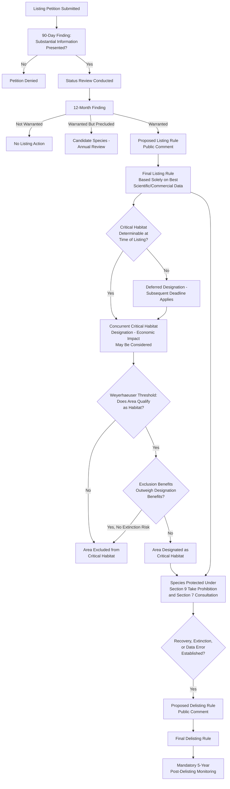

## Listing Criteria, Delisting, and Critical Habitat Designation

### Overview

The Endangered Species Act (ESA) of 1973 operates on a foundational premise: species protection begins with a formal, science-based determination that a species qualifies as **endangered** or **threatened**, followed (with limited exceptions) by designation of **critical habitat** necessary for the species' conservation. The listing and critical habitat processes are the statutory gateway through which the ESA's substantive protections — including the §7 consultation requirement and §9 take prohibition — are triggered. Because listing decisions are meant to be based **solely on the best available scientific and commercial data**, without regard to economic impact, this area of law has generated substantial litigation over the proper role (or exclusion) of non-scientific factors, agency discretion, and procedural deadlines.

### Statutory and Regulatory Basis

- **ESA §3(6), (19), (20)** — 16 U.S.C. §1532: definitions of "endangered species," "species," and "threatened species"
- **ESA §4** — 16 U.S.C. §1533: listing, delisting, and critical habitat designation procedures
- **ESA §4(a)(1)** — the five statutory listing factors
- **ESA §4(b)(1)(A)** — "best scientific and commercial data available" standard
- **ESA §4(a)(3)** — critical habitat designation requirement
- Implementing regulations: 50 C.F.R. Part 424 (listing, delisting, and critical habitat)

---

### Listing Criteria

#### **Key Points**

- A species may be listed as **endangered** if it is "in danger of extinction throughout all or a significant portion of its range," or as **threatened** if it is "likely to become an endangered species within the foreseeable future throughout all or a significant portion of its range" (§3(6), (20)).
- Listing determinations must rest on one or more of **five statutory factors** under §4(a)(1):
  1. **Present or threatened destruction, modification, or curtailment** of habitat or range
  2. **Overutilization** for commercial, recreational, scientific, or educational purposes
  3. **Disease or predation**
  4. **Inadequacy of existing regulatory mechanisms**
  5. **Other natural or manmade factors** affecting the species' continued existence
- Listing must be made **solely on the basis of the best scientific and commercial data available**, without reference to the possible economic or other impacts of the determination (§4(b)(1)(A)) — this economic-blindness provision is one of the ESA's most distinctive and frequently litigated features, distinguishing it from statutes like FIFRA that expressly incorporate cost-benefit balancing.
- "Species" under the ESA is defined broadly to include **subspecies** and, for vertebrates, **distinct population segments (DPS)** — allowing listing of a genetically or ecologically distinct population even where the broader species remains abundant elsewhere.

#### The Listing Petition Process

1. Any interested person may submit a **listing petition** to the U.S. Fish and Wildlife Service (FWS) or the National Marine Fisheries Service (NMFS/NOAA Fisheries), depending on the species type (terrestrial and freshwater species generally fall to FWS; most marine species to NMFS).
2. The relevant agency must make an initial **90-day finding** on whether the petition presents "substantial scientific or commercial information" indicating the petitioned action **may be warranted**.
3. If the 90-day finding is positive, the agency conducts a **status review** and must issue a **12-month finding** determining whether listing is: (a) **not warranted**, (b) **warranted**, or (c) **warranted but precluded** by higher-priority listing actions, in which case the species becomes a **candidate species** subject to annual review.
4. A "warranted" finding proceeds to a **proposed rule**, subject to public comment (generally at least 60 days), followed by a **final listing rule** within specified statutory timeframes (subject to extensions in cases of substantial disagreement regarding sufficiency or accuracy of data).

#### Emergency Listing

- Section 4(b)(7) authorizes **emergency listing**, effective immediately upon publication, where the agency determines an emergency exists posing a significant risk to the species' well-being — bypassing the normal notice-and-comment sequence, though a proposed rule must still follow, with the emergency listing generally lapsing after 240 days absent a final rule.

---

### Delisting

#### **Key Points**

- A species may be **delisted** (removed from the endangered/threatened list) where the best available data shows one or more of the following:
  1. **Recovery** — the species has recovered to the point that listing protections are no longer necessary
  2. **Extinction** — the species is extinct
  3. **Original data error** — the original listing was based on erroneous data (e.g., taxonomic reclassification, improved survey data showing the species is more abundant or secure than previously understood)
- Delisting follows the **same procedural rigor** as listing — a proposed rule, public comment, and final rule — reflecting Congress's intent that removing protections receive comparable scrutiny to imposing them, and delisting must likewise rest on the best scientific and commercial data.
- The ESA requires **post-delisting monitoring** for a minimum of five years to ensure the species does not require re-listing, with FWS/NMFS obligated to monitor and, if warranting, use emergency listing authority to promptly restore protection if the species' status significantly deteriorates during the monitoring period.

#### **[Inference]** Delisting as a Statutory Success Marker and a Litigation Flashpoint

Because delisting decisions often carry significant economic and land-use consequences (e.g., resuming timber harvest, ending grazing restrictions, or removing habitat protections), delisting rules — even those grounded in genuine recovery success stories — are frequently challenged in litigation by environmental groups (arguing recovery is premature or insufficiently secured) or by regulated industries and states (arguing delisting has been unduly delayed despite adequate recovery data), making delisting one of the ESA's most consistently contested procedural junctures regardless of the underlying species' actual conservation trajectory.

---

### Critical Habitat Designation

#### **Key Points**

- **Critical habitat** is defined (§3(5)(A)) as: (1) specific areas within the geographical area occupied by the species at the time of listing, containing physical or biological features essential to conservation and that may require special management; and (2) specific areas outside the occupied area determined to be essential for the species' conservation.
- Unlike listing, critical habitat designation **does permit consideration of economic and other relevant impacts** (§4(b)(2)) — the Secretary must designate critical habitat "on the basis of the best scientific data available" and "after taking into consideration the economic impact, national security impact, and any other relevant impact" of specifying a particular area.
- The Secretary may **exclude** an area from critical habitat if the benefits of exclusion outweigh the benefits of designation, **unless** exclusion would result in extinction of the species — creating a economic/conservation balancing test distinct from the listing determination itself.
- Critical habitat must generally be designated **concurrently with listing**, "to the maximum extent prudent and determinable" — though FWS/NMFS may defer designation where habitat is not yet determinable, subject to a subsequent deadline (generally within one additional year).

#### Effect of Critical Habitat Designation

- Critical habitat designation does **not** itself directly regulate private landowner conduct through a take prohibition — its principal legal effect operates through **§7 consultation**: federal agencies must ensure their actions are not likely to result in the **destruction or adverse modification** of designated critical habitat, in addition to the separate duty to avoid jeopardizing the species' continued existence.
- This makes critical habitat's practical bite largely dependent on the presence of a **federal nexus** (federal funding, permitting, or land management) triggering §7 consultation — critical habitat designation alone does not restrict purely private activity absent some federal agency action or federal permit requirement.

#### Key Interpretive Case: *Weyerhaeuser Co. v. United States Fish and Wildlife Service*

*Weyerhaeuser Co. v. United States Fish and Wildlife Service*, 586 U.S. 9 (2018), addressed the scope of "critical habitat" for the dusky gopher frog:

- The Supreme Court held that an area designated as critical habitat must first qualify as **"habitat"** for the species — meaning a purely textual and definitional prerequisite exists before the "essential to conservation" analysis even applies. The Court did not resolve exactly how much modification an area may need before it can no longer be considered habitat, remanding that question to the lower courts.
- The Court also held that the Secretary's decision **not to exclude** an area from critical habitat under the §4(b)(2) economic-impact balancing provision **is subject to judicial review**, rejecting the government's argument that such exclusion decisions were unreviewable agency discretion.
- This case significantly narrowed FWS's ability to designate as critical habitat unoccupied areas that require substantial modification (e.g., significant vegetative or hydrological change) to become suitable for the species, requiring closer attention to whether an area is genuinely habitat-capable in its current or reasonably achievable condition.

---

### **Example**

A freshwater fish species, historically abundant across a multi-state river basin, has experienced significant population decline attributed to habitat degradation from water diversion projects and impoundments.

1. A conservation organization submits a **listing petition**. FWS issues a positive **90-day finding**, concluding the petition presents substantial information that listing may be warranted, based on factor (1) (habitat destruction/modification from water diversions) and factor (4) (inadequacy of existing state regulatory mechanisms to address flow requirements).
2. Following a status review, FWS issues a **12-month finding** of "warranted," proceeds through **proposed and final listing rules**, and lists the species as **threatened** — the listing decision rests solely on biological and hydrological data, without consideration of the economic impact of restricting water diversions.
3. **Concurrently** with listing, FWS designates **critical habitat** covering specific river segments containing spawning and rearing habitat essential to conservation. In this analysis, FWS **does** consider economic impacts — for example, weighing the economic cost to irrigation districts of designating certain reaches against the conservation benefit, and potentially excluding a reach where a robust existing state conservation agreement already provides comparable protection, provided exclusion would not risk the species' extinction.
4. Following *Weyerhaeuser* principles, FWS excludes from critical habitat certain historically occupied but now permanently altered reaches (e.g., areas behind a large, unremovable dam) that no longer qualify as "habitat" in any meaningful sense, even though the species once occurred there.
5. Years later, following successful habitat restoration and flow-management agreements, the species' population rebounds. FWS proposes **delisting** based on recovery, subject to the same notice-and-comment rigor as the original listing, followed by a mandatory **five-year post-delisting monitoring period** to confirm the recovery is durable.

---

### Comparative Table: Listing vs. Critical Habitat Designation

| Feature | Listing Determination | Critical Habitat Designation |
| --- | --- | --- |
| Governing standard | Best scientific and commercial data available; **no** economic consideration | Best scientific data available; economic and other impacts **may** be considered |
| Statutory factors | Five factors under §4(a)(1) | "Essential to conservation" + occupied/unoccupied habitat criteria |
| Timing | Petition-driven; 90-day and 12-month findings | Concurrent with listing "to the maximum extent prudent and determinable" |
| Exclusion authority | N/A | Secretary may exclude areas where exclusion benefits outweigh designation benefits (unless extinction would result) |
| Primary legal trigger | Activates §9 take prohibition and §7 consultation generally | Activates the "destruction or adverse modification" prong of §7 consultation |
| Key case | — | *Weyerhaeuser v. FWS* (habitat definitional prerequisite; reviewability of exclusion decisions) |

---

### Diagram: Listing, Critical Habitat, and Delisting Process Flow (svg_diagram)

---

### **Related Topics**

- *Weyerhaeuser Co. v. United States Fish and Wildlife Service* in full case analysis
- Distinct Population Segment (DPS) policy and its application to vertebrate species listing
- Section 7 consultation process: jeopardy and adverse modification standards in depth
- Section 9 take prohibition and the "harm" regulation under *Babbitt v. Sweet Home Chapter*
- Candidate Conservation Agreements and pre-listing conservation incentives
- Economic impact analysis methodology in critical habitat exclusion decisions
- Foreseeable future analysis and climate-change-driven listing determinations
- Citizen suit provisions under ESA §11(g) for compelling overdue listing determinations