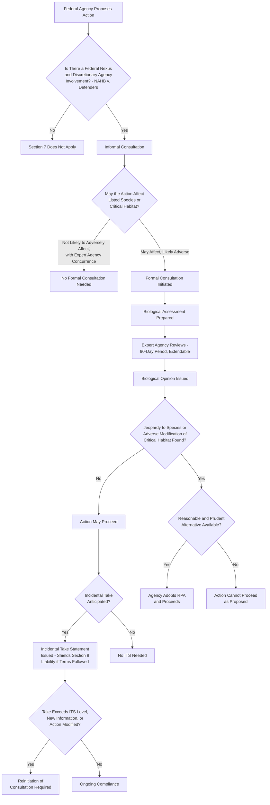

## Section 7 Interagency Consultation and Jeopardy Determinations

### Overview

ESA §7 is the statute's primary mechanism for regulating **federal agency conduct** — as distinct from §9, which regulates private and public conduct generally through the take prohibition. Section 7 requires every federal agency to ensure that any action it authorizes, funds, or carries out is not likely to **jeopardize the continued existence** of a listed species or result in the **destruction or adverse modification** of designated critical habitat. This consultation requirement has been described as one of the most substantively powerful provisions in federal environmental law, since it can require modification, mitigation, or even abandonment of otherwise-authorized federal projects, and its interpretation has generated some of the ESA's most consequential Supreme Court litigation.

### Statutory and Regulatory Basis

- **ESA §7(a)(2)** — 16 U.S.C. §1536(a)(2): the substantive "no jeopardy" and "no adverse modification" duties
- **ESA §7(b)** — 16 U.S.C. §1536(b): biological opinion requirements
- **ESA §7(o)** — 16 U.S.C. §1536(o): incidental take statements and their protective effect
- Implementing regulations: 50 C.F.R. Part 402 (interagency cooperation)

---

### The Threshold: Federal Nexus and Discretionary Control

#### **Key Points**

- Section 7(a)(2) applies only where there is a **federal nexus** — meaning the action is **authorized, funded, or carried out** by a federal agency. Purely private action with no federal permit, funding, or approval component falls outside §7 (though it may still be independently subject to the §9 take prohibition).
- The consulting duty applies only where the federal agency retains **some discretionary involvement or control** over the action — an agency has no consultation obligation with respect to purely ministerial actions where it lacks discretion to influence the action for the species' benefit.

#### *National Association of Home Builders v. Defenders of Wildlife*

*National Association of Home Builders v. Defenders of Wildlife*, 551 U.S. 644 (2007), addressed the interaction between ESA §7 and the Clean Water Act's NPDES permitting transfer provision:

- The Court held that when a federal statute (there, the CWA) makes a permitting decision **mandatory** upon satisfaction of specified statutory criteria that do not include ESA considerations, EPA has **no discretion** to add an ESA-based factor to that decision, and therefore §7(a)(2)'s consultation obligation does not apply to that action.
- This established the **"agency discretion" limiting principle**: §7(a)(2) reaches only discretionary agency actions, not action the agency is legally compelled to take regardless of species impact.

---

### The Consultation Process

#### **1. Informal Consultation**

- The action agency (the federal agency proposing to authorize, fund, or carry out the action) and the relevant expert agency — U.S. Fish and Wildlife Service (FWS) for terrestrial/freshwater species, National Marine Fisheries Service (NMFS/NOAA Fisheries) for most marine species — engage in preliminary discussions to determine whether formal consultation is required.
- If the action agency determines, with the expert agency's written concurrence, that the action **"is not likely to adversely affect"** any listed species or critical habitat, formal consultation is unnecessary and the process concludes.

#### **2. Formal Consultation**

- Required where the action **"may affect"** a listed species or critical habitat in a manner that is likely to be adverse.
- The action agency prepares a **Biological Assessment (BA)** (mandatory for major construction activities, discretionary otherwise) describing the action and its potential effects.
- The expert agency reviews the BA and available data, generally within a **90-day** consultation period (extendable by mutual agreement), and prepares a **Biological Opinion (BiOp)**.

#### **3. The Biological Opinion**

The BiOp represents the expert agency's formal determination and must include:

- A summary of the biological information relevant to the action
- The expert agency's opinion on whether the action is likely to **jeopardize** the species' continued existence or result in **destruction or adverse modification** of critical habitat
- If jeopardy or adverse modification is found, **reasonable and prudent alternatives (RPAs)** that the expert agency believes would avoid that result, if any exist
- An **Incidental Take Statement (ITS)**, where applicable, specifying the amount or extent of incidental take anticipated and reasonable and prudent measures to minimize it

#### **4. Conclusion of Consultation**

- If the BiOp concludes **no jeopardy/no adverse modification**, the action agency may proceed, subject to any terms and conditions in the accompanying ITS.
- If the BiOp concludes **jeopardy/adverse modification**, the action agency must either adopt an RPA, or, absent a viable RPA, cannot lawfully proceed with the action as proposed without risking §7(a)(2) violation (and separately, potential §9 liability if take occurs without ITS protection).

---

### The Jeopardy Standard

#### **Key Points**

- "Jeopardize the continued existence of" is defined by regulation (50 C.F.R. §402.02) as engaging in an action that reasonably would be expected, directly or indirectly, to **reduce appreciably the likelihood of both the survival and recovery** of a listed species in the wild.
- The jeopardy analysis requires assessing both the **"survival"** and **"recovery"** dimensions — an action might not threaten a species' bare survival in the near term but could still appreciably diminish its prospects for eventual recovery to the point of delisting, triggering jeopardy concerns under the regulatory definition.
- Jeopardy analysis considers the action's effects in the context of the **species' current status**, the **environmental baseline** (existing conditions absent the proposed action), and any **cumulative effects** of other reasonably certain future non-federal activities in the action area.

#### Destruction or Adverse Modification of Critical Habitat

- A separate, though related, standard applies to designated critical habitat: whether the action would result in a **direct or indirect alteration** that appreciably diminishes the value of critical habitat for the conservation of the species.
- Following regulatory revisions responding to *Weyerhaeuser*-adjacent litigation over the years, the "destruction or adverse modification" analysis focuses on whether the action diminishes the value of critical habitat as a whole for **both the survival and recovery** of the species, generally paralleling the jeopardy standard's structure but applied specifically to habitat function rather than the species population directly.

---

### Reasonable and Prudent Alternatives (RPAs)

#### **Key Points**

- Where a BiOp finds jeopardy or adverse modification, the expert agency must identify RPAs if any exist that the expert agency believes would avoid the jeopardy/adverse modification result, are consistent with the action's intended purpose, are within the action agency's legal authority and jurisdiction, and are economically and technologically feasible.
- RPAs commonly include: project redesign, timing restrictions (e.g., avoiding construction during breeding seasons), flow or operational modifications (e.g., for dam or water-management projects), habitat restoration or mitigation measures, and monitoring requirements.
- If no RPA exists that would avoid jeopardy, the action agency faces a stark choice: abandon or substantially redesign the action, or proceed and risk a §7(a)(2) violation (potentially subject to injunctive relief in litigation).

---

### Incidental Take Statements (ITS)

#### **Key Points**

- Where formal consultation concludes **no jeopardy** but some level of "incidental take" — take that is incidental to, and not the purpose of, an otherwise lawful federal activity — is nonetheless reasonably anticipated, the BiOp includes an **Incidental Take Statement**.
- The ITS specifies: the anticipated amount or extent of incidental take, **reasonable and prudent measures (RPMs)** necessary to minimize that impact, and mandatory **terms and conditions** implementing those measures.
- **Critical legal effect**: take that occurs in compliance with an ITS's terms and conditions is **exempted from §9 liability** — the ITS functions as a shield against take prohibition enforcement, provided the action agency and any applicant comply with its specified terms.
- If actual take exceeds the level anticipated in the ITS, this typically triggers a **reinitiation of consultation** requirement.

#### Reinitiation of Consultation

Formal consultation must be reinitiated if:

1. The amount or extent of taking specified in the ITS is exceeded;
2. New information reveals effects of the action that were not previously considered;
3. The action is subsequently modified in a manner that causes an effect on listed species not previously considered; or
4. A new species is listed or new critical habitat is designated that may be affected by the action.

---

### **Example**

A federal agency proposes to fund a major highway expansion project that will cross a river segment designated as critical habitat for a threatened fish species, and construction activity may disturb riparian habitat used by a separately listed migratory bird.

1. The agency conducts **informal consultation**, determining the project **"may affect"** both species and initiating **formal consultation** with the relevant expert agencies (FWS for the bird, potentially NMFS if the fish is anadromous, or FWS if it is a freshwater species).
2. The agency prepares a **Biological Assessment** describing construction methods, timing, and anticipated sediment runoff and habitat disturbance.
3. Following the 90-day (or extended) consultation period, the expert agency issues a **Biological Opinion** concluding that the project, as originally proposed, would likely result in **adverse modification** of the fish's critical habitat due to sedimentation effects on spawning substrate, but would **not jeopardize** the bird species given its broader range and the limited habitat disturbance involved.
4. The BiOp identifies a **reasonable and prudent alternative**: modifying the construction method to reduce sediment runoff (e.g., turbidity curtains, seasonal timing restrictions avoiding the spawning period) and adding a downstream habitat restoration component to offset unavoidable impacts.
5. The BiOp also includes an **Incidental Take Statement** for the migratory bird, anticipating a specified level of incidental take from construction-related habitat disturbance, with reasonable and prudent measures (e.g., pre-construction nest surveys, buffer zones around active nests) and terms and conditions the agency must implement to remain within the ITS's protective shield against §9 liability.
6. If, during construction, unexpectedly severe flooding causes sediment impacts far exceeding those analyzed in the BiOp, the agency must **reinitiate consultation** given that new information reveals effects not previously considered.

---

### Comparative Table: Jeopardy vs. Adverse Modification Standards

| Feature | Jeopardy (Species) | Adverse Modification (Critical Habitat) |
| --- | --- | --- |
| Statutory basis | §7(a)(2), first clause | §7(a)(2), second clause |
| Core question | Does the action appreciably reduce likelihood of survival **and** recovery of the species? | Does the action appreciably diminish the value of critical habitat for survival **and** recovery? |
| Applies even absent critical habitat? | Yes — jeopardy analysis applies to any listed species regardless of critical habitat designation | No — only relevant where critical habitat has been designated |
| Remedy if triggered | Reasonable and prudent alternatives, or action cannot proceed as proposed | Reasonable and prudent alternatives, or action cannot proceed as proposed |

---

### Diagram: Section 7 Consultation Process Flow (svg_diagram)

---

### **Related Topics**

- *National Association of Home Builders v. Defenders of Wildlife* — agency discretion limiting principle in full
- Biological Assessment preparation requirements and Biological Opinion litigation standards
- Environmental baseline and cumulative effects methodology in jeopardy analysis
- Section 9 take prohibition, the "harm" regulation, and *Babbitt v. Sweet Home Chapter*
- Reasonable and prudent alternatives: feasibility litigation and agency deference post-*Loper Bright*
- Programmatic consultation and batching approaches for recurring agency action categories
- God Squad exemption process under ESA §7(e)-(h) for jeopardy findings without viable alternatives
- Habitat Conservation Plans and Section 10 incidental take permits for non-federal actions