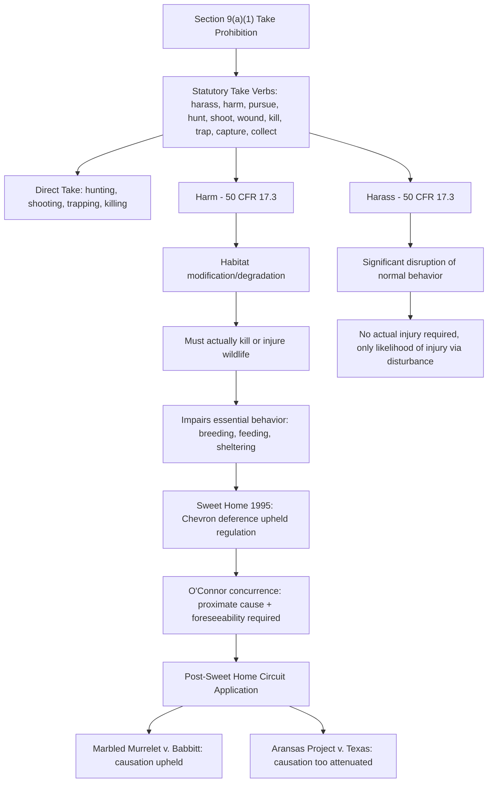

## Section 9's Take Prohibition and the Historical Scope of "Harm"

### Statutory Text and Structure

Section 9 of the Endangered Species Act (ESA), codified at 16 U.S.C. § 1538, establishes the core prohibitions of the Act. Section 9(a)(1) makes it unlawful for any person subject to U.S. jurisdiction to:

- Import or export any endangered species
- "Take" any endangered species within the United States, its territorial waters, or the high seas
- Possess, sell, deliver, carry, transport, or ship any unlawfully taken species
- Deliver, receive, carry, transport, or ship in interstate or foreign commerce any endangered species in the course of commercial activity
- Sell or offer for sale any endangered species in interstate or foreign commerce
- Violate any regulation pertaining to endangered species

Section 4(d) extends similar protections to threatened species through Fish and Wildlife Service (FWS) or National Marine Fisheries Service (NMFS) regulations, though the take prohibition is not automatic for threatened species as it is for endangered species.

### Definition of "Take"

16 U.S.C. § 1532(19) defines "take" as:

> to harass, harm, pursue, hunt, shoot, wound, kill, trap, capture, or collect, or to attempt to engage in any such conduct

**Key Points**

- The definition is intentionally broad and enumerates nine distinct verbs, several of which (particularly "harm" and "harass") extend liability beyond direct physical contact with an animal.
- "Take" applies only to fish and wildlife; plants receive narrower protection under Section 9(a)(2), which does not include a "take" prohibition and instead restricts removal/damage on federal land and interstate commerce activity.
- Liability under Section 9 does not require intent to harm a listed species; general intent to commit the underlying act is sufficient in most circuits, though some require that the defendant knew or should have known a protected species was involved.

### FWS Regulatory Definition of "Harm"

The term "harm" within the take definition was not self-explanatory, and its administrative interpretation became the single most litigated issue in ESA take jurisprudence. FWS regulations at 50 C.F.R. § 17.3 define harm as:

> an act which actually kills or injures wildlife. Such act may include significant habitat modification or degradation where it actually kills or injures wildlife by significantly impairing essential behavioral patterns, including breeding, feeding, or sheltering.

**Key Points**

- This definition extends take liability to habitat modification and degradation, not merely direct physical acts against an individual animal.
- It requires actual injury or death, not merely a risk of harm — the regulation does not cover speculative or generalized threats to a species.
- The impairment must affect "essential behavioral patterns" such as breeding, feeding, or sheltering, rather than any disturbance whatsoever.
- NMFS uses a similar but not identical regulatory formulation for marine species under its jurisdiction.

### Historical Development of the Habitat-Modification Theory

**Pre-1981: Statutory Silence**

The original 1973 ESA and 1978 amendments left "harm" undefined by regulation, creating uncertainty about whether habitat destruction alone (as opposed to hunting, trapping, or direct injury) could constitute a taking.

**1981: FWS Codifies the Habitat Theory**

FWS promulgated the harm definition above in 1981, explicitly including habitat modification. This was a significant expansion because it meant land-use decisions by private parties — logging, development, agriculture — could trigger federal take liability even absent any direct contact with an animal.

**Palila Litigation (Palila v. Hawaii Dept. of Land & Natural Resources, 1979 and 1988)**

Two Ninth Circuit decisions involving the Palila, an endangered Hawaiian honeycreeper, were foundational:

- *Palila I* (9th Cir. 1979) held that habitat destruction affecting the Palila's critical mamane-naio forest habitat, caused by feral sheep and goats grazing on state land, constituted a taking because it degraded habitat essential to the species' survival.
- *Palila II* (9th Cir. 1988) reaffirmed and extended this reasoning, holding that habitat degradation that could drive a species toward extinction — even without proof that individual birds were being directly injured — satisfied the "harm" standard.

**Key Points**

- The Palila cases established, at the circuit level, that indirect habitat-based harm could satisfy the take prohibition even in the absence of direct contact or observable injury to specific individuals.
- This interpretation directly influenced the regulatory language later challenged in *Sweet Home*.

### Babbitt v. Sweet Home Chapter of Communities for a Great Oregon (1995)

This U.S. Supreme Court decision is the definitive precedent on the scope of "harm" and, by extension, the outer boundary of Section 9 liability for habitat modification.

**Facts and Procedural History**

Small landowners, logging companies, and families dependent on the forest products industry in the Pacific Northwest and Southeast challenged the FWS regulatory definition of "harm," arguing that Congress intended "take" to require direct application of force against a specific animal, not habitat modification affecting a species generally. The challenge arose in the context of Northern Spotted Owl and Red-cockaded Woodpecker habitat protections that restricted logging on private land.

**Holding**

The Supreme Court (6-3, opinion by Justice Stevens) upheld the FWS regulation as a reasonable interpretation of an ambiguous statutory term, applying *Chevron* deference. The Court held that:

- The ordinary meaning of "harm" includes indirect as well as direct injuries.
- Congress's use of the word "harm" in addition to more specific terms like "hunt" and "trap" implied that Congress intended some broader reach, since a narrower reading would render "harm" superfluous.
- The Endangered Species Act's broad purpose — to provide a "comprehensive program to protect endangered species" — supported a reading of "harm" that reaches habitat modification causing actual death or injury.
- The regulation itself was already narrowed by requiring proximate causation and actual injury, addressing overbreadth concerns.

**Concurrence (O'Connor)**

Justice O'Connor's concurrence, often cited as the practical operative standard, emphasized that:

- The regulation requires **foreseeability** and **proximate causation** — habitat modification must be a proximate cause of actual death or injury to identifiable animals, not merely a but-for or remote cause.
- Purely speculative harm to a species as a whole, without a demonstrable causal link to actual injury of members of that species, does not satisfy the standard.

**Dissent (Scalia, joined by Rehnquist and Thomas)**

The dissent argued that "take" as used throughout the statute and in traditional wildlife law consistently connoted direct applications of force against animals (akin to hunting and trapping), and that extending liability to habitat modification impermissibly stretched the statutory term beyond its ordinary and historical meaning, effectively converting Section 9 into a land-use regulation statute.

**Key Points**

- *Sweet Home* did not eliminate the causation requirement; it confirmed that proximate cause and actual injury remain necessary elements even under the broad habitat-modification theory.
- The decision left open significant case-by-case litigation over what counts as sufficiently direct and foreseeable causation between habitat alteration and injury to a member of a listed species.
- O'Connor's proximate-cause gloss has since functioned as the practical limiting principle applied by lower courts.

### Post-Sweet Home Doctrinal Refinement

**Causation and Foreseeability**

Lower courts applying *Sweet Home* have required plaintiffs (typically environmental groups or, in citizen-suit contexts, plaintiffs alleging ongoing violations) to show:

1. An identifiable, ongoing, or imminent threat of harm (not merely a past, completed act);
2. That the challenged habitat modification is a proximate, not merely but-for, cause of injury;
3. That actual injury or death to specific, identifiable members of the species is reasonably certain or has already occurred, rather than a generalized decline in species viability.

**Marbled Murrelet v. Babbitt (9th Cir. 1996)** applied *Sweet Home*'s proximate causation framework to timber harvest plans threatening old-growth nesting habitat, finding sufficient likelihood of harm to support an injunction.

**Aransas Project v. Shaw / Aransas Project v. Texas Commission on Environmental Quality (5th Cir. 2014)** involved whooping crane deaths linked to state water-permitting decisions that reduced freshwater inflows to crane habitat. The Fifth Circuit reversed a district court finding of liability, holding the causal chain — water permits to reduced freshwater inflow to reduced blue crab prey to crane malnutrition to death — was too attenuated and involved too many independent, intervening causes (including drought) to satisfy proximate cause, illustrating the outer limit of the habitat-harm theory in complex ecological causation chains.

**Key Points**

- Courts increasingly scrutinize multi-step causal chains skeptically, particularly where natural variables (drought, disease, predation) intervene between the defendant's conduct and the alleged injury.
- The "reasonably certain to occur" standard, drawn from ESA case law addressing imminent threats, is commonly applied to determine whether injunctive relief is warranted before injury has actually occurred.

### "Harass" as a Separate Basis for Take

Distinct from "harm," the regulatory definition of "harass" at 50 C.F.R. § 17.3 covers:

> an intentional or negligent act or omission which creates the likelihood of injury to wildlife by annoying it to such an extent as to significantly disrupt normal behavioral patterns which include, but are not limited to, breeding, feeding, or sheltering

**Key Points**

- Unlike "harm," "harass" does not require actual injury or death — significant disruption of behavior is sufficient.
- This provision is frequently invoked in contexts such as wildlife viewing, ecotourism regulation, and noise/disturbance from human activity (e.g., whale-watching vessel approach distances, off-road vehicle use near nesting shorebirds).
- An exception exists for generally accepted animal husbandry practices affecting captive wildlife.

### Incidental Take Statements and Permits

Because Section 9's take prohibition is strict and broad, Congress and the agencies developed mechanisms to authorize otherwise-prohibited takes that are incidental to, but not the purpose of, an otherwise lawful activity:

- **Section 7 Incidental Take Statements (ITS):** Issued by FWS/NMFS as part of formal consultation under Section 7 when a federal action may affect a listed species; shields the action agency and applicants from Section 9 liability for take that occurs within specified terms and conditions.
- **Section 10(a)(1)(B) Incidental Take Permits (ITPs):** Available to non-federal (private, state, local) parties whose otherwise lawful activities may incidentally take listed species; requires an approved **Habitat Conservation Plan (HCP)** that mitigates and minimizes take impacts.
- **Section 10(a)(1)(A) Permits:** Cover take for scientific research or to enhance the propagation or survival of the species.

**Example**

A residential developer whose project would remove habitat used by an endangered kangaroo rat can apply for an incidental take permit under Section 10(a)(1)(B), submitting an HCP that sets aside preserved habitat, funds off-site conservation, and specifies construction timing restrictions to minimize direct mortality — thereby converting an otherwise unlawful Section 9 take into an authorized incidental take.

### Enforcement and Penalties

- **Civil penalties:** Up to $25,000 per violation for knowing violations; lesser amounts for other violations (16 U.S.C. § 1540(a)).
- **Criminal penalties:** Up to $50,000 and/or one year imprisonment for knowing violations (16 U.S.C. § 1540(b)).
- **Citizen suits:** Section 11(g) (16 U.S.C. § 1540(g)) permits any person to bring a civil suit to enjoin a violation of Section 9, including ongoing or threatened takes, following 60-day notice to the agency and alleged violator.
- Courts have held that plaintiffs seeking injunctive relief for a threatened (not yet completed) take must show the harm is "reasonably certain to occur," a standard distinct from, though related to, the proximate causation requirement from *Sweet Home*.

### Diagrammatic Overview

### Take Liability Pathway (SVG)

<svg xmlns="http://www.w3.org/2000/svg" viewBox="0 0 800 380">
<text x="400" y="25" font-size="16" font-weight="bold" text-anchor="middle" fill="#1a1a1a">Section 9 Take Liability Pathway (svg_diagram)</text>
<rect x="20" y="60" width="200" height="60" rx="6" fill="#dbeafe" stroke="#1e40af" />
<text x="120" y="85" font-size="12" text-anchor="middle" fill="#1e3a8a">Conduct or</text>
<text x="120" y="100" font-size="12" text-anchor="middle" fill="#1e3a8a">habitat modification</text>
<rect x="300" y="60" width="200" height="60" rx="6" fill="#fef3c7" stroke="#b45309" />
<text x="400" y="85" font-size="12" text-anchor="middle" fill="#78350f">Does it fall within</text>
<text x="400" y="100" font-size="12" text-anchor="middle" fill="#78350f">a "take" verb?</text>
<rect x="580" y="60" width="200" height="60" rx="6" fill="#fee2e2" stroke="#b91c1c" />
<text x="680" y="85" font-size="12" text-anchor="middle" fill="#7f1d1d">No — no Section 9</text>
<text x="680" y="100" font-size="12" text-anchor="middle" fill="#7f1d1d">liability</text>
<line x1="220" y1="90" x2="300" y2="90" stroke="#333" marker-end="url(#arrow)" />
<line x1="500" y1="90" x2="580" y2="90" stroke="#333" stroke-dasharray="4" marker-end="url(#arrow)" />
<text x="540" y="80" font-size="10" text-anchor="middle">no</text>
<rect x="300" y="160" width="200" height="60" rx="6" fill="#fef3c7" stroke="#b45309" />
<text x="400" y="185" font-size="12" text-anchor="middle" fill="#78350f">Actual injury/death to</text>
<text x="400" y="200" font-size="12" text-anchor="middle" fill="#78350f">identifiable animal?</text>
<line x1="400" y1="120" x2="400" y2="160" stroke="#333" marker-end="url(#arrow)" />
<text x="410" y="140" font-size="10">yes</text>
<rect x="580" y="160" width="200" height="60" rx="6" fill="#fee2e2" stroke="#b91c1c" />
<text x="680" y="185" font-size="12" text-anchor="middle" fill="#7f1d1d">No — not "harm";</text>
<text x="680" y="200" font-size="12" text-anchor="middle" fill="#7f1d1d">check "harass" instead</text>
<line x1="500" y1="190" x2="580" y2="190" stroke="#333" stroke-dasharray="4" marker-end="url(#arrow)" />
<text x="540" y="180" font-size="10">no</text>
<rect x="300" y="260" width="200" height="60" rx="6" fill="#fef3c7" stroke="#b45309" />
<text x="400" y="285" font-size="12" text-anchor="middle" fill="#78350f">Proximate cause &amp;</text>
<text x="400" y="300" font-size="12" text-anchor="middle" fill="#78350f">foreseeability (O'Connor, Sweet Home)?</text>
<line x1="400" y1="220" x2="400" y2="260" stroke="#333" marker-end="url(#arrow)" />
<text x="410" y="245" font-size="10">yes</text>
<rect x="580" y="260" width="200" height="60" rx="6" fill="#fee2e2" stroke="#b91c1c" />
<text x="680" y="285" font-size="12" text-anchor="middle" fill="#7f1d1d">No — causal chain too</text>
<text x="680" y="300" font-size="12" text-anchor="middle" fill="#7f1d1d">attenuated (cf. Aransas)</text>
<line x1="500" y1="290" x2="580" y2="290" stroke="#333" stroke-dasharray="4" marker-end="url(#arrow)" />
<text x="540" y="280" font-size="10">no</text>
<rect x="300" y="330" width="200" height="40" rx="6" fill="#dcfce7" stroke="#15803d" />
<text x="400" y="355" font-size="12" text-anchor="middle" fill="#14532d">Unlawful "take" — Section 9 liability attaches</text>
<line x1="400" y1="320" x2="400" y2="330" stroke="#333" marker-end="url(#arrow)" />
</svg>

### Distinguishing Section 9 Take from Section 7 Jeopardy

**Key Points**

- Section 9 take analysis focuses on individual animals ("harm" requires actual injury/death to identifiable members of a species).
- Section 7 jeopardy analysis (16 U.S.C. § 1536(a)(2)) focuses on the species as a whole — whether an action is likely to appreciably reduce the likelihood of survival and recovery of the species in the wild.
- A federal action can cause an unlawful take of individual animals without necessarily jeopardizing the species, and vice versa; consultation under Section 7 and the resulting Incidental Take Statement typically resolve both issues concurrently for federal actions.

### [Inference] Areas of Continuing Doctrinal Uncertainty

- The precise degree of causal directness required beyond *Sweet Home*'s "proximate cause" language continues to be litigated on a fact-specific basis, and circuit courts have not fully harmonized their approaches to multi-step ecological causation chains. [Inference]
- Whether climate-change-driven habitat loss (e.g., sea ice loss affecting polar bears) can satisfy the *Sweet Home* proximate causation standard for a "harm" claim against a specific emitter or federal permitting decision remains a contested and largely unresolved question in the case law. [Inference]

**Related Topics**

- Section 7 consultation process and jeopardy standard
- Habitat Conservation Plans (HCPs) and the "No Surprises" policy
- Critical habitat designation under Section 4
- Citizen suit provisions and standing requirements under Section 11(g)
- Distinguishing "take" from "harm" for threatened species under Section 4(d) rules
- Vicarious and third-party liability for take under the ESA
- Interaction between Section 9 take liability and the Migratory Bird Treaty Act / Marine Mammal Protection Act