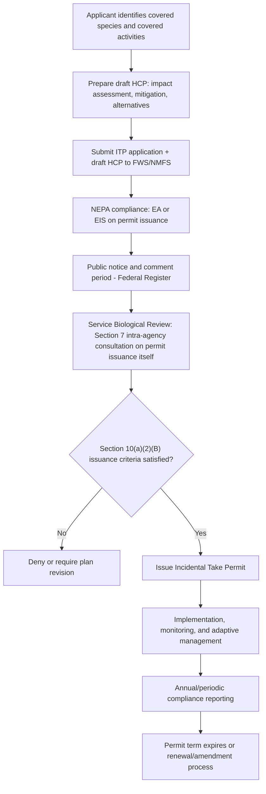

## Habitat Conservation Plans and Incidental Take Permits

### Statutory Basis

Section 10(a)(1)(B) of the Endangered Species Act (ESA), 16 U.S.C. § 1539(a)(1)(B), authorizes the U.S. Fish and Wildlife Service (FWS) and National Marine Fisheries Service (NMFS) to issue permits allowing the "take" of listed species that is **incidental to, and not the purpose of, carrying out an otherwise lawful activity**. This provision was added by the 1982 ESA amendments specifically to resolve conflicts between Section 9's strict take prohibition and lawful private and non-federal land use.

**Key Points**

- The incidental take permit (ITP) is the mechanism by which non-federal parties (private landowners, developers, state and local governments, timber companies, utilities) obtain legal authorization for take that would otherwise violate Section 9.
- A Habitat Conservation Plan (HCP) is the required supporting document that must accompany every ITP application; the permit cannot issue without an approved HCP.
- This is distinct from the Section 7 consultation process, which applies to federal agency actions and produces an Incidental Take Statement (ITS) rather than a permit.

### Statutory Issuance Criteria

Under 16 U.S.C. § 1539(a)(2)(B), FWS/NMFS may issue an ITP only if the applicant demonstrates that:

1. The taking will be incidental to an otherwise lawful activity;
2. The applicant will, to the **maximum extent practicable**, minimize and mitigate the impacts of the take;
3. The applicant has ensured adequate funding for the plan;
4. The taking will not appreciably reduce the likelihood of survival and recovery of the species in the wild; and
5. Any other measures required by the Secretary as necessary or appropriate will be met.

**Key Points**

- The "maximum extent practicable" standard for mitigation is not a zero-impact standard; it balances biological need against economic and technical feasibility.
- Criterion 4 mirrors, but is distinct from, the Section 7 "jeopardy" standard — it is applied here to a non-federal action and assessed by the permitting agency rather than through interagency consultation.

### Required Elements of a Habitat Conservation Plan

An HCP submitted under Section 10(a)(2)(A) must include:

- **Impact assessment:** The likely impact (level of anticipated take) of the proposed activity on covered species.
- **Mitigation measures:** Steps the applicant will take to monitor, minimize, and mitigate those impacts, and the funding available to implement them.
- **Alternatives analysis:** Alternative actions considered and reasons why those alternatives were not adopted.
- **Additional measures:** Any other measures the Service may require as necessary or appropriate for purposes of the plan.

**Example**

An HCP for a residential subdivision affecting the endangered San Joaquin kit fox might include: a habitat assessment identifying occupied burrows on-site, a mitigation ratio (e.g., 3:1 acres of preserved off-site habitat per acre developed), pre-construction den surveys with exclusion/relocation protocols, seasonal construction timing restrictions to avoid pupping season, an endowment funding a conservation easement in perpetuity, and a discussion of a "no-build" alternative rejected as economically infeasible.

### The HCP Development and Permitting Process

**Key Points**

- Issuance of the ITP is itself a federal agency action, triggering the National Environmental Policy Act (NEPA) and internal Section 7 consultation (the Service consults with itself, or with the sister agency, on whether issuing the permit will jeopardize the species).
- Public notice and a minimum 30-day comment period (often longer for large or controversial HCPs) are required before permit issuance.
- Large regional HCPs can take years to negotiate and often involve multiple non-federal co-applicants (e.g., counties, water districts, utilities) under a single "umbrella" plan.

### Permit Duration, Amendment, and the "No Surprises" Policy

**No Surprises Rule (1998, codified at 50 C.F.R. §§ 17.22, 17.32, 222.307)**

This regulatory policy provides assurances to ITP holders that, once an HCP is approved and being properly implemented, the Services will not require additional land, water, or financial compensation beyond what the HCP specifies, even if new information later indicates the species requires greater protection — except in extraordinary circumstances.

**Key Points**

- The policy is intended to give landowners regulatory certainty over the life of long-term HCPs (which often run 30–50 years or longer) in exchange for their voluntary participation.
- The "extraordinary circumstances" exception is narrowly construed and has rarely been invoked.
- Critics have argued the policy can lock in outdated conservation measures against a backdrop of changing scientific understanding or climate conditions; proponents argue it is essential to induce voluntary landowner participation in conservation planning. [Inference: the balance of these competing policy critiques remains a matter of ongoing debate rather than settled empirical consensus.]

**Permit Amendments and Changed Circumstances vs. Unforeseen Circumstances**

- **Changed circumstances:** Reasonably foreseeable changes (e.g., a specified fire or flood event) that are planned for within the HCP itself, with pre-agreed response measures.
- **Unforeseen circumstances:** Changes not anticipated in the HCP and not reasonably foreseeable at the time of approval; under "No Surprises," the Services bear the burden of demonstrating unforeseen circumstances exist before requiring additional mitigation beyond the HCP's terms, and even then, generally cannot require additional land or financial compensation from a fully compliant permittee absent the permittee's consent.

### Types of HCPs by Scale

| HCP Type | Scope | Example |
| --- | --- | --- |
| Single-species, single-landowner | One property, one covered species | Small residential lot with gopher tortoise burrows |
| Multi-species, single-landowner | One property, multiple covered species | Timber company plan covering spotted owl and marbled murrelet |
| Regional/Multi-Species (MSHCP) | Multiple jurisdictions, multiple species, large geographic area | San Diego Multiple Species Conservation Program (MSCP) |
| Programmatic/Umbrella | Statewide or industry-wide template covering routine, low-effect activities | Programmatic HCPs for utility line maintenance |

**Low-Effect HCPs**

FWS provides a streamlined process for HCPs involving minor or negligible effects on covered species and habitat, individually and cumulatively, which may qualify for a Categorical Exclusion under NEPA rather than a full Environmental Assessment or Environmental Impact Statement, substantially shortening the review timeline.

### Relationship to Section 7 Incidental Take Statements

**Key Points**

- Section 7 ITS applies where a **federal nexus** exists (federal funding, federal permit, federal land, or other federal agency action) — the action agency consults with FWS/NMFS, and the resulting Biological Opinion includes an ITS authorizing incidental take tied to that federal action.
- Section 10(a)(1)(B) ITPs apply where **no federal nexus exists** — purely private or state/local action requires the landowner to seek its own permit and prepare its own HCP.
- Some large-scale projects require both: a federal permit (e.g., a Clean Water Act Section 404 dredge-and-fill permit from the Army Corps of Engineers) triggers Section 7 consultation, while a broader master-planned development might separately pursue a Section 10 HCP to cover non-federally-nexused portions of the project or a longer time horizon than the federal permit covers.

### Enforcement, Compliance, and Permit Revocation

- ITP holders must comply with monitoring and reporting conditions specified in the permit and Implementing Agreement.
- Failure to implement HCP mitigation measures, or take exceeding permitted levels, can result in permit suspension or revocation under 50 C.F.R. § 13.28 and independent Section 9 liability for take outside the permit's scope.
- Citizen suits under Section 11(g) may be brought to challenge permit issuance (e.g., as arbitrary and capricious under the Administrative Procedure Act) or to enforce compliance with permit terms.

### Landmark and Illustrative HCPs

- **San Bruno Mountain HCP (California, 1983):** Widely regarded as the first major HCP, developed to protect the endangered mission blue butterfly while allowing residential development on adjacent portions of the mountain; served as a template for subsequent multi-party regional HCPs.
- **Plum Creek Timber HCP (Washington/Montana, 1996):** A large-scale, long-duration (100-year) multi-species HCP covering northern spotted owl and other species across extensive commercial timberlands, notable for its scale and duration under the No Surprises policy.
- **Balcones Canyonlands Conservation Plan (Travis County, Texas):** A regional HCP addressing golden-cheeked warbler and black-capped vireo habitat amid rapid urban growth around Austin, combining permit coverage with a dedicated preserve system.

*(Details of specific HCP terms, acreages, and mitigation ratios in older or regionally administered plans should be verified against current FWS records, as plan amendments and administrative updates occur over time.)* [Unverified]

### Judicial Review of HCP/ITP Decisions

Courts reviewing ITP issuance apply the Administrative Procedure Act's "arbitrary and capricious" standard, examining whether:

- The Service adequately considered the best available scientific and commercial data (as required generally under ESA Section 4(b)(1)(A), and by analogy to permitting decisions);
- The mitigation measures reasonably minimize and mitigate impacts to the maximum extent practicable;
- The "no jeopardy" finding for permit issuance is adequately supported;
- NEPA procedural requirements (EA/EIS, public comment) were properly followed.

**Key Points**

- Environmental groups have periodically challenged HCP approvals as insufficiently protective, while permittees or affected industries have challenged permit denials or overly burdensome mitigation conditions — litigation runs in both directions.
- Courts generally afford deference to agency scientific and biological determinations under *Chevron*-style review principles, subject to the requirement that the agency's reasoning be adequately explained in the administrative record. [Behavior may vary by circuit and by the specific administrative record at issue.]

### Comparative Diagram: ITP/HCP vs. Section 7 ITS Pathways

<svg xmlns="http://www.w3.org/2000/svg" viewBox="0 0 800 340">
<text x="400" y="25" font-size="16" font-weight="bold" text-anchor="middle" fill="#1a1a1a">Incidental Take Authorization Pathways (svg_diagram)</text>
<rect x="40" y="60" width="320" height="40" rx="6" fill="#e0e7ff" stroke="#3730a3" />
<text x="200" y="85" font-size="13" text-anchor="middle" fill="#312e81">Non-federal action, no federal nexus</text>
<rect x="440" y="60" width="320" height="40" rx="6" fill="#e0e7ff" stroke="#3730a3" />
<text x="600" y="85" font-size="13" text-anchor="middle" fill="#312e81">Federal action or federal nexus present</text>
<line x1="200" y1="100" x2="200" y2="140" stroke="#333" marker-end="url(#arrow2)" />
<line x1="600" y1="100" x2="600" y2="140" stroke="#333" marker-end="url(#arrow2)" />
<rect x="40" y="140" width="320" height="50" rx="6" fill="#fef9c3" stroke="#a16207" />
<text x="200" y="160" font-size="12" text-anchor="middle" fill="#713f12">Section 10(a)(1)(B) Permit</text>
<text x="200" y="176" font-size="12" text-anchor="middle" fill="#713f12">Requires: Habitat Conservation Plan</text>
<rect x="440" y="140" width="320" height="50" rx="6" fill="#fef9c3" stroke="#a16207" />
<text x="600" y="160" font-size="12" text-anchor="middle" fill="#713f12">Section 7 Consultation</text>
<text x="600" y="176" font-size="12" text-anchor="middle" fill="#713f12">Produces: Biological Opinion</text>
<line x1="200" y1="190" x2="200" y2="230" stroke="#333" marker-end="url(#arrow2)" />
<line x1="600" y1="190" x2="600" y2="230" stroke="#333" marker-end="url(#arrow2)" />
<rect x="40" y="230" width="320" height="50" rx="6" fill="#dcfce7" stroke="#15803d" />
<text x="200" y="250" font-size="12" text-anchor="middle" fill="#14532d">Incidental Take Permit issued</text>
<text x="200" y="266" font-size="12" text-anchor="middle" fill="#14532d">Shields permittee from Section 9</text>
<rect x="440" y="230" width="320" height="50" rx="6" fill="#dcfce7" stroke="#15803d" />
<text x="600" y="250" font-size="12" text-anchor="middle" fill="#14532d">Incidental Take Statement issued</text>
<text x="600" y="266" font-size="12" text-anchor="middle" fill="#14532d">Shields action agency/applicant</text>
<line x1="200" y1="280" x2="200" y2="300" stroke="#333" />
<line x1="600" y1="280" x2="600" y2="300" stroke="#333" />
<line x1="200" y1="300" x2="600" y2="300" stroke="#333" stroke-dasharray="5" />
<text x="400" y="320" font-size="11" text-anchor="middle" fill="#444">Both governed by "No Surprises" and adaptive management principles where applicable</text>
</svg>

### Common Criticisms and Reform Debates

- **Scientific adequacy concerns:** Critics argue some HCPs, particularly older or lower-effect plans, were approved with limited baseline population data or monitoring rigor. [Inference]
- **Climate change and static mitigation:** Long-duration HCPs (50–100 years) fix mitigation commitments at approval, raising questions about adequacy as species ranges and habitat suitability shift under changing climate conditions. [Inference]
- **Cumulative effects across overlapping regional HCPs:** Multiple HCPs within the same ecosystem may be individually approved as non-jeopardizing while raising unresolved questions about aggregate, landscape-level impact. [Inference]

**Related Topics**

- Section 9 take prohibition and the "harm"/"harass" regulatory definitions
- Section 7 consultation, Biological Opinions, and jeopardy determinations
- NEPA review requirements for federal permitting actions
- Critical habitat designation and its interaction with HCP planning
- Safe Harbor Agreements and Candidate Conservation Agreements with Assurances
- Recovery planning and delisting criteria under Section 4(f)