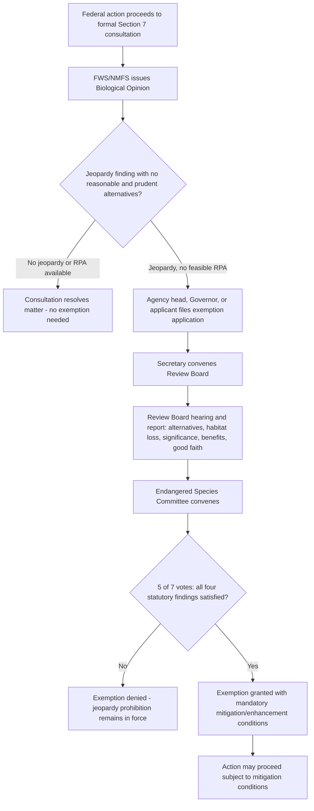

## The Endangered Species Committee Exemption Process

### Statutory Basis and Purpose

Section 7 of the Endangered Species Act (ESA), specifically 16 U.S.C. § 1536(e)-(p), establishes the Endangered Species Committee (ESC) — commonly known as the "God Squad" — as a mechanism of last resort allowing a limited exemption from Section 7(a)(2)'s substantive jeopardy and adverse modification prohibitions when interagency consultation fails to produce a compliant alternative.

**Key Points**

- The exemption process was added by the 1978 ESA amendments in direct response to *TVA v. Hill* (1978), the Supreme Court decision halting the Tellico Dam over the snail darter, which highlighted the absence of any mechanism to resolve conflicts between an economically significant federal project and an absolute statutory jeopardy prohibition.
- The Committee has convened only a small number of times in the Act's history, reflecting the deliberately high procedural and substantive bar Congress built into the process.
- The exemption applies only to federal agency actions subject to Section 7; it has no application to non-federal (private) take addressed through Section 10 Incidental Take Permits.

### Committee Composition

The Endangered Species Committee, under 16 U.S.C. § 1536(e)(3), consists of seven members:

1. The Secretary of Agriculture
2. The Secretary of the Army
3. The Chairman of the Council of Economic Advisers
4. The Administrator of the Environmental Protection Agency
5. The Secretary of the Interior
6. The Administrator of the National Oceanic and Atmospheric Administration
7. One individual from the affected state, appointed by the President, with expertise relevant to the matter (a state-specific representative appointed for that particular exemption application)

**Key Points**

- Five of the seven votes are required for the Committee to grant an exemption — a supermajority threshold intended to prevent routine or politically expedient exemptions.
- The Secretary of the Interior, who administers the underlying ESA listing and consultation process for most terrestrial and freshwater species, sits on the Committee that can override that same agency's jeopardy finding — creating a structurally distinct decision-maker from the consulting agency.

### Prerequisites: Exhaustion of the Consultation Process

An exemption application cannot be filed until ordinary Section 7 consultation has been exhausted and has failed to resolve the conflict. Specifically, under 16 U.S.C. § 1536(g), an application may be submitted only after:

- Formal consultation between the action agency and FWS/NMFS has concluded with a jeopardy Biological Opinion;
- The Biological Opinion has identified that no reasonable and prudent alternatives (RPAs) exist to avoid jeopardy, or the agency has determined the RPAs are not economically or technically feasible; and
- Good faith efforts have been made by the parties to resolve the conflict through consultation.

**Key Points**

- Only the head of the relevant federal action agency, the Governor of the state in which the action would occur, or a permit/license applicant may apply for an exemption — private parties without such standing may not directly initiate the process.
- The application must be filed within a defined statutory window after conclusion of consultation (generally 90 days), reinforcing the exemption's role as an exhaustion-dependent, last-resort remedy rather than an alternative to consultation.

### The Review Board and Report

Before the Committee itself votes, 16 U.S.C. § 1536(g)-(h) requires a **Review Board** process:

1. The Secretary convenes a Review Board consisting of one member appointed by the Secretary, one by the head of each relevant Federal agency, and one by the Governor of the affected state.
2. The Review Board holds a hearing and compiles a report addressing:
   - Availability of reasonable and prudent alternatives;
   - Nature and extent of the expected loss or modification of critical habitat;
   - Whether the action is of regional or national significance;
   - The nature and extent of the benefits of the proposed action versus alternative courses of action consistent with conserving the species;
   - Whether the Federal agency and applicant made a good faith effort to resolve the conflict through consultation.
3. The Review Board's report is submitted to the Committee, which then holds its own proceedings and vote based on the record developed.

**Key Points**

- The Review Board's report is advisory and fact-finding; the ultimate exemption decision rests with the seven-member Committee itself.
- The process is designed to compile a detailed administrative record justifying (or rejecting) an extraordinary departure from the statute's substantive protections.

### Substantive Findings Required for Exemption

Under 16 U.S.C. § 1536(h)(1), the Committee may grant an exemption only if, based on the report and the record, it determines that:

1. There are **no reasonable and prudent alternatives** to the agency action;
2. The **benefits of the action clearly outweigh** the benefits of alternative courses of action consistent with conserving the species or critical habitat, and the action is in the **public interest**;
3. The action is of **regional or national significance**; and
4. Neither the Federal agency nor the applicant made any **irreversible or irretrievable commitment of resources** prohibited by Section 7(d) during the consultation process (i.e., they did not prejudge or foreclose alternatives while consultation was pending).

**Key Points**

- All four findings must be satisfied; failure on any single element bars exemption.
- The "clearly outweigh" and "public interest" standards are substantive, not merely procedural, requiring the Committee to weigh conservation value against the economic, social, or strategic benefits of the action.
- The Section 7(d) prohibition on irreversible commitments functions as a "clean hands" requirement — an agency that has already committed resources in a way that forecloses alternatives during consultation cannot then seek an exemption from the resulting jeopardy finding.

### Mandatory Mitigation and Conservation Conditions

Even where the Committee grants an exemption, 16 U.S.C. § 1536(h)(1)(B) requires it to establish **reasonable mitigation and enhancement measures**, including live propagation, transplantation, and habitat acquisition and improvement, necessary and appropriate to minimize the adverse effects of the exempted action on the affected species or critical habitat.

**Key Points**

- An exemption is therefore never an unconditional override; it is coupled with mandatory offsetting conservation measures determined by the Committee.
- This mirrors, in a more constrained form, the mitigation logic found in Habitat Conservation Plans under Section 10, though imposed directly by the Committee rather than negotiated through a permit application.

### Process Flow

### The Grayrocks Dam / Whooping Crane Case (1979)

The first exemption application under the newly created process involved the Grayrocks Dam and Reservoir project on the Laramie River in Wyoming, which threatened downstream Platte River habitat critical to the whooping crane.

**Key Points**

- The Committee did not ultimately need to render a full exemption decision on the merits because the parties reached a negotiated mitigation settlement (including funding for a habitat trust) before or during Committee proceedings, allowing the project to proceed with agreed conservation measures.
- This outcome illustrated a recurring pattern: the mere availability of the exemption process, and the pressure of a pending Committee proceeding, can catalyze negotiated settlements that resolve the underlying conflict without requiring the Committee to exercise its full override authority. [Inference]

### The Tellico Dam Exemption Denial (1979)

Following *TVA v. Hill*, TVA sought an exemption for the Tellico Dam itself (the same project underlying the Supreme Court case) to complete construction despite the jeopardy finding regarding the snail darter.

**Key Points**

- The Committee **unanimously denied** the exemption, finding that the dam's economic benefits did not clearly outweigh the value of the alternatives and the habitat that would be lost, and noting subsequent economic analyses questioned the project's cost-effectiveness independent of the snail darter issue.
- Congress subsequently exempted the Tellico Dam from the ESA through separate, specific legislation (a rider to a 1979 appropriations act), illustrating that Congress retains the ultimate authority to override the ESA (and the Committee's own determinations) through subsequent specific statutory action, distinct from the Section 7 Committee process itself.
- This sequence — administrative denial followed by direct congressional override — remains a notable illustration of the limits of the Committee mechanism relative to Congress's plenary legislative authority.

### The Oregon Spotted Owl / BLM Timber Sales Exemption (1992)

The Committee granted a partial exemption for a subset of Bureau of Land Management timber sales in Oregon that had been halted due to jeopardy findings for the northern spotted owl.

**Key Points**

- The Committee granted exemptions for a limited number of the disputed timber sales while denying exemption for others, reflecting a parcel-by-parcel application of the statutory findings rather than a blanket determination.
- This remains among the most prominent instances of an exemption actually being granted (as opposed to being resolved by settlement or denied), and it occurred amid significant political controversy over Pacific Northwest timber policy versus spotted owl conservation. [Unverified: specific vote counts and parcel-level details should be confirmed against the original Committee decision record, as recollection of administrative specifics from this era varies across secondary sources.]

### Practical and Political Significance

**Key Points**

- The exemption process functions less as a routinely used regulatory tool and more as a **structural safety valve** and **negotiating lever**: its mere existence, and the elaborate, high-visibility, multi-agency process required to invoke it, creates strong incentives for the action agency and the Services to resolve conflicts through ordinary consultation, reasonable and prudent alternatives, or negotiated mitigation rather than pursue a full Committee proceeding. [Inference]
- Because five of seven cabinet-level or sub-cabinet-level votes are required, and because the President appoints the state-specific member, the process necessarily has a significant political dimension layered on top of its technical/legal findings. [Inference]
- No court has extensively developed a substantial body of case law interpreting the Committee's substantive findings, given the small number of completed proceedings, meaning many interpretive questions about the "clearly outweigh" and "public interest" standards remain relatively undertested in litigation. [Inference]

### Comparison: Section 7 Exemption vs. Section 10 Incidental Take Permit

| Feature | ESC Exemption (§ 7) | Incidental Take Permit (§ 10) |
| --- | --- | --- |
| Applies to | Federal agency actions with jeopardy findings | Non-federal (private/state/local) activities |
| Trigger | Failed consultation, no feasible RPA | No federal nexus; need to authorize incidental take |
| Decision-maker | 7-member Endangered Species Committee | FWS/NMFS Director/Regional Director |
| Vote threshold | 5 of 7 votes | N/A (agency permitting decision) |
| Core standard | Benefits "clearly outweigh" alternatives; national/regional significance | Take minimized/mitigated "to the maximum extent practicable"; no appreciable reduction in survival/recovery likelihood |
| Frequency of use | Rare; a handful of applications in the Act's history | Common; routinely issued nationwide |
| Mandatory conditions | Committee-imposed mitigation/enhancement measures | HCP-negotiated mitigation measures |

### Diagram: Committee Decision Structure

<svg xmlns="http://www.w3.org/2000/svg" viewBox="0 0 800 320">
<text x="400" y="25" font-size="16" font-weight="bold" text-anchor="middle" fill="#1a1a1a">Endangered Species Committee Composition and Vote (svg_diagram)</text>
<circle cx="150" cy="100" r="45" fill="#dbeafe" stroke="#1e40af" />
<text x="150" y="95" font-size="11" text-anchor="middle" fill="#1e3a8a">Secretary of</text>
<text x="150" y="110" font-size="11" text-anchor="middle" fill="#1e3a8a">Agriculture</text>
<circle cx="290" cy="100" r="45" fill="#dbeafe" stroke="#1e40af" />
<text x="290" y="95" font-size="11" text-anchor="middle" fill="#1e3a8a">Secretary of</text>
<text x="290" y="110" font-size="11" text-anchor="middle" fill="#1e3a8a">the Army</text>
<circle cx="430" cy="100" r="45" fill="#dbeafe" stroke="#1e40af" />
<text x="430" y="88" font-size="10" text-anchor="middle" fill="#1e3a8a">Chair, Council</text>
<text x="430" y="102" font-size="10" text-anchor="middle" fill="#1e3a8a">of Economic</text>
<text x="430" y="116" font-size="10" text-anchor="middle" fill="#1e3a8a">Advisers</text>
<circle cx="570" cy="100" r="45" fill="#dbeafe" stroke="#1e40af" />
<text x="570" y="95" font-size="11" text-anchor="middle" fill="#1e3a8a">EPA</text>
<text x="570" y="110" font-size="11" text-anchor="middle" fill="#1e3a8a">Administrator</text>
<circle cx="710" cy="100" r="45" fill="#dbeafe" stroke="#1e40af" />
<text x="710" y="95" font-size="11" text-anchor="middle" fill="#1e3a8a">Secretary of</text>
<text x="710" y="110" font-size="11" text-anchor="middle" fill="#1e3a8a">the Interior</text>
<circle cx="220" cy="210" r="45" fill="#dbeafe" stroke="#1e40af" />
<text x="220" y="200" font-size="10" text-anchor="middle" fill="#1e3a8a">NOAA</text>
<text x="220" y="214" font-size="10" text-anchor="middle" fill="#1e3a8a">Administrator</text>
<circle cx="360" cy="210" r="45" fill="#fef3c7" stroke="#b45309" />
<text x="360" y="200" font-size="10" text-anchor="middle" fill="#78350f">State-specific</text>
<text x="360" y="214" font-size="10" text-anchor="middle" fill="#78350f">Presidential appointee</text>
<rect x="470" y="180" width="260" height="60" rx="6" fill="#dcfce7" stroke="#15803d" />
<text x="600" y="205" font-size="12" text-anchor="middle" fill="#14532d">5 of 7 votes required</text>
<text x="600" y="222" font-size="12" text-anchor="middle" fill="#14532d">to grant exemption</text>
</svg>

**Related Topics**

- Section 7 consultation process: informal vs. formal consultation and Biological Opinions
- Reasonable and prudent alternatives (RPAs) in Biological Opinions
- *TVA v. Hill* and the origins of the ESA's strict jeopardy standard
- Congressional override of ESA protections via specific legislation
- Section 10 Habitat Conservation Plans and Incidental Take Permits (contrast with Committee exemption)
- Section 7(d) prohibition on irreversible or irretrievable commitment of resources during consultation