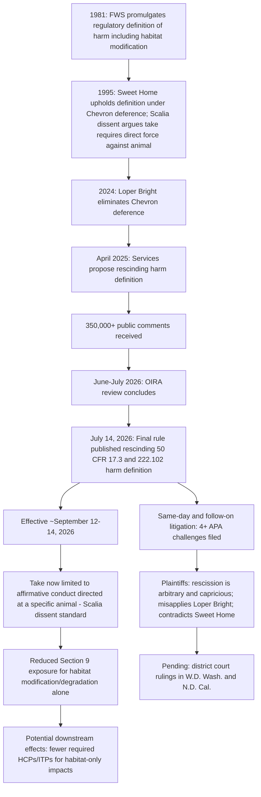

## The 2026 Rescission of the Regulatory Definition of "Harm" and Its Effect on Habitat Protection

### Overview and Timeline

On July 14, 2026, the U.S. Fish and Wildlife Service (FWS) and National Marine Fisheries Service (NMFS) jointly finalized a rule rescinding the regulatory definition of "harm" under the federal Endangered Species Act (ESA). The rulemaking followed a multi-year process: the Services published a final rule to rescind the definition of "harm" from their ESA implementing regulations, with the proposal originating from an April 17, 2025 rulemaking proposal to remove the definition. The Services jointly proposed to rescind their respective definitions of "harm" in April 2025 and received more than 350,000 comments with respect to their proposed actions. [FWS and NMFS Finalize Rule Rescinding ESA Definition of “Harm” | Stoel Rives Environmental Law +3](https://www.stoelrivesenvironmentallawblog.com/laws-and-regulations/esa/fws-and-nmfs-finalize-rule-rescinding-esa-definition-of-harm/)

**Key Points**

- The rescission removes the regulatory definition of "harm" from the Code of Federal Regulations (CFR) in Title 50 parts 17 and 222. [Federal Register](https://www.federalregister.gov/documents/2026/07/14/2026-14195/rescinding-the-definition-of-harm-under-the-endangered-species-act)
- The final rule was published under Docket No. FWS-HQ-ES-2025-0034 and Docket No. NMFS-250411-0064. [Substack](https://oteronativeplants.substack.com/p/new-rule-rescinding-the-definition)
- Sources show slightly differing effective dates in secondary reporting — most identify September 14, 2026 as the effective date, while at least one source states the rule would take effect 60 days after publication, on September 12, 2026. [Unverified: the exact effective date should be confirmed directly against the Federal Register text, as secondary sources report both September 12 and September 14, 2026.] [Somachlaw](https://somachlaw.com/policy-alert/federal-resource-agencies-rescind-longstanding-regulatory-definition-of-harm-under-the-endangered-species-act/)[Bracewell LLP](https://www.bracewell.com/resources/fws-and-nmfs-rescind-endangered-species-act-regulatory-definition-of-harm/)
- As of the current date (September 15, 2026), the rule has either just taken effect or is on the immediate cusp of taking effect, and litigation described below was already underway before the effective date arrived.

### What the Rule Does — and Does Not — Change

**Key Points**

- The only change in the final rule is the complete removal of the regulatory definition of "harm" at 50 CFR 17.3 and 222.102. The rescinded definition had stated that harm "means an act which actually kills or injures wildlife," and that "such act may include significant habitat modification or degradation where it actually kills or injures wildlife by significantly impairing essential behavioral patterns, including breeding, feeding or sheltering." [Policyinnovation](https://www.policyinnovation.org/insights/summary-of-the-final-rule-rescinding-the-definition-of-harm-from-endangered-species-act-regulations)[Policyinnovation](https://www.policyinnovation.org/insights/summary-of-the-final-rule-rescinding-the-definition-of-harm-from-endangered-species-act-regulations)
- The Services did not promulgate a replacement definition; instead, they explained that moving forward they will rely solely on the ESA's statutory text as interpreted by Justice Scalia in his Sweet Home dissent (see prior coverage of *Babbitt v. Sweet Home*, 515 U.S. 687 (1995), under Section 9's take prohibition). [Bracewell LLP](https://www.bracewell.com/resources/fws-and-nmfs-rescind-endangered-species-act-regulatory-definition-of-harm/)
- Under this view, "take" encompasses only affirmative conduct intentionally directed at a particular animal or animals, and the Services will not view habitat modification that results in indirect and accidental injury to a wildlife population as "take" within the meaning of the Act. [Bracewell LLP](https://www.bracewell.com/resources/fws-and-nmfs-rescind-endangered-species-act-regulatory-definition-of-harm/)[Bracewell LLP](https://www.bracewell.com/resources/fws-and-nmfs-rescind-endangered-species-act-regulatory-definition-of-harm/)
- The former "harm" definition — which indicated that, under certain circumstances, modifying the habitat of ESA-listed species could result in prohibited "take" — has for decades been the primary means by which the ESA impacts private activities. Following the effective date of the final rule, many activities that would have been regulated under the former definition may no longer be. [Endangeredspecieslawandpolicy](https://www.endangeredspecieslawandpolicy.com/agencies-rescind-harm-definition)[Endangeredspecieslawandpolicy](https://www.endangeredspecieslawandpolicy.com/agencies-rescind-harm-definition)
- The rescission does not eliminate ESA protections outright — direct take (hunting, shooting, trapping, killing, capturing) and the "harass" prohibition remain in force; what is removed is the specific habitat-modification pathway to take liability. [Greenbuildinglawupdate](https://www.greenbuildinglawupdate.com/2026/07/articles/codes-and-regulations/federal/federal-government-rescinds-the-meaning-of-harm-under-the-endangered-species-act/)

### Stated Agency Rationale

**Key Points**

- The agencies concluded that the prior regulation could not be reconciled with the "single, best meaning" of the statute, particularly after the Supreme Court's decision in *Loper Bright Enterprises v. Raimondo*, which rejected judicial deference to expansive agency interpretations of ambiguous statutes. [Greenbuildinglawupdate](https://www.greenbuildinglawupdate.com/2026/07/articles/codes-and-regulations/federal/federal-government-rescinds-the-meaning-of-harm-under-the-endangered-species-act/)
- The rescission was framed as restoring "the statute's plain meaning" and eliminating what the Services characterized as an "unauthorized expansion of the ESA." [Greenbuildinglawupdate](https://www.greenbuildinglawupdate.com/2026/07/articles/codes-and-regulations/federal/federal-government-rescinds-the-meaning-of-harm-under-the-endangered-species-act/)
- Proponents argued that under the former rule, a landowner could face years of permitting, biological studies, mitigation demands, and litigation over whether altering habitat might someday indirectly injure a protected species, and that such determinations were often subjective, expensive, and difficult to predict. [Greenbuildinglawupdate](https://www.greenbuildinglawupdate.com/2026/07/articles/codes-and-regulations/federal/federal-government-rescinds-the-meaning-of-harm-under-the-endangered-species-act/)
- The rule was presented as part of a broader shift toward textual statutory interpretation and more predictable environmental regulation, restoring focus to the words Congress enacted while preserving the Act's core prohibition against actually injuring or killing endangered wildlife. [Greenbuildinglawupdate](https://www.greenbuildinglawupdate.com/2026/07/articles/codes-and-regulations/federal/federal-government-rescinds-the-meaning-of-harm-under-the-endangered-species-act/)
- The Services determined that the rule qualifies for a categorical exclusion under NEPA (43 CFR 46.210(i)), pointing to two prior rulemakings addressing a regulatory definition of "habitat" that had found similar categorical exclusions applicable. [Federal Register](https://www.federalregister.gov/documents/2026/07/14/2026-14195/rescinding-the-definition-of-harm-under-the-endangered-species-act)

### The *Loper Bright* Argument, and Why Challengers Dispute It

**Key Points**

- The agencies' central legal theory rests on *Loper Bright Enterprises v. Raimondo* (2024), which eliminated *Chevron* deference and directs courts to determine the single best reading of a statute independently, rather than deferring to a reasonable agency interpretation.
- Plaintiffs argue that under the *Loper Bright* standard, it is courts, not agencies, that determine the single, best interpretation of the law, and that the rescission rule cannot be the best interpretation of "harm" because it is an interpretation the Supreme Court has already rejected — referring to the *Sweet Home* majority's rejection of the Scalia dissent's narrower reading in 1995. [Oklahoma Farm Report](https://www.oklahomafarmreport.com/2026/08/21/services-rescind-esa-definition-of-harm-face-lawsuits/)
- This creates an unusual doctrinal posture: the agencies are using a case about limiting agency deference (*Loper Bright*) to justify unilaterally adopting an interpretation that the Supreme Court, applying deference under the pre-*Loper Bright* regime, had already found permissible in *Sweet Home* — while critics contend the *Sweet Home* majority's own textual analysis (not just its deference holding) undercuts the rescission's premise. [Inference]

### Litigation Challenging the Rescission

Multiple lawsuits were filed immediately upon the rule's publication.

**Key Points**

- The same day the rescission rule was finalized, three federal lawsuits were filed to challenge the decision, with a fourth filed days after. [National Agricultural Law Center](https://nationalaglawcenter.org/services-rescind-esa-harm-definition-environmental-groups-file-suit/)
- Earthjustice, along with roughly half a dozen other environmental groups and Defenders of Wildlife, filed suit in federal district court in Seattle against FWS and NOAA Fisheries. The Center for Biological Diversity, Columbia Riverkeeper, Conservation Law Foundation, Conservation Northwest, Friends of the Wild Swan, Oregon Wild, Sierra Club, Swan View Coalition, and WildEarth Guardians filed a Complaint for Declaratory and Injunctive Relief in the U.S. District Court for the Western District of Washington, Seattle Division, against Douglas Burgum as Secretary of the Interior and other officials. [Yournec](https://www.yournec.org/the-rescission-of-harm-under-the-esa-will-do-substantial-harm/)[Substack](https://oteronativeplants.substack.com/p/new-rule-rescinding-the-definition)
- The Swinomish Indian Tribal Community and the Squaxin Island Tribe also filed a lawsuit, claiming that habitat degradation has been primarily responsible for the loss of salmon stocks in Puget Sound and that loss of long-standing habitat protection will injure the Tribes and their members. This case is captioned Swinomish Indian Tribal Cmty. v. Nat'l Marine Fisheries Serv. [Yournec](https://www.yournec.org/the-rescission-of-harm-under-the-esa-will-do-substantial-harm/)[National Agricultural Law Center](https://nationalaglawcenter.org/services-rescind-esa-harm-definition-environmental-groups-file-suit/)
- EPIC, Friends of the Shasta River, Cascadia Wildlands, Klamath Siskiyou Wildlands Center, a fishing guide, and the Western Environmental Law Center filed a separate case in the U.S. District Court for the Northern District of California, naming NMFS, FWS, Secretary Burgum, and Secretary of Commerce Howard Lutnick as defendants. [Yournec](https://www.yournec.org/the-rescission-of-harm-under-the-esa-will-do-substantial-harm/)
- All four known lawsuits claim that the rescission violates the Administrative Procedure Act (APA) and ask that the rule be overturned, alleging that the Services did not provide a "reasonable rationale" for the rescission and that the action is "arbitrary and capricious" because its sole stated justification rests on an improper interpretation of *Loper Bright*. [Oklahoma Farm Report](https://www.oklahomafarmreport.com/2026/08/21/services-rescind-esa-definition-of-harm-face-lawsuits/)
- The lawsuits allege that the agencies' action conflicts with decades of ESA implementation and judicial precedent recognizing that habitat destruction can effectively injure or kill species by impairing breeding, feeding, sheltering, and other essential life functions, and that the agencies failed to comply with APA and NEPA requirements in adopting the revised interpretation. [CSG Law](https://www.csglaw.com/newsroom/csg-law-environmental-blog-federal-rollback-of-esa-harm-definition-could-reshape-federal-project-permitting/)
- An Earthjustice attorney was quoted stating that the agencies "haven't explained themselves adequately," and that "making this kind of dramatic change doesn't make any legal sense because it goes against the fundamental purpose and spirit of the statute itself," calling it "an unreasoned and unreasonable decision." [Yournec](https://www.yournec.org/the-rescission-of-harm-under-the-esa-will-do-substantial-harm/)

### Anticipated Practical Effects on Habitat Protection

**Key Points**

- If the rescission is upheld, project proponents may face fewer ESA restrictions where activities affect habitat but do not directly injure individual protected animals — narrowing the scope of Section 9 liability essentially back to the *Sweet Home* dissent's "affirmative conduct directed at a particular animal" standard. [CSG Law](https://www.csglaw.com/newsroom/csg-law-environmental-blog-federal-rollback-of-esa-harm-definition-could-reshape-federal-project-permitting/)
- If the challengers prevail, courts could restore the broader interpretation of "harm," preserving the habitat-based protections that have long been applied in ESA enforcement and permitting decisions. [CSG Law](https://www.csglaw.com/newsroom/csg-law-environmental-blog-federal-rollback-of-esa-harm-definition-could-reshape-federal-project-permitting/)
- Because the pre-2026 "harm" definition was the doctrinal basis for the entire line of habitat-modification take theory discussed in *Palila*, *Sweet Home*, and their progeny (see the separate treatment of Section 9's take prohibition), its rescission directly affects the analytical framework by which Habitat Conservation Plans (HCPs) and Incidental Take Permits are evaluated — a project causing only indirect habitat-based injury may no longer require an ITP at all, since no "take" would be implicated. [Inference]
- Effects are expected to fall most heavily on species whose primary threat is habitat degradation rather than direct killing or capture (e.g., aquatic and anadromous species affected by water diversions, temperature changes, or sedimentation; species affected by land conversion or resource extraction) — the Tribal plaintiffs' salmon-habitat claims illustrate this category directly. [Inference]
- The rescission does not eliminate ESA protections; consultation obligations under Section 7 for federal actions, listing and critical habitat designation processes under Section 4, and direct-take prohibitions under Section 9 remain independently in force, meaning the practical effect is concentrated specifically on the habitat-modification theory of "harm" rather than the ESA's protective framework as a whole. [Greenbuildinglawupdate](https://www.greenbuildinglawupdate.com/2026/07/articles/codes-and-regulations/federal/federal-government-rescinds-the-meaning-of-harm-under-the-endangered-species-act/)

### Relationship to Other Concurrent 2026 ESA Regulatory Changes

The "harm" rescission did not occur in isolation; it was one of several 2026 regulatory actions affecting ESA implementation.

**Key Points**

- On June 5, 2026, the White House Office of Information and Regulatory Affairs concluded review of two other ESA rules: one that would remove the blanket Section 4(d) rule (which had automatically extended take prohibitions to threatened species absent a species-specific rule) and one addressing regulations for designating critical habitat. [Harvard](https://eelp.law.harvard.edu/tracker/endangered-species-act-regulations/)
- Separately, in March 2026, the Endangered Species Committee ("God Squad") voted unanimously to exempt oil and gas drilling activity in the Gulf of Mexico from ESA restrictions, relying on the exemption provision discussed in the Committee exemption process — a decision that itself faces a legal challenge. [Harvard](https://eelp.law.harvard.edu/tracker/endangered-species-act-regulations/)
- The Judicial Panel on Multidistrict Litigation consolidated challenges to the administration's use of the Endangered Species Committee process into the Fifth Circuit, in *American Energy Association v. Burgum* and a consolidated D.C. Circuit case, *Natural Resources Defense Council, Inc. v. Douglas Burgum*. [Harvard](https://eelp.law.harvard.edu/tracker/endangered-species-act-regulations/)
- Taken together, these actions represent a coordinated set of regulatory and administrative moves narrowing multiple distinct pathways of ESA protection (habitat-based take liability, blanket threatened-species protections, critical habitat designation criteria, and use of the Committee exemption process) within the same calendar year. [Inference]

### Procedural and Doctrinal Diagram

### Comparison: Pre-Rescission vs. Post-Rescission "Harm" Standard

| Element | Pre-Rescission (1981–2026) | Post-Rescission (2026– ) |
| --- | --- | --- |
| Definition source | 50 C.F.R. § 17.3 / § 222.102 regulatory text | No regulatory definition; statutory text as construed by Scalia's *Sweet Home* dissent |
| Habitat modification | Could constitute "harm" if it actually killed/injured wildlife via impaired breeding, feeding, sheltering | Not considered "take" absent affirmative conduct directed at a specific animal |
| Governing precedent | *Babbitt v. Sweet Home* majority (*Chevron* deference to agency definition) | Agencies' own post-*Loper Bright* statutory interpretation, contested in litigation |
| Causation requirement | Proximate cause + foreseeability (O'Connor concurrence) between habitat act and actual injury | Largely moot for habitat-only claims, since habitat modification alone is not "take" |
| Legal status as of Sept. 15, 2026 | N/A (rescinded) | In effect or about to take effect, subject to active APA litigation seeking vacatur |

### Practical Guidance for Practitioners During the Litigation Period

**Key Points**

- Entities undertaking projects with potential impacts to listed species or their habitat should continue to evaluate ESA obligations carefully and remain attentive to further judicial and regulatory developments, since the rule's ultimate survival is contested and a court could vacate or stay it. [Somachlaw](https://somachlaw.com/policy-alert/federal-resource-agencies-rescind-longstanding-regulatory-definition-of-harm-under-the-endangered-species-act/)
- Given active litigation seeking vacatur, project proponents relying on the narrowed "harm" standard face residual legal risk if a reviewing court restores the prior definition, particularly for projects with long permitting or construction timelines that span the litigation period. [Inference]
- Because the rescission does not alter direct-take prohibitions, Section 7 consultation obligations for federally-nexused actions, or listing/critical-habitat processes, practitioners should evaluate each of those pathways independently rather than assuming broad deregulation across the entire statute. [Inference]

*(As this is an active and rapidly evolving regulatory and litigation matter as of the current date, practitioners should verify the current procedural posture — including any preliminary injunctions, stays, or rulings on the merits — directly against the applicable district court dockets and the Federal Register before relying on the status described here.)* [Unverified]

**Related Topics**

- Section 9's take prohibition and the historical scope of "harm" (foundational doctrine now under revision)
- *Babbitt v. Sweet Home Chapter of Communities for a Great Oregon* and the *Chevron*/*Loper Bright* deference shift
- Habitat Conservation Plans and Incidental Take Permits (downstream effects of a narrowed "harm" standard)
- The Endangered Species Committee exemption process and its 2026 use for Gulf of Mexico drilling
- Proposed removal of the Section 4(d) blanket rule for threatened species
- Proposed changes to critical habitat designation regulations
- Administrative Procedure Act "arbitrary and capricious" review standards for rule rescissions
- *Loper Bright Enterprises v. Raimondo* and post-*Chevron* administrative law