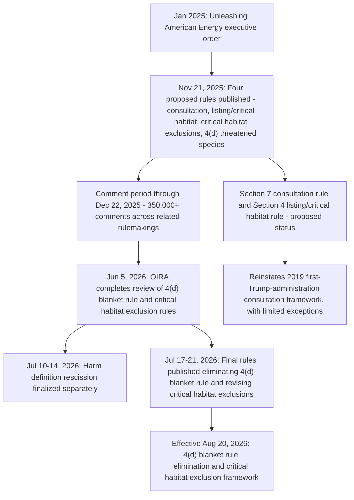

## The 2025 to 2026 Rollback of Section 4 Listing and Section 7 Consultation Regulations

### Overview and Regulatory Context

Beginning in late 2025, the U.S. Fish and Wildlife Service (FWS) and National Marine Fisheries Service (NMFS) undertook a coordinated, multi-rule effort to revise Endangered Species Act (ESA) implementing regulations governing Section 4 (listing, delisting, critical habitat, threatened-species protections) and Section 7 (interagency consultation). The stated approach, to a substantial extent, was to return to the regulations put in place by the first Trump Administration and thereby undo changes made by the Biden Administration, primarily through 2024 rulemakings.

**Key Points**

- On November 21, 2025, FWS and NMFS published four proposed rules in the Federal Register addressing: (1) interagency consultation procedures under Section 7; (2) listing, delisting, and critical habitat determinations under Section 4; (3) critical habitat exclusions under Section 4(b)(2); and (4) threatened species protections under Section 4(d).
- The proposed rules relied heavily on *Loper Bright Enterprises v. Raimondo* as justification, with agencies arguing the changes better reflect the "best reading" of the ESA's statutory text rather than a policy-driven reinterpretation entitled to judicial deference.
- The administration also cited the "Unleashing American Energy" executive order issued in January 2025 as a catalyst for reconsidering the Biden-era rules.
- The initial public comment period ran through December 22, 2025; multiple stakeholders requested an extension, which the Services did not grant.

### Timeline of Key Actions

**Note:** [Unverified] Public reporting through the search results reviewed confirms final action on the Section 4(d) blanket-rule rule and the critical habitat exclusion rule (both effective August 20, 2026), and on the separate "harm" definition rescission (effective September 2026). The finalization status of the Section 7 interagency consultation rule and the Section 4 listing/critical-habitat-determination rule (50 C.F.R. § 424) specifically, as opposed to remaining in proposed form, should be verified against the current Federal Register and FWS regulatory tracker, since available sources describe them primarily as proposed rules as of the most recent reporting reviewed.

### Component 1: Elimination of the Section 4(d) "Blanket Rule"

Section 4(d) of the ESA authorizes FWS/NMFS to issue regulations considered "necessary and advisable" for the conservation of threatened species, including extending some or all of Section 9's endangered-species prohibitions to a given threatened species.

**Key Points**

- Historically, Section 9 prohibitions do not automatically apply to threatened species; a species-specific Section 4(d) rule is required to extend such prohibitions.
- Under a "blanket rule" adopted late in the Biden Administration (2024), most Section 9-type endangered-species protections applied automatically to newly listed threatened species by default, unless FWS adopted a species-specific exception.
- The final rule published July 21, 2026 (effective August 20, 2026) eliminates this blanket-rule default. Species newly listed as threatened, or reclassified from endangered to threatened, after August 20, 2026 will receive only the protections established through a species-specific Section 4(d) rule, rather than automatic endangered-species-equivalent protections.
- This change aligns FWS's approach with NMFS's longstanding practice, which has historically relied on species-specific 4(d) rules rather than a blanket default.
- Future species-specific 4(d) rules must include a determination that the protections are "necessary and advisable" for the species' conservation, and that determination must consider both conservation and economic impacts.
- The rule is explicitly prospective: it does not remove protections from species already listed as threatened before the effective date, and existing blanket-rule and species-specific protections for currently listed species remain in place unless FWS separately revises them through a distinct rulemaking.
- The docket number for this rule is FWS-HQ-ES-2025-0029.

**Example**

If a new freshwater mussel species is listed as threatened on September 1, 2026, it will not automatically receive the full suite of Section 9 take, possession, and commerce prohibitions that would apply to an endangered species. Instead, FWS must issue a species-specific 4(d) rule determining which particular prohibitions (e.g., take prohibition, but perhaps not commercial-activity restrictions) are "necessary and advisable" for that species' conservation, weighing both biological and economic considerations, before any such prohibitions take legal effect.

### Component 2: Revisions to Critical Habitat Exclusion Criteria (Section 4(b)(2))

**Key Points**

- A companion final rule, also published July 21, 2026 and effective August 20, 2026, creates an FWS-specific framework for deciding whether to exclude particular areas from critical habitat designations under Section 4(b)(2).
- Section 4(b)(2) requires FWS to consider the economic impact, national security impact, and other relevant impacts of designating a particular area as critical habitat, and permits exclusion of an area if the Secretary determines the benefits of exclusion outweigh the benefits of designation, unless exclusion would result in extinction of the species.
- The proposed version of this rule sought to reintroduce criteria providing that it may not be prudent to designate critical habitat where threats to a species' habitat leading to its listed status stem solely from causes that cannot be addressed through management actions identified in a Section 7(a)(2) consultation (e.g., diffuse climate-driven habitat threats not tied to a specific consultable federal action).
- The proposed rules also addressed the designation of unoccupied areas as critical habitat, an issue with independent doctrinal significance following *Weyerhaeuser Co. v. U.S. Fish and Wildlife Service*, 586 U.S. 9 (2018), which held that an area must first qualify as "habitat" before it can be designated as unoccupied critical habitat.
- The docket number associated with this rule is FWS-HQ-ES-2025-0048.

### Component 3: Section 7 Interagency Consultation Rule (Return to 2019 Framework)

**Key Points**

- The proposed rule addressing interagency consultation would replace the consultation regulations issued under the Biden Administration in 2024 with the framework that existed in 2019 (adopted during the first Trump Administration), with limited exceptions.
- Section 7 requires federal agencies to consult with FWS or NMFS to ensure that any action authorized, funded, or carried out by the agency is not likely to jeopardize the continued existence of a listed species or result in destruction or adverse modification of critical habitat.
- The 2025 proposed changes reportedly include revisions to definitions and analytical steps governing interagency consultation, including revisiting the definition of "environmental baseline" and related analytical concepts used in Biological Opinions (specifics of the definitional changes were still working through the rulemaking process as of the most recent reporting reviewed). [Unverified]
- Stakeholder critics, in comments and correspondence opposing the rulemakings, emphasized that Section 7 consultations are typically completed in approximately two weeks for informal review and two months for formal review, and that only approximately 0.3% of federal projects were halted between 2010 and 2017 due to the consultation process — arguments used to contest the administration's framing of consultation as an undue regulatory burden. [Note: these figures represent one side's advocacy framing in opposition correspondence, not independently verified agency statistics; presented here as a documented position rather than an established fact.] [Unverified]

### Component 4: Section 4 Listing, Delisting, and Critical Habitat Determination Rule

**Key Points**

- A separate proposed rule addresses regulations governing listing, delisting, and critical habitat determinations under Section 4 generally (50 C.F.R. Part 424), distinct from the 4(d) threatened-species-protection rule and the 4(b)(2) exclusion-criteria rule.
- Critics characterized the package of proposed rules as narrowing protections for newly listed species, altering the approach to considering factors relevant to listing decisions, and potentially making it more difficult to designate critical habitat or list species in the first instance.
- The proposed revisions across this rule and the consultation rule were described by the agencies as prospective in nature, meaning they would not affect currently listed species or already-finalized critical habitat designations, but would govern future listing decisions and consultations going forward.

### Stakeholder and Congressional Opposition

**Key Points**

- A group of congressional members sent a letter dated January 16, 2026 to Interior Secretary Doug Burgum and Commerce Secretary Howard Lutnick expressing opposition to the four proposed rules (referencing docket numbers FWS-HQ-ES-2025-0029, -0039, -0044, and -0048), characterizing them as sweeping changes that would fundamentally weaken the nation's wildlife conservation framework.
- The letter argued that the ESA has prevented more than 99% of listed species from going extinct and has helped many move toward recovery, and urged the Services to withdraw the proposed rulemakings.
- Environmental organizations, including Defenders of Wildlife, issued statements characterizing the proposed rollbacks as risking accelerated extinction for vulnerable wildlife.
- Some states, including California, began evaluating state-level regulatory responses (e.g., under the California Endangered Species Act) to fill anticipated gaps in federal protection, with at least one state legislative measure (A.B. 1319, 2025–2026 Reg. Sess.) referenced in connection with this dynamic.

### Relationship to the "Harm" Definition Rescission and the Broader 2026 Regulatory Package

**Key Points**

- These Section 4 and Section 7 rule changes proceeded on a parallel but distinct track from the separate rescission of the regulatory definition of "harm" under Section 9, finalized July 14, 2026 and effective in September 2026, which was based on a different docket (FWS-HQ-ES-2025-0034 / NMFS-250411-0064).
- Collectively, industry-side commentary characterized the combined set of 2025–2026 actions (harm rescission, 4(d) blanket rule elimination, critical habitat exclusion revision, and the pending Section 4/Section 7 rules) as "potentially one of the most consequential shifts in ESA implementation in years," reflecting a coordinated agency strategy of applying *Loper Bright*-based statutory reinterpretation across multiple regulatory fronts simultaneously. [Inference, drawing on the framing used in industry legal commentary rather than a neutral empirical assessment]
- Because these are independent rulemakings on separate legal tracks and timelines, practitioners must track each rule's individual status (proposed, final, effective date, and any litigation) separately rather than treating the "rollback" as a single unified regulatory action.

### Comparative Summary Table

| Rule Component | CFR Provision | Status (as of reporting reviewed) | Effective Date |
| --- | --- | --- | --- |
| Section 4(d) blanket rule elimination | 50 C.F.R. Part 17 (threatened species) | Final | August 20, 2026 |
| Critical habitat exclusion framework | 50 C.F.R. § 424 / Section 4(b)(2) | Final | August 20, 2026 |
| Section 7 interagency consultation (2019 framework restoration) | 50 C.F.R. Part 402 | Proposed as of late 2025 reporting; finalization status should be verified | Not confirmed in sources reviewed [Unverified] |
| Section 4 listing/delisting/critical habitat determinations | 50 C.F.R. § 424 (general listing provisions) | Proposed as of late 2025 reporting; finalization status should be verified | Not confirmed in sources reviewed [Unverified] |
| Section 9 "harm" definition rescission (related, separate track) | 50 C.F.R. §§ 17.3, 222.102 | Final | September 2026 (effective date reported variously as Sept. 12 or Sept. 14) |

### Practical Implications for Practitioners

**Key Points**

- For any project involving a threatened species listed or reclassified after August 20, 2026, practitioners must read the listing decision together with its accompanying species-specific Section 4(d) rule to determine which conduct is prohibited, rather than assuming default endangered-species-equivalent protections apply.
- The rule changes do not automatically remove Section 7 consultation obligations, Section 10 permitting requirements, or independent state-law requirements (such as under state-level endangered species acts) — project teams should confirm which regulatory framework (pre- or post-rollback) governs each species and each federal nexus involved in a given project.
- Given the prospective nature of most of these changes, projects involving species listed before the relevant effective dates should generally continue to apply the pre-existing regulatory framework unless and until FWS separately revises protections for that specific, already-listed species.
- As with the "harm" rescission, several of these rules may be subject to litigation risk given their reliance on a contested application of *Loper Bright* and their reversal of relatively recent Biden-era rules; practitioners should monitor for legal challenges analogous to those filed against the harm-definition rescission. [Inference]

**Related Topics**

- The 2026 rescission of the regulatory definition of "harm" and its effect on habitat protection
- Section 9's take prohibition and the historical scope of "harm"
- Habitat conservation plans and incidental take permits
- The Endangered Species Committee exemption process
- *Weyerhaeuser Co. v. U.S. Fish and Wildlife Service* and unoccupied critical habitat
- *Loper Bright Enterprises v. Raimondo* and the end of *Chevron* deference in environmental rulemaking
- State-level endangered species statutes as a backstop to federal deregulation (e.g., California Endangered Species Act)
- Administrative Procedure Act challenges to rule rescissions and reversals of prior administration rulemakings