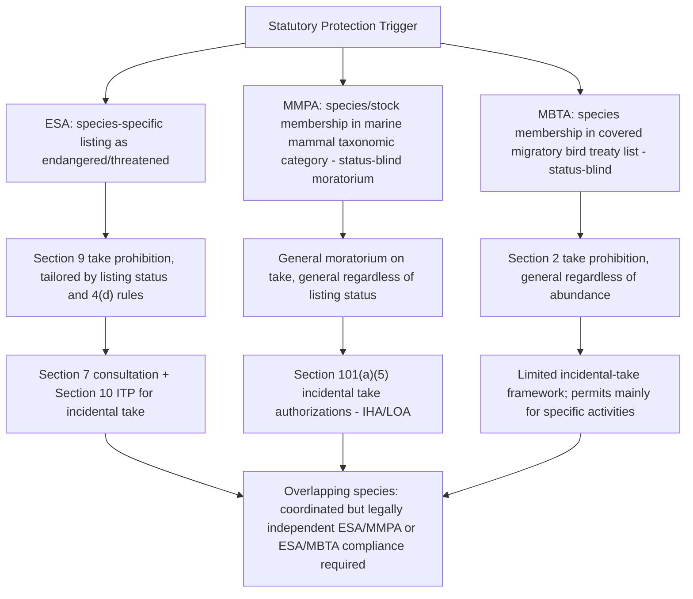

## Related Wildlife Statutes: The Migratory Bird Treaty Act, the Marine Mammal Protection Act, and the Lacey Act

### Overview and Relationship to the ESA

The Endangered Species Act does not operate in isolation. Three older or independently structured federal wildlife statutes — the Migratory Bird Treaty Act (MBTA), the Marine Mammal Protection Act (MMPA), and the Lacey Act — provide overlapping, complementary, and in some cases more stringent protections for categories of species that may or may not also be ESA-listed.

**Key Points**

- These statutes are frequently invoked together with the ESA in enforcement actions, permitting analyses, and Section 7 consultations, because a single project or activity (e.g., wind energy development, commercial fishing, wildlife trade) can implicate all four statutes simultaneously.
- Unlike the ESA, which is species-status-driven (endangered/threatened listing triggers protection), the MBTA and MMPA protect entire taxonomic categories (migratory birds; marine mammals) regardless of individual species' extinction risk.
- The Lacey Act is structurally different from the other three: it is primarily a trafficking and enforcement-multiplier statute that incorporates violations of other federal, state, tribal, and foreign wildlife laws, rather than an independent source of primary conduct prohibitions tied to a specific taxonomic group.

### The Migratory Bird Treaty Act (MBTA)

**Statutory Basis and Purpose**

Enacted in 1918 (16 U.S.C. §§ 703–712) to implement bilateral treaty obligations with Great Britain (for Canada), later extended through additional treaties with Mexico, Japan, and Russia, the MBTA protects migratory bird species covered by these international conventions.

**Key Points**

- Section 2 (16 U.S.C. § 703) makes it unlawful, except as permitted by regulation, to "pursue, hunt, take, capture, kill, attempt to take, capture or kill, possess, offer for sale, sell, offer to purchase, purchase, deliver for shipment, ship, export, import, cause to be shipped, exported, or imported, deliver for transportation, transport or cause to be transported... any migratory bird, any part, nest, or egg of any such bird."
- Coverage extends to over 1,000 native bird species listed in regulations at 50 C.F.R. § 10.13, encompassing the vast majority of native North American bird species (songbirds, raptors, waterfowl, shorebirds), regardless of individual species' conservation status.
- Unlike the ESA, protection under the MBTA does not depend on a species being rare or declining — common species (e.g., red-tailed hawks, mallards) receive the same baseline take prohibition as rare ones.

**The "Incidental Take" Circuit Split and 2021 Regulatory History**

A major recurring doctrinal question is whether the MBTA's take prohibition extends to incidental, unintentional killing of birds resulting from otherwise lawful activity (e.g., birds killed by oil pit exposure, wind turbine strikes, or communication tower collisions), as opposed to only purposeful hunting/trapping conduct.

**Key Points**

- Circuits have historically split: some circuits (e.g., the Tenth Circuit in *United States v. Apollo Energies*) have held incidental take can violate the MBTA under certain circumstances, while others (e.g., the Fifth Circuit in *United States v. CITGO Petroleum Corp.* and related precedent) have required a more direct nexus between the defendant's conduct and bird deaths.
- A 2017 Department of the Interior Solicitor's Opinion (M-37050) took the position that the MBTA's prohibitions apply only to affirmative, purposeful actions (hunting, poaching, trapping) and not to incidental take from otherwise lawful commercial activity; a subsequent 2021 rulemaking attempted to codify this narrower interpretation, which was challenged and the underlying opinion was withdrawn/reversed following a change in administration.
- Given the pattern of ESA-related deregulatory activity in 2025–2026 discussed in this chapter, practitioners should verify the current regulatory status of MBTA incidental-take interpretation directly against current FWS guidance and any recent rulemaking, as this is a historically unstable area subject to administration-driven reinterpretation. [Unverified — current as of Claude's training data and not independently re-verified via search for this specific sub-issue in this response]

**Permits**

- FWS issues permits under 50 C.F.R. Part 21 for otherwise-prohibited activities, including scientific collecting, falconry, depredation control, and special purpose permits.
- No general incidental-take permit analogous to ESA Section 10 has historically existed for the MBTA, contributing to the practical significance of the incidental-take interpretive dispute described above.

**Example**

A wind energy developer siting turbines in a raptor migration corridor may need to evaluate MBTA exposure (for turbine-strike mortality of eagles, hawks, and other protected migratory birds) separately from any ESA analysis, since many raptor species affected are not ESA-listed but remain fully protected under the MBTA's take prohibition.

### The Bald and Golden Eagle Protection Act (Related Companion Statute)

**Key Points**

- Though not one of the three statutes specifically named in this topic, the Bald and Golden Eagle Protection Act (16 U.S.C. §§ 668–668d) is frequently discussed alongside the MBTA because it provides a heightened, eagle-specific take prohibition and permit system (50 C.F.R. § 22), including specific incidental-take permits for eagles that function similarly in structure to ESA Section 10 permits — a notable contrast to the MBTA's general lack of an incidental-take permit mechanism.

### The Marine Mammal Protection Act (MMPA)

**Statutory Basis and Purpose**

Enacted in 1972 (16 U.S.C. §§ 1361–1423h), the MMPA establishes a moratorium on the "take" of marine mammals in U.S. waters and by U.S. citizens on the high seas, reflecting a precautionary, population-management-oriented approach distinct from the ESA's extinction-risk-based listing system.

**Key Points**

- The MMPA's definition of "take" (16 U.S.C. § 1362(13)) means "to harass, hunt, capture, or kill, or attempt to harass, hunt, capture, or kill any marine mammal" — narrower in its enumerated verbs than the ESA's take definition but historically interpreted to include significant incidental harassment.
- Jurisdiction is split: NMFS (National Marine Fisheries Service) administers the MMPA for cetaceans (whales, dolphins, porpoises) and pinnipeds other than walrus; FWS administers it for walrus, sea otters, polar bears, and manatees/dugongs.
- The Act applies a moratorium-based approach: take is presumptively prohibited for all marine mammal species and stocks, not merely those facing extinction risk, reflecting Congress's stated concern that some species and population stocks "may be, or are in danger of being, diminished to the extent that they are or may become endangered."

**Key Definitional Concepts**

- **Level A vs. Level B Harassment:** MMPA regulations distinguish "Level A harassment" (has the potential to injure a marine mammal or marine mammal stock in the wild) from "Level B harassment" (has the potential to disturb a marine mammal or stock by causing disruption of behavioral patterns, without a potential to injure).
- **Stock:** The MMPA's core management unit is the "population stock" — a group of marine mammals of the same species or smaller taxonomic unit in a common spatial arrangement — rather than the species as a whole, allowing for more geographically granular management than the ESA's species/subspecies/DPS framework.
- **Optimum Sustainable Population (OSP):** The MMPA's management goal for a stock, defined by reference to the size that results in the maximum productivity of the population or species, keeping in mind the optimum carrying capacity of the habitat and the health of the ecosystem.
- **Depleted:** A stock designation under the MMPA (16 U.S.C. § 1362(1)) indicating the stock is below its OSP, triggering heightened management obligations, conceptually parallel to but legally distinct from ESA listing.

**Incidental Take Authorizations**

- Sections 101(a)(5)(A)-(D) of the MMPA (16 U.S.C. § 1371(a)(5)) authorize NMFS/FWS to issue incidental take authorizations for specified activities (e.g., oil and gas exploration, offshore wind construction, military sonar training, seismic surveys) causing incidental, not intentional, take of small numbers of marine mammals, provided the taking will have a negligible impact on the affected species or stock and will not have an unmitigable adverse impact on subsistence uses.
- These authorizations function analogously to ESA Section 10 Incidental Take Permits and Section 7 Incidental Take Statements but operate under the MMPA's own statutory and regulatory framework (50 C.F.R. Part 216 and related NMFS/FWS regulations) rather than under the ESA.
- Two primary authorization types exist: **Incidental Harassment Authorizations (IHAs)** (one-year duration, for activities involving only harassment-level take) and **Letters of Authorization (LOAs)** issued under longer-term (up to five-year) regulations for activities that may cause mortality or serious injury in addition to harassment.

**Overlap with the ESA**

**Key Points**

- Many marine mammal species are both MMPA-protected and ESA-listed (e.g., North Atlantic right whale, several Distinct Population Segments of humpback whale, various pinniped species). For these species, an activity typically requires both an MMPA incidental take authorization and, where the action has a federal nexus, a favorable ESA Section 7 consultation and Incidental Take Statement — the two processes are often coordinated but remain legally independent requirements.
- The MMPA does not include a habitat-modification-based "harm" theory analogous to the pre-2026 ESA "harm" regulation; its focus remains on direct harassment, injury, and mortality of individual animals within the moratorium framework, which somewhat insulates it from the doctrinal upheaval affecting ESA Section 9 discussed elsewhere in this chapter. [Inference]

### Comparative Structure: MBTA vs. MMPA vs. ESA

### The Lacey Act

**Statutory Basis and Purpose**

Originally enacted in 1900 and substantially amended over time (most recently and significantly by the 2008 Farm Bill amendments extending coverage to plants), the Lacey Act (16 U.S.C. §§ 3371–3378) is the oldest federal wildlife protection statute in the United States and functions as an enforcement-multiplier and trafficking-control statute rather than a primary source of take prohibitions.

**Key Points**

- The Lacey Act's core prohibition makes it unlawful to import, export, transport, sell, receive, acquire, or purchase in interstate or foreign commerce any fish, wildlife, or plant taken, possessed, transported, or sold in violation of any underlying federal, state, tribal, or foreign law.
- This structure means the Lacey Act does not itself define what conduct constitutes illegal taking; it "borrows" the underlying illegality from another law (which may be the ESA, the MBTA, the MMPA, a state game law, a foreign nation's wildlife law, or CITES implementing regulations) and adds an independent federal trafficking offense on top of that underlying violation.
- The Act therefore functions as a powerful cross-jurisdictional enforcement tool: conduct that is illegal only under state or foreign law can become a federal felony if it also involves interstate or foreign commerce in the unlawfully taken specimen.

**Key Provisions**

- **False labeling prohibition:** Independently makes it unlawful to submit false records, labels, or identification for fish, wildlife, or plants moving through interstate or foreign commerce, regardless of whether the underlying take was otherwise illegal.
- **Plant coverage (2008 amendment):** Extended coverage to plants and plant products, including timber and paper products, requiring import declarations for certain plant products and creating significant compliance obligations for the timber, furniture, and paper industries regarding sourcing from countries with weak forestry law enforcement.
- **Knowledge/intent standards:** Criminal penalties generally require that the person knew or, in the exercise of due care, should have known the wildlife/plant was taken, possessed, transported, or sold in violation of underlying law; civil penalties can apply on a stricter, lower-knowledge standard.

**Penalties**

- Felony violations (knowing violation of the underlying law, involving goods with a market value exceeding $350) can result in fines up to $250,000 for individuals ($500,000 for organizations) and imprisonment up to five years.
- Misdemeanor violations and civil penalties apply to lesser degrees of culpability or lower-value goods.

**Relationship to the ESA, MBTA, and MMPA**

**Key Points**

- The Lacey Act is frequently charged in tandem with ESA, MBTA, or MMPA violations because it converts what might otherwise be a lower-penalty or civil-only violation of the underlying wildlife statute into an independent federal offense carrying its own (often more severe) penalty structure, particularly where interstate or international commerce is involved.
- A common enforcement pattern: illegal take of an ESA-listed species under Section 9 combined with interstate transport or sale of that specimen creates independent liability exposure under both the ESA itself and the Lacey Act.
- The Act's foreign-law incorporation provision is particularly significant for international wildlife trafficking: a specimen taken in violation of a foreign country's wildlife protection law (even where no U.S. law would have independently prohibited the underlying taking) can support a Lacey Act prosecution once it enters U.S. interstate or foreign commerce.

**Example**

An importer knowingly brings into the United States reptile specimens collected in violation of a foreign country's wildlife export restrictions. Even though no U.S. statute directly prohibited the foreign collection itself, the act of importing and later selling those specimens in interstate commerce, knowing they were unlawfully taken under the foreign country's law, constitutes an independent federal Lacey Act violation — separate from any CITES-based prohibition that might also apply.

### Comparative Enforcement Structure Diagram

<svg xmlns="http://www.w3.org/2000/svg" viewBox="0 0 800 320">
<text x="400" y="25" font-size="16" font-weight="bold" text-anchor="middle" fill="#1a1a1a">Lacey Act as Enforcement Multiplier (svg_diagram)</text>
<rect x="30" y="60" width="180" height="50" rx="6" fill="#dbeafe" stroke="#1e40af" />
<text x="120" y="80" font-size="11" text-anchor="middle" fill="#1e3a8a">ESA Section 9</text>
<text x="120" y="95" font-size="11" text-anchor="middle" fill="#1e3a8a">take violation</text>
<rect x="30" y="130" width="180" height="50" rx="6" fill="#dbeafe" stroke="#1e40af" />
<text x="120" y="150" font-size="11" text-anchor="middle" fill="#1e3a8a">MBTA Section 2</text>
<text x="120" y="165" font-size="11" text-anchor="middle" fill="#1e3a8a">take violation</text>
<rect x="30" y="200" width="180" height="50" rx="6" fill="#dbeafe" stroke="#1e40af" />
<text x="120" y="220" font-size="11" text-anchor="middle" fill="#1e3a8a">MMPA moratorium</text>
<text x="120" y="235" font-size="11" text-anchor="middle" fill="#1e3a8a">take violation</text>
<rect x="30" y="270" width="180" height="40" rx="6" fill="#dbeafe" stroke="#1e40af" />
<text x="120" y="295" font-size="11" text-anchor="middle" fill="#1e3a8a">State/tribal/foreign law violation</text>
<line x1="210" y1="85" x2="330" y2="170" stroke="#333" marker-end="url(#arrow3)" />
<line x1="210" y1="155" x2="330" y2="175" stroke="#333" marker-end="url(#arrow3)" />
<line x1="210" y1="225" x2="330" y2="180" stroke="#333" marker-end="url(#arrow3)" />
<line x1="210" y1="290" x2="330" y2="185" stroke="#333" marker-end="url(#arrow3)" />
<rect x="340" y="140" width="200" height="80" rx="6" fill="#fef3c7" stroke="#b45309" />
<text x="440" y="165" font-size="11" text-anchor="middle" fill="#78350f">Interstate or foreign</text>
<text x="440" y="180" font-size="11" text-anchor="middle" fill="#78350f">commerce in the</text>
<text x="440" y="195" font-size="11" text-anchor="middle" fill="#78350f">unlawfully taken</text>
<text x="440" y="210" font-size="11" text-anchor="middle" fill="#78350f">specimen</text>
<line x1="540" y1="180" x2="620" y2="180" stroke="#333" marker-end="url(#arrow3)" />
<rect x="630" y="140" width="150" height="80" rx="6" fill="#fee2e2" stroke="#b91c1c" />
<text x="705" y="165" font-size="11" text-anchor="middle" fill="#7f1d1d">Independent</text>
<text x="705" y="180" font-size="11" text-anchor="middle" fill="#7f1d1d">federal Lacey Act</text>
<text x="705" y="195" font-size="11" text-anchor="middle" fill="#7f1d1d">liability</text>
<text x="705" y="210" font-size="11" text-anchor="middle" fill="#7f1d1d">(civil/criminal)</text>
</svg>

### Comparative Summary Table

| Feature | ESA | MBTA | MMPA | Lacey Act |
| --- | --- | --- | --- | --- |
| Trigger for protection | Species/DPS listing as endangered or threatened | Membership in covered migratory bird treaty list | Membership in marine mammal taxonomic category | Violation of an underlying wildlife law (federal, state, tribal, or foreign) |
| Core prohibition | Take (harass, harm, pursue, hunt, shoot, wound, kill, trap, capture, collect) | Pursue, hunt, take, capture, kill, possess, sell, transport | Harass, hunt, capture, kill (moratorium-based) | Import/export/transport/sell wildlife or plants taken in violation of another law; false labeling |
| Habitat protection theory | Historically included habitat modification via "harm" (now rescinded, 2026) | No general habitat-modification take theory | No general habitat-modification take theory | Not applicable (derivative statute) |
| Incidental take mechanism | Section 7 ITS; Section 10 ITP/HCP | Limited; historically unsettled, no general ITP | Section 101(a)(5) IHA/LOA | Not applicable |
| Administering agency | FWS (terrestrial/freshwater); NMFS (marine) | FWS | NMFS (cetaceans/most pinnipeds); FWS (walrus, sea otter, polar bear, manatee) | FWS, NMFS, USDA APHIS (enforcement varies by commodity) |
| Primary function | Species conservation and recovery | Migratory bird conservation via treaty implementation | Marine mammal population/stock management | Trafficking deterrence and enforcement multiplier |

### Practical Cross-Statute Compliance Considerations

**Key Points**

- Environmental review and permitting for a single project (e.g., offshore wind, transmission lines, port expansion) frequently requires parallel analysis across all four statutes: ESA Section 7/Section 10, MBTA permitting or avoidance measures, MMPA incidental take authorization, and Lacey Act due-diligence review for any wildlife or plant products moved in commerce during construction or operation.
- Because the Lacey Act incorporates violations of the other statutes (and of state, tribal, and foreign law), a compliance failure under the ESA, MBTA, or MMPA can generate simultaneous, additional Lacey Act exposure once interstate or foreign commerce is involved — a factor project proponents and compliance counsel should evaluate cumulatively rather than statute-by-statute in isolation. [Inference]
- Given the ESA regulatory instability discussed elsewhere in this chapter (2026 rescission of the "harm" definition; Section 4/Section 7 rule rollbacks), it is worth noting that the MBTA and MMPA's take definitions and regulatory frameworks have not been reported as subject to equivalent 2025–2026 rescission actions in the sources reviewed for this topic, meaning their protective scope may currently be more stable relative to the ESA's shifting habitat-harm doctrine. [Unverified — based on the absence of contrary reporting in sources reviewed, not on affirmative confirmation of MBTA/MMPA regulatory stability]

**Related Topics**

- Section 9's take prohibition and the historical scope of "harm"
- The 2026 rescission of the regulatory definition of "harm" and its effect on habitat protection
- CITES (Convention on International Trade in Endangered Species) and its interaction with the Lacey Act
- Bald and Golden Eagle Protection Act permitting and incidental take
- NMFS/FWS jurisdictional division under the MMPA
- Wildlife trafficking enforcement and international cooperation frameworks
- Habitat conservation plans and incidental take permits (ESA Section 10) compared to MMPA incidental take authorizations