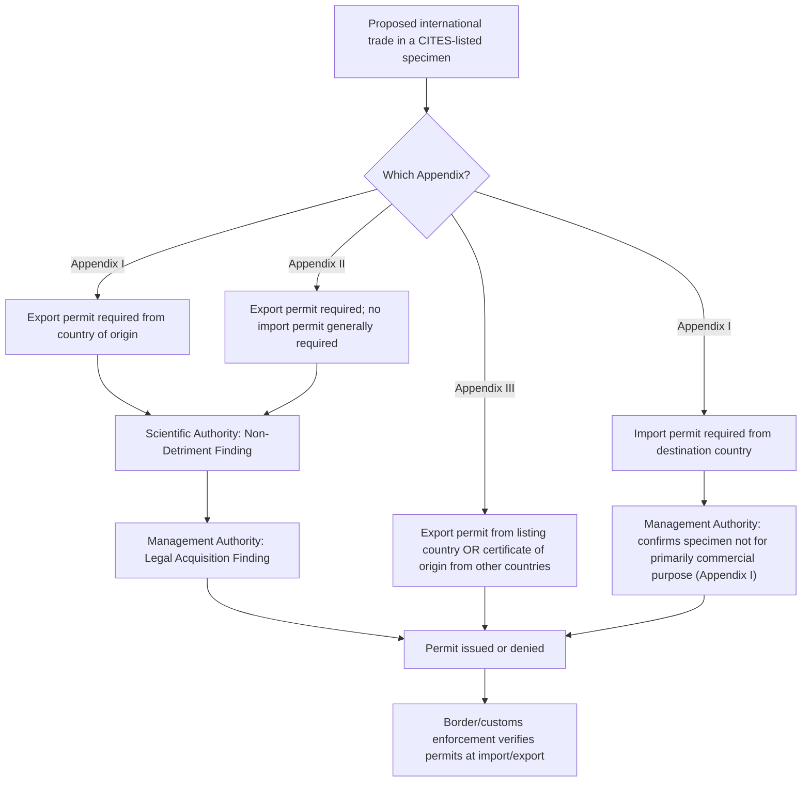

## International Wildlife Trade Regulation Under CITES

### Overview and Legal Foundation

The Convention on International Trade in Endangered Species of Wild Fauna and Flora (CITES) is a multilateral treaty, opened for signature in 1973 and entered into force in 1975, that regulates international trade in specimens of wild animals and plants to ensure such trade does not threaten their survival. It is implemented in the United States primarily through the Endangered Species Act itself, alongside dedicated implementing regulations.

**Key Points**

- CITES currently has more than 180 Parties (member states/regional economic integration organizations), making it one of the most widely adopted conservation-related treaties in existence.
- CITES does not itself replace domestic wildlife law; it establishes a permit-based international trade control framework that Parties implement through their own national legislation. In the United States, Section 8A of the ESA (16 U.S.C. § 1537a) designates the Secretary of the Interior as the primary CITES Management Authority and Scientific Authority functions, implemented through FWS's Division of Management Authority and Division of Scientific Authority.
- CITES regulates trade — import, export, re-export, and introduction from the sea — of listed species and their parts, derivatives, and products; it does not directly regulate domestic take, possession, or habitat protection within a single country's borders (those remain governed by that country's own laws, such as the ESA domestically).

### Structure: The Three Appendices

CITES organizes species into three appendices reflecting different levels of trade restriction, each with distinct permitting requirements.

**Key Points**

- **Appendix I:** Species threatened with extinction that are or may be affected by trade. Commercial international trade in wild-caught specimens is generally prohibited; trade is permitted only in exceptional circumstances (e.g., scientific research, certain captive-bred specimens) and requires both an export permit from the country of origin and an import permit from the destination country.
- **Appendix II:** Species not necessarily threatened with extinction but in which trade must be controlled to avoid utilization incompatible with their survival, plus certain "look-alike" species listed to protect Appendix I or genuinely threatened species from trade due to visual similarity. Trade requires an export permit (issued only if the Scientific Authority makes a "non-detriment finding") but generally does not require an import permit.
- **Appendix III:** Species that a Party has unilaterally identified as subject to regulation within its own jurisdiction and for which it is seeking the cooperation of other Parties to control trade. Trade requires an export permit from the listing country and a certificate of origin from other countries.

**Key Definitional Concepts**

- **Non-Detriment Finding (NDF):** A determination by the exporting country's Scientific Authority that export of specimens will not be detrimental to the survival of the species in the wild — a prerequisite for Appendix I and Appendix II export permits.
- **Legal Acquisition Finding:** A determination that specimens were obtained in accordance with the exporting country's domestic wildlife protection laws.
- **Introduction from the Sea:** Transportation into a State of specimens of any species taken in the marine environment not under the jurisdiction of any State (i.e., taken on the high seas) — treated as a distinct trade category requiring its own permitting analysis.

### Permitting Process Flow

### U.S. Domestic Implementation

**Key Points**

- FWS's Division of Management Authority issues CITES export and import permits, re-export certificates, and other required documentation for U.S. trade in CITES-listed specimens.
- FWS's Division of Scientific Authority makes non-detriment findings and provides scientific advice supporting permitting decisions, and represents the U.S. at CITES Conference of the Parties (CoP) meetings on scientific and technical matters.
- U.S. Fish and Wildlife Service Office of Law Enforcement, along with U.S. Customs and Border Protection, enforces CITES permit requirements at ports of entry and investigates trafficking violations.
- Where a CITES-listed species is also ESA-listed, both the CITES permit requirements and the ESA's own take/import/export prohibitions under Section 9 apply independently — obtaining a CITES export permit from a foreign country does not by itself satisfy separate U.S. ESA import requirements, and vice versa.
- The Lacey Act (discussed as a related wildlife statute) serves as the primary domestic criminal enforcement mechanism for CITES violations: importing or trading a specimen in violation of CITES permit requirements can independently trigger Lacey Act liability because CITES is treated as incorporated "foreign law" or federal regulation for Lacey Act purposes, in addition to any direct ESA violation.

### Species Listing and Amendment Process

**Key Points**

- Species are added to, removed from, or moved between appendices through proposals submitted by Parties and voted on at the CITES Conference of the Parties, held approximately every two to three years (CoP19 occurred in 2022; subsequent CoPs continue on this general cycle).
- Appendix I and II listing/amendment proposals require a two-thirds majority vote of Parties present and voting.
- Appendix III listings are unilateral and do not require a CoP vote — any Party may list a species native to its territory at any time by notifying the CITES Secretariat.
- Listing proposals are informed by biological and trade criteria set out in Resolution Conf. 9.24 (as amended), addressing population size, distribution, decline rates, and the actual or potential trade impact on the species.

### Relationship Between CITES Listing and ESA Listing

**Key Points**

- CITES listing and ESA listing are legally independent processes with different criteria, different listing authorities (an international treaty body vs. domestic FWS/NMFS rulemaking), and different substantive triggers (international trade impact vs. overall extinction risk within the species' range).
- A species can be CITES Appendix I or II listed without being ESA-listed (e.g., because its extinction risk driver is primarily international trade pressure abroad rather than any factor implicating U.S. domestic conservation status), and conversely, a species can be ESA-listed without being CITES-listed (e.g., a U.S.-endemic species with no meaningful international trade dimension).
- For species that are both CITES- and ESA-listed (a substantial overlap exists, particularly for high-profile trade-driven species such as elephants, rhinoceroses, many parrot species, and numerous reptile and turtle species), compliance requires satisfying both frameworks: the CITES permit process governs the cross-border trade transaction itself, while the ESA governs domestic take, possession, and any U.S.-specific import/export prohibitions that may be more restrictive than the baseline CITES requirement.
- The ESA's Section 8A explicitly directs the Secretary to give a species found to be in danger of extinction, or likely to become so, "such protection as may be afforded under" CITES, reflecting the statute's built-in linkage to the treaty framework, but ESA implementation can and often does impose additional or more stringent requirements beyond the CITES baseline (a Party is always free under CITES to adopt stricter domestic measures).

### Comparative Table: CITES vs. ESA

| Feature | CITES | ESA |
| --- | --- | --- |
| Legal instrument | Multilateral international treaty | Domestic U.S. federal statute |
| Trigger | International trade impact on species survival | Overall risk of extinction (not limited to trade) |
| Geographic scope | Cross-border trade among 180+ Parties | Primarily U.S. jurisdiction (with some high-seas application) |
| Core mechanism | Permit-based trade control (export/import permits by appendix) | Listing + take prohibition (Section 9) + consultation (Section 7) + permitting (Section 10) |
| Domestic take/habitat regulation | Not directly addressed; left to Party domestic law | Directly addressed (Sections 4, 7, 9, 10) |
| Amendment process | CoP vote (two-thirds majority) for Appendices I/II; unilateral for Appendix III | Notice-and-comment rulemaking under APA; best available science standard |
| U.S. implementing authority | FWS Divisions of Management Authority and Scientific Authority (Section 8A ESA) | FWS/NMFS generally |

### Illustrative High-Profile CITES-Listed Categories

**Example**

African elephant ivory illustrates the interplay of these frameworks: African elephants are listed on CITES Appendix I (with certain populations down-listed to Appendix II subject to specific conditions and quotas), meaning commercial international ivory trade is generally prohibited absent narrow exceptions. Within the U.S., African elephants are also ESA-listed as threatened, and domestic ivory sales are additionally restricted under both federal ESA-related regulations and numerous state-level ivory sale bans, illustrating a layered compliance structure spanning international treaty, federal statute, and state law.

**Key Points**

- Rhinoceros species (Appendix I) face similarly stringent trade prohibitions reflecting acute poaching-driven population declines, with rhino horn trade prohibited in nearly all circumstances.
- Many CITES Appendix II-listed species (numerous timber species, many reptile and amphibian species, some shark and ray species) illustrate the "sustainable trade" model, where export is permitted subject to a non-detriment finding and quota system rather than an outright prohibition.
- Look-alike species listings under Appendix II (e.g., listing an entire genus or family to protect enforcement officials' ability to distinguish protected from unprotected specimens at the point of trade) illustrate a distinctive enforcement-driven listing rationale not present in ESA listing criteria.

### Diagram: Institutional Roles in U.S. CITES Implementation

<svg xmlns="http://www.w3.org/2000/svg" viewBox="0 0 800 300">
<text x="400" y="25" font-size="16" font-weight="bold" text-anchor="middle" fill="#1a1a1a">U.S. CITES Implementation Structure (svg_diagram)</text>
<rect x="300" y="55" width="200" height="50" rx="6" fill="#e0e7ff" stroke="#3730a3" />
<text x="400" y="75" font-size="12" text-anchor="middle" fill="#312e81">CITES Secretariat</text>
<text x="400" y="90" font-size="12" text-anchor="middle" fill="#312e81">(International treaty body)</text>
<line x1="400" y1="105" x2="400" y2="140" stroke="#333" marker-end="url(#arrow4)" />
<rect x="280" y="140" width="240" height="40" rx="6" fill="#dbeafe" stroke="#1e40af" />
<text x="400" y="165" font-size="12" text-anchor="middle" fill="#1e3a8a">ESA Section 8A: U.S. CITES Authority</text>
<line x1="330" y1="180" x2="200" y2="215" stroke="#333" marker-end="url(#arrow4)" />
<line x1="470" y1="180" x2="600" y2="215" stroke="#333" marker-end="url(#arrow4)" />
<rect x="80" y="215" width="240" height="60" rx="6" fill="#fef3c7" stroke="#b45309" />
<text x="200" y="235" font-size="11" text-anchor="middle" fill="#78350f">FWS Division of</text>
<text x="200" y="250" font-size="11" text-anchor="middle" fill="#78350f">Management Authority</text>
<text x="200" y="265" font-size="10" text-anchor="middle" fill="#78350f">Permits, Legal Acquisition Findings</text>
<rect x="480" y="215" width="240" height="60" rx="6" fill="#fef3c7" stroke="#b45309" />
<text x="600" y="235" font-size="11" text-anchor="middle" fill="#78350f">FWS Division of</text>
<text x="600" y="250" font-size="11" text-anchor="middle" fill="#78350f">Scientific Authority</text>
<text x="600" y="265" font-size="10" text-anchor="middle" fill="#78350f">Non-Detriment Findings</text>
</svg>

### Enforcement and Penalties in the United States

**Key Points**

- Violations of CITES permit requirements are primarily prosecuted domestically under the Lacey Act (treating a CITES violation as a violation of an underlying federal regulation/foreign law trigger for Lacey Act liability) and, where the specimen is also ESA-listed, under ESA Section 9's own import/export and take prohibitions.
- The Eagle Act, MBTA, and various state wildlife laws may provide additional, independent bases for prosecution depending on the species and conduct involved, consistent with the layered, multi-statute enforcement pattern discussed in relation to the Lacey Act.
- Criminal penalties for wildlife trafficking prosecuted under the Lacey Act in conjunction with CITES violations can reach the felony thresholds described in Lacey Act analysis (up to five years imprisonment and substantial fines), particularly for large-scale or commercial trafficking operations.

### Special Domestic Complications and Debates

**Key Points**

- **Captive-bred vs. wild-caught specimens:** CITES treats specimens bred in captivity in accordance with specific criteria (Resolution Conf. 10.16 and related guidance) differently from wild-caught specimens, often permitting trade in captive-bred Appendix I specimens as if Appendix II-listed — a distinction that has generated significant enforcement complexity due to "laundering" concerns (falsely representing wild-caught specimens as captive-bred).
- **Personal effects and household exemptions:** CITES and its national implementing regulations generally provide narrow exemptions for non-commercial personal effects (e.g., a musical instrument containing small quantities of a CITES-listed material, pre-Convention antiques), which require careful documentation to distinguish from commercial trade subject to full permitting.
- **Interaction with the 2025–2026 ESA regulatory rollbacks:** Because CITES implementation in the U.S. operates substantially through Section 8A of the ESA and through FWS's general permitting infrastructure, changes to broader ESA listing procedures, the Section 4(d) blanket rule, or resource allocation within FWS could have downstream effects on CITES permit processing capacity and non-detriment finding timelines, though sources reviewed for other topics in this chapter do not specifically document CITES-related impacts from those regulatory changes. [Inference — plausible institutional linkage, not confirmed by direct reporting]

**Related Topics**

- Related wildlife statutes: the Migratory Bird Treaty Act, the Marine Mammal Protection Act, and the Lacey Act
- Section 9's take prohibition and the historical scope of "harm"
- ESA Section 8A and international cooperation provisions
- Wildlife trafficking enforcement and the role of U.S. Customs and Border Protection
- Captive breeding and propagation permits under ESA Section 10(a)(1)(A)
- CITES Conference of the Parties listing criteria and Resolution Conf. 9.24
- State-level wildlife trade restrictions (e.g., ivory sale bans) as a complement to federal and international frameworks