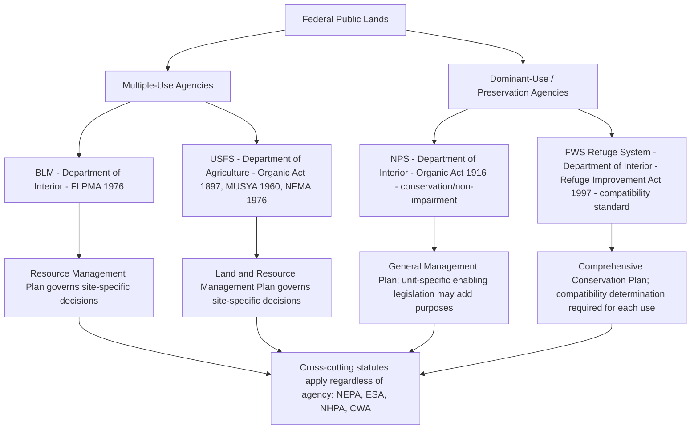

## Federal Land Management Agencies and Their Organic Statutes

### Overview

Federal public lands in the United States are administered by four principal agencies, each governed by a distinct "organic statute" (or set of statutes) establishing its mission, authorities, and management standards. Understanding these organic statutes is foundational to Administrative & Environmental Law because they define the substantive standards against which agency action is reviewed under the Administrative Procedure Act (APA) and determine how environmental statutes like NEPA and the ESA interact with land management decisions.

**Key Points**

- The four principal federal land management agencies are: the Bureau of Land Management (BLM), the U.S. Forest Service (USFS), the National Park Service (NPS), and the U.S. Fish and Wildlife Service (FWS) (in its land-management capacity over the National Wildlife Refuge System).
- BLM and USFS operate under a **multiple-use, sustained-yield** management standard, permitting a broad range of extractive and non-extractive uses on the same lands.
- NPS and FWS (refuge system) operate under **dominant-use** or **preservation-oriented** standards, where conservation or a specific statutory purpose takes precedence over competing uses.
- Each agency's organic act interacts with cross-cutting statutes (NEPA, ESA, Clean Water Act, National Historic Preservation Act) that apply regardless of which agency administers the land.

### Bureau of Land Management (BLM)

**Organic Statute: Federal Land Policy and Management Act of 1976 (FLPMA), 43 U.S.C. §§ 1701–1787**

**Key Points**

- FLPMA declared, for the first time, a policy of permanent federal retention of most remaining public domain lands, reversing the prior historical policy favoring disposal of public lands into private ownership.
- FLPMA establishes **multiple use and sustained yield** as BLM's core management mandate (43 U.S.C. § 1702(c), (h)): multiple use means management for a combination of uses (grazing, mineral extraction, timber, recreation, wildlife habitat, watershed protection) without permanent impairment of land productivity; sustained yield means achieving and maintaining high-level annual or regular periodic output of renewable resources without impairing the land's productivity.
- FLPMA directs BLM to prepare **land use plans** (Resource Management Plans, or RMPs) that guide subsequent site-specific decisions, and requires that subsequent actions conform to the applicable RMP.
- FLPMA also established the modern framework for BLM's administration of grazing permits, mineral leasing coordination, and rights-of-way, and repealed numerous prior disposal-era statutes (though it preserved certain existing rights, such as those under the Mining Law of 1872 for locatable minerals).
- BLM manages the largest total acreage of any federal land agency, primarily located in the western states and Alaska, along with subsurface mineral estate management functions extending to lands surface-managed by other agencies.

**Additional Governing Statutes**

- **Mining Law of 1872** (30 U.S.C. §§ 22 et seq.): Governs locatable hardrock minerals (gold, silver, copper) on BLM (and USFS) lands open to mineral entry, allowing claim staking and patenting under a framework largely unchanged since the 19th century.
- **Mineral Leasing Act of 1920** (30 U.S.C. §§ 181 et seq.): Governs leasable minerals (oil, gas, coal, phosphate, sodium) through a competitive/noncompetitive leasing system rather than the location-claim system used for hardrock minerals.
- **Taylor Grazing Act of 1934** (43 U.S.C. §§ 315 et seq.): Established the original framework for regulated grazing on public rangelands, predating FLPMA and now operating alongside it.

### U.S. Forest Service (USFS)

**Organic Statutes: Organic Administration Act of 1897, Multiple-Use Sustained-Yield Act of 1960 (MUSYA), and National Forest Management Act of 1976 (NFMA)**

**Key Points**

- The **Organic Administration Act of 1897** (16 U.S.C. § 473 et seq.) established the original purposes of the national forests: to improve and protect the forest, secure favorable conditions of water flows, and furnish a continuous supply of timber — a narrower, utilitarian conservation mandate reflecting Gifford Pinchot-era forestry philosophy.
- The **Multiple-Use Sustained-Yield Act of 1960** (16 U.S.C. §§ 528–531) expanded the Forest Service's statutory purposes beyond timber and water to explicitly include outdoor recreation, range, timber, watershed, and wildlife and fish purposes, formally establishing multiple use and sustained yield (parallel in concept, though independently codified, to the later FLPMA standard for BLM) as the Forest Service's management framework.
- The **National Forest Management Act of 1976** (16 U.S.C. §§ 1600 et seq.), enacted the same year as FLPMA, requires the Forest Service to prepare comprehensive **Land and Resource Management Plans (LRMPs)** for each national forest, imposes substantive environmental standards on timber harvesting practices (e.g., restrictions on clearcutting, requirements for maintaining diversity of plant and animal communities), and was enacted substantially in response to litigation (notably *West Virginia Division of the Izaak Walton League v. Butz*, 4th Cir. 1975) challenging clearcutting practices under the 1897 Organic Act's "mature" timber harvest language.
- USFS is housed within the U.S. Department of Agriculture, distinguishing it institutionally from BLM, NPS, and FWS, all housed within the Department of the Interior — a structural artifact of the Forest Service's origins in scientific forestry and agricultural land management rather than Interior's historical public-domain administration role.

### National Park Service (NPS)

**Organic Statute: National Park Service Organic Act of 1916, 54 U.S.C. §§ 100101 et seq.**

**Key Points**

- The NPS Organic Act establishes a fundamentally different management standard from BLM/USFS: NPS's purpose is "to conserve the scenery and the natural and historic objects and the wild life therein and to provide for the enjoyment of the same in such manner and by such means as will leave them unimpaired for the enjoyment of future generations" — a dual conservation/enjoyment mandate often summarized as the "conservation and use" or "non-impairment" standard.
- This creates the so-called **Organic Act tension**: NPS must simultaneously conserve resources unimpaired and provide for visitor enjoyment, and courts and NPS policy have generally resolved apparent conflicts by prioritizing conservation where genuine impairment is at stake (reflected in NPS's 2006 Management Policies, which state that when there is a conflict between conservation and use, conservation is to be predominant).
- Unlike BLM and USFS, NPS units are individually established by specific enabling legislation (or presidential proclamation under the Antiquities Act for national monuments), meaning each park unit may have its own unit-specific statutory purposes layered on top of the general Organic Act mandate.
- The **General Authorities Act of 1970** and its 1978 "Redwood Amendment" reinforced that all units of the National Park System are to be managed under a consistent set of Organic Act standards regardless of the individual unit's specific designation (national park, monument, seashore, recreation area, etc.), and that NPS must ensure that no unit's management compromises the fundamental purposes for which it was established, even where a specific enabling act might otherwise suggest a lesser standard.

### U.S. Fish and Wildlife Service — National Wildlife Refuge System

**Organic Statute: National Wildlife Refuge System Administration Act of 1966, as substantially amended by the National Wildlife Refuge System Improvement Act of 1997**

**Key Points**

- The 1997 Improvement Act established, for the first time, a unifying statutory mission for the National Wildlife Refuge System: "to administer a national network of lands and waters for the conservation, management, and where appropriate, restoration of the fish, wildlife, and plant resources and their habitats... for the benefit of present and future generations."
- The Act establishes wildlife conservation as the **dominant purpose** of the Refuge System — a stricter priority ordering than BLM/USFS's multiple-use standard — and requires that any proposed use be evaluated for "compatibility" with this dominant conservation mission before being permitted (the "compatibility determination" process).
- The Act designates **wildlife-dependent recreational uses** (hunting, fishing, wildlife observation, wildlife photography, environmental education, and interpretation) as priority public uses that receive enhanced consideration, but even these remain subordinate to the compatibility requirement.
- FWS's refuge-management organic statute is distinct from the ESA itself (which FWS also administers), though the two frequently intersect since many refuges are established or managed with specific reference to ESA-listed species conservation.

### Comparative Table of Organic Statutes and Management Standards

| Agency | Department | Key Organic Statute(s) | Management Standard | Core Planning Document |
| --- | --- | --- | --- | --- |
| BLM | Interior | FLPMA (1976) | Multiple use, sustained yield | Resource Management Plan (RMP) |
| USFS | Agriculture | Organic Act (1897); MUSYA (1960); NFMA (1976) | Multiple use, sustained yield | Land and Resource Management Plan (LRMP) |
| NPS | Interior | NPS Organic Act (1916); General Authorities Act (1970/1978) | Conservation/non-impairment, with visitor enjoyment | General Management Plan (GMP) |
| FWS (Refuges) | Interior | Refuge System Administration Act (1966); Improvement Act (1997) | Dominant-use conservation; compatibility standard | Comprehensive Conservation Plan (CCP) |

### Institutional and Standard-of-Review Diagram

### Cross-Cutting Statutory Overlays

**Key Points**

- Regardless of which agency's organic statute governs a given parcel, several cross-cutting federal statutes apply to most federal land management decisions: the **National Environmental Policy Act (NEPA)** (requiring environmental review of major federal actions), the **Endangered Species Act** (requiring Section 7 consultation where listed species may be affected), the **National Historic Preservation Act** (requiring consideration of effects on historic properties), and the **Clean Water Act** and **Clean Air Act** (governing discharges and emissions associated with land management activities).
- The interplay between an agency's organic statute (which defines the substantive management standard and discretion the agency possesses) and these cross-cutting procedural/substantive environmental statutes (which constrain how that discretion may be exercised) is a recurring analytical structure in public lands litigation — a plaintiff might argue an agency acted outside its organic-statute mandate (e.g., failed to achieve "sustained yield"), failed to comply with NEPA's procedural requirements, or both simultaneously.
- Judicial review of federal land management decisions under any of these organic statutes is generally conducted under the APA's "arbitrary and capricious" standard (5 U.S.C. § 706(2)(A)), since none of the organic statutes at issue provide their own private right of action or distinct standard of review, with the specific organic statute supplying the substantive legal standard against which the challenged action is measured.

### Illustrative Comparative Example

**Example**

Consider a proposed mineral exploration project on federal land. If sited on BLM land, the proponent would seek a mineral lease or claim under the Mineral Leasing Act or Mining Law of 1872, with BLM evaluating the project against FLPMA's multiple-use standard and the applicable RMP. If the same mineral deposit extended beneath a national forest, USFS surface-management consent would additionally be required alongside BLM's subsurface mineral authority (since BLM retains mineral-leasing authority even on National Forest System lands), evaluated against NFMA planning standards. If the deposit were instead located within a national park unit, mineral development would generally be prohibited or severely constrained under the NPS Organic Act's non-impairment standard (subject to any pre-existing valid mineral rights predating park establishment), illustrating how the same physical resource can be subject to dramatically different management outcomes purely as a function of which organic statute governs the surface estate.

### Historical Development Context

**Key Points**

- The public-land management framework evolved through distinct historical eras: an early disposal era (favoring transfer of public lands to private ownership via homesteading and railroad grants), a conservation-reservation era (late 19th/early 20th century, creating the national forests, national parks, and early wildlife refuges), and a modern retention-and-multiple-use era culminating in the mid-1970s statutes (FLPMA and NFMA) that comprehensively modernized management standards for BLM and USFS lands respectively.
- FLPMA and NFMA's near-simultaneous 1976 enactment reflected a broader congressional response to increased environmental awareness following the enactment of NEPA (1970) and the ESA (1973), and to litigation (such as the *Izaak Walton League* clearcutting case) that had exposed gaps or ambiguities in the older, narrower organic statutes.
- The 1964 **Wilderness Act** (16 U.S.C. §§ 1131–1136) operates as a further overlay across multiple agencies' lands (BLM, USFS, NPS, and FWS refuges can all contain designated wilderness areas), imposing the most restrictive management standard within the federal lands system by prohibiting commercial enterprise, permanent roads, and most forms of mechanized equipment within designated wilderness boundaries, regardless of which agency administers the surrounding land.

**Related Topics**

- National Environmental Policy Act (NEPA) review requirements for land management decisions
- Section 7 ESA consultation in the context of federal land management actions
- The Mining Law of 1872 and modern hardrock mineral development
- The Mineral Leasing Act and federal oil, gas, and coal leasing programs
- The Wilderness Act and wilderness area designation and management
- Judicial review of agency land management decisions under the APA's arbitrary and capricious standard
- National Forest Management Act planning requirements and diversity standards
- Compatibility determinations under the National Wildlife Refuge System Improvement Act