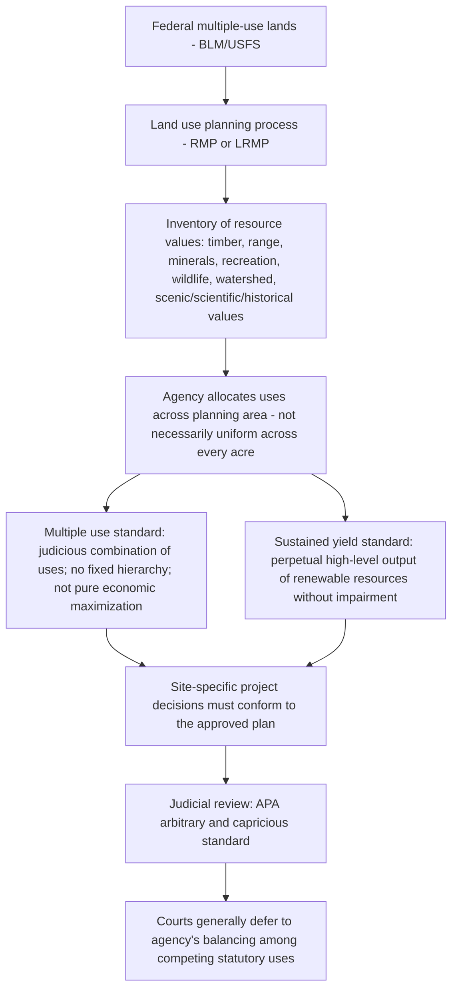

## Multiple Use and Sustained Yield Management Mandates

### Overview and Origins

Multiple use and sustained yield are the two foundational management standards governing the Bureau of Land Management (BLM) and the U.S. Forest Service (USFS), the two federal agencies charged with managing public lands for a broad array of competing uses rather than a single dominant purpose. These standards are codified in distinct but conceptually parallel statutes and represent Congress's attempt to translate an inherently discretionary, resource-allocation policy judgment into judicially administrable statutory language.

**Key Points**

- For USFS, the standard originates in the Multiple-Use Sustained-Yield Act of 1960 (MUSYA), 16 U.S.C. §§ 528–531, later reinforced by the National Forest Management Act of 1976 (NFMA).
- For BLM, the standard originates in the Federal Land Policy and Management Act of 1976 (FLPMA), 43 U.S.C. § 1701 et seq., particularly the definitions at 43 U.S.C. § 1702(c) and (h) and the management directive at 43 U.S.C. § 1732(a).
- Both statutes emerged from a common conservation-policy lineage traceable to Progressive Era "wise use" forestry principles associated with Gifford Pinchot, but were codified decades apart and independently, resulting in similar but not textually identical formulations.

### Statutory Definition: "Multiple Use"

**FLPMA Definition (43 U.S.C. § 1702(c))**

Multiple use means the management of public lands and their various resource values so that they are utilized in the combination that will best meet the present and future needs of the American people, making the most judicious use of the land for some or all of these resources, with consideration given to the relative values of the resources and not necessarily the combination that will give the greatest economic return or the greatest unit output.

**MUSYA Definition (16 U.S.C. § 531(a))**

Multiple use means the management of all the various renewable surface resources of the national forests so that they are utilized in the combination that will best meet the needs of the American people, making the most judicious use of the land for some or all of these resources or related services over areas large enough to provide sufficient latitude for periodic adjustments in use to conform to changing needs and conditions.

**Key Points**

- Both definitions share the core concept that multiple use does not require every acre to be used for every purpose simultaneously; rather, the agency may allocate different uses to different areas or times, so long as the overall management scheme reflects a considered balance among competing resource values across the broader planning area.
- Neither statute establishes a fixed hierarchy among uses (recreation, range, timber, minerals, watershed, wildlife and fish habitat, and — under FLPMA — also scenic, scientific, historical, and ecological values); the enumerated uses are formally equal, leaving substantial allocation discretion to the agency.
- Both definitions explicitly reject a pure economic-maximization standard: FLPMA's definition specifically disclaims that multiple use means "the combination that will give the greatest economic return," and MUSYA's parallel provision similarly emphasizes balance over any single-resource optimization.

### Statutory Definition: "Sustained Yield"

**FLPMA Definition (43 U.S.C. § 1702(h))**

Sustained yield means the achievement and maintenance in perpetuity of a high-level annual or regular periodic output of the various renewable resources of the public lands consistent with multiple use.

**MUSYA Definition (16 U.S.C. § 531(b))**

Sustained yield of the several products and services means the achievement and maintenance in perpetuity of a high-level annual or regular periodic output of the various renewable resources of the national forests without impairment of the productivity of the land.

**Key Points**

- Sustained yield applies specifically to **renewable** resources (timber, forage, water yield, wildlife populations) — it does not govern the rate of extraction of non-renewable resources such as hardrock minerals, oil, and gas, which are instead governed by separate mineral leasing and mining statutes.
- The standard requires perpetual maintenance of high-level output without long-term impairment of the resource base — implicitly prohibiting harvest or use rates that would deplete a renewable resource below its capacity for regeneration, though the precise numerical or scientific benchmarks for "high-level" and "impairment" are left largely to agency technical judgment.
- Sustained yield and multiple use are textually linked (FLPMA's sustained yield definition explicitly requires consistency "with multiple use"), meaning an agency cannot pursue maximum sustained yield of a single resource (e.g., timber) if doing so would be inconsistent with maintaining the broader multiple-use balance across other resource values.

### The Combined Standard in Practice

### Judicial Interpretation: Broad Agency Discretion

**Key Points**

- Courts have consistently held that the multiple-use standard confers substantial, though not unlimited, discretion on the managing agency to weigh and balance competing uses, rather than creating judicially enforceable rights for any particular use or user group to a specific allocation of resources.
- The leading judicial articulation of this discretion is often traced to cases interpreting MUSYA and FLPMA as establishing a broad policy mandate rather than a specific, quantifiable management formula — courts generally will not second-guess an agency's substantive balancing of uses so long as the agency considered the relevant statutory factors and did not act arbitrarily or capriciously.
- Multiple-use and sustained-yield claims are frequently raised in conjunction with NEPA claims in litigation challenging specific projects (timber sales, grazing allotment renewals, oil and gas leasing decisions), but a freestanding multiple-use claim (alleging the agency's overall balance of uses is unlawful, apart from any specific procedural defect) faces a high bar because of the broad discretion these statutes confer.
- NFMA added more specific substantive constraints on top of MUSYA's general multiple-use mandate for the Forest Service — for example, requiring maintenance of diversity of plant and animal communities and imposing specific limitations on clearcutting and other even-aged management practices — narrowing agency discretion in ways the original 1960 multiple-use standard alone did not.

### Land Use Planning as the Operative Mechanism

**Key Points**

- Multiple use and sustained yield are implemented primarily through the land use planning process: BLM's Resource Management Plans (RMPs) under FLPMA and USFS's Land and Resource Management Plans (LRMPs, often called "forest plans") under NFMA.
- These plans allocate the planning area into management zones or prescriptions (e.g., areas open to mineral leasing, areas managed primarily for wildlife habitat, areas designated for timber production, areas managed for primitive recreation), each reflecting a site-specific application of the multiple-use/sustained-yield balance.
- Once approved, subsequent site-specific agency decisions (individual timber sales, grazing permit renewals, oil and gas lease issuances, rights-of-way grants) must conform to the governing plan; a site-specific decision inconsistent with the plan is generally subject to challenge on that basis, separate from any freestanding multiple-use challenge to the plan itself.
- Plan amendments and revisions provide the mechanism for adjusting the multiple-use balance over time in response to changing conditions, new information, or evolving public needs, consistent with MUSYA's and FLPMA's framing of the standards as flexible policies suited to periodic adjustment rather than fixed, one-time allocations.

### Interaction with Other Statutory Mandates

**Key Points**

- **Endangered Species Act:** Section 7 consultation obligations apply independently of the multiple-use standard; an agency cannot use its multiple-use discretion to justify an action that would jeopardize a listed species or destroy/adversely modify critical habitat, regardless of how the action might otherwise fit within a permissible multiple-use balance.
- **NEPA:** The multiple-use planning process itself (adoption or revision of an RMP or LRMP) typically constitutes a major federal action requiring NEPA review, and site-specific implementing decisions may require their own tiered NEPA analysis.
- **Wilderness Act:** Areas designated as wilderness are managed under the more restrictive Wilderness Act standard rather than ordinary multiple use, effectively removing those acres from the multiple-use balance for purposes such as commercial timber harvest, mineral development, and mechanized use, though the designation process itself often occurs through or alongside multiple-use land use planning.
- **National Historic Preservation Act:** Historic and cultural resource values are one of the considerations FLPMA identifies as part of the multiple-use balance for BLM lands, requiring integration with Section 106 review processes for federal undertakings affecting historic properties.

### Multiple Use/Sustained Yield vs. Dominant-Use Standards: Comparative Framework

| Feature | Multiple Use/Sustained Yield (BLM, USFS) | Dominant-Use Standards (NPS, FWS Refuges) |
| --- | --- | --- |
| Governing concept | Balance among co-equal competing uses | One purpose (conservation/preservation) predominates |
| Statutory hierarchy among uses | None — agency discretion to balance | Conservation purpose given priority; other uses evaluated for compatibility |
| Renewable resource harvest standard | Sustained yield — perpetual high-level output without impairment | Not generally applicable; commercial extraction largely prohibited |
| Agency discretion in allocation | Substantial; courts defer absent arbitrary/capricious action | Narrower; use must satisfy compatibility or non-impairment threshold |
| Primary planning instrument | Resource Management Plan (BLM) / Land and Resource Management Plan (USFS) | General Management Plan (NPS) / Comprehensive Conservation Plan (FWS refuges) |

### Illustrative Application

**Example**

A BLM field office preparing an RMP for a planning area containing significant natural gas reserves, seasonal big-game winter range, and popular dispersed recreation areas must, under the multiple-use standard, evaluate and balance these competing values across the planning area — potentially designating some areas as open to oil and gas leasing with seasonal timing restrictions to protect winter range, other areas as closed to leasing to protect high-value recreation or wildlife habitat, and yet other areas as available for full-field development, rather than either uniformly opening or uniformly closing the entire planning area to any single use. A challenge alleging the RMP unlawfully favors energy development over wildlife habitat would need to show the agency failed to genuinely consider and balance the statutory factors (an APA arbitrary-and-capricious argument), since the multiple-use standard itself does not mandate a particular substantive outcome or resource priority.

### Contemporary Debates and Criticisms

**Key Points**

- Critics have long argued that the multiple-use standard's broad, judicially unenforceable balancing language allows agencies effectively unlimited discretion to favor politically or economically favored uses (particularly extractive industries) over less economically quantifiable values (such as wildlife habitat, scenic quality, or ecological integrity), since courts rarely find an agency's balancing judgment itself to be arbitrary and capricious. [Inference]
- Conversely, defenders of the standard's flexibility argue that a more rigid, hierarchical statutory mandate would be poorly suited to the enormous ecological, geographic, and socioeconomic diversity of the lands BLM and USFS administer, and that meaningful constraint is better achieved through the land use planning process, NEPA analysis, and overlay statutes like the ESA and NFMA's diversity requirements, rather than through a more rigid multiple-use definition itself. [Inference]
- Both perspectives reflect ongoing, unresolved policy debate rather than settled legal consensus, and the practical balance struck in any given planning area tends to depend heavily on the specific administration's policy priorities, as reflected in the differing emphases of successive RMPs and LRMPs over time. [Inference]

**Related Topics**

- Federal land management agencies and their organic statutes
- Resource Management Plans and Land and Resource Management Plans as the operative planning instruments
- The National Forest Management Act's diversity and clearcutting standards
- The Wilderness Act and its relationship to multiple-use land management
- NEPA review requirements for land use planning and site-specific projects
- Section 7 ESA consultation in the multiple-use planning context
- Judicial review of federal land management decisions under the APA's arbitrary and capricious standard
- The Mineral Leasing Act and Mining Law of 1872 as extractive-use overlays on multiple-use lands