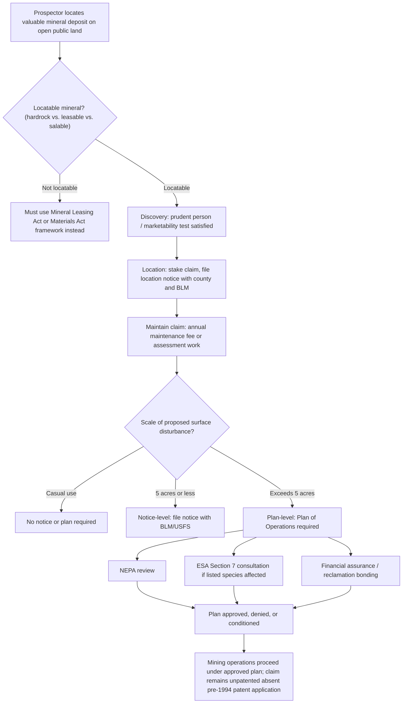

## Mining Law and the General Mining Act Framework

### Overview and Historical Origins

The General Mining Law of 1872 (30 U.S.C. §§ 22 et seq.), often called the Mining Law or the General Mining Act, is the foundational federal statute governing exploration for and development of "locatable" hardrock minerals on federal public lands. Enacted during an era of westward expansion and resource-disposal policy, it remains substantially unchanged in its core structure despite the enactment of numerous later statutes (FLPMA, NEPA, various environmental laws) that layer additional procedural and environmental requirements on top of it.

**Key Points**

- The 1872 Act consolidated and codified an informal system of mining customs that had developed in western mining camps during and after the California Gold Rush, formally recognizing self-initiated claim-staking as the basis of mineral rights acquisition on public land.
- Unlike the leasing system that governs fuel and other "leasable" minerals under the Mineral Leasing Act of 1920, the 1872 Act uses a **location system**: a private party may enter public land, discover a valuable mineral deposit, and establish a legal claim through self-initiated location, without a prior competitive bidding or agency-granted lease.
- The 1872 Act's core framework has survived largely intact for over 150 years, making it one of the oldest continuously operative federal natural resource statutes, though its application has been substantially modified by subsequent overlay statutes (FLPMA, NEPA, the Clean Water Act, and various withdrawal and reform statutes).

### "Locatable" vs. "Leasable" vs. "Salable" Minerals

**Key Points**

- **Locatable minerals** (governed by the 1872 Act): hardrock minerals such as gold, silver, copper, lead, zinc, uranium, and other metallic and some nonmetallic minerals not otherwise specifically classified as leasable or salable.
- **Leasable minerals** (governed by the Mineral Leasing Act of 1920 and related statutes): oil, gas, coal, oil shale, phosphate, sodium, potassium, and geothermal resources — resources Congress determined warranted a competitive/noncompetitive leasing and royalty system rather than free self-initiated location.
- **Salable minerals** (governed by the Materials Act of 1947 and Surface Resources Act of 1955, administered via mineral materials sale contracts): common variety materials such as sand, gravel, and building stone, sold by the agency rather than subject to location or lease.
- This three-category framework means the applicable legal regime for any given mineral development project depends entirely on which category the target mineral falls into — a critical threshold determination in any mining law analysis.

### The Location System: Discovery, Location, and Maintenance

**Discovery Requirement**

**Key Points**

- A valid mining claim requires the actual **discovery** of a valuable mineral deposit — mere presence of mineralization or geological potential is insufficient; the discovering party must find mineralization of such quality and quantity that a person of ordinary prudence would be justified in the further expenditure of labor and means to develop a paying mine (the "prudent person test," later refined by the "marketability test," which requires that the mineral can be extracted, removed, and marketed at a profit).
- The discovery requirement applies both at the time of initial location and must be maintained (or capable of demonstration) for the claim to remain valid against a government challenge or contest.

**Location and Claim Types**

- **Lode claims:** Cover mineral deposits in place within a defined vein or lode structure (e.g., a quartz vein containing gold); generally limited to 1,500 feet in length along the vein and up to 300 feet on either side of the vein's centerline (600 feet total width), subject to specific state-law variations historically permitted.
- **Placer claims:** Cover mineral deposits not occurring in a lode formation (e.g., alluvial gold deposits in streambeds); typically limited to 20 acres per individual locator, with larger association placer claims permitted for multiple co-locators (up to 160 acres for an eight-person association).
- **Mill site and tunnel site claims:** Ancillary claim types permitting up to five acres of non-mineral-bearing land for processing facilities (mill sites) or providing rights for tunneling to access a vein (tunnel sites).

**Maintenance Requirements**

- Historically, claim holders were required to perform **annual assessment work** (labor or improvements valued at not less than $100 per claim per year) to maintain a claim in good standing; this was supplemented and, in years when Congress did not appropriate funds for annual assessment work enforcement, substituted with an annual **maintenance fee** system administered by BLM.
- Claims must be properly recorded with both the county in which they are located and with BLM under FLPMA's recordation requirements (43 U.S.C. § 1744); failure to file required maintenance documents or pay fees can result in claim forfeiture.

### Patenting: Historical Process and Current Moratorium

**Key Points**

- The 1872 Act originally allowed claim holders to obtain a **mineral patent** — full fee simple title to the claimed land, including both mineral and (for most patent types) surface rights — upon proof of discovery, compliance with location and assessment requirements, and payment of a nominal per-acre fee (historically $2.50/acre for placer claims, $5.00/acre for lode claims).
- Beginning in 1994, Congress has included a **moratorium on new mineral patent applications** in annual Interior Department appropriations riders, effectively suspending the ability to obtain new patents (though patent applications filed and deemed complete before the moratorium took effect could still be processed to completion).
- This means that, in practice, the vast majority of mining claims located since the mid-1990s remain **unpatented claims** — the claim holder possesses an exclusive right to extract minerals and use the surface for mining-related purposes, but the underlying land remains in federal ownership, subject to BLM's continuing surface management authority under FLPMA.
- [Inference] The persistence of this appropriations-rider moratorium, renewed annually rather than enacted as permanent legislation, means the patenting framework's future status remains formally contingent on continued congressional action each fiscal year, though the moratorium has been renewed consistently for approximately three decades.

### Surface Management and Environmental Overlay

**Key Points**

- Although the 1872 Act itself contains minimal environmental or surface-management provisions, BLM has promulgated surface management regulations (43 C.F.R. Subpart 3809) requiring varying levels of review depending on the scale of proposed operations: **casual use** (no significant surface disturbance, no notice or plan required), **notice-level operations** (disturbance of 5 acres or less, requiring a notice to BLM but not full plan approval), and **plan-level operations** (disturbance exceeding 5 acres, requiring an approved Plan of Operations, financial assurance/reclamation bonding, and typically NEPA review).
- The Forest Service maintains parallel surface-management regulations (36 C.F.R. Part 228, Subpart A) for mining claims located on National Forest System lands, reflecting the fact that the 1872 Act's location system applies on both BLM and Forest Service lands open to mineral entry.
- NEPA review is typically required for plan-level Plans of Operations, and Section 7 ESA consultation applies where a proposed mining operation may affect listed species, regardless of the claim holder's unpatented mining rights — a claim holder's statutory right to develop a valid claim does not exempt the agency from its independent environmental review obligations, though courts have recognized that agencies must accommodate the claim holder's statutory right to reasonable access and development rather than effectively vetoing all development outright.
- Clean Water Act Section 404 permitting (for dredge-and-fill activities affecting waters of the United States) and state water quality certification requirements under Section 401 frequently apply to mining operations involving stream crossings, tailings impoundments, or waste rock placement near water bodies.

### Process Flow: From Discovery to Operating Mine

### Withdrawals and Areas Closed to Mineral Entry

**Key Points**

- Federal lands can be **withdrawn** from mineral entry under FLPMA (43 U.S.C. § 1714) or other specific statutes, removing the land from availability for new mining claim location, though this generally does not extinguish validly existing claims located before the withdrawal took effect.
- Congressionally or administratively designated areas — national parks, wilderness areas, wildlife refuges, and certain other special management areas — are typically withdrawn from mineral entry as a matter of the area's establishing legislation or subsequent withdrawal action, reflecting the dominant-use/preservation management standards discussed in connection with those land categories.
- High-profile, large-scale mineral withdrawals (such as area-specific withdrawals near sensitive watersheds, cultural sites, or national park boundaries) have periodically generated significant litigation and political controversy, illustrating the ongoing tension between the 1872 Act's self-initiated development right and evolving land-management and environmental priorities. [Inference: specific contemporary withdrawal controversies should be verified against current sources, as this is an area of frequent administrative and political change.]

### Reform Debates and Criticisms

**Key Points**

- The 1872 Act has been the subject of sustained reform criticism for over a century, with critics arguing that it: (1) imposes no royalty obligation on hardrock mineral production, unlike the royalty systems applicable to leasable minerals under the Mineral Leasing Act; (2) allows claim holders to obtain (historically) or exclusively use (currently, given the patent moratorium) valuable public mineral resources for a nominal fee; and (3) provides comparatively limited statutory tools for imposing modern environmental and reclamation standards relative to purpose-built modern statutes.
- Numerous mining law reform bills have been introduced in Congress over multiple decades proposing royalty requirements, enhanced reclamation and bonding standards, and mechanisms for balancing mineral development against other resource values, though comprehensive reform of the core 1872 statute has not been enacted; [Inference] the persistence of the annual patent moratorium rider, rather than permanent statutory reform, reflects Congress's general pattern of addressing specific concerns incrementally rather than through wholesale revision of the underlying Act.
- Proponents of the existing framework argue that the location system provides valuable regulatory certainty and incentivizes mineral exploration and development (including for minerals increasingly recognized as critical to renewable energy and national security supply chains, such as lithium, cobalt, and rare earth elements), and that surface-management and environmental overlay requirements developed since 1872 (FLPMA, NEPA, the Clean Water Act, and modern reclamation regulations) already impose substantial modern regulatory discipline notwithstanding the age of the core statute. [Inference]

### Comparative Table: Mineral Development Frameworks

| Feature | Locatable Minerals (1872 Act) | Leasable Minerals (Mineral Leasing Act 1920) | Salable Minerals (Materials Act 1947) |
| --- | --- | --- | --- |
| Examples | Gold, silver, copper, uranium | Oil, gas, coal, phosphate, geothermal | Sand, gravel, building stone |
| Acquisition mechanism | Self-initiated location upon discovery | Competitive or noncompetitive lease | Sale contract |
| Royalty to federal government | None | Yes (statutory/regulatory royalty rate) | Purchase price paid |
| Patent/fee title available | Historically yes; new patents under moratorium since 1994 | No (lease interest only) | No |
| Governing surface regulations | 43 C.F.R. Subpart 3809 (BLM); 36 C.F.R. Part 228 (USFS) | Mineral Leasing Act regulations; agency-specific leasing rules | Agency contract terms |

### Illustrative Application

**Example**

A company identifies a copper-molybdenum deposit on BLM land open to mineral entry. Because copper and molybdenum are locatable hardrock minerals, the company (rather than seeking a lease) stakes lode mining claims covering the deposit, records the claims with the county and BLM, and conducts exploratory drilling under casual-use or notice-level surface disturbance thresholds. Upon confirming an economically viable deposit satisfying the discovery requirement, the company submits a Plan of Operations to BLM for full-scale mine development, triggering NEPA review (likely an Environmental Impact Statement given the project's scale), ESA Section 7 consultation if any listed species occur in the project area, Clean Water Act permitting for any stream impacts, and BLM approval of a reclamation plan and bond — all while the company's underlying claims remain unpatented, meaning the federal government retains title to the land itself even as the company holds the exclusive right to extract and market the minerals.

**Related Topics**

- Federal land management agencies and their organic statutes
- Multiple use and sustained yield management mandates
- The Mineral Leasing Act of 1920 and federal oil, gas, and coal leasing programs
- NEPA review requirements for mineral development on federal lands
- Section 7 ESA consultation in the mineral development context
- Clean Water Act Section 404 permitting for mining-related discharges
- Mineral withdrawals and areas closed to mineral entry
- Reclamation bonding and financial assurance requirements for hardrock mining operations