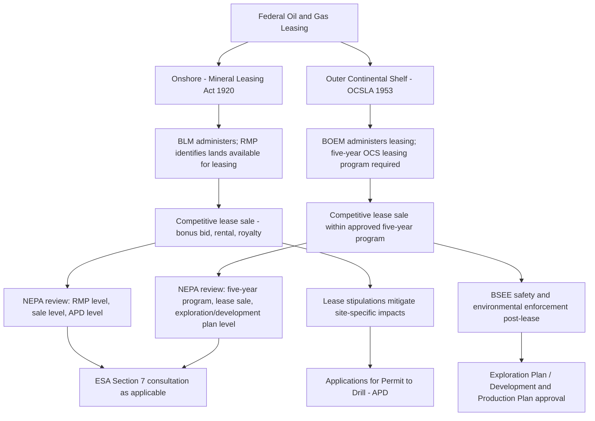

## Oil and Gas Leasing Onshore and on the Outer Continental Shelf

### Overview and Dual Statutory Framework

Federal oil and gas leasing operates under two distinct statutory regimes depending on location: onshore and state-water leasing is governed principally by the Mineral Leasing Act of 1920 (MLA), while leasing on the Outer Continental Shelf (OCS) — federal submerged lands beyond state jurisdictional waters — is governed by the Outer Continental Shelf Lands Act of 1953 (OCSLA), as substantially amended.

**Key Points**

- Both statutes establish a **leasing system** (as opposed to the location system governing hardrock minerals under the 1872 Mining Law), meaning the federal government retains an ownership/royalty interest and controls access through a competitive bidding and lease-issuance process rather than allowing self-initiated claim staking.
- Onshore leasing is administered primarily by BLM (Department of the Interior), which also manages the mineral estate underlying National Forest System lands (with USFS consent required for surface-disturbing activities).
- OCS leasing is administered by the Bureau of Ocean Energy Management (BOEM), with safety and environmental enforcement functions performed by the Bureau of Safety and Environmental Enforcement (BSEE) — both created in 2011 as successor agencies to the former Minerals Management Service (MMS), which was reorganized following the 2010 Deepwater Horizon oil spill to separate resource-development and safety-oversight functions that had previously resided in a single agency.

### Onshore Leasing Under the Mineral Leasing Act

**Leasing Process**

**Key Points**

- BLM conducts periodic **competitive lease sales** for parcels nominated by industry or identified by BLM, requiring parcels to first be available under the applicable Resource Management Plan (RMP) and to have completed required NEPA review.
- Successful bidders pay a bonus bid (the competitive sale price), plus ongoing **rental payments** during the primary lease term, and **royalty payments** (a percentage of the value of production) once the lease produces oil or gas.
- Leases are typically issued for a primary term (historically 10 years for onshore leases), extended automatically for so long as the lease produces oil or gas in paying quantities or specified diligent development activities continue.
- Lands not receiving competitive bids may become available for **noncompetitive leasing** in some circumstances, though reforms over time (including provisions in the Inflation Reduction Act of 2022) have curtailed noncompetitive leasing availability and adjusted minimum bid, rental, and royalty rates.

**Environmental Review Points**

- NEPA review is required at multiple stages: land use planning (RMP-level programmatic review), lease sale-level review (often an Environmental Assessment or, for larger or more controversial sales, an Environmental Impact Statement), and site-specific review of individual Applications for Permit to Drill (APDs).
- ESA Section 7 consultation applies at the lease-sale and/or APD stage where listed species may be affected, and the timing of when consultation must occur (lease issuance vs. subsequent drilling permit stage) has been a recurring subject of litigation, since a lease itself may or may not constitute an "irreversible and irretrievable commitment of resources" foreclosing future consultation, depending on the specific lease stipulations reserved by the agency.
- **Lease stipulations** (e.g., seasonal timing limitations to protect wildlife breeding or migration, controlled surface use requirements, no-surface-occupancy restrictions) are attached at the leasing stage to mitigate environmental impacts while preserving the leaseholder's subsurface development rights.

### Outer Continental Shelf Leasing Under OCSLA

**Statutory Framework and Five-Year Planning Program**

**Key Points**

- OCSLA (43 U.S.C. §§ 1331–1356) declares the OCS subject to federal jurisdiction and authorizes the Secretary of the Interior to grant leases for oil and gas (and other mineral) development on submerged lands beyond the seaward boundary of state jurisdiction (generally 3 nautical miles from shore for most states, 3 marine leagues for Texas and the Gulf coast of Florida).
- OCSLA requires BOEM to prepare a **five-year Outer Continental Shelf Oil and Gas Leasing Program** identifying the size, timing, and location of proposed lease sales for the coming five-year period, informed by an extensive multi-stage planning and environmental review process (including a draft proposed program, proposed program, and final program stage, each with associated environmental review).
- The five-year program itself does not authorize any specific leasing activity; it establishes the planning framework within which specific individual lease sales are subsequently proposed, environmentally reviewed, and conducted.
- OCS leases are issued through competitive bidding (sealed bid or other Secretary-approved bidding systems), with bonus bids, rentals, and royalties analogous in structure (though calculated under distinct regulatory formulas) to onshore leasing.

**Post-Deepwater Horizon Regulatory Reforms**

**Key Points**

- Following the 2010 Deepwater Horizon blowout and oil spill in the Gulf of Mexico — one of the largest marine oil spills in history — Interior reorganized the former Minerals Management Service into three successor entities with separated functions: BOEM (leasing and resource management), BSEE (safety and environmental enforcement), and the Office of Natural Resources Revenue (royalty collection and disbursement), addressing criticism that combining revenue-generation and safety-oversight functions in a single agency created conflicts of interest.
- BSEE subsequently promulgated enhanced well-control and blowout-preventer regulations, along with expanded inspection and enforcement authority, directly responsive to the technical failures identified in post-spill investigations.
- The Deepwater Horizon spill also prompted the enactment of the RESTORE Act (2012), directing a substantial portion of Clean Water Act civil penalties collected from the spill to Gulf Coast restoration efforts — illustrating the interaction between OCS leasing/safety regulation and separate pollution-liability statutes.

### Comparative Structure: Onshore vs. OCS Leasing

### Royalty and Revenue Structure

**Key Points**

- Both onshore and OCS leasing generate federal revenue through bonus bids, rentals, and production royalties, with revenue shared between the federal government and, for onshore leasing, the states in which production occurs (historically a substantial percentage returned to the host state, subject to statutory formulas that have been adjusted over time).
- The Gulf of Mexico Energy Security Act of 2006 (GOMESA) established a specific revenue-sharing formula directing a portion of OCS oil and gas revenue from certain Gulf of Mexico leases to Alabama, Louisiana, Mississippi, and Texas, reflecting a departure from the general historical practice of retaining most OCS revenue at the federal level (in contrast to onshore leasing's more substantial state-share tradition).
- The Inflation Reduction Act of 2022 made notable adjustments to minimum royalty rates, rental rates, and bonding requirements for both onshore and offshore federal oil and gas leasing, and also linked future federal wind and solar rights-of-way leasing to the conduct of prior oil and gas lease sales for a period, illustrating legislative efforts to link fossil fuel and renewable energy leasing policy. [Unverified: the precise current status and specific numeric terms of these provisions should be verified against current BLM/BOEM regulations, as implementing details and subsequent legislative or regulatory adjustments may have evolved.]

### Comparative Table: Onshore vs. OCS Leasing Frameworks

| Feature | Onshore (MLA) | Outer Continental Shelf (OCSLA) |
| --- | --- | --- |
| Administering agency | BLM (leasing); BLM/BSEE analog not applicable onshore in the same structure | BOEM (leasing); BSEE (safety/environmental enforcement) |
| Governing land use plan | Resource Management Plan (RMP) | Five-year OCS Oil and Gas Leasing Program |
| Planning cycle | Ongoing, tied to RMP revision cycles | Fixed five-year program cycle |
| Revenue sharing with states | Substantial historical state share | Limited; GOMESA provides specific Gulf-state formula |
| Key safety regulatory framework | BLM onshore safety regulations; state oil and gas commissions play significant complementary role | BSEE well-control, blowout-preventer, and inspection regulations (post-2010 reform) |
| Signature regulatory event shaping current framework | Ongoing RMP-level planning and litigation | 2010 Deepwater Horizon spill and subsequent MMS reorganization |

### Litigation and Recurring Legal Issues

**Key Points**

- **Timing of NEPA and ESA review relative to lease issuance:** A recurring litigation theme (both onshore and OCS) concerns whether adequate environmental review must occur before lease issuance itself, or whether it is sufficient to conduct detailed site-specific review at the subsequent drilling-permit or exploration-plan stage, given that lease issuance itself may constrain the range of options available at later stages.
- **Five-year program challenges:** OCS five-year programs have periodically been challenged as failing to adequately consider environmental impacts, alternatives, or climate-related effects at the programmatic stage, with courts sometimes ordering remand for supplemental analysis (specific case outcomes vary by program iteration and administration). [Unverified: specific recent case law should be confirmed via search, as this is a frequently-litigated and evolving area]
- **Climate impact analysis (NEPA's "hard look" for greenhouse gas emissions):** Both onshore and OCS leasing decisions have faced litigation over the adequacy of greenhouse gas and climate impact analysis under NEPA, reflecting broader doctrinal development regarding how agencies must account for downstream and cumulative climate effects of fossil fuel leasing decisions. [Inference: this represents a well-established and ongoing category of litigation rather than a single settled outcome; specific current case status should be verified.]
- **Moratoria and leasing pauses:** Both onshore and OCS leasing have been subject to periodic executive-branch leasing pauses or moratoria (e.g., following the Deepwater Horizon spill, an OCS drilling moratorium was imposed; various administrations have paused new onshore or offshore lease sales pending policy review), generating litigation over the scope of executive authority to pause statutorily-authorized leasing programs.

### Illustrative Application

**Example**

A company seeking to develop a natural gas deposit underlying BLM land in Wyoming would identify parcels within an area designated open to leasing under the applicable RMP, participate in a competitive lease sale (paying a bonus bid), and upon winning the lease, pay ongoing rentals until production begins, at which point royalty obligations attach. Before drilling, the company must submit an APD, triggering site-specific NEPA review and, if applicable, ESA consultation regarding species such as sage-grouse that may be present in the lease area, potentially subject to seasonal timing stipulations attached at the leasing stage. By contrast, a company seeking to develop a Gulf of Mexico offshore prospect would need the relevant lease area to fall within an active five-year OCS leasing program, participate in a BOEM lease sale, and upon securing the lease, submit an Exploration Plan and later a Development and Production Plan to BOEM, with BSEE conducting ongoing safety inspections and well-control oversight throughout drilling and production — a regulatory structure substantially reshaped by the post-2010 institutional reforms.

**Related Topics**

- Federal land management agencies and their organic statutes
- Multiple use and sustained yield management mandates
- Mining law and the General Mining Act framework
- NEPA review of federal oil and gas leasing decisions and climate impact analysis
- Section 7 ESA consultation in oil and gas leasing and drilling permitting
- The Deepwater Horizon spill and Clean Water Act civil penalty liability under the RESTORE Act
- The Gulf of Mexico Energy Security Act and offshore revenue sharing
- Sage-grouse conservation and its interaction with onshore oil and gas leasing in the western United States