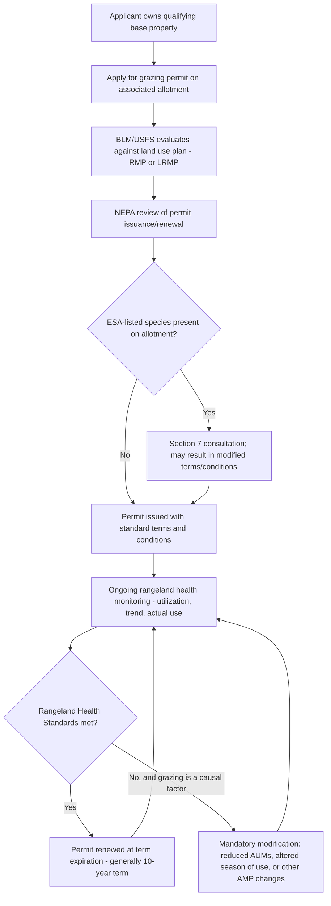

## Grazing Rights and Rangeland Management

### Overview and Statutory Foundations

Federal grazing on public lands is governed by a layered statutory framework built primarily on the Taylor Grazing Act of 1934, later integrated into the modern multiple-use planning system through the Federal Land Policy and Management Act of 1976 (FLPMA) and, for National Forest System lands, the Multiple-Use Sustained-Yield Act of 1960 and National Forest Management Act of 1976. Together these statutes establish a permit-based system granting private livestock operators authorized, but legally circumscribed, access to graze livestock on federal rangelands.

**Key Points**

- The Taylor Grazing Act (43 U.S.C. §§ 315 et seq.) was enacted in 1934 in direct response to severe rangeland degradation from unregulated open-range grazing, and it ended the prior era of the unrestricted public domain by establishing federal grazing districts and a permit system.
- BLM administers grazing on public lands primarily through Taylor Grazing Act authority as integrated with FLPMA's multiple-use planning framework; USFS administers grazing on National Forest System lands under its own multiple-use authorities (MUSYA, NFMA) and implementing regulations.
- Grazing is treated as one of several co-equal uses under the multiple-use standard (discussed in the companion topic on multiple use and sustained yield mandates), meaning grazing authorizations must be balanced against other resource values (wildlife habitat, watershed, recreation, threatened and endangered species) rather than enjoying automatic priority.

### The Grazing Permit System

**Key Points**

- Livestock grazing on BLM and USFS lands requires a **grazing permit** (BLM terminology) or **grazing permit/allotment authorization** (USFS terminology), authorizing a specified number of livestock (measured in **Animal Unit Months**, or AUMs — the amount of forage needed to sustain one animal unit, typically one cow-calf pair, for one month) on a defined **grazing allotment** for a specified season of use.
- Permits are typically issued for a term of 10 years, subject to renewal, modification, or cancellation based on rangeland conditions, changes in permitted use, or violations of permit terms.
- Permits are generally appurtenant to base property (private land or water rights the permittee owns), meaning the grazing privilege is legally tied to ownership of qualifying base property rather than existing as a freely transferable, independent property right — an important distinction that has generated substantial litigation regarding the legal nature of the grazing "privilege."
- Grazing fees are calculated under a statutory/regulatory formula (historically tied to a base rate adjusted annually based on forage value, beef cattle prices, and production costs) and have long been a subject of controversy, with critics arguing federal grazing fees are set substantially below fair market lease rates for comparable private rangeland. [Inference: the persistence of this criticism across decades reflects a long-running policy debate rather than a settled empirical consensus on appropriate fee levels.]

### Legal Nature of the Grazing Permit: Privilege, Not Property Right

**Key Points**

- A foundational and frequently litigated principle is that a federal grazing permit constitutes a **revocable privilege**, not a vested property right — a principle rooted in Section 3 of the Taylor Grazing Act itself, which explicitly states that the issuance of a permit "shall not create any right, title, interest, or estate in or to the lands."
- This distinction has significant practical consequences: permit modification, reduction, or cancellation in response to changed range conditions, resource protection needs (including ESA-driven habitat protection), or other public interest determinations generally does not constitute a compensable taking under the Fifth Amendment, because the permittee never held a property interest in the grazing privilege itself.
- Courts have nonetheless recognized that permittees may hold certain protectable procedural interests and, in some circumstances, compensable property interests in **range improvements** (fences, water developments, corrals) they constructed and own on the allotment, distinct from the underlying grazing privilege.
- This privilege-not-property framework parallels, and is often discussed alongside, similar doctrines governing other federal resource-use authorizations (mining claims prior to patent, water rights on federal land, and certain federal contract and license arrangements), reflecting a broader administrative law principle that government-conferred use authorizations on public resources are subject to the government's continuing regulatory authority.

### Rangeland Health Standards and Monitoring

**Key Points**

- BLM administers grazing under **Rangeland Health Standards and Guidelines**, regionally-tailored ecological benchmarks addressing soil stability, water quality, and the presence of healthy, productive plant and animal communities, adopted following the 1995 rangeland reform regulations.
- Permittees and BLM conduct periodic monitoring of range conditions (utilization levels, trend data, actual use records) to inform permit renewal, modification, and enforcement decisions; failure to meet rangeland health standards attributable to livestock grazing can result in mandatory permit modifications under BLM's implementing regulations.
- USFS applies analogous, though independently developed, rangeland monitoring and condition standards under its Land and Resource Management Plans, integrated with NFMA's broader diversity and sustained-yield planning requirements.
- **Allotment Management Plans (AMPs)** translate rangeland health standards into site-specific grazing management prescriptions for a given allotment (e.g., rotational grazing schedules, rest-rotation systems, stocking rate adjustments, and infrastructure such as fencing and water developments needed to implement the management scheme).

### Grazing Permit Lifecycle

### Interaction with the Endangered Species Act

**Key Points**

- Grazing allotments frequently overlap with habitat for ESA-listed species (e.g., greater sage-grouse, desert tortoise, various riparian-dependent fish and amphibian species), making Section 7 consultation and, where a federal nexus triggers consultation on permit issuance or renewal, resulting Biological Opinions and Incidental Take Statements a routine feature of grazing permit administration on many allotments.
- Litigation challenging grazing permit renewals on ESA grounds has been a recurring feature of public lands law for decades, often centered on whether BLM/USFS adequately analyzed and mitigated grazing-related impacts to listed species and their habitat (streambank degradation, riparian vegetation loss, forage competition) as part of the consultation process.
- Given the doctrinal significance of the 2026 rescission of the ESA's "harm" regulatory definition (discussed elsewhere in this course), grazing-related habitat degradation claims premised on indirect habitat modification rather than direct take may be significantly affected by that rescission, since much grazing-related species impact historically operates through habitat modification (riparian degradation, forage competition affecting food availability) rather than direct, intentional take of individual animals. [Inference: this represents a plausible doctrinal consequence of the 2026 rescission as applied to the grazing context specifically, rather than a documented outcome confirmed by case law addressing grazing allotments in particular.]

### Grazing on Wilderness and Other Special Management Areas

**Key Points**

- The Wilderness Act of 1964 contains an explicit "grandfather" provision preserving pre-existing grazing uses within designated wilderness areas, subject to reasonable regulation, reflecting a specific congressional accommodation for the historical prevalence of grazing across much of the western public land base that later received wilderness designation.
- Grazing within National Wildlife Refuges is subject to the compatibility determination standard discussed in connection with the Refuge System's dominant-use conservation mandate — grazing may be permitted only where FWS determines it is compatible with the refuge's conservation purposes, a materially more restrictive threshold than the BLM/USFS multiple-use standard.
- National Park Service units generally do not authorize ongoing commercial livestock grazing, consistent with the Park Service's non-impairment/conservation-predominant management standard, though limited historical or administrative exceptions exist at some units depending on specific enabling legislation.

### Comparative Table: Grazing Authorization Across Land Categories

| Land Category | Governing Framework | Grazing Standard |
| --- | --- | --- |
| BLM public lands | Taylor Grazing Act; FLPMA multiple use | Permit system; Rangeland Health Standards |
| National Forest System | MUSYA; NFMA | Permit system; USFS-specific rangeland monitoring |
| Designated Wilderness (any agency) | Wilderness Act | Pre-existing grazing grandfathered, subject to reasonable regulation |
| National Wildlife Refuges | Refuge Improvement Act 1997 | Compatibility determination required; conservation-dominant |
| National Park Service units | NPS Organic Act | Generally prohibited/limited; non-impairment standard |

### Range Improvements and Water Rights

**Key Points**

- Permittees frequently construct and maintain **range improvements** (fencing, stock ponds, wells, pipelines) on their allotments, typically under a cooperative agreement or permit-specific authorization with the managing agency, and disputes over ownership, cost-sharing, and removal obligations for these improvements upon permit termination are a recurring source of administrative and judicial disputes.
- **Stock water rights** present a particularly complex intersection of state water law (which generally governs the appropriation and ownership of water rights, including stockwater rights, even on federal land) and federal land management authority, with disputes periodically arising over whether the United States, the permittee, or both hold cognizable water rights associated with stock ponds and wells developed on federal allotments — an area where state water law and federal land management law intersect in ways that vary significantly by state.

### Illustrative Application

**Example**

A rancher holds a BLM grazing permit for 500 AUMs on a Nevada allotment that includes riparian habitat for a federally threatened desert fish species. At permit renewal, BLM must consult with FWS under ESA Section 7 given the federal nexus of permit reissuance. If riparian monitoring data show grazing-related streambank degradation inconsistent with Rangeland Health Standards and threatening the fish's habitat, BLM may modify the permit to reduce authorized AUMs, restrict the season of use to avoid critical breeding periods, or require fencing to exclude livestock from sensitive riparian segments — modifications the rancher cannot challenge as a compensable taking of a property right, given the Taylor Grazing Act's explicit disclaimer of vested property interests in the grazing privilege itself, though the rancher could still challenge the modification as arbitrary and capricious under the APA if the agency failed to adequately support its rangeland health findings.

**Related Topics**

- Federal land management agencies and their organic statutes
- Multiple use and sustained yield management mandates
- Section 7 ESA consultation in the grazing permit context
- The 2026 rescission of the regulatory definition of "harm" and its effect on grazing-related habitat claims
- The Wilderness Act and grandfathered pre-existing uses
- Compatibility determinations under the National Wildlife Refuge System Improvement Act
- State water law and federal land management authority over stockwater rights
- NEPA review of grazing permit issuance and renewal decisions