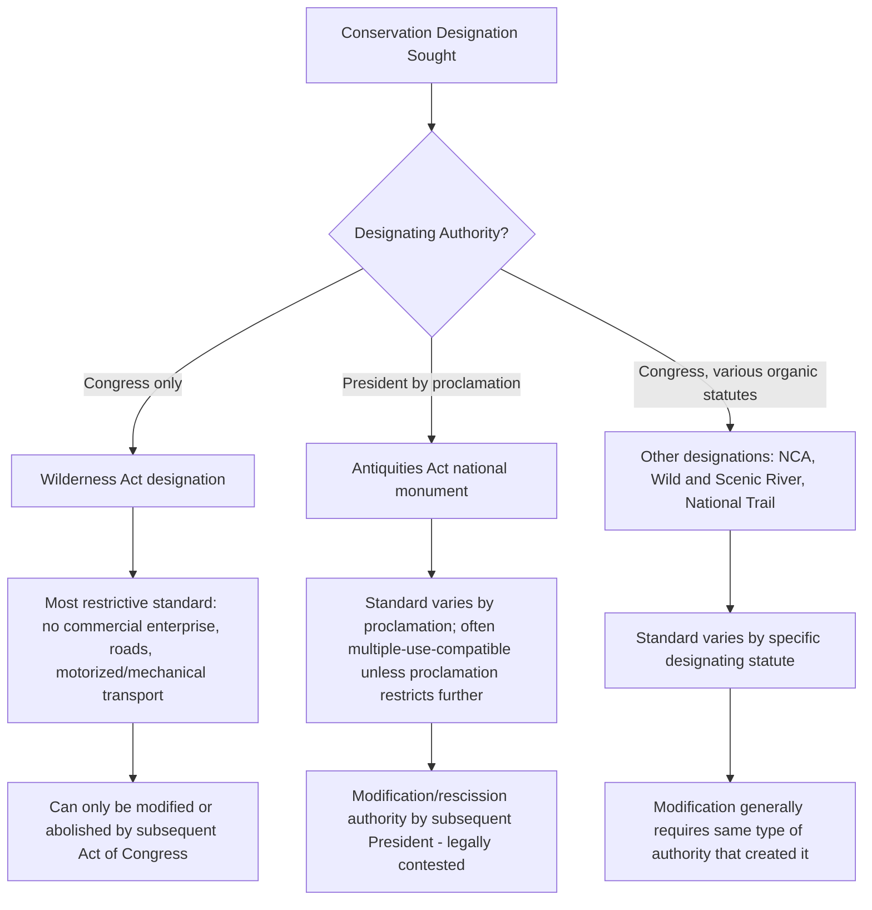

## Wilderness, Monument, and Other Conservation Designations

### Overview

Beyond the general multiple-use and dominant-use frameworks governing federal land agencies, Congress and the Executive Branch possess several distinct legal mechanisms for imposing heightened conservation protection on specific federal land areas: statutory wilderness designation, presidential national monument proclamation, and a range of other special designations (National Conservation Areas, Wild and Scenic Rivers, National Scenic and Historic Trails, and Areas of Critical Environmental Concern). Each mechanism has a distinct statutory source, a distinct designating authority, and a distinct management standard layered on top of the underlying agency's organic statute.

**Key Points**

- These designations can be layered onto lands administered by any of the four principal land management agencies (BLM, USFS, NPS, FWS), meaning a designated wilderness area or national monument does not change which agency administers the land, but does impose an additional, typically more restrictive, management standard on top of that agency's ordinary organic-statute authority.
- Congress holds exclusive authority to designate wilderness areas; the President holds independent statutory authority to proclaim national monuments; and a range of other designations may originate from either Congress or, in narrower circumstances, agency administrative action.
- Understanding which branch of government created a given designation, and under what statute, is essential to understanding both the designation's legal durability and the scope of subsequent executive or judicial authority to modify or rescind it.

### The Wilderness Act of 1964

**Statutory Basis and Definition**

**Key Points**

- The Wilderness Act (16 U.S.C. §§ 1131–1136) established the National Wilderness Preservation System and provides the most protective, restrictive management standard available within the federal lands system.
- The Act's famous statutory definition of wilderness (Section 2(c)) describes it as an area "where the earth and its community of life are untrammeled by man, where man himself is a visitor who does not remain," retaining its "primeval character and influence," generally appearing "to have been affected primarily by the forces of nature," with outstanding opportunities for solitude or primitive recreation, and possessing at least 5,000 acres or being of sufficient size to make practicable its preservation and use in an unimpaired condition (with some smaller exceptions for islands and similarly distinct areas).
- **Only Congress may designate wilderness areas** — there is no presidential or purely administrative wilderness-designation authority; each wilderness area is created by its own specific act of Congress, though the Wilderness Act's substantive management standard applies uniformly to all designated areas regardless of which statute created a particular one.

**Prohibited Uses**

- Section 4(c) of the Act prohibits, within designated wilderness, commercial enterprise, permanent roads, temporary roads, use of motor vehicles, motorized equipment, motorboats, landing of aircraft, and mechanical transport (including, per subsequent agency interpretation and litigation, mountain bikes), and structures or installations — subject to specific, narrowly drawn statutory exceptions.
- Statutory exceptions include: pre-existing mining claims and mineral leases validly established before wilderness designation (subject to a 1984 sunset on new mineral entry into most wilderness areas), grazing uses established prior to designation (the "grandfather" provision discussed in connection with rangeland management), use of aircraft or motorboats where such use had already become established prior to designation, and measures necessary to control fire, insects, and disease.
- Wilderness areas may be established on lands administered by any of the four principal agencies (BLM wilderness, National Forest wilderness, National Park wilderness, and Refuge System wilderness all exist), with each agency applying the Wilderness Act's substantive standard within its own broader organic-statute framework.

**Wilderness Study Areas**

- FLPMA (for BLM lands) and analogous authorities for other agencies established a process for identifying and administratively protecting **Wilderness Study Areas (WSAs)** — areas found to possess wilderness characteristics pending congressional decision on permanent designation — during which the administering agency must manage the area so as not to impair its suitability for wilderness designation (a "non-impairment" management standard pending Congress's ultimate decision to designate or release the area).

### National Monuments Under the Antiquities Act

**Statutory Basis**

**Key Points**

- The Antiquities Act of 1906 (16 U.S.C. §§ 431 et seq., now recodified at 54 U.S.C. §§ 320301–320303) authorizes the **President**, by proclamation, to declare national monuments on federal lands containing "historic landmarks, historic and prehistoric structures, and other objects of historic or scientific interest," reserving "the smallest area compatible with the proper care and management of the objects to be protected."
- Unlike wilderness designation, national monument proclamation does not require congressional action — it is an independent executive authority, historically used to protect areas ranging from small, discrete archaeological sites to vast landscape-scale monuments spanning millions of acres.
- Monument proclamations can be issued affecting lands administered by any of the four principal agencies, and the proclamation typically specifies which agency will administer the newly designated monument (often NPS or BLM, though USFS and FWS also administer certain monuments).

**Presidential Authority to Modify or Rescind Monuments**

- A significant and unresolved legal question concerns whether the President possesses authority under the Antiquities Act to substantially **reduce the size** of, or **rescind**, a previously designated national monument, given that the Act grants explicit authority to establish monuments but does not expressly address modification or revocation.
- This question has been squarely litigated in connection with 2017 proclamations substantially reducing the Bears Ears and Grand Staircase-Escalante National Monuments in Utah, with litigation addressing whether the Antiquities Act implicitly permits such reductions or whether only Congress can modify or abolish an existing monument; subsequent administrations restored the original monument boundaries by further proclamation before the underlying legal question was definitively resolved by the courts. [Unverified: the current, up-to-date litigation and boundary status of these specific monuments should be confirmed via search, as this is a recurring subject of administration-driven reversal and ongoing or renewed litigation.]
- [Inference] Because this presidential-authority question remains legally unsettled at the doctrinal level (as opposed to having been resolved through a definitive, controlling appellate or Supreme Court decision squarely addressing monument-reduction authority), each new administration's approach to modifying existing monuments continues to carry meaningful litigation risk, and practitioners should treat this as an active area of legal uncertainty rather than settled law.

### National Monuments vs. Wilderness: Key Distinctions

### National Conservation Areas and Other FLPMA-Era Designations

**Key Points**

- **National Conservation Areas (NCAs)** are congressionally designated areas on BLM lands managed to protect specific scientific, ecological, or scenic values, typically established by individual, area-specific statutes that define a management standard more protective than ordinary multiple use but generally less restrictive than full wilderness (often permitting continued grazing, dispersed recreation, and other compatible uses while prohibiting new mineral development or other higher-intensity uses).
- **Areas of Critical Environmental Concern (ACECs)** are an administrative (not congressional) designation available under FLPMA, allowing BLM to identify and apply special management attention to areas with significant historic, cultural, or scenic values, fish or wildlife resources, or natural hazards, through the land use planning process rather than requiring congressional action.
- **National Recreation Areas** similarly represent a congressionally or, in some contexts, administratively established designation emphasizing recreational use and access alongside resource protection, with specific management standards defined by the establishing statute.

### Wild and Scenic Rivers

**Key Points**

- The Wild and Scenic Rivers Act of 1968 (16 U.S.C. §§ 1271–1287) establishes a system for designating rivers (or river segments) possessing outstandingly remarkable scenic, recreational, geologic, fish and wildlife, historic, cultural, or other similar values, protecting them from dam construction and other federally licensed or assisted water resource development projects that would harm the values for which the river was designated.
- Designation may occur through direct congressional action or, for state-nominated rivers meeting specified criteria, through Secretarial (executive branch) designation upon state legislative request and gubernatorial application.
- Designated rivers are classified into three categories reflecting differing degrees of development and accessibility: **wild** (free of impoundment, generally inaccessible except by trail, primitive watersheds/shorelines), **scenic** (free of impoundment, shorelines largely undeveloped but accessible in places by roads), and **recreational** (readily accessible by road or railroad, may have undergone some impoundment or development in the past).
- A protective corridor (typically extending a specified distance from the riverbank) accompanies each designation, within which federal agencies must manage land to protect the river's designated values, though the underlying land ownership and administering agency (BLM, USFS, NPS, FWS) does not change as a result of Wild and Scenic designation.

### National Scenic and Historic Trails

**Key Points**

- The National Trails System Act of 1968 (16 U.S.C. §§ 1241–1251) establishes a framework for designating National Scenic Trails (long-distance trails providing outdoor recreation and enjoyment of significant scenic, historic, natural, or cultural qualities, e.g., the Appalachian Trail, Pacific Crest Trail) and National Historic Trails (commemorating historic routes of significant national historical importance, e.g., the Oregon Trail, Lewis and Clark Trail).
- Trail designations typically traverse lands administered by multiple different agencies and, frequently, private and state lands as well, requiring coordinated management agreements among the various administering entities and landowners along the trail corridor, distinguishing trail designations from more geographically consolidated designations like wilderness or national monuments.

### Comparative Table of Conservation Designations

| Designation | Governing Statute | Designating Authority | Relative Restrictiveness | Modification Authority |
| --- | --- | --- | --- | --- |
| Wilderness Area | Wilderness Act (1964) | Congress only | Highest — prohibits commercial enterprise, roads, motorized/mechanized use | Congress only |
| National Monument | Antiquities Act (1906) | President (proclamation) | Variable, set by proclamation | Presidential authority to reduce/rescind is legally contested |
| National Conservation Area | Area-specific congressional statute | Congress | Moderate — more protective than ordinary multiple use | Congress (or as specified by establishing statute) |
| Area of Critical Environmental Concern | FLPMA | BLM (administrative, via RMP) | Variable, set by planning decision | BLM, through subsequent plan amendment |
| Wild and Scenic River | Wild and Scenic Rivers Act (1968) | Congress or Secretarial designation (state-nominated) | Protects specific river-corridor values from development | Congress, or as provided by designating mechanism |
| National Scenic/Historic Trail | National Trails System Act (1968) | Congress | Corridor-specific; coordinated multi-agency management | Congress |

### Interaction with Multiple-Use and Extractive Development

**Key Points**

- Conservation designations generally operate as an overlay removing or restricting certain uses (particularly mineral development, motorized access, and commercial timber harvest) that would otherwise be available under the underlying agency's ordinary multiple-use standard, without transferring administrative jurisdiction to a different agency (a BLM wilderness area remains BLM-administered land, now subject to the more restrictive Wilderness Act standard in addition to FLPMA).
- This layering structure is central to understanding land-use conflicts in public lands law: a proposed mine, pipeline, or grazing allotment modification must be evaluated not only against the underlying agency's organic statute and land use plan but also against any applicable overlay designation that may categorically prohibit or substantially restrict the proposed use.
- National monument proclamations frequently include specific withdrawal language removing the designated area from mineral entry and, in many cases, from new oil and gas leasing, grazing modification, or other extractive uses — the precise scope of restriction depends on the specific proclamation's text rather than a single uniform monument-wide standard, since (unlike wilderness) the Antiquities Act does not impose a single statutorily fixed management regime applicable to every monument.

### Illustrative Application

**Example**

A tract of BLM land contains significant petroglyph sites, is bordered by a free-flowing river segment with outstanding scenic qualities, and includes an area with high-quality bighorn sheep habitat currently identified as a Wilderness Study Area. Depending on the path chosen, Congress could designate the WSA as permanent wilderness (imposing the Wilderness Act's full prohibition on roads and motorized use), designate the river segment under the Wild and Scenic Rivers Act (protecting it from dam or diversion development while permitting continued BLM multiple-use management outside the river corridor), and/or the President could proclaim some or all of the area a national monument under the Antiquities Act citing the petroglyph sites as "objects of historic or scientific interest" — with each mechanism producing different restrictions, different legal durability, and different vulnerability to subsequent modification, even though all three would be layered onto the same underlying BLM-administered land base.

**Related Topics**

- Federal land management agencies and their organic statutes
- Multiple use and sustained yield management mandates
- Mining law and the General Mining Act framework (interaction with mineral withdrawal in designated areas)
- Grazing rights and rangeland management (grandfathered grazing in wilderness)
- The Antiquities Act and presidential authority to modify national monuments
- Wilderness Study Areas and the FLPMA non-impairment management standard
- NEPA review requirements for designation-related land use plan amendments
- Litigation over the Bears Ears and Grand Staircase-Escalante National Monument boundary reductions