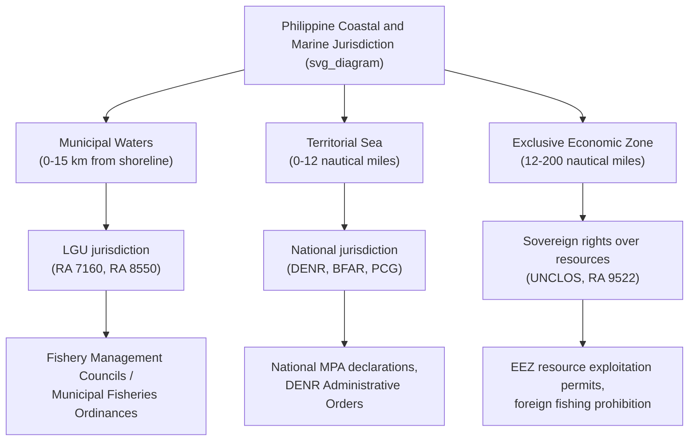
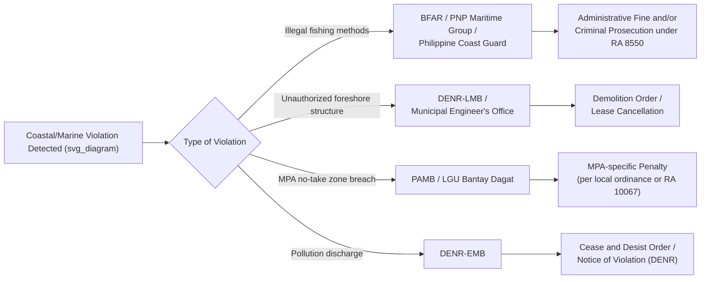

## Coastal Zone Management and Marine Protected Areas

### Conceptual Framework and Legal Basis

Coastal zone management (CZM) is the integrated administrative and legal framework governing the use, development, and conservation of the interface between land and sea — encompassing shorelines, foreshore areas, coastal waters, and adjacent terrestrial areas that influence or are influenced by coastal processes. In the Philippines, as an archipelagic state with over 36,000 km of coastline, CZM sits at the intersection of environmental law, local government law, and public lands/waters regulation.

**Key Points — Constitutional and Statutory Foundations**

- Article XII, Section 2 of the 1987 Constitution: all lands of the public domain, waters, and marine resources are owned by the State; the exploration, development, and utilization of natural resources are under the full control and supervision of the State
- The Regalian Doctrine extends to submerged lands, foreshore areas, and territorial waters, meaning coastal and marine resources cannot be privately titled absent specific statutory exception
- Republic Act No. 8550 (Philippine Fisheries Code of 1998, as amended by RA 10654) — primary statute governing municipal waters, fishery management areas, and marine protected areas
- Republic Act No. 7160 (Local Government Code of 1991) — devolves jurisdiction over municipal waters (15 km from shoreline) to cities/municipalities
- Republic Act No. 7586 (National Integrated Protected Areas System Act, as amended by RA 11038, the Expanded NIPAS Act) — governs terrestrial and marine protected area declarations
- Presidential Decree No. 1586 (Environmental Impact Statement System) — applies to coastal development projects as Environmentally Critical Areas/Projects

### Jurisdictional Architecture of Philippine Coastal Waters

**Key Points — Overlapping Jurisdiction Problem**

- Municipal waters (0–15 km) fall under LGU regulatory authority for fisheries management, but the underlying seabed/foreshore remains State-owned land requiring DENR foreshore lease agreements for any structure or reclamation
- This creates a recurring administrative law issue: an LGU ordinance regulating fishing activity operates alongside a separate national permitting requirement for any physical use of the same space (e.g., a resort's foreshore lease), producing potential regulatory conflict requiring careful jurisdictional analysis in disputes

### Marine Protected Areas: Legal Typology

**Example — MPA Categories Under Philippine Law**

1. **National MPAs under NIPAS** — declared by law or presidential proclamation, managed by a Protected Area Management Board (PAMB) chaired by the DENR Regional Executive Director, with representation from LGUs, indigenous peoples, and civil society (e.g., Tubbataha Reefs Natural Park, established by RA 10067)
2. **Locally-managed MPAs** — declared by municipal/city ordinance under the LGU's municipal waters jurisdiction pursuant to RA 8550 and RA 7160, typically smaller "no-take zones" or fish sanctuaries
3. **Community-based MPAs** — co-managed arrangements involving People's Organizations, often supported by Community-Based Forest/Coastal Resource Management Agreements
4. **Marine Key Biodiversity Areas** — identified through DENR-BMB scientific processes, which may or may not yet carry formal legal protection but influence EIA screening and land-use planning

### Tubbataha Reefs Natural Park: Case Study in MPA Governance

Tubbataha, a UNESCO World Heritage Site in the Sulu Sea, illustrates the most robust Philippine MPA governance model.

**Key Points**

- Governed by RA 10067 (Tubbataha Reefs Natural Park Act of 2009), which created a special statutory framework distinct from standard NIPAS management
- Managed by the Tubbataha Protected Area Management Board (TPAMB) with a dedicated Tubbataha Management Office and a Special Tubbataha Reefs Natural Park Fund financed by conservation fees, penalties, and grants
- Enforcement mechanism includes a Ranger Station with year-round presence, joint patrols with the Philippine Navy and Coast Guard, and a schedule of administrative fines distinct from general Fisheries Code penalties
- **Precedent significance**: The 2013 USS Guardian grounding incident tested the interaction between Philippine environmental/MPA law and international law governing warship immunity — the Philippines pursued and obtained a settlement/compensation from the United States for reef damage despite sovereign immunity considerations, illustrating the practical limits and diplomatic dimensions of domestic MPA enforcement against foreign state actors

### Fisheries Code Framework for Coastal Resource Management

**Key Points — RA 8550 as amended by RA 10654 (2015)**

- Establishes Fisheries and Aquatic Resources Management Councils (FARMCs) at municipal, city, and integrated levels — a co-management mechanism mandating participation of fisherfolk organizations in local fishery ordinance formulation
- Reserves municipal waters exclusively for municipal/small-scale fisherfolk, prohibiting commercial fishing vessels (subject to limited exceptions requiring municipal ordinance authorization for vessels 3.1–7.99 GT in waters beyond 10.1 km, per specific zonation)
- RA 10654 significantly increased penalties and introduced the concept of "commercial fishing vessel" tracking via the Vessel Monitoring Measures, responding to the 2014 European Union "yellow card" warning under EU IUU (Illegal, Unreported, and Unregulated) fishing regulations
- Established close season declarations (e.g., the annual sardine closed season in the Visayan Sea under Fisheries Administrative Order 167) as a science-based stock management tool

**Example**

The Visayan Sea Sardine Closed Season, imposed annually (typically November 15–February 15) under a Bureau of Fisheries and Aquatic Resources (BFAR) Fisheries Administrative Order, prohibits sardine fishing in the Visayan Sea during peak spawning season. This is a recurring illustration of adaptive fisheries management combining scientific stock assessment with administrative rule-making under delegated authority from RA 8550.

### Integrated Coastal Management (ICM) as Administrative Methodology

ICM is the planning methodology (rather than a single statute) through which national agencies and LGUs are expected to coordinate coastal governance across sectors.

**Key Points**

- DENR's ICM framework, operationalized through the Integrated Coastal Management Program, promotes a cyclical planning process: issue identification, program preparation, formal adoption, implementation, monitoring, and evaluation
- Requires horizontal coordination among DENR (environmental regulation), BFAR (fisheries), DA (agriculture linkages), DOT (tourism), DILG (LGU oversight), and PPA (ports), alongside vertical coordination between national agencies and coastal LGUs
- The National Coastal and Marine Management Framework provides policy guidance, though ICM implementation quality varies significantly by LGU capacity — [Inference] a persistent implementation gap frequently identified in Commission on Audit and academic assessments of coastal governance, though the specific extent varies by region and is not uniformly documented nationwide

### Environmental Impact Assessment for Coastal Development

**Key Points**

- Coastal areas, particularly those with mangroves, coral reefs, and seagrass beds, are classified as Environmentally Critical Areas under PD 1586's Implementing Rules, triggering mandatory Environmental Impact Statement (EIS) requirements for covered projects regardless of project scale
- Foreshore lease applications for reclamation, resorts, ports, and similar structures require both an Environmental Compliance Certificate (ECC) from DENR-EMB and a separate foreshore lease agreement from DENR-Lands Management Bureau
- Reclamation projects face additional layers: Philippine Reclamation Authority (PRA) approval, local government endorsement, and — following jurisprudence such as *Chavez v. NHA* and related reclamation cases — heightened scrutiny regarding the alienability of reclaimed land under the Regalian Doctrine

### Mangrove and Coastal Ecosystem Protection

**Key Points**

- Mangroves are classified as forest lands under the Revised Forestry Code (PD 705) even where tidally influenced, placing them under DENR jurisdiction rather than BFAR, despite their marine ecological function
- RA 8550 explicitly prohibits conversion of mangrove areas into fishponds except in limited, already-existing/legally-vested circumstances, reversing the historic policy (under earlier fishpond lease agreement regimes) that had encouraged mangrove-to-fishpond conversion
- Coral reef protection is reinforced through specific prohibitions on destructive fishing methods (blast fishing, cyanide fishing, muro-ami) under RA 8550, carrying both administrative penalties and criminal liability

### Enforcement Architecture and Multi-Agency Coordination

### Climate Change and Coastal Vulnerability Integration

**Key Points**

- RA 9729 (Climate Change Act, as amended by RA 10174) requires integration of climate risk (sea level rise, storm surge) into Local Climate Change Action Plans, which must align with Comprehensive Land Use Plans covering coastal zones
- RA 10121 (Philippine Disaster Risk Reduction and Management Act) mandates no-build zones in high-risk coastal areas following storm surge hazard mapping, a policy significantly reinforced after Typhoon Yolanda/Haiyan (2013)
- Coastal setback requirements interact with the easement provisions of the Water Code (PD 1067), which reserves a three-meter (urban), twenty-meter (agricultural), or forty-meter (forest) easement along the shore for public use, recreation, and navigation, and CZM planning must reconcile this legal easement with disaster-driven no-build zone determinations that may require greater setbacks

### Administrative Law Doctrines Specifically Engaged in Coastal Disputes

**Key Points**

- **Exhaustion of administrative remedies**: Disputes over foreshore lease denials or MPA boundary determinations generally must proceed through DENR's internal appeal process before judicial review is available
- **Primary jurisdiction doctrine**: Courts routinely defer initial resolution of technical coastal resource classification questions (e.g., whether an area is foreshore, mangrove, or alienable land) to DENR's technical expertise
- **Police power versus eminent domain distinction**: MPA no-take zone declarations restricting fishing access are generally sustained as valid exercises of police power for resource conservation rather than compensable takings, though this characterization can be contested where restrictions effectively deprive long-term users of all economically viable use
- **Public trust doctrine**: Philippine jurisprudence (echoing *Oposa v. Factoran* principles on intergenerational responsibility) has been invoked to argue that coastal and marine resources are held in trust for present and future generations, reinforcing the State's non-delegable duty to regulate rather than merely permit private exploitation

### Comparative Note: International Frameworks Influencing Domestic CZM

**Key Points**

- UNCLOS (United Nations Convention on the Law of the Sea), ratified by the Philippines and implemented through RA 9522 (Baselines Law), establishes the outer jurisdictional framework within which domestic municipal waters and EEZ regulation operate
- The 2016 South China Sea Arbitral Award (*Philippines v. China*) clarified maritime entitlements and environmental obligations regarding coral reef destruction in disputed areas, reinforcing that environmental protection duties under UNCLOS Article 192 operate independently of unresolved sovereignty questions
- ASEAN's Coral Triangle Initiative on Coral Reefs, Fisheries, and Food Security functions as a transnational regulatory network (see comparative GAL frameworks) shaping Philippine MPA network design standards, particularly regarding MPA network connectivity and representativeness targets

**Next Steps**

- Foreshore lease agreements and reclamation law under the Regalian Doctrine
- The Fisheries and Aquatic Resources Management Council (FARMC) co-management model in depth
- Water Code easements and their interaction with coastal setback regulation
- *Oposa v. Factoran* and the public trust/intergenerational equity doctrine in Philippine environmental law
- EIA System (PD 1586) procedural requirements for Environmentally Critical Projects
- Illegal, Unreported, and Unregulated (IUU) fishing regulation and the EU market-access "yellow card" mechanism
- Protected Area Management Board composition and decision-making under the Expanded NIPAS Act