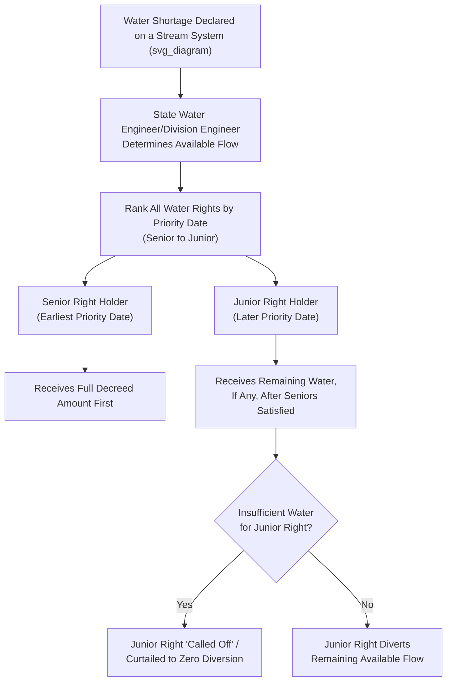

## Prior Appropriation Systems in the Western United States

### Conceptual Foundations

The prior appropriation doctrine is a water rights allocation system that emerged in the arid and semi-arid western United States during the 19th-century mining and settlement era, fundamentally distinct from the riparian doctrine that governs water rights in the eastern United States. Its foundational maxim is "first in time, first in right" — the entity that first diverts water and applies it to a beneficial use acquires a legally protected right superior to all subsequent appropriators, regardless of whether that entity owns land adjacent to the water source.

**Key Points**

- Water rights under prior appropriation are use-based and severable from land ownership, unlike riparian rights which attach automatically to land bordering a watercourse
- The doctrine developed organically from customary practices among California gold miners in the 1850s who needed water diverted to mining sites often far from any stream, later codified into state constitutions and statutes
- Nine western states (Colorado, Idaho, Montana, Nevada, New Mexico, Utah, Arizona, Wyoming, and Alaska) follow "pure" prior appropriation exclusively; eight others (California, Oregon, Washington, Texas, Kansas, Nebraska, South Dakota, North Dakota) operate "hybrid" or "dual" systems recognizing both riparian and appropriative rights

### Riparian vs. Prior Appropriation: Comparative Framework

| Dimension | Riparian Doctrine | Prior Appropriation Doctrine |
| --- | --- | --- |
| Basis of right | Land ownership adjacent to water | Actual diversion and beneficial use |
| Priority during shortage | Shared reasonable use among all riparians | Strict seniority ("first in time, first in right") |
| Transferability | Generally tied to land, limited severability | Freely transferable/severable from land (with restrictions) |
| Loss of right | Rarely lost through non-use | Can be lost through abandonment or forfeiture (non-use) |
| Quantification | Generally unquantified ("reasonable use") | Precisely quantified (specific volume/flow rate) |
| Administrative structure | Judicial, case-by-case | Permit-based administrative system with state water engineer/board |

### The Elwood Mead Model and Administrative Permit Systems

Wyoming pioneered the administrative permit-based model for prior appropriation in its 1890 constitution, largely architected by state engineer Elwood Mead, which became the template most western states subsequently adopted.

**Key Points — Core Administrative Elements**

- Centralizes water rights determination in a state water engineer or state engineer's office/water resources board, replacing purely judicial adjudication with an administrative permitting process
- Requires a formal application specifying point of diversion, place of use, purpose of use, and quantity requested, subject to agency review before a permit is issued
- Establishes the "Wyoming model" or "Colorado doctrine" administrative sequence: application → permit → construction → beneficial use → issuance of a certificate/adjudicated decree confirming the perfected right
- [Inference] Most prior appropriation states have converged toward some version of this administrative permit model, though Colorado notably retains a distinctively judicial system administered through specialized Water Courts rather than a pure administrative permit board, reflecting variation in institutional design across the doctrine's adopting states

### Elements Required to Establish a Valid Appropriative Right

**Example — The Three Essential Elements**

1. **Intent to appropriate** — a bona fide intention to apply water to beneficial use, evidenced by filing an application or, in early common-law-era claims, by physical acts demonstrating intent
2. **Diversion** — actual physical removal of water from its natural source via a ditch, canal, pump, or other diversion structure (some jurisdictions recognize limited exceptions for in-stream/instream flow rights, discussed below)
3. **Beneficial use** — the water must be applied to a use recognized by law as beneficial (irrigation, municipal supply, mining, industrial use, stockwatering, and increasingly recreational and environmental/instream uses)

**Key Points — "Beneficial Use" as the Measure and Limit of the Right**

- The often-cited maxim "beneficial use is the basis, measure, and limit of a water right" means the right is capped at the amount actually and reasonably necessary for the appropriator's beneficial purpose, not the full amount diverted
- Waste or non-beneficial application of appropriated water (e.g., excessive flood irrigation without conservation) can subject a right to challenge or curtailment in several jurisdictions
- The definition of "beneficial use" has evolved significantly over time, historically favoring extractive/consumptive uses (mining, agriculture) and only later expanding to recognize instream flows, recreation, and environmental preservation as beneficial in many states

### Priority Administration: The "First in Time, First in Right" Mechanism

**Example**

In a "priority call" (or "water call"), a senior appropriator whose water right is not being satisfied can call on the water commissioner/division engineer to shut off or curtail diversions by junior appropriators upstream, even if those junior users have valid permits, until the senior's full decreed right is satisfied. This is the doctrine's central enforcement mechanism and distinguishes it sharply from riparian systems, where shortages are shared proportionally rather than allocated strictly by seniority.

### Loss and Forfeiture of Appropriative Rights

**Key Points**

- **Abandonment**: Loss of a water right through demonstrated intent to permanently relinquish it, requiring both non-use and clear intent — a common-law doctrine requiring more than mere non-use
- **Statutory forfeiture**: Most prior appropriation states impose a statutory non-use period (commonly measured in a specified number of consecutive years) after which a right is subject to forfeiture regardless of subjective intent, though the specific triggering period and procedural requirements vary by state statute
- **"Use it or lose it" critique**: This forfeiture-for-non-use structure has been criticized as creating a perverse incentive against water conservation, since reducing consumption below the full decreed amount risks partial forfeiture of the unused portion — a significant driver of modern water law reform efforts around conserved-water and water-banking provisions

### Transferability and the "No Injury" Rule

**Key Points**

- Appropriative water rights, unlike most riparian rights, can generally be sold, leased, or transferred separately from the land on which they originated, subject to state approval
- Transfers are constrained by the **no-injury rule**: a proposed change in point of diversion, place of use, purpose of use, or time of use cannot be approved if it would injure other existing water rights holders, particularly by altering the timing or quantity of return flows relied upon by downstream junior appropriators
- This creates significant transactional complexity in water markets, since a transfer application typically requires engineering analysis of historical consumptive use and return flow patterns, and can be challenged by any water right holder claiming potential injury

### Groundwater Integration and Conjunctive Management

**Key Points**

- Historically, groundwater and surface water were regulated as separate legal regimes even where hydrologically connected, but most prior appropriation states have moved toward **conjunctive management** — administering hydrologically connected groundwater and surface water under a unified priority system
- Colorado's post-1969 groundwater administration (following the Water Right Determination and Administration Act) is a prominent example requiring augmentation plans for junior groundwater wells that deplete water hydrologically connected to senior surface rights
- [Inference] The degree of integration between groundwater and surface water administration remains uneven across appropriation states, with some jurisdictions retaining largely separate permitting tracks for groundwater despite scientific recognition of hydrologic connectivity, reflecting the significant institutional and political difficulty of retrofitting conjunctive management onto historically bifurcated legal regimes

### Instream Flow Rights and Environmental Beneficial Use

**Key Points**

- Traditional prior appropriation required physical diversion, which structurally excluded environmental/ecological water uses (leaving water in the stream) from qualifying as an appropriable beneficial use
- Beginning in the 1970s–1980s, most western states enacted statutory instream flow programs allowing a state agency (rather than private parties) to hold appropriative rights for maintaining minimum stream flows for fish, wildlife, and recreation, without physical diversion
- These instream flow rights are typically junior in priority (since they were only recently authorized), meaning they are frequently the first curtailed during shortage, limiting their practical effectiveness relative to senior consumptive rights established a century earlier
- **Example**: Colorado's Instream Flow Program, administered by the Colorado Water Conservation Board, holds the exclusive statutory authority to appropriate instream flow rights in that state, reflecting a deliberate policy choice to prevent private instream rights while still recognizing the beneficial use category

### General Stream Adjudications

**Key Points**

- A general stream adjudication is a comprehensive judicial or administrative proceeding to determine, quantify, and rank all water rights claims on an entire river system in a single consolidated action, producing a final decree that establishes each right's priority date and quantity
- These proceedings can take decades to complete due to the volume of claims and the complexity of historical evidence required (particularly for pre-statehood or federal reserved rights claims)
- Necessary because informal or piecemeal permit issuance over a century leaves substantial uncertainty about actual relative priority across an entire basin, which becomes critical precisely when scarcity triggers priority administration

### Federal Reserved Water Rights Doctrine

**Key Points**

- Established in *Winters v. United States* (1908), the federal reserved rights doctrine holds that when the federal government reserves land for a specific purpose (Indian reservations, national forests, national parks), it implicitly reserves sufficient water to fulfill that purpose, with a priority date as of the reservation's creation — potentially senior to many state-permitted appropriative rights
- **Winters rights** (reserved rights for Indian reservations) are quantified according to the *Arizona v. California* (1963) standard, typically measured by the amount of practicably irrigable acreage on the reservation, and are not subject to state law forfeiture-for-non-use doctrines
- This doctrine creates significant tension with state-administered prior appropriation systems because federal/tribal reserved rights, though often unquantified for decades after their creation, can claim a priority date predating virtually all state-permitted rights on the same stream system once formally adjudicated, disrupting settled expectations among state-law appropriators

### The Colorado River Compact as Interstate Prior Appropriation

**Example**

The 1922 Colorado River Compact allocates Colorado River water between the Upper Basin (Colorado, New Mexico, Utah, Wyoming) and Lower Basin (Arizona, California, Nevada) states using an interstate variant of prior appropriation logic, apportioning fixed annual quantities rather than percentages. This compact-based apportionment, combined with subsequent Supreme Court decrees (*Arizona v. California*) and administrative guidelines, illustrates how prior appropriation principles scale from intrastate stream administration to complex interstate and international (Mexico, via the 1944 treaty) water allocation frameworks, and how prolonged drought conditions in the Colorado River Basin have driven recent multi-state shortage-sharing agreements built on this priority architecture.

### Administrative Law Doctrines Distinctive to Water Rights Adjudication

**Key Points**

- **Special statutory tribunals**: Colorado's Water Court system exemplifies a specialized judicial forum for water matters, distinct from general civil courts, staffed by judges with water law expertise and supported by a Water Referee and the state Division Engineer's technical input
- **Standard of review for state engineer determinations**: Judicial review of state engineer permit decisions and priority administration actions typically applies a substantial-evidence or arbitrary-and-capricious standard, respecting the technical/hydrological expertise embedded in these agencies
- **Res judicata and continuing jurisdiction**: General stream adjudication decrees typically retain continuing court/agency jurisdiction to address subsequent changes, transfers, or newly discovered claims, distinguishing water law finality principles from ordinary civil judgment finality

### Comparative Relevance to Philippine and Civil Law Water Systems

**Key Points**

- Philippine water law under the Water Code (PD 1067) follows a fundamentally different allocation philosophy — a permit-based system administered by the National Water Resources Board, but grounded in the civil law tradition where all waters belong to the State (Regalian Doctrine) and are allocated through administrative water permits rather than a common-law priority hierarchy
- [Inference] While the Philippine system shares administrative permit mechanics with the western U.S. model (application, permit, beneficial use requirement), it does not employ the same strict seniority-based curtailment mechanism during shortage, instead relying on NWRB's administrative discretion and the Water Code's use-preference hierarchy (domestic use generally prioritized over irrigation, which is prioritized over other uses) — a structurally different method of resolving scarcity than the "first in time, first in right" call system
- This comparison is useful for administrative law students to distinguish common-law customary origins (prior appropriation) from civil-law statutory/administrative origins (Philippine Water Code) even where both ultimately rely on administrative permitting bodies

### Related Topics

- Riparian doctrine and hybrid dual-system states (California, Texas)
- Winters v. United States and the federal reserved water rights doctrine in depth
- Colorado River Compact and interstate water apportionment litigation
- Groundwater conjunctive management and augmentation plans
- Instream flow rights and the "no diversion" beneficial use exception
- General stream adjudication procedure and evidentiary challenges
- The Philippine Water Code (PD 1067) and NWRB permit allocation compared to appropriative systems
- Water markets, water banking, and conserved-water legislation as responses to the forfeiture problem