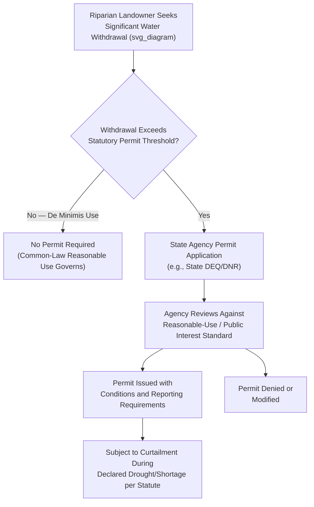

## Riparian Rights Systems in the Eastern United States

### Conceptual Foundations

The riparian doctrine is a water rights allocation system rooted in English common law that governs water use in the eastern and midwestern United States, where relative water abundance historically made land-based, shared-use allocation viable — in contrast to the scarcity-driven prior appropriation doctrine of the arid West. Under riparian law, the right to use water derives from and is inseparably attached to ownership of land bordering (or overlying) a natural watercourse.

**Key Points**

- "Riparian" derives from the Latin *ripa* (riverbank); a riparian owner is one whose land physically touches a stream, river, or lake
- The doctrine was received into American law as part of the general reception of English common law by the original thirteen colonies and subsequently adopted states east of approximately the 100th meridian
- Unlike prior appropriation, riparian rights are not acquired through use, are not lost through non-use, and are not generally quantified in advance — they exist as an incident of land ownership itself
- Roughly 31 eastern and midwestern states follow riparian doctrine in some form, with the majority having transitioned from "natural flow" to "reasonable use" or fully "regulated riparian" (permit-based) variants over the past century

### The Natural Flow Theory (Classical/Early Riparianism)

**Key Points**

- The earliest American formulation, the natural flow theory, held that each riparian owner was entitled to have the stream flow past their land in its natural state, undiminished in quantity and unaltered in quality, subject only to minor domestic uses by upstream riparians
- This theory proved poorly suited to industrializing 19th-century America because it effectively prohibited any substantial upstream consumptive use (irrigation, milling, manufacturing) that would measurably reduce flow to downstream riparians
- Courts progressively abandoned strict natural flow theory in favor of the more flexible reasonable use rule, recognizing that some diminishment of flow was inevitable and economically necessary

### The Reasonable Use Rule (Modern American Riparianism)

The reasonable use rule, articulated in the *Restatement (Second) of Torts* §850–850A, is the dominant riparian standard in most eastern states today.

**Key Points — Core Principle**

- Each riparian owner may make reasonable use of the water, and is entitled to be free from unreasonable interference by other riparians; reasonableness is determined by weighing the utility of the use against the harm caused to other riparian users
- No riparian has an absolute quantified entitlement; rights are correlative and relative to the reasonable needs of all other riparians on the same watercourse
- Reasonableness is assessed case-by-case at the time of dispute (ex post), which creates inherent legal uncertainty compared to prior appropriation's clearly quantified and prioritized rights

**Example — Restatement (Second) of Torts §850A Reasonableness Factors**

1. The purpose of the use (domestic use is typically favored over commercial or industrial use)
2. The suitability of the use to the watercourse
3. The economic value of the use
4. The social value of the use
5. The extent and amount of harm caused
6. The practicality of avoiding harm by adjusting the use or method of use
7. The practicality of adjusting the quantity of water used by each proprietor
8. The protection of existing values of water uses, land, investments, and enterprises
9. The justice of requiring the user causing harm to bear the loss

### Riparian vs. Prior Appropriation: Comparative Framework

| Dimension | Riparian Doctrine | Prior Appropriation Doctrine |
| --- | --- | --- |
| Basis of right | Land ownership adjacent/overlying water | Actual diversion and beneficial use |
| Priority during shortage | Shared reasonable use among all riparians | Strict seniority ("first in time, first in right") |
| Quantification | Generally unquantified, assessed case-by-case | Precisely quantified (specific volume/flow rate) |
| Transferability | Tied to riparian land; limited severability | Freely transferable/severable from land |
| Loss of right | Not lost through non-use | Can be lost through abandonment/forfeiture |
| Dominant administrative form | Historically judicial (tort-based litigation) | Administrative permit systems |
| New use by new owner | Automatically available upon acquiring riparian land | Requires new application/permit |

### Categories of Riparian Land and Extent of Rights

**Key Points**

- Riparian rights attach only to the smallest tract held under one title that has water frontage — subdividing riparian land does not automatically create new riparian rights for the severed non-riparian parcel (the "unity of title" or "source of title" rule)
- Riparian rights extend to the entire watershed of the tract in most jurisdictions, meaning water may generally be used on any part of the riparian owner's contiguous land within the same watercourse's drainage basin, though many states restrict use to the specific parcel actually bordering the water
- Distinction is drawn between **natural uses** (domestic drinking water, household needs, watering livestock) which receive priority protection even under scarcity, and **artificial uses** (irrigation, manufacturing, commercial/industrial application) which are subject to full reasonable-use balancing against other riparians

### Riparian Rights and Groundwater: The Reasonable Use/American Rule

**Key Points**

- Groundwater in most riparian states is governed by an analogous "reasonable use" or "American rule," permitting a landowner to withdraw groundwater for reasonable use on the overlying land, but restricting use that unreasonably harms neighboring wells, distinguishing it from the older, now largely abandoned "absolute ownership" or "English rule" allowing unlimited withdrawal regardless of effect on neighbors
- The Restatement (Second) of Torts §858 extends similar reasonableness balancing to groundwater withdrawal as applies to surface riparian use, reflecting judicial recognition of hydrologic connectivity between groundwater and surface water systems

### Transition to Regulated Riparianism: The Modern Permit Model

Beginning in the mid-20th century, most eastern states supplemented or replaced pure common-law riparianism with statutory permit systems — a hybrid model often called "regulated riparianism."

**Key Points — Drivers of the Shift**

- Population growth, industrialization, and periodic droughts (notably in the southeastern U.S.) exposed the practical inadequacy of case-by-case litigated reasonableness for managing water scarcity at scale
- Regulated riparian statutes typically require a state permit for water withdrawals above a specified threshold, administered by a state environmental or natural resources agency, while still nominally preserving riparian land-based eligibility as a threshold requirement in some states
- The **Regulated Riparian Model Water Code**, developed by the American Society of Civil Engineers, has substantially influenced state legislative reform, though state implementation varies considerably

**Example**

Florida's Water Resources Act (Chapter 373, Florida Statutes) requires Consumptive Use Permits from regional Water Management Districts for withdrawals exceeding specified thresholds, applying a three-part statutory reasonableness test: the use must be a reasonable-beneficial use, must not interfere with existing legal users, and must be consistent with the public interest. This exemplifies regulated riparianism's fusion of common-law reasonableness language with administrative permitting structure.

### Riparian Rights to Navigable Waters: Public Trust Doctrine Interaction

**Key Points**

- Riparian ownership of land bordering navigable waters is subject to the public trust doctrine, under which the state holds title to the beds of navigable waters (and, in many states, the water itself) in trust for the public's use for navigation, fishing, and commerce
- Riparian owners on navigable waters typically hold specific "riparian" or "littoral" rights distinct from full ownership: rights of access to the water, the right to build a wharf or pier (wharfage rights), the right to accretion (gradual natural land deposit), and the right to reasonable use of the water, but not exclusive ownership of the submerged land or the water column itself
- This doctrine parallels, and shares conceptual lineage with, the Philippine Regalian Doctrine's treatment of foreshore and submerged lands as inalienable public domain, though the American public trust doctrine developed through judicial common-law elaboration (originating in *Illinois Central Railroad v. Illinois*, 1892) rather than constitutional declaration

### Interstate Riparian Disputes and Equitable Apportionment

**Key Points**

- Because riparian rights are not tied to a fixed quantified allocation, interstate disputes between riparian states over shared rivers cannot be resolved through simple priority-date comparison as in prior appropriation compacts; instead, the U.S. Supreme Court applies the doctrine of **equitable apportionment**
- Equitable apportionment balances multiple factors — historical use patterns, economic dependence, conservation efforts, and comparative harm — to divide interstate river flows between riparian states, as seen in disputes such as the decades-long Alabama-Coosa-Tallapoosa and Apalachicola-Chattahoochee-Flint river basin litigation between Georgia, Alabama, and Florida
- [Inference] The absence of a quantified priority system in riparian states tends to make interstate equitable apportionment litigation more protracted and evidence-intensive than prior appropriation-based interstate compacts, since courts must construct an allocation formula from competing reasonableness claims rather than rank existing decreed rights, though outcomes and litigation duration vary considerably by case

### Riparian Doctrine and Modern Drought Litigation

**Example**

The "Tri-State Water Wars" among Georgia, Alabama, and Florida over the Apalachicola-Chattahoochee-Flint (ACF) and Alabama-Coosa-Tallapoosa (ACT) river basins, litigated intermittently from the 1990s through a 2021 Supreme Court decision (*Florida v. Georgia*), illustrate how population growth in traditionally water-abundant riparian states (metropolitan Atlanta's growth as the primary driver) can produce prior-appropriation-style scarcity conflicts within a riparian legal framework never designed for zero-sum allocation, forcing courts to import equitable apportionment principles more commonly associated with interstate prior appropriation disputes.

### Dual/Hybrid System States

**Key Points**

- Several states, most notably California, Texas, Oklahoma, Kansas, Nebraska, South Dakota, North Dakota, Mississippi, and Washington, recognize both riparian and appropriative rights within the same jurisdiction, typically because riparian doctrine was inherited from common law while appropriative rights developed later through mining-era customary practice or statute
- These hybrid states generally resolve the friction by treating existing (vested, pre-code) riparian rights as senior to subsequently created appropriative rights, while requiring all new water rights (riparian or appropriative) created after a specified statutory date to be obtained through the permit system
- California's system is the most complex hybrid, layering pre-1914 appropriative rights, post-1914 permitted appropriative rights, and riparian rights (further complicated by pueblo rights and groundwater's historically separate treatment) into a famously intricate priority hierarchy that has generated extensive administrative and judicial litigation, particularly during California's recurring drought cycles

### Administrative Law Dimensions of Riparian Litigation

**Key Points**

- **Judicial versus administrative resolution**: Pure common-law riparian disputes are resolved through ordinary civil litigation (nuisance/tort framework) rather than specialized administrative tribunals, in contrast to prior appropriation's dedicated water courts or engineer-driven administrative process — though regulated riparian states increasingly channel disputes through agency permit proceedings subject to standard administrative review
- **Standard of review in regulated riparian permitting**: Judicial review of state agency consumptive-use permit decisions typically applies an arbitrary-and-capricious or substantial-evidence standard, similar to prior appropriation permit review, reflecting convergence in administrative methodology even where the underlying substantive doctrine differs
- **Public interest balancing tests**: Many regulated riparian statutes require agencies to weigh a broader "public interest" standard beyond simple inter-riparian reasonableness, incorporating environmental, recreational, and public water supply considerations absent from classical common-law riparianism

### Comparative Relevance to Philippine and Civil Law Water Systems

**Key Points**

- The Philippine Water Code (PD 1067) rejects both riparian land-based entitlement and pure prior appropriation seniority, instead vesting all waters in the State under the Regalian Doctrine and allocating use exclusively through National Water Resources Board permits, with a statutory use-preference hierarchy (domestic use generally prioritized, followed by municipal, irrigation, and other uses) rather than either a reasonableness balancing test or a strict priority-date call system
- [Inference] The Philippine model shares more structural similarity with regulated riparianism's permit-and-agency-discretion approach than with classical common-law riparianism's tort-based reasonableness litigation, since both rely on ex ante administrative permitting rather than ex post judicial balancing, though the Philippine system's civil-law statutory use-preference hierarchy operates differently from the case-specific multi-factor reasonableness tests found in the Restatement framework
- This comparison is useful for distinguishing common-law doctrinal evolution (natural flow → reasonable use → regulated riparianism) from the Philippine civil-law tradition's direct administrative allocation model, illustrating two different institutional paths toward managing water scarcity under State/public ownership assumptions

### Related Topics

- Prior appropriation systems in the western United States (comparative doctrine)
- The public trust doctrine and navigable waters (*Illinois Central Railroad v. Illinois*)
- Equitable apportionment and interstate river basin litigation
- Regulated riparianism and the ASCE Model Water Code
- Groundwater's "American rule" (reasonable use) versus "English rule" (absolute ownership)
- California's hybrid riparian-appropriative water rights system
- The Philippine Water Code (PD 1067) use-preference hierarchy compared to riparian reasonableness balancing
- Drought contingency planning and curtailment authority in regulated riparian statutes