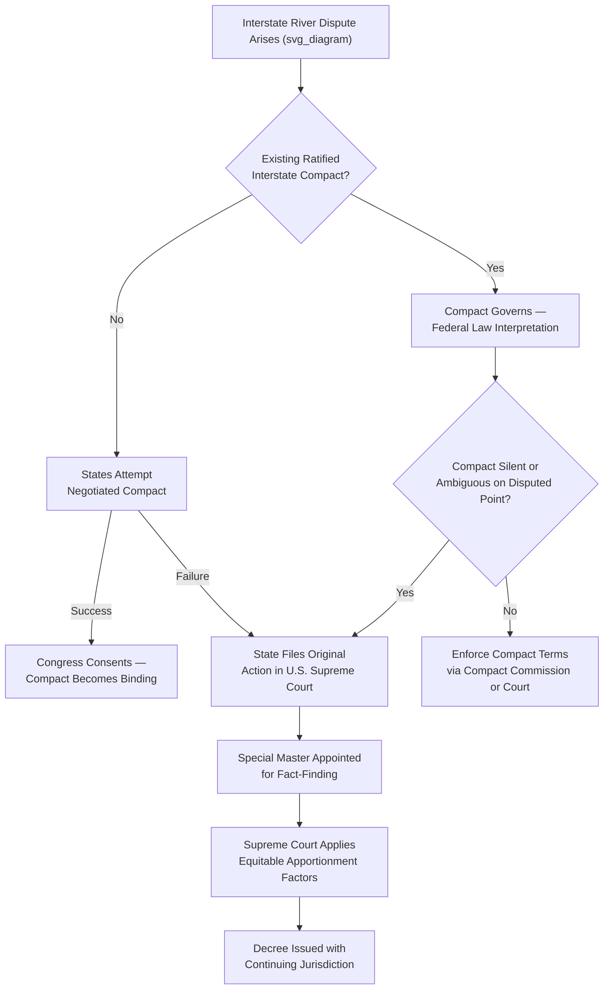

## Interstate Water Compacts and Equitable Apportionment Litigation

### Conceptual Framework

Interstate water allocation in the United States addresses a structural problem absent from purely intrastate water law: rivers and aquifers frequently cross state boundaries, yet each state's water law (riparian, prior appropriation, or hybrid) operates only within its own territory. When upstream and downstream states apply conflicting or competing allocation rules to the same shared water body, no single state's law can resolve the dispute — resolution requires either interstate agreement (compact) or federal intervention (litigation or, in rare cases, congressional apportionment).

**Key Points — Three Mechanisms of Interstate Water Allocation**

1. **Interstate compacts** — negotiated agreements between states, ratified by each state's legislature and requiring congressional consent under the Compact Clause (U.S. Constitution, Article I, Section 10, Clause 3)
2. **Equitable apportionment** — judicial allocation by the U.S. Supreme Court exercising its original jurisdiction over disputes between states, applied when states cannot reach a negotiated compact
3. **Congressional apportionment** — direct allocation by federal statute, constitutionally permissible but rarely used in practice due to political difficulty and preference for negotiated or judicial resolution

### The Compact Clause and Congressional Consent Requirement

**Key Points**

- Article I, Section 10, Clause 3 of the U.S. Constitution prohibits states from entering "any Agreement or Compact with another State" without the consent of Congress, a structural safeguard against states forming alliances that could undermine federal supremacy or injure non-party states
- Once a compact receives congressional consent, it becomes binding federal law, and its interpretation is governed by federal common law principles of contract interpretation, meaning that even the U.S. Supreme Court reviewing a compact dispute is enforcing the compact's negotiated terms rather than crafting an independent equitable allocation from scratch
- This is the critical distinction between compacts and equitable apportionment: a ratified compact displaces judicial equitable apportionment for the specific waters and states it covers, since the states have already exercised their sovereign authority to fix the allocation by agreement

### Equitable Apportionment Doctrine

Equitable apportionment is the default judicial mechanism when no compact governs an interstate water dispute. Established in *Kansas v. Colorado* (1907) and refined through subsequent Supreme Court decisions, it reflects the Court's exercise of original jurisdiction under Article III over controversies between states.

**Key Points — Doctrinal Origins and Rationale**

- The Supreme Court held in *Kansas v. Colorado* that neither state's domestic water law (Kansas riparian doctrine versus Colorado prior appropriation doctrine) could unilaterally govern the interstate portion of the Arkansas River; instead, the Court would apply federal common law principles of "equity and equality" between sovereign states
- Equitable apportionment does not mechanically import either party state's substantive water doctrine; rather, it is a distinct, freestanding body of federal common law crafted specifically for interstate contexts
- The doctrine reflects a strong presumption against disproportionate injury to any one state, requiring the complaining state to prove real and substantial injury by clear and convincing evidence — a demanding evidentiary standard reflecting judicial reluctance to disturb established state water uses

### Factors Considered in Equitable Apportionment

**Example — Key Factors Drawn from *Nebraska v. Wyoming* (1945) and Subsequent Cases**

1. Physical and climatic conditions of the river basin
2. The consumptive use of water in each section of the river
3. The character and rate of return flows
4. The extent of established uses and the investments made in reliance on those uses (protection of "prior appropriation" logic even in equitable apportionment context)
5. The availability of storage and conservation measures to minimize wastage
6. The practical effect of wasteful or inefficient uses on downstream availability
7. The comparative efficiency of proposed or existing uses (encouraging conservation)
8. The economic and social importance of the water use to the region and its population

**Key Points**

- Notably, equitable apportionment tends to respect priority-in-time and beneficial use principles from prior appropriation doctrine even when applied to disputes between riparian states, because the practical realities of established economic reliance on existing water uses carry significant equitable weight regardless of the states' domestic doctrinal labels
- The burden of proof rests heavily on the complaining state, and the Supreme Court has repeatedly emphasized that equitable apportionment is not a mechanical exercise but "a question of federal law that depends upon a consideration of the pertinent laws of the contending States and all other relevant facts," decided flexibly on the totality of circumstances

### Comparative Framework: Compacts vs. Equitable Apportionment vs. Congressional Apportionment

| Dimension | Interstate Compact | Equitable Apportionment | Congressional Apportionment |
| --- | --- | --- | --- |
| Initiating body | State legislatures (negotiated) | U.S. Supreme Court (original jurisdiction) | U.S. Congress |
| Legal character | Binding federal law upon congressional consent | Federal common law judicial decree | Federal statute |
| Flexibility | Fixed terms as negotiated; amendment difficult | Case-by-case, evolving with changed circumstances via continuing jurisdiction | Fixed by statute; amendable by subsequent legislation |
| Typical trigger | Proactive negotiation before/during dispute | Failure to reach or maintain compact; ongoing violation claims | Rare; used historically for major reclamation-era allocations |
| Enforcement mechanism | Compact commission, special master, or Supreme Court enforcement action | Supreme Court decree with continuing jurisdiction, special master oversight | Federal agency implementation (e.g., Bureau of Reclamation) |

### The Colorado River Compact: Landmark Case Study

**Key Points**

- The 1922 Colorado River Compact divided the Colorado River Basin into the Upper Basin (Colorado, New Mexico, Utah, Wyoming) and Lower Basin (Arizona, California, Nevada), apportioning 7.5 million acre-feet annually to each basin — a fixed-quantity approach rather than percentage-based allocation, reflecting concern that the basin's hydrology was not yet fully understood
- The Compact was negotiated under the leadership of then-Commerce Secretary Herbert Hoover and represents one of the earliest and most consequential exercises of the Compact Clause mechanism for water allocation
- Arizona initially refused to ratify the compact for over two decades (finally ratifying in 1944), leading to protracted disputes over Lower Basin sub-allocation, which were eventually resolved through litigation rather than a supplemental compact
- [Inference] The Compact's foundational allocation was based on hydrological data from an unusually wet period in the early 20th century, and modern paleoclimatic reconstruction indicates the river's long-term average flow is likely lower than the Compact's total apportionment assumed, a structural over-allocation problem that has become acutely visible during the sustained drought conditions of the 21st century

### *Arizona v. California*: Equitable Apportionment Meets Compact Interpretation

**Key Points**

- *Arizona v. California* (1963, with subsequent decrees through 2006) resolved the Lower Basin sub-allocation dispute the 1922 Compact left unsettled, with the Supreme Court ultimately deferring to the allocation scheme established by the Boulder Canyon Project Act of 1928 (federal legislation implementing the Compact) rather than crafting an independent equitable apportionment from first principles
- This illustrates an important doctrinal point: where Congress has enacted specific legislation apportioning an interstate river (here, via the Boulder Canyon Project Act's statutory allocation of Lower Basin water among Arizona, California, and Nevada), that congressional apportionment displaces both compact silence and equitable apportionment analysis
- The case also addressed and confirmed federal reserved water rights (*Winters* doctrine) for five Indian reservations along the river, quantified according to practicably irrigable acreage — integrating tribal water rights directly into the interstate allocation framework

### Compact Administration and Enforcement Mechanisms

**Key Points**

- Many interstate compacts establish a **compact commission** — a standing interstate administrative body with representatives from each signatory state (and sometimes a federal representative) responsible for ongoing measurement, accounting, and dispute resolution regarding compact compliance
- The **Upper Colorado River Commission**, created under the 1948 Upper Colorado River Basin Compact, exemplifies this model, administering apportionment among the four Upper Basin states and maintaining stream gauging and accounting records essential to compact compliance
- Where a compact commission cannot resolve a dispute, or where one state alleges another is violating compact terms, the aggrieved state may seek Supreme Court enforcement through an original jurisdiction action — a hybrid mechanism where the Court's role shifts from equitable apportionment (crafting new allocation) to compact enforcement (interpreting and enforcing existing allocation)

### The Pecos River Compact and Compact Violation Litigation

**Example**

*Texas v. New Mexico* (1988) addressed New Mexico's failure to deliver the water quantities owed to Texas under the 1949 Pecos River Compact. The Supreme Court appointed a Special Master, adopted a specific hydrologic accounting methodology (the "Pecos River Master's Manual") to calculate New Mexico's delivery obligations, and ultimately awarded Texas monetary damages for past shortfalls plus ongoing injunctive relief requiring future compliance. This case illustrates that compact litigation, unlike equitable apportionment, centers on interpreting and enforcing a fixed bargain rather than balancing open-ended equitable factors, though technical special master fact-finding plays a similarly central role in both contexts.

### The Tri-State "Water Wars": ACF and ACT Basin Litigation

**Key Points**

- The prolonged conflict among Georgia, Alabama, and Florida over the Apalachicola-Chattahoochee-Flint (ACF) and Alabama-Coosa-Tallapoosa (ACT) river basins is notable precisely because the three states never successfully negotiated a binding compact despite decades of attempts (an interim compact from the 1990s expired without a permanent agreement)
- Absent a compact, the dispute proceeded via equitable apportionment litigation, culminating in *Florida v. Georgia* (2018 and 2021), where the Supreme Court ultimately declined to apportion additional water to Florida, finding Florida had not met its burden of proving that a proposed cap on Georgia's water consumption would demonstrably remedy the harm to Florida's Apalachicola Bay oyster fisheries
- This litigation demonstrates the practical difficulty of the equitable apportionment evidentiary burden: even where a complaining state shows genuine environmental and economic harm, failure to establish causation and remedial efficacy by clear and convincing evidence can defeat the claim entirely, leaving the status quo largely undisturbed

### Special Masters in Interstate Water Litigation

**Key Points**

- Because interstate water disputes involve highly technical hydrological, engineering, and historical usage evidence unsuited to ordinary appellate fact-finding, the Supreme Court routinely appoints a **Special Master** (typically a senior judge or experienced water law practitioner) to conduct evidentiary hearings, receive expert testimony, and issue a recommended report
- The Special Master's report and recommendations are advisory; the Supreme Court retains ultimate decision-making authority and may adopt, modify, or reject the Special Master's findings, though in practice the Court frequently defers substantially to the Special Master's factual determinations given the technical complexity involved
- This procedural structure reflects a broader administrative law principle: even within the judiciary's original jurisdiction, complex technical fact-finding is effectively delegated to specialized fact-finders, echoing the deference courts extend to administrative agency expertise in ordinary judicial review contexts

### Groundwater and Interstate Apportionment

**Key Points**

- Equitable apportionment doctrine, developed primarily around surface streams, has been extended to interstate aquifers, as in *Mississippi v. Tennessee* (2021), though the Supreme Court in that case held that equitable apportionment did not apply on the specific facts because Mississippi failed to show the relevant aquifer was an interstate water resource in the sense triggering the doctrine (the Court found Mississippi's claim sounded more in ownership than equitable apportionment, and dismissed it)
- [Inference] This relatively recent decision suggests the Supreme Court may apply a more cautious, fact-specific threshold before extending full equitable apportionment analysis to groundwater disputes compared to its well-established surface water jurisprudence, given groundwater's distinct hydrogeological characteristics and the less mature body of interstate groundwater case law, though the doctrine's ultimate scope for aquifers remains an evolving area

### Administrative Law Dimensions

**Key Points**

- **Original jurisdiction procedure**: Interstate water disputes proceed under the Supreme Court's original (rather than appellate) jurisdiction pursuant to 28 U.S.C. §1251(a), a distinctive procedural posture with no lower court record, requiring the Court itself (via its Special Master) to conduct de novo fact-finding
- **Continuing jurisdiction and decree modification**: Supreme Court equitable apportionment decrees typically retain continuing jurisdiction, allowing a party state to petition for modification based on changed circumstances (climate shifts, new usage patterns, technological changes in water measurement) — a feature that distinguishes water decrees from the finality norms of ordinary civil judgments
- **Federal agency implementation role**: Even where the Supreme Court or a compact establishes the interstate allocation framework, day-to-day administration is frequently delegated to federal agencies (Bureau of Reclamation for the Colorado River system) or interstate compact commissions, illustrating the layered relationship between judicial/compact allocation and ongoing administrative implementation

### Comparative Relevance to Philippine Transboundary and Interregional Water Issues

**Key Points**

- The Philippines, as an archipelagic unitary state rather than a federal system, does not face interstate water compact or equitable apportionment issues in the U.S. sense, since all water resources fall under unified national jurisdiction (National Water Resources Board) rather than sovereign state-by-state allocation
- [Inference] However, the underlying analytical challenge — allocating a shared water resource across competing jurisdictional/administrative units with different priorities — has functional analogues in Philippine law regarding river basins spanning multiple LGUs (e.g., the Cagayan River, Pampanga River, or Agno River basins), where River Basin Control Offices and coordinating bodies mediate among local government units and water users rather than sovereign states, offering a useful comparative contrast in institutional design for the same underlying resource-sharing problem
- This comparison is valuable for illustrating how the choice between federal/interstate systems (compacts, equitable apportionment) and unitary/centralized systems (NWRB permit allocation) reflects fundamentally different constitutional starting points for resolving multi-jurisdictional resource competition

### Related Topics

- Prior appropriation and riparian doctrine as the underlying state-law backdrop to interstate disputes
- The Colorado River Compact and modern shortage-sharing agreements amid sustained drought
- Federal reserved water rights (*Winters* doctrine) and tribal water rights in interstate allocation
- Special Master procedure and technical fact-finding in Supreme Court original jurisdiction cases
- Interstate compact commissions as administrative bodies (Upper Colorado River Commission model)
- River basin governance and multi-LGU coordination mechanisms in Philippine water law
- Climate change adaptation and compact renegotiation pressures on 20th-century fixed-quantity allocations