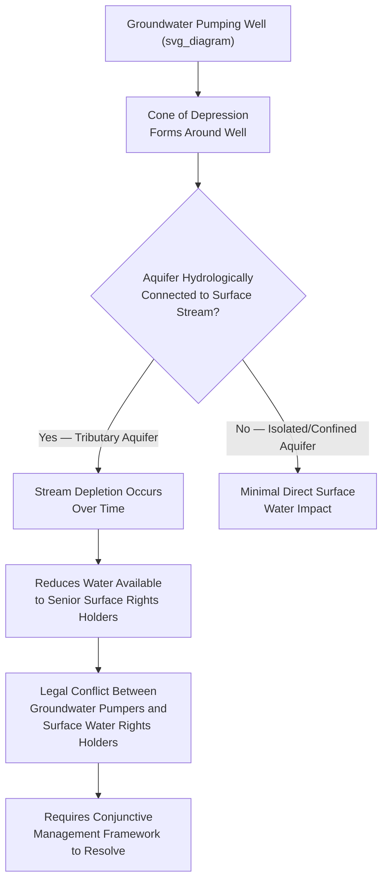

## Groundwater Regulation and Conjunctive Management

### Conceptual Foundations

Groundwater regulation governs the extraction, use, and protection of water stored in subsurface aquifers, historically treated as a legally distinct resource from surface water despite frequent hydrologic connection between the two. Conjunctive management refers to the integrated administration of groundwater and surface water as a single interconnected hydrologic system, recognizing that pumping groundwater can deplete connected streams (and vice versa) and that sound water policy requires managing both resources together rather than under separate, uncoordinated legal regimes.

**Key Points**

- Groundwater law developed independently of surface water law in most legal systems because early hydrogeological science could not reliably trace subsurface flow paths, leading courts and legislatures to treat groundwater as a fundamentally different — and often less protected — resource
- The historical bifurcation between groundwater and surface water regulation is now widely recognized as a legal and scientific anachronism, driving the modern conjunctive management reform movement across U.S. states and internationally
- The Philippines, as a civil law jurisdiction, avoided some of the doctrinal fragmentation seen in U.S. common law by treating both groundwater and surface water uniformly as State-owned resources under the Water Code, though administrative integration challenges persist regardless of the underlying ownership theory

### Historical Common-Law Groundwater Doctrines (U.S. Comparative Background)

**Key Points — Four Traditional Doctrines**

1. **Absolute ownership (English rule)** — landowner may extract unlimited groundwater beneath their land for any purpose, regardless of effect on neighboring wells, treating groundwater as akin to a component of the land itself
2. **Reasonable use (American rule)** — landowner may extract groundwater for reasonable use on the overlying land, but not for unreasonable off-tract use or in a manner that unreasonably harms neighboring wells (Restatement (Second) of Torts §858)
3. **Correlative rights doctrine** — overlying landowners share the aquifer proportionally based on their overlying acreage, particularly during shortage, applied prominently in California groundwater adjudications
4. **Prior appropriation for groundwater** — some western U.S. states extend a first-in-time priority system to groundwater analogous to surface water appropriation, particularly where groundwater is legally classified as tributary to a surface stream

### The Hydrologic Connectivity Problem

**Key Points**

- Most aquifers are hydrologically connected to surface water to some degree, meaning sustained groundwater pumping near a stream will eventually reduce streamflow by intercepting water that would otherwise have discharged to the surface — a phenomenon well-documented in hydrogeology but historically ignored by legal systems that regulated groundwater and surface water separately
- This connectivity creates a structural conflict: a surface water right holder with a senior, legally protected right can see their water supply diminished by an unregulated or separately-regulated groundwater pumper who holds no formal priority relationship to the surface right at all
- Legal systems that fail to account for this connectivity effectively allow groundwater extraction to indirectly defeat surface water priority systems, undermining the integrity of whichever surface allocation doctrine (riparian or appropriative) the jurisdiction otherwise follows

### Conjunctive Management: Definition and Administrative Approaches

**Key Points**

- Conjunctive management (or "conjunctive use management") is the coordinated administration of groundwater and surface water resources as an integrated system, typically involving unified accounting, combined permitting, and coordinated curtailment when connected resources are over-allocated
- **Augmentation plans** — a mechanism (prominently used in Colorado) requiring junior groundwater users whose pumping depletes water hydrologically connected to senior surface rights to provide replacement ("augmentation") water, often through storage releases or water purchases, to offset their depletive effect and avoid curtailment
- **Conjunctive use programs** — proactive water management strategies that deliberately use groundwater storage as a buffer, banking surplus surface water underground during wet periods (managed aquifer recharge) for extraction during dry periods, treating the aquifer as a reservoir integrated with surface supply planning
- **Unified permitting** — some jurisdictions require a single agency to evaluate both groundwater and surface water impacts within one permit application process, avoiding the administrative silos that previously allowed each resource to be permitted without reference to the other

### Case Study: Colorado's Post-1969 Groundwater Integration

**Key Points**

- Colorado's Water Right Determination and Administration Act of 1969 was a landmark statutory reform explicitly integrating "tributary groundwater" (groundwater hydrologically connected to a natural stream) into the state's existing prior appropriation priority system, subjecting it to the same seniority-based administration as surface rights
- This required Colorado's Water Courts and the State Engineer's Office to develop augmentation plan procedures, allowing junior well users to continue pumping despite depleting senior surface supplies, provided they replace the depleted water through approved substitute water supply arrangements
- Colorado additionally distinguishes "non-tributary groundwater" (groundwater with negligible hydrologic connection to surface streams, typically in deep confined aquifers) which is administered under a separate depletion-allowance regime rather than the prior appropriation priority system, reflecting a legally significant scientific distinction embedded directly into the regulatory framework
- [Inference] Colorado's model is frequently cited as the most legally sophisticated conjunctive management framework among U.S. states, though its administrative complexity and litigation costs (augmentation plan approval often requires extensive water court proceedings) have also drawn criticism regarding accessibility for smaller water users

### California's Sustainable Groundwater Management Act (SGMA) — 2014

**Key Points**

- California historically had among the least regulated groundwater systems in the western United States, relying primarily on common-law correlative rights and localized adjudications rather than comprehensive statewide permitting, a gap that became acute during severe droughts (particularly 2012–2016) as unregulated pumping caused significant land subsidence and aquifer depletion in the Central Valley
- SGMA created a new statutory framework requiring the formation of local **Groundwater Sustainability Agencies (GSAs)** for each designated groundwater basin, tasked with developing and implementing **Groundwater Sustainability Plans (GSPs)** to achieve sustainable yield within statutorily defined timeframes
- SGMA explicitly requires GSPs to consider interconnected surface water depletion as one of six statutory "undesirable results" to be avoided, embedding conjunctive management principles directly into the sustainability planning mandate rather than leaving groundwater-surface water interaction to separate proceedings
- The California Department of Water Resources reviews and can reject inadequate GSPs, and the State Water Resources Control Board retains backstop intervention authority over basins that fail to develop or implement adequate plans — a tiered local-first, state-backstop administrative structure

### Groundwater Rights and the "Tragedy of the Commons" Problem

**Key Points**

- Groundwater aquifers exhibit classic common-pool resource characteristics: extraction by one user reduces availability for all other users drawing from the same aquifer, yet the aquifer's shared, invisible, and often poorly-mapped nature makes it difficult for any single user to internalize the full cost of their extraction on others
- Absent regulation, this structure incentivizes over-extraction ("race to the pumphouse"), as no individual user's restraint benefits them if neighboring users continue unrestricted pumping — a dynamic that has driven land subsidence, saltwater intrusion in coastal aquifers, and permanent aquifer storage capacity loss in numerous jurisdictions worldwide
- **Example**: The Ogallala Aquifer underlying the U.S. High Plains (Texas to South Dakota) has experienced substantial long-term depletion from irrigation pumping that vastly exceeds the aquifer's natural recharge rate, illustrating the common-pool depletion problem at a massive geographic scale and the political difficulty of imposing extraction limits on economically dependent agricultural communities across multiple states with differing regulatory philosophies

### Managed Aquifer Recharge (MAR) as a Conjunctive Management Tool

**Key Points**

- Managed Aquifer Recharge deliberately introduces surface water (often surplus flood flows, treated wastewater, or stormwater) into an aquifer through spreading basins, injection wells, or enhanced natural infiltration, effectively using aquifer storage capacity as a substitute for or supplement to surface reservoirs
- MAR provides several conjunctive management advantages: reduced evaporation losses compared to surface reservoirs, mitigation of land subsidence from over-drafted aquifers, and improved drought resilience by banking water underground during wet years for later withdrawal
- Legal and administrative complexity arises regarding "recovery rights" — ensuring the party who banked water underground retains a legally protected right to withdraw an equivalent quantity later, distinct from the ambient native groundwater rights of other overlying users, typically requiring specific statutory or permit-based recharge-and-recovery accounting mechanisms

### Philippine Groundwater Regulation Under the Water Code

**Key Points — Statutory and Institutional Framework**

- The Water Code of the Philippines (PD 1067) treats groundwater as a category of "waters" belonging to the State under Article 3, subject to the same permit-based allocation system (Water Permits issued by the National Water Resources Board) applicable to surface water, avoiding the historical common-law bifurcation that characterized U.S. groundwater law
- NWRB Water Permits for groundwater extraction specify authorized volume, well location, and purpose, and are subject to the Water Code's use-preference hierarchy (domestic use prioritized over irrigation, which is prioritized over other uses) during scarcity, applying the same statutory framework as surface water rather than a separate groundwater-specific priority scheme
- **Critical Groundwater Reservation** designations, wherein NWRB (in coordination with DENR and LGUs) restrict or prohibit new groundwater permits in over-extracted areas, function as the Philippine functional analogue to conjunctive management "sustainability plans," most notably applied to portions of Metro Manila and other rapidly urbanizing areas experiencing land subsidence and saltwater intrusion

**Example**

Metro Manila and portions of Bulacan and Cavite have experienced documented land subsidence attributed significantly to excessive groundwater extraction, prompting NWRB restrictions on new groundwater permits in designated critical areas and driving increased reliance on surface water sources (Angat, Ipo, and La Mesa reservoirs via the Metropolitan Waterworks and Sewerage System) as a substitute — illustrating a conjunctive management dynamic (shifting demand between groundwater and surface sources based on sustainability constraints) even without a formally labeled "conjunctive management plan" comparable to California's SGMA framework.

### Saltwater Intrusion as a Distinct Groundwater Regulatory Concern

**Key Points**

- Coastal aquifer over-extraction can permit seawater to migrate into freshwater aquifer zones, a largely irreversible or extremely slow-to-reverse form of aquifer contamination distinct from simple volumetric depletion
- Regulatory responses typically include extraction limits calibrated to maintain a protective freshwater-saltwater interface ("freshwater lens" management), monitoring well networks to detect early intrusion, and in severe cases, mandatory reduction or cessation of coastal groundwater withdrawal in favor of alternative supply sources
- [Inference] Saltwater intrusion regulation illustrates a scenario where conjunctive management principles extend beyond groundwater-surface water interaction to encompass groundwater-seawater interaction, requiring similarly integrated monitoring and extraction-limiting frameworks, though the specific regulatory thresholds and monitoring protocols vary considerably by jurisdiction and local hydrogeology

### Administrative Law Doctrines in Groundwater Regulation

**Key Points**

- **Technical/scientific deference**: Because groundwater regulation depends heavily on hydrogeological modeling (aquifer characterization, safe yield calculations, connectivity assessments) that courts are ill-equipped to independently evaluate, judicial review of agency groundwater management decisions typically extends substantial deference to agency technical determinations, similar to primary jurisdiction principles in other environmental/natural resource contexts
- **Retroactive regulation of vested rights**: A recurring legal tension in groundwater reform (as in California's SGMA and Colorado's 1969 Act) involves whether newly imposed sustainability requirements or augmentation obligations can be applied to groundwater users who established their wells and pumping patterns before the new regulatory framework existed, raising vested-rights and regulatory-taking arguments that legislatures typically address through phased implementation timelines and grandfathering provisions
- **Local versus centralized administrative authority**: The trend across jurisdictions (California's locally-formed GSAs, Philippine NWRB-LGU coordination) reflects an ongoing administrative design choice between empowering local/basin-level bodies with granular knowledge of local aquifer conditions versus centralized agencies with greater technical capacity and enforcement consistency — a tension recurring throughout natural resource administrative law generally

### Comparative Synthesis: Conjunctive Management Design Choices

| Design Element | Colorado Model | California SGMA Model | Philippine NWRB Model |
| --- | --- | --- | --- |
| Legal integration point | Tributary groundwater folded into existing prior appropriation priority system | New statutory sustainability planning layered atop existing correlative rights | Unified permit system treats groundwater and surface water identically from inception |
| Administering body | Water Courts + State Engineer | Local Groundwater Sustainability Agencies + State Water Board backstop | National Water Resources Board (centralized) with LGU coordination |
| Key mechanism | Augmentation plans (replace depleted senior supply) | Groundwater Sustainability Plans (basin-wide extraction limits) | Critical groundwater reservation designations (permit restriction in over-drafted areas) |
| Treatment of pre-existing users | Grandfathered priority dates; new pumping subject to augmentation | Phased sustainable yield targets over statutory timeline | Existing permits generally honored; new permits restricted in critical areas |

### Related Topics

- Prior appropriation and riparian doctrine as the surface water backdrop to conjunctive management
- California's Sustainable Groundwater Management Act implementation and Groundwater Sustainability Plan requirements
- Managed aquifer recharge design and recovery-rights accounting
- Saltwater intrusion monitoring and coastal aquifer management
- Land subsidence as a regulatory trigger for groundwater extraction limits
- The Philippine Water Code (PD 1067) permit system and NWRB institutional authority
- Interstate/transboundary aquifer disputes (*Mississippi v. Tennessee*) as an emerging equitable apportionment frontier
- Common-pool resource theory and Elinor Ostrom's governance principles applied to aquifer management