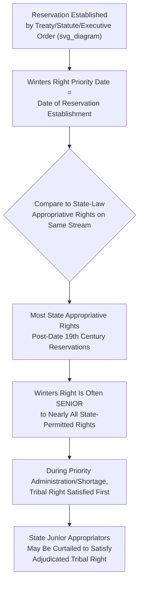

## Tribal Reserved Water Rights Under the Winters Doctrine

### Conceptual Foundations

The Winters doctrine (also called federal reserved water rights doctrine, as applied to tribal reservations) holds that when the United States established Indian reservations, it implicitly reserved sufficient water to fulfill the purposes for which each reservation was created, even where the treaty, statute, or executive order creating the reservation made no explicit mention of water rights. This doctrine fundamentally departs from the state-law water allocation systems (prior appropriation and riparian) that otherwise govern water rights in the United States, because it derives from federal reservation of land rather than state-law diversion, beneficial use, or land-adjacency principles.

**Key Points**

- Established in *Winters v. United States* (1908), a case arising from the Fort Belknap Indian Reservation in Montana, where non-Indian upstream settlers had begun diverting water from the Milk River in a manner that threatened to leave insufficient water for the reservation
- The Supreme Court held that when Congress and the Gros Ventre and Assiniboine Tribes agreed to establish the reservation in 1888, they must be understood to have intended reservation of enough water to make the reservation livable and productive for its intended agricultural purpose, since without such water the reservation "would be practically valueless" — a form of implied reservation doctrine
- This implied-reservation logic was later extended to federal reservations generally (national forests, national parks, wildlife refuges) in *United States v. New Mexico* (1978) and other cases, though tribal reserved rights retain distinct features tied to the trust relationship between the federal government and tribes

### The Doctrinal Logic: Why Water Rights Are "Implied"

**Key Points**

- Most 19th-century treaties, statutes, and executive orders establishing Indian reservations addressed land but were silent on water, reflecting the era's limited attention to water scarcity issues in treaty negotiations rather than any deliberate exclusion of water rights
- The Supreme Court's interpretive approach treats this silence not as an absence of a water right but as an implicit incorporation of whatever water is necessary to accomplish the reservation's purpose, reasoning that the tribes would not have agreed to cede vast territories in exchange for a reservation the government simultaneously intended to render useless by permitting upstream diversion of its water supply
- This reflects a broader interpretive canon in federal Indian law — treaties and statutes affecting tribal rights are to be construed as the tribes would have understood them at the time, and ambiguities are resolved in favor of the tribes (the "Indian canon of construction")

### Priority Date: The Central Legal Advantage of Winters Rights

**Key Points**

- Unlike state-law prior appropriation rights, which carry a priority date corresponding to when the water was actually diverted and applied to beneficial use, a Winters right's priority date is the date the reservation was established — frequently decades before most state-permitted appropriative rights on the same river system were ever filed
- This "time-immemorial" or early priority date gives tribal reserved rights a structurally senior position relative to state-law water users, meaning that once formally adjudicated and quantified, a tribal Winters right can compel curtailment of state-permitted junior users to satisfy the tribal allocation — even where the tribe had not been physically using that full quantity of water for decades
- Winters rights are not subject to state-law forfeiture-for-non-use doctrines; because the right derives from federal reservation rather than state-law beneficial use requirements, non-use by the tribe (often due to historical lack of capital to develop irrigation infrastructure) does not extinguish or diminish the right

### Quantification Standards: How Much Water Is Reserved

The doctrine establishes that reserved water rights exist, but determining the specific quantity reserved has generated extensive subsequent litigation and competing quantification standards.

**Key Points — The Practicably Irrigable Acreage (PIA) Standard**

- *Arizona v. California* (1963) established the dominant quantification method for agricultural reservations: the tribal reserved right is measured by the amount of water necessary to irrigate all "practicably irrigable acreage" on the reservation — land that could feasibly be irrigated considering engineering feasibility and economic practicability, not merely land currently under cultivation
- The PIA standard is significant because it ties quantification to the reservation's full agricultural potential rather than historical or current water use, again reflecting the doctrine's protection of future development needs rather than a mere snapshot of present consumption
- [Inference] The PIA standard has been criticized by both tribal advocates (as potentially undervaluing non-agricultural water needs such as fisheries, cultural, or municipal uses central to some tribes' priorities) and by state/non-Indian water users (as producing large paper water rights that may substantially exceed a tribe's actual near-term capacity to develop and use the water), and this tension continues to shape settlement negotiations in lieu of full PIA litigation

**Key Points — Alternative and Emerging Quantification Approaches**

- Some tribal water rights settlements (negotiated rather than litigated) have adopted quantification standards beyond PIA, including consideration of instream flows for fisheries, cultural and religious water uses, and homeland/municipal-industrial purposes reflecting a broader conception of reservation purpose than pure agricultural development
- The "purpose of the reservation" inquiry itself has evolved; while early cases focused heavily on agricultural self-sufficiency as the presumed reservation purpose, more recent scholarship and some settlement agreements recognize that reservations were often established for broader purposes (permanent tribal homeland, preservation of traditional subsistence practices) supporting a correspondingly broader water rights quantification

### The McCarran Amendment and State Court Adjudication

**Key Points**

- The McCarran Amendment (1952), 43 U.S.C. §666, is a federal statute waiving the United States' sovereign immunity to allow joinder of the federal government (as trustee for tribal water rights) in state court general stream adjudications — comprehensive proceedings determining all water rights on an entire river system
- This creates a structurally significant jurisdictional consequence: although tribal reserved rights arise under federal law, they are typically adjudicated and quantified in state court proceedings (or state administrative water courts, such as Colorado's), not federal court, because the McCarran Amendment specifically channels these disputes into the state general stream adjudication process
- This arrangement has drawn significant criticism from tribal advocates who argue that state courts, historically and institutionally oriented toward protecting state-law appropriative rights and non-Indian water users, may not always provide as favorable or expeditious a forum for adjudicating federal tribal rights as would federal court, though the Supreme Court in *Arizona v. San Carlos Apache Tribe* (1983) upheld the McCarran Amendment's applicability to tribal reserved rights specifically

### Winters Rights and Groundwater

**Key Points**

- Courts have divided on whether the Winters doctrine extends to groundwater as well as surface water, since the original 1908 case and most 20th-century extensions concerned surface streams
- The Ninth Circuit's decision in *Agua Caliente Band of Cahuilla Indians v. Coachella Valley Water District* (2017) held that the Winters doctrine does extend to groundwater where necessary to fulfill the reservation's purpose, reasoning that the same implied-reservation logic applies regardless of whether the water source is surface or subsurface
- [Inference] This remains a jurisdictionally uneven area of law, as not all federal circuits have addressed the question, and the scope of tribal groundwater reserved rights may continue to be litigated and clarified in additional circuits and potentially the Supreme Court, particularly as groundwater scarcity intensifies in the western United States

### Tribal Water Rights Settlements: The Negotiated Alternative to Litigation

**Key Points**

- Because full PIA litigation is extraordinarily expensive, time-consuming (often spanning decades), and produces winner-take-all outcomes with significant uncertainty for all parties, negotiated settlements have become the dominant mechanism for resolving tribal water rights claims in recent decades
- A typical tribal water rights settlement, often ratified by federal legislation, quantifies the tribe's water right at an agreed amount (frequently less than a maximalist PIA claim but with greater certainty and immediate usability), and commonly includes federal funding for water infrastructure development (pipelines, treatment facilities, irrigation systems) to allow the tribe to actually put the settled water to use
- **Example**: The Navajo Utah Water Rights Settlement and the White Mountain Apache Tribe Water Rights Quantification Act illustrate the modern settlement template — combining a quantified water right, infrastructure funding, and a negotiated waiver of further water rights claims against the settling state and other water users, providing finality that pure litigation cannot easily achieve
- Congressional appropriation of settlement infrastructure funding has historically been a bottleneck, with completed legal settlements sometimes waiting years for the federal funding needed to make the settled water right practically usable

### Interaction with Interstate Compacts and Equitable Apportionment

**Key Points**

- Tribal reserved rights complicate interstate river allocation because compacts negotiated among states (such as the 1922 Colorado River Compact) were generally silent on tribal claims, yet tribal Winters rights on tributaries within a compact-covered basin can carry priority dates senior to the compact itself
- *Arizona v. California* directly confronted this by quantifying reserved rights for five Lower Colorado River Basin tribes as part of the broader interstate equitable apportionment/compact-interpretation litigation, effectively carving out a fixed tribal allocation from within the states' compact-apportioned shares rather than treating tribal rights as an unlimited claim layered atop the compact
- [Inference] As the 21st-century Colorado River shortage crisis has intensified, unresolved or only partially quantified tribal water rights in the Basin represent a significant source of ongoing legal and political uncertainty for state water planners, since substantial tribal claims not yet fully settled or developed could materially affect the water available to state-permitted junior users if and when those claims are fully adjudicated or developed

### Distinguishing Tribal Winters Rights from General Federal Reserved Rights

| Dimension | Tribal (Indian Reservation) Winters Rights | General Federal Reserved Rights (Forests, Parks, Refuges) |
| --- | --- | --- |
| Legal basis | Treaty, statute, or executive order establishing reservation; federal trust relationship | Statute or executive order establishing the federal reservation |
| Purpose standard | Broadly construed (agricultural self-sufficiency, homeland, cultural/fishery uses in modern settlements) | Narrowly construed to the "primary purpose" of the reservation (*United States v. New Mexico*) |
| Quantification | Practicably Irrigable Acreage (or negotiated settlement terms) | Minimal amount necessary for primary purpose (often significantly more limited) |
| Interpretive canon | Indian canon of construction — ambiguities resolved in favor of tribes | Ordinary statutory construction; no comparable pro-claimant canon |
| Adjudication forum | State court general stream adjudications (McCarran Amendment) | Also typically state court under McCarran Amendment |

### Administrative Law and Trust Doctrine Dimensions

**Key Points**

- The federal government's role in tribal water rights litigation reflects its unique **trust responsibility** to tribes — the Department of Justice and Department of the Interior (through the Bureau of Indian Affairs) typically participate in or lead litigation and settlement negotiations on behalf of tribal water interests, creating a distinctive administrative posture where federal executive agencies act as advocates for tribal claims rather than neutral regulators
- This trust relationship has occasionally generated conflict-of-interest concerns where federal agencies simultaneously manage competing federal interests (such as Bureau of Reclamation projects serving non-Indian irrigators) alongside their trust obligation to advocate for tribal water rights on the same river system
- **Standard of review**: Judicial review of federal agency actions implementing tribal water rights settlements or reserved rights determinations is generally governed by ordinary Administrative Procedure Act standards, but courts often incorporate the Indian canon of construction and the trust doctrine as interpretive overlays when reviewing agency discretion in matters affecting tribal water interests

### Comparative Relevance to Philippine Indigenous Peoples' Rights Framework

**Key Points**

- The Philippines addresses indigenous water and resource rights through a substantially different legal architecture — the Indigenous Peoples' Rights Act (RA 8371, IPRA), which recognizes Ancestral Domain and Ancestral Land rights for Indigenous Cultural Communities/Indigenous Peoples, including rights to develop and utilize natural resources (potentially including water) found within ancestral domains, subject to free and prior informed consent (FPIC) requirements for any external development activity
- [Inference] While IPRA's ancestral domain framework and the Winters doctrine both aim to protect indigenous communities' access to resources within lands historically recognized as theirs, IPRA's approach centers on territorial recognition and consent-based development control (FPIC) rather than the Winters doctrine's federal-implied-reservation and priority-date mechanism tailored specifically to water scarcity administration within an already-established state/federal water permit hierarchy — reflecting the different historical and constitutional contexts in which each framework developed
- This comparison is useful for administrative law students examining how different legal systems structure special protections for indigenous communities' natural resource access — through implied water rights embedded in a priority system (U.S.) versus territorial ancestral domain recognition with consent requirements (Philippines)

### Related Topics

- Prior appropriation systems in the western United States (the state-law backdrop against which Winters rights operate)
- General federal reserved water rights doctrine beyond tribal contexts (*United States v. New Mexico*)
- The McCarran Amendment and state court jurisdiction over federal water rights claims
- Practicably Irrigable Acreage standard and its critiques
- Tribal water rights settlement structure and federal infrastructure funding mechanisms
- Interstate equitable apportionment and the integration of tribal claims into compact allocations
- The Indigenous Peoples' Rights Act (RA 8371) and Free and Prior Informed Consent in Philippine law
- The federal trust doctrine and its administrative law implications for agency conflicts of interest