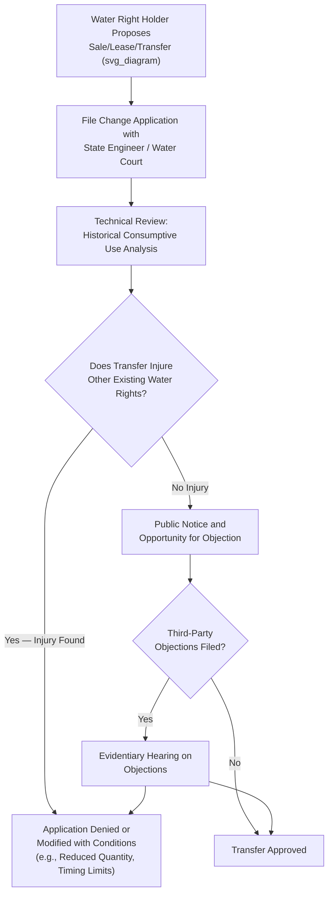

## Water Markets, Transfers, and Drought Contingency Planning

### Conceptual Foundations

Water markets refer to institutional mechanisms that allow water rights holders to voluntarily sell, lease, or exchange their rights to water — either permanently or temporarily — with other users, subject to regulatory approval. Water transfers are the individual transactions occurring within such markets, while drought contingency planning encompasses the anticipatory legal and administrative frameworks designed to manage water scarcity during declared shortage conditions, often relying on both regulatory curtailment and market-based reallocation tools working in tandem.

**Key Points**

- Water markets emerged primarily as a policy response to the economic inefficiency of rigid, non-transferable allocation systems, allowing water to move from lower-value to higher-value uses (e.g., from lower-value agricultural use to higher-value municipal or industrial use) without requiring new appropriation or permit applications from scratch
- Markets function differently depending on the underlying legal system: prior appropriation states generally facilitate transfers because appropriative rights are already conceived as severable property rights, whereas riparian states face greater structural difficulty because riparian rights are tied to land ownership and not inherently designed for market transfer
- Drought contingency planning increasingly incorporates market mechanisms (voluntary fallowing agreements, water banks, dry-year options) alongside traditional regulatory tools (priority curtailment, mandatory conservation orders) to manage shortage with greater economic efficiency and reduced litigation

### The Economic Rationale for Water Markets

**Key Points**

- Water has historically been allocated through administrative and judicial processes (permits, priority dates, reasonable-use adjudication) rather than price signals, which can result in water remaining committed to relatively low-value uses (certain irrigation crops) even as nearby higher-value uses (growing municipalities, environmental flows) face acute shortage
- Markets allow reallocation without requiring the state to physically re-permit or condemn existing rights, instead relying on voluntary transactions between willing sellers (typically agricultural rights holders willing to fallow land or reduce consumption) and willing buyers (municipalities, industries, environmental groups, or other agricultural users)
- [Inference] Economists have long argued that well-functioning water markets improve overall allocative efficiency compared to purely administrative reallocation, though the transaction costs, information asymmetries, and third-party effects inherent in water transfers mean that real-world water markets function considerably less smoothly than markets for more fungible commodities

### The Water Transfer Approval Process Under Prior Appropriation

**Key Points**

- The **no-injury rule** is the central legal constraint on water transfers under prior appropriation: a proposed change in point of diversion, place of use, purpose of use, or timing cannot be approved if it would injure other existing water rights holders, particularly by altering return flow patterns that downstream junior appropriators have come to rely upon
- Transfer applications typically require a **historical consumptive use analysis** — quantifying not the full decreed water right, but the amount actually and consistently consumed (as opposed to diverted and returned via return flow) over a representative historical period, since only the consumptively-used portion can generally be transferred without injuring return-flow-dependent downstream users
- This no-injury requirement, while protecting existing rights holders, is frequently criticized as a significant transaction cost and source of delay in water markets, since transfer applications can face extended contested proceedings, engineering studies, and litigation, particularly in heavily appropriated basins

### Types of Water Market Transactions

**Example — Common Transaction Structures**

1. **Permanent transfers (sales)** — full conveyance of a water right from seller to buyer, typically the highest-value but also highest-transaction-cost and most contested type of transfer, often requiring formal change-of-use proceedings
2. **Temporary leases** — the right holder retains ownership but leases use rights for a defined period (a single season or a specified number of years), commonly used for drought-year municipal supplement or environmental flow augmentation
3. **Dry-year options and forbearance agreements** — a buyer pays an agricultural rights holder for the option to call on their water only during declared drought years, with the seller continuing normal use in non-drought years — a risk-sharing instrument that provides drought resilience for the buyer while preserving the seller's baseline agricultural operation
4. **Water banking** — an intermediary institution (often a public agency) aggregates water from multiple sellers into a "bank," from which buyers can purchase or lease water, reducing transaction costs relative to numerous bilateral negotiations
5. **Groundwater substitution transfers** — a surface water right holder temporarily forgoes their surface diversion (transferring it to another surface user) while substituting groundwater pumping for their own continued use, effective only where hydrologically appropriate and legally authorized

### Case Study: California Water Markets and the State Water Project/Central Valley Project Interface

**Key Points**

- California's water market activity is heavily shaped by the interaction between its complex hybrid riparian-appropriative rights system and the large federal (Central Valley Project) and state (State Water Project) water infrastructure that delivers contracted water to agricultural and urban users across the state
- The Bureau of Reclamation and California Department of Water Resources both administer transfer approval processes for water moving through project infrastructure, adding a layer of federal/state contractual review atop the underlying state water rights transfer approval process
- **Example**: Agricultural-to-urban transfers, such as historical arrangements between Central Valley agricultural districts and Southern California urban water agencies (e.g., the Imperial Irrigation District-San Diego County Water Authority transfer, one of the largest agricultural-to-urban water transfers in U.S. history), illustrate how water conserved through on-farm efficiency improvements or fallowing can be monetized and transferred to higher-value urban uses over significant distances via existing aqueduct infrastructure

### Colorado's Water Court-Mediated Transfer System

**Key Points**

- Colorado's specialized Water Court system channels all significant water rights transfers through formal judicial change-of-use proceedings, requiring the applicant to prove no injury to other water rights holders through detailed engineering evidence, often involving a Water Referee's initial review before formal court proceedings
- This judicially-mediated approach, while procedurally rigorous and protective of existing rights holders, is frequently characterized as slower and more expensive than administrative agency-based transfer approval systems used in other prior appropriation states, [Inference] a trade-off widely understood to favor certainty and thoroughness of injury analysis over transactional speed, though the specific magnitude of this trade-off is debated among water law practitioners and varies by case complexity

### Drought Contingency Planning: Regulatory Frameworks

**Key Points — Core Components of Drought Contingency Plans**

1. **Drought declaration triggers** — statutory or regulatory criteria (reservoir storage levels, snowpack measurements, streamflow forecasts) that formally activate emergency drought management authority
2. **Tiered curtailment schedules** — pre-established sequences of mandatory use reductions or priority curtailment escalating with drought severity, providing water users advance notice of how shortage will be administered rather than ad hoc case-by-case decisions
3. **Emergency regulatory authority** — statutory provisions granting water agencies expanded authority during declared drought to temporarily modify permit conditions, expedite transfer approvals, or impose conservation mandates that would not be permissible or discretionary during normal conditions
4. **Interstate/interbasin shortage-sharing agreements** — pre-negotiated protocols (as in the Colorado River Drought Contingency Plan) specifying how multiple states or water districts will share reductions during declared basin-wide shortage, avoiding the need for emergency negotiation during an active crisis

### Case Study: The Colorado River Drought Contingency Plan (2019) and Post-2022 Shortage Agreements

**Key Points**

- The 2019 Colorado River Drought Contingency Plan (DCP), agreed among the seven Basin states, established tiered reduction schedules tied to Lake Mead elevation levels, requiring Lower Basin states (Arizona, California, Nevada) to accept specified delivery reductions as reservoir levels declined below defined thresholds, supplementing the 2007 Interim Guidelines' shortage-sharing framework
- As Colorado River reservoir levels continued declining substantially beyond the DCP's anticipated scenarios by 2021–2022, the Bureau of Reclamation and Basin states negotiated additional supplemental agreements, including significant voluntary conservation commitments compensated through federal Inflation Reduction Act funding — illustrating how drought contingency planning has evolved toward compensated voluntary reduction (market-adjacent mechanisms) alongside traditional mandatory curtailment
- [Inference] The pace and severity of Colorado River reservoir decline since the DCP's negotiation has significantly exceeded the assumptions embedded in the 2007 Interim Guidelines and 2019 DCP, prompting ongoing renegotiation of post-2026 operating guidelines; because these negotiations remain unresolved and politically contested among the Basin states as of this writing, the ultimate framework replacing current guidelines should be verified against current Bureau of Reclamation announcements rather than assumed to follow any specific proposed scenario

### Emergency Water Transfer Provisions

**Key Points**

- Many states incorporate expedited or streamlined transfer procedures specifically for drought emergencies, recognizing that the standard no-injury review process (often taking months or years for permanent transfers) is too slow to respond to acute short-term shortage
- These provisions typically apply only to temporary transfers/leases (not permanent conveyances) and often include shortened public notice periods, delegated approval authority to agency staff rather than requiring full board/court proceedings, and automatic expiration when drought conditions end
- [Inference] The trade-off in expedited emergency transfer procedures is a reduction in the thoroughness of third-party injury review compared to standard proceedings, which is generally considered an acceptable and time-limited risk during genuine emergency conditions but has occasionally drawn objections from third parties who argue their interests received insufficient scrutiny under compressed emergency timelines

### Third-Party and Area-of-Origin Protections

**Key Points**

- Water transfers, even where they satisfy the no-injury rule as applied strictly to other water rights holders, can generate broader **third-party effects** on communities that depend economically on the water remaining in the area of origin — reduced agricultural employment, diminished local tax base, or ecological effects on non-appropriated instream values not captured by the formal no-injury analysis
- Many western states have enacted **area-of-origin statutes** or public interest review requirements specifically to protect the exporting region's long-term water needs and socioeconomic interests, requiring transfer approval agencies to consider factors beyond strict water-rights injury, such as the transfer's effect on the local economy, environment, and future water needs of the origin community
- **Example**: California's area-of-origin statutes (Water Code §§10505, 11460–11463) grant certain origin-county priority claims and protections against permanent export of water needed for the county's own reasonably foreseeable future growth, reflecting a policy judgment that pure market efficiency should be tempered by regional equity considerations

### Water Banking Institutional Models

**Key Points**

- **State-administered water banks** — a state agency (e.g., historically, the California Drought Water Bank operated by the Department of Water Resources during severe drought years) purchases water from willing sellers and reallocates it to priority users, functioning as a centralized clearinghouse rather than relying purely on bilateral private transactions
- **Groundwater banking** — using aquifer storage capacity to "bank" surplus surface water for later withdrawal (see conjunctive management), which can function as either a physical water management tool or a tradable "water credit" system depending on the specific legal and accounting framework adopted
- [Inference] Water banks generally reduce transaction costs and information asymmetries relative to purely bilateral markets by aggregating supply and demand, though they introduce their own governance challenges regarding pricing methodology, allocation priority among competing buyers, and the political sensitivity of a government agency actively participating in water commodification

### Environmental and Instream Flow Considerations in Water Markets

**Key Points**

- Environmental water transactions — where conservation organizations, state agencies, or federal entities purchase or lease water rights specifically to maintain or restore instream flows for fish and wildlife — represent an increasingly significant segment of water markets in several western states
- These transactions face the same instream flow legal constraints discussed under prior appropriation doctrine: many states restrict who may hold instream flow rights (often exclusively a state agency) and require the converted right to satisfy the same no-injury and quantification standards applicable to consumptive transfers
- [Inference] The growth of environmental water markets reflects broader recognition that instream ecological values can be protected through voluntary market transactions rather than solely through regulatory mandates, though the scale of environmental water transactions relative to total water market activity remains comparatively modest in most western states and varies considerably by jurisdiction and available conservation funding

### Administrative Law Dimensions of Water Transfer Review

**Key Points**

- **Standard of review**: Judicial review of state engineer or water court transfer decisions typically applies a substantial-evidence or abuse-of-discretion standard, reflecting deference to the technical hydrological and injury analysis underlying transfer determinations
- **Public interest review**: An increasing number of states require transfer approval agencies to consider not only technical injury to existing water rights but a broader "public interest" or "public welfare" standard encompassing environmental, socioeconomic, and area-of-origin considerations — expanding the scope of administrative discretion (and corresponding litigation risk) beyond the historically narrower no-injury inquiry
- **Emergency rulemaking procedures**: Drought declarations and associated curtailment orders often proceed through expedited or emergency rulemaking procedures that bypass standard notice-and-comment timelines, raising administrative law questions about the appropriate balance between emergency responsiveness and procedural due process for affected water users

### Philippine Comparative Context: Water Rights Transferability Under the Water Code

**Key Points**

- The Philippine Water Code (PD 1067) permits limited transferability of water permits, but transfers require NWRB approval and are generally more administratively constrained than U.S. prior appropriation transfer markets, reflecting the civil-law State-ownership model where water permits are viewed as usufructuary administrative grants rather than freely alienable property-like rights
- [Inference] The Philippines does not currently have a developed water market comparable to California's or Colorado's active transfer markets; water reallocation during scarcity in the Philippines has historically relied primarily on NWRB's administrative use-preference hierarchy (domestic use prioritized over irrigation and other uses) and direct agency-mediated allocation rather than voluntary market-based transactions between water users, representing a structurally different approach to the same underlying scarcity-management problem
- This comparison illustrates a fundamental design choice in water law: property-rights-based market mechanisms (U.S. prior appropriation states) versus administrative-preference-based allocation (Philippine civil-law model), each with distinct efficiency, equity, and administrative-capacity trade-offs

### Related Topics

- Prior appropriation doctrine's no-injury rule and historical consumptive use analysis in depth
- The Colorado River Drought Contingency Plan and post-2026 operating guideline negotiations
- Groundwater banking and managed aquifer recharge as conjunctive management tools
- Area-of-origin statutes and regional equity protections in water export transactions
- Environmental water transactions and instream flow rights acquisition
- The Philippine Water Code's use-preference hierarchy as an alternative to market-based reallocation
- Administrative Procedure Act standards of review applied to state engineer transfer decisions
- Interstate compact renegotiation dynamics under conditions of chronic over-allocation