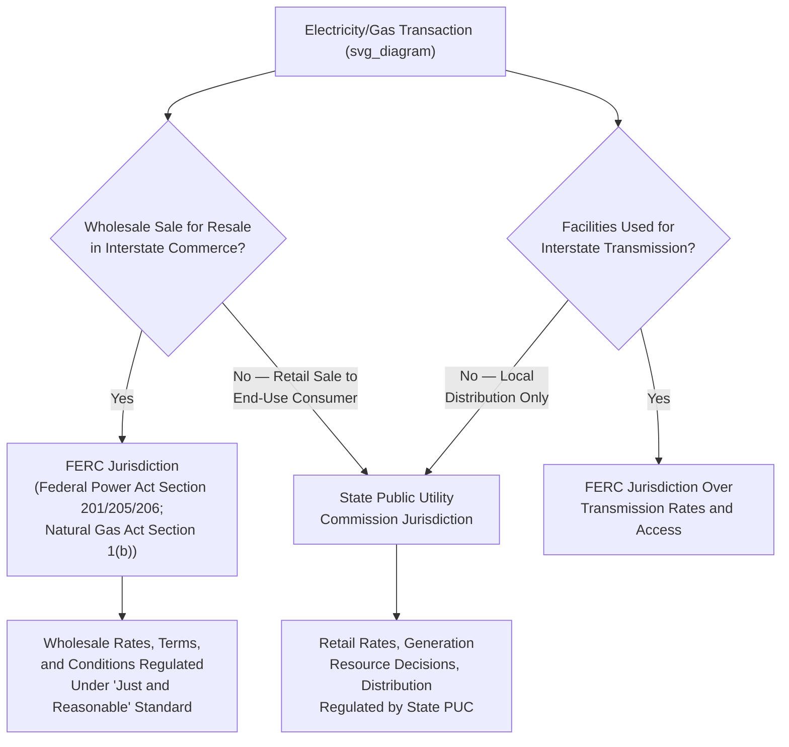

## FERC Jurisdiction Over Wholesale Electricity and Natural Gas Markets

### Institutional Overview

The Federal Energy Regulatory Commission (FERC) is an independent regulatory agency within the U.S. Department of Energy structure, though it operates independently of DOE direction, exercising jurisdiction over interstate transmission and wholesale sale of electricity and natural gas. FERC's jurisdiction is fundamentally defined by a jurisdictional line separating federal from state regulatory authority — a line that has generated some of the most consequential and technically complex administrative law litigation in the energy sector.

**Key Points**

- FERC consists of up to five Senate-confirmed Commissioners serving staggered five-year terms, with no more than three from the same political party, structured to insulate the agency from single-administration political control consistent with independent agency design principles
- FERC's authority derives primarily from the Federal Power Act (FPA) of 1935 (as amended) for electricity and the Natural Gas Act (NGA) of 1938 (as amended) for natural gas, both enacted during the New Deal era to fill a regulatory gap left by the Supreme Court's holding in *Public Utilities Commission of Rhode Island v. Attleboro Steam & Electric Co.* (1927) that states lacked authority to regulate interstate wholesale electricity sales
- The agency's predecessor, the Federal Power Commission, was reorganized into FERC by the Department of Energy Organization Act of 1977

### The Federal-State Jurisdictional Divide: The Bright-Line Test

**Key Points**

- FPA Section 201(b) establishes FERC's jurisdiction over the transmission of electric energy in interstate commerce and the sale of electric energy at wholesale in interstate commerce, while explicitly reserving to the states jurisdiction over "facilities used for the generation of electric energy" and "facilities used in local distribution"
- This "bright-line" jurisdictional test — wholesale/interstate transmission (federal) versus retail/local distribution (state) — has been repeatedly tested and refined through litigation as electricity markets have evolved in ways the 1935 FPA drafters did not anticipate, particularly with the rise of organized wholesale markets, demand response, and distributed generation
- Natural Gas Act jurisdiction follows an analogous structure: FERC regulates the transportation and sale of natural gas in interstate commerce for resale, while states retain jurisdiction over direct retail sales to end-use consumers (local distribution companies) and production/gathering activities

### The "Just and Reasonable" Rate Standard

**Key Points**

- Both the FPA (Section 205/206) and NGA (Section 4/5) require that all rates, charges, terms, and conditions for jurisdictional wholesale sales and transmission/transportation services be "just and reasonable" and not "unduly discriminatory or preferential"
- This standard, while textually vague, has been elaborated through decades of FERC ratemaking precedent and judicial review, generally requiring rates that allow regulated utilities a fair opportunity to recover prudently incurred costs plus a reasonable return on invested capital, while protecting captive customers from monopolistic overcharging
- FERC possesses authority under Section 206 (FPA) and Section 5 (NGA) to investigate and remedy rates it finds are no longer just and reasonable, even absent a utility-initiated filing, reflecting a continuing regulatory oversight function rather than a one-time rate-setting exercise

### Filed Rate Doctrine and Its Administrative Law Significance

**Key Points**

- The filed rate doctrine holds that a rate properly filed with and approved by FERC is the only lawful rate, and neither courts nor state regulators may substitute a different rate through subsequent litigation, even in contract disputes between the utility and its customers
- This doctrine, rooted in *Montana-Dakota Utilities Co. v. Northwestern Public Service Co.* (1951) and subsequent cases, reflects a strong judicial deference to the exclusivity of FERC's ratemaking jurisdiction, preventing collateral attacks on FERC-approved rates through alternative legal theories (contract, antitrust, or state tort claims)
- The doctrine has generated significant controversy in the context of long-term wholesale power contracts during market volatility (notably the 2000–2001 California energy crisis), where purchasers sought to challenge contracts as unjust and unreasonable after prices spiked dramatically, testing the boundary between the filed rate doctrine's finality and FERC's own statutory authority to modify unjust rates

### Organized Wholesale Electricity Markets: RTOs and ISOs

FERC's jurisdiction extends significantly to the governance of Regional Transmission Organizations (RTOs) and Independent System Operators (ISOs) — entities that operate organized wholesale electricity markets and manage transmission grid reliability across multi-state regions.

**Key Points**

- FERC Order No. 2000 (1999) established voluntary standards for RTO formation, encouraging (but not mandating) the creation of independent entities to operate transmission systems and organized markets separately from vertically integrated utility ownership, addressing concerns about discriminatory transmission access by utilities favoring their own generation
- Major RTOs/ISOs operating under FERC-approved tariffs include PJM Interconnection (mid-Atlantic and Midwest), MISO (Midcontinent), ERCOT (Texas — notably NOT under full FERC jurisdiction, discussed below), CAISO (California), ISO-New England, NYISO (New York), and SPP (Southwest Power Pool)
- These entities operate FERC-approved tariffs governing day-ahead and real-time energy markets, capacity markets, ancillary services markets, and transmission planning/cost allocation — meaning FERC's jurisdiction extends not merely to individual utility rates but to the design and operation of entire multi-state market mechanisms

### The ERCOT Exception: A Jurisdictional Anomaly

**Key Points**

- The Electric Reliability Council of Texas (ERCOT) operates almost entirely within Texas and does not interconnect synchronously with the two other major U.S. interconnections (Eastern and Western), meaning it engages in minimal interstate transmission of electricity
- Because FERC's FPA jurisdiction is predicated on interstate commerce, ERCOT's near-total electrical isolation from interstate transmission has allowed it to remain regulated primarily by the Public Utility Commission of Texas rather than FERC — a deliberate structural choice historically maintained specifically to avoid triggering federal jurisdiction
- This exception became a matter of significant public attention following the February 2021 Texas winter storm/grid failure (Winter Storm Uri), which exposed reliability regulation gaps and prompted debate about whether ERCOT's jurisdictional isolation from FERC-mandated reliability standards contributed to the grid's vulnerability, though ERCOT-area entities are subject to mandatory reliability standards enforced by the North American Electric Reliability Corporation (NERC) under FERC oversight for bulk power system reliability even absent full FPA wholesale rate jurisdiction

### FERC's Reliability Authority Under EPAct 2005

**Key Points**

- The Energy Policy Act of 2005 added FPA Section 215, granting FERC authority to certify an Electric Reliability Organization (NERC has held this designation since 2006) and to approve mandatory, enforceable reliability standards for the bulk power system
- This reliability jurisdiction is analytically distinct from FERC's traditional wholesale rate jurisdiction — it extends to virtually all bulk power system users, owners, and operators (including, notably, ERCOT-area entities) regardless of whether they engage in FERC-jurisdictional wholesale sales, because reliability of the interconnected grid is treated as inherently affecting interstate commerce even where a specific entity's own transactions might not be
- NERC-developed reliability standards, once approved by FERC, become mandatory and enforceable through substantial civil penalties, representing a significant expansion of quasi-regulatory authority delegated to a private self-regulatory organization operating under FERC's ultimate oversight

### Natural Gas Act Jurisdiction: Pipeline Certification and Interstate Transportation

**Key Points**

- FERC's NGA authority centers on certificating interstate natural gas pipeline construction and operation under NGA Section 7, requiring a "Certificate of Public Convenience and Necessity" before an interstate pipeline company may construct or operate facilities, and regulating the rates charged for interstate transportation and storage services
- Unlike electricity, natural gas production and gathering are explicitly excluded from FERC's NGA jurisdiction (NGA Section 1(b)), reflecting the statute's original focus on transportation and resale rather than the wellhead production process — production/gathering regulation remains largely a state matter (often through state oil and gas conservation commissions)
- FERC's pipeline certification process under NGA Section 7 has become a significant focus of environmental and climate litigation, as certificate applicants must undergo National Environmental Policy Act (NEPA) review, and FERC's public interest determination has increasingly been challenged in court regarding whether it adequately considers downstream greenhouse gas emissions from the gas the pipeline will transport (as in *Sabal Trail* litigation, *Sierra Club v. FERC*, D.C. Circuit 2017)

### The *Mississippi Power & Light* and *Hughes v. Talen Energy* Line of Preemption Cases

**Key Points**

- Federal preemption doctrine in energy law holds that once FERC has determined a wholesale rate to be just and reasonable, states cannot indirectly second-guess that determination through state regulatory mechanisms that effectively alter the FERC-approved wholesale price or terms
- *Hughes v. Talen Energy Marketing* (2016) held that a Maryland program requiring utilities to enter long-term contracts with a specific new generator at a state-set price, conditioned on the generator's participation in the PJM capacity market, impermissibly intruded on FERC's exclusive jurisdiction over wholesale rates because the state program set a price for a wholesale transaction — even though structured as a state contracting mandate rather than direct rate regulation
- This preemption line has generated substantial ongoing litigation as states pursue clean energy policy goals (zero-emission credit programs for nuclear plants, renewable portfolio standards, capacity market carve-outs) that interact with FERC-jurisdictional wholesale markets, requiring careful legal structuring to avoid the *Hughes* preemption trap — generally by ensuring state programs operate through mechanisms (such as direct subsidies untethered to wholesale market participation) that do not set or condition a FERC-jurisdictional wholesale price

### FERC Order No. 2222 and Distributed Energy Resource Market Participation

**Key Points**

- FERC Order No. 2222 (2020) required RTOs/ISOs to remove barriers preventing aggregations of distributed energy resources (DERs) — rooftop solar, battery storage, demand response, electric vehicles — from participating directly in wholesale capacity, energy, and ancillary services markets through DER aggregators
- This order represents a significant extension of FERC's wholesale market jurisdiction into resources that are physically interconnected at the distribution level (traditionally state-jurisdictional territory), justified on the theory that once aggregated DERs participate in a wholesale market transaction, that specific transaction falls within FERC's wholesale jurisdiction regardless of where the underlying physical resource is located
- [Inference] Order 2222 implementation has proceeded unevenly across different RTOs/ISOs, with varying timelines and technical participation models adopted by each region, and the order continues to generate state-federal jurisdictional friction regarding the appropriate boundary between wholesale market participation rules (federal) and distribution system interconnection/tariff requirements (state) for the same physical DER

### Standard of Judicial Review for FERC Orders

**Key Points**

- FERC orders are reviewed by U.S. Courts of Appeals (typically the D.C. Circuit, given its frequent jurisdiction over agency rate and policy orders, though venue can lie in other circuits depending on the affected party's location) under the Administrative Procedure Act's arbitrary-and-capricious standard, with substantial deference extended to FERC's technical ratemaking and market design expertise
- The "zone of reasonableness" doctrine, derived from *FPC v. Hope Natural Gas Co.* (1944) and *FPC v. Natural Gas Pipeline Co.* (1942), holds that courts should not evaluate rates by any single required methodology but should assess whether the overall result falls within a zone of reasonableness balancing investor and consumer interests — a results-oriented rather than methodology-mandating standard of review that grants FERC considerable ratemaking flexibility
- FERC's market-based rate authority (allowing sellers with insufficient market power to charge market-based rather than cost-of-service rates) has been subject to ongoing litigation regarding the adequacy of FERC's market power screening and mitigation measures, particularly following market manipulation episodes such as the Enron-era California crisis

### FERC's Role in Energy Transition and Interconnection Reform

**Key Points**

- FERC Order No. 2023 (2023) reformed the generator interconnection process, addressing the substantial backlogs and delays that have accumulated in RTO/ISO interconnection queues as renewable and storage project applications have surged, implementing a "first-ready, first-served" cluster study approach intended to reduce speculative queue congestion
- FERC Order No. 1920 (2024) addressed long-term regional transmission planning requirements, requiring transmission providers to conduct longer-horizon planning that accounts for anticipated changes in generation resource mix, a significant regulatory response to the transmission buildout challenges associated with integrating dispersed renewable generation resources
- [Inference] Given the rapid pace of FERC rulemaking activity in the transmission planning, interconnection, and market design space in recent years, and the significant political and judicial contestation surrounding several of these orders, current implementation status and any subsequent judicial modifications should be verified against FERC's most recent orders and any pending D.C. Circuit litigation rather than assumed static

### Comparative Note: Philippine Energy Regulatory Structure

**Key Points**

- The Philippines does not employ a federal-state jurisdictional divide analogous to FERC's FPA/NGA framework, given its unitary governmental structure; instead, the Energy Regulatory Commission (ERC), created under the Electric Power Industry Reform Act (EPIRA, RA 9136), exercises comprehensive regulatory authority over the entire electricity value chain — generation, transmission, distribution, and supply rates — within a single national regulatory body
- [Inference] While the ERC's comprehensive single-agency jurisdiction avoids the complex federal-state boundary litigation that characterizes FERC's history (such as the *Hughes* preemption line), it also means the Philippines lacks FERC's specific institutional feature of state-level retail/distribution regulators operating in parallel with a distinct federal wholesale regulator, representing two structurally different institutional responses to the shared underlying challenge of segmenting electricity market regulation by transaction type and geographic scope
- The Wholesale Electricity Spot Market (WESM), established under EPIRA and operated under ERC oversight, functions as the Philippines' organized wholesale electricity market analogue to FERC-jurisdictional RTO/ISO markets, though under unified national rather than federal-regional regulatory architecture

### Related Topics

- The Federal Power Act and Natural Gas Act statutory frameworks in depth
- RTO/ISO market design: energy, capacity, and ancillary services markets
- The filed rate doctrine and its interaction with contract law in wholesale power disputes
- FERC preemption doctrine and state clean energy program design (*Hughes v. Talen Energy*)
- NERC reliability standards and FERC's Section 215 authority
- Natural gas pipeline certification under NGA Section 7 and NEPA/climate litigation
- FERC Order Nos. 2222, 2023, and 1920 and their implementation across RTOs/ISOs
- The Philippine EPIRA framework and Energy Regulatory Commission's unified jurisdictional model