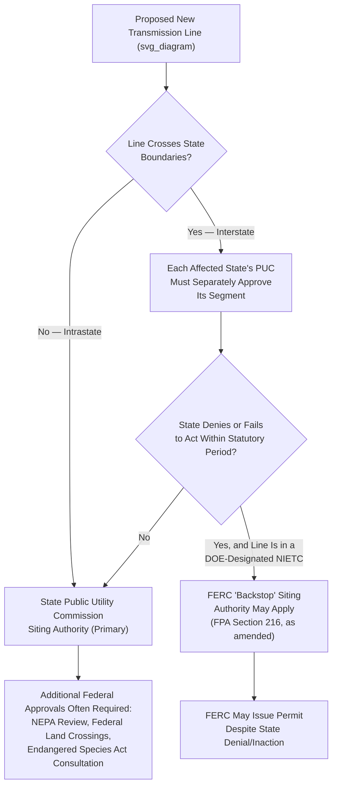
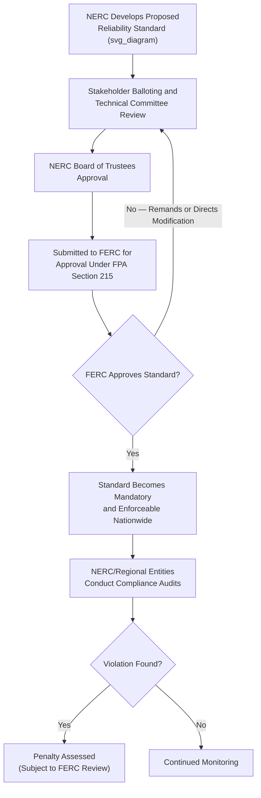

## Transmission Siting, Interconnection, and Grid Reliability Regulation

### Conceptual Framework

Transmission siting, interconnection, and grid reliability regulation together govern how new electricity transmission infrastructure and generation resources are physically approved, connected to, and maintained within the interconnected electric grid. These three regulatory domains are analytically distinct but functionally interdependent: siting determines where transmission lines may be built, interconnection determines how individual generators (and increasingly, distributed resources) connect to existing infrastructure, and reliability regulation ensures the combined system operates safely and predictably under normal and emergency conditions.

**Key Points**

- Unlike FERC's relatively centralized jurisdiction over wholesale rates, transmission siting authority is fragmented between federal and state governments in a manner that has generated persistent regulatory friction, particularly for interstate transmission lines needed to connect remote renewable generation to load centers
- Interconnection regulation has become an area of intense reform activity as the volume of generator interconnection requests (overwhelmingly wind, solar, and battery storage projects) has vastly outpaced historical processing capacity in most regional grids
- Reliability regulation operates through a distinctive public-private hybrid structure, with a nominally private self-regulatory organization (NERC) developing standards that FERC then approves and makes federally enforceable

### Transmission Siting Authority: The Federal-State Divide

**Key Points**

- Transmission siting has traditionally been treated as a matter of state jurisdiction (part of the states' reserved authority over "facilities used for generation" and local matters under FPA Section 201(b)), requiring developers of interstate lines to obtain separate certificate approval from every state the line crosses — a fragmented process that can produce inconsistent outcomes, prolonged timelines, and effective veto power for any single state along a proposed route
- The Energy Policy Act of 2005 added FPA Section 216, granting FERC limited "backstop" siting authority allowing it to approve transmission projects within Department of Energy-designated National Interest Electric Transmission Corridors (NIETCs) where a state has denied an application or failed to act within a statutory timeframe
- This backstop authority was significantly narrowed by the Fourth Circuit's decision in *Piedmont Environmental Council v. FERC* (2009), which held that FERC's backstop authority did not extend to situations where a state had denied a permit application (as opposed to simply failing to act), substantially undermining the provision's practical utility for years afterward
- The Fiscal Responsibility Act of 2023 and subsequent DOE/FERC implementation efforts have sought to restore and clarify federal backstop siting authority, reflecting sustained policy concern that state-by-state veto points impede transmission buildout needed for grid reliability and renewable energy integration — [Inference] given the ongoing and evolving nature of this reform effort, current implementation status should be verified against the most recent FERC and DOE actions rather than assumed static

### National Interest Electric Transmission Corridors (NIETCs)

**Key Points**

- Established under EPAct 2005, NIETCs are geographic corridors designated by the Department of Energy as experiencing electric energy transmission capacity constraints or congestion that adversely affects consumers, intended to trigger the availability of FERC's backstop siting authority within the designated corridor
- DOE's NIETC designation process itself requires extensive study, public comment, and coordination with affected states, and has historically been used sparingly, reflecting both the political sensitivity of federal transmission siting intervention and the practical difficulty of the underlying congestion analysis
- The interaction between NIETC designation, FERC backstop authority, and ordinary state permitting creates a multi-layered administrative process in which developers of major interstate lines must navigate federal, multi-state, and potentially additional federal land-management approvals simultaneously

### Environmental and Federal Land Approval Layers

**Key Points**

- Even where state siting approval is obtained, transmission projects crossing federal lands require separate approval from the relevant federal land management agency (Bureau of Land Management, U.S. Forest Service), each triggering independent National Environmental Policy Act (NEPA) review
- Projects affecting federally listed species require Endangered Species Act Section 7 consultation with the U.S. Fish and Wildlife Service or National Marine Fisheries Service, and projects affecting wetlands or navigable waters may require Clean Water Act Section 404 permitting from the U.S. Army Corps of Engineers
- This layered federal environmental review process, operating independently of and in addition to state siting proceedings, has been a significant focus of permitting reform discussions, as a single major interstate transmission project can require coordinated approval across numerous state and federal agencies each applying distinct statutory standards and timelines

### Interconnection Regulation: The Queue Reform Problem

**Key Points**

- Generator interconnection is the technical and administrative process by which a new power plant (or aggregated distributed resource) obtains the necessary studies, agreements, and physical infrastructure to safely connect to the transmission or distribution grid
- RTOs/ISOs and vertically integrated utilities maintain interconnection "queues" — the ordered sequence in which pending generator interconnection requests are studied for their grid impact, historically processed largely on a first-come-first-served, serial study basis
- The dramatic surge in renewable and storage project applications over the past decade produced massive queue backlogs in most U.S. regions, with some projects waiting years for interconnection study completion, and a substantial share of queued projects ultimately withdrawing due to excessive costs or delays identified during the study process — a phenomenon frequently termed the "interconnection queue crisis"

### FERC Order No. 2023: Interconnection Process Reform

**Key Points**

- FERC Order No. 2023 (2023) mandated that RTOs/ISOs and transmission providers transition from serial, first-come-first-served interconnection study processing to a "first-ready, first-served" **cluster study** approach, grouping multiple pending interconnection requests together for simultaneous study rather than processing them strictly sequentially
- The order introduced firm study deadlines, increased financial commitment and readiness requirements at earlier stages of the queue process (intended to deter speculative applications that clog the queue without genuine intent to build), and required implementation of technologies like surplus interconnection service and generator replacement provisions to make more efficient use of existing interconnection capacity
- [Inference] Because Order No. 2023 implementation has proceeded on a compliance-filing basis with each RTO/ISO submitting its own tariff revisions for FERC approval, the specific queue reform mechanics and timelines vary somewhat by region, and current implementation status in any given RTO/ISO should be verified against that region's FERC-approved compliance filing rather than assumed uniform nationally

### Interconnection Cost Allocation: Network Upgrades

**Key Points**

- A central and frequently litigated interconnection issue is cost allocation for "network upgrades" — transmission system improvements required to accommodate a new generator's interconnection that also benefit the broader grid beyond the specific interconnecting project
- FERC precedent generally distinguishes between costs for facilities that solely benefit the interconnecting generator (typically assigned entirely to that generator, the "interconnection customer") and costs for broader network upgrades that provide system-wide reliability or capacity benefits (which may be eligible for cost allocation across a broader set of beneficiaries or transmission ratepayers, subject to specific tariff provisions)
- This cost allocation question has substantial practical significance because unexpectedly large network upgrade cost assignments discovered late in the interconnection study process are a leading cause of project withdrawal from interconnection queues, reinforcing the queue-reform rationale for earlier and more accurate cost estimation

### Distributed Energy Resource Interconnection at the Distribution Level

**Key Points**

- Interconnection of smaller distributed energy resources (rooftop solar, small battery storage, distributed generation) to the local distribution system is governed primarily by state-jurisdictional interconnection standards, distinct from the FERC-jurisdictional transmission-level interconnection process
- Many states have adopted interconnection procedures modeled on or referencing IEEE 1547 (the industry technical standard for interconnecting distributed resources), with tiered review levels calibrated to project size and anticipated grid impact — smaller, lower-impact systems typically receive streamlined "fast-track" review while larger systems undergo more detailed engineering study
- FERC Order No. 2222's requirement that RTOs/ISOs permit distributed energy resource aggregations to participate in wholesale markets has created a jurisdictional interface question regarding how distribution-level interconnection approval (state) coordinates with wholesale market participation registration (federal) for the same physical resource

### Grid Reliability Regulation: The NERC-FERC Framework

**Key Points**

- FPA Section 215, added by the Energy Policy Act of 2005, authorizes FERC to certify an Electric Reliability Organization and approve mandatory, enforceable reliability standards for the bulk power system — a direct legislative response to the 2003 Northeast Blackout, which was significantly attributed to inadequate voluntary reliability compliance under the pre-2005 framework
- The North American Electric Reliability Corporation (NERC) has held the Electric Reliability Organization designation since 2006, developing Critical Infrastructure Protection (cybersecurity), operations, planning, and other reliability standard categories through a stakeholder-driven technical development process, subject to ultimate FERC approval
- NERC delegates significant compliance monitoring and enforcement authority to Regional Entities (geographically organized reliability coordination bodies), which conduct audits and can levy penalties for standard violations, subject to appeal through NERC and ultimately FERC review — a multi-tiered enforcement architecture blending industry self-regulation with federal oversight

### Bulk Power System Definition and Jurisdictional Scope

**Key Points**

- FERC's reliability jurisdiction under Section 215 extends to the "bulk power system" — generally defined to encompass facilities and control systems necessary for operating an interconnected electric energy transmission network, but explicitly excluding facilities used in local distribution
- This reliability-specific jurisdictional scope is analytically broader than FERC's traditional wholesale rate jurisdiction in one critical respect: it applies to virtually all bulk power system users, owners, and operators regardless of whether they engage in FERC-jurisdictional wholesale rate transactions, meaning even ERCOT-area entities (otherwise largely outside FERC's FPA rate jurisdiction due to Texas's electrical isolation) remain subject to NERC reliability standards
- Critical Infrastructure Protection standards addressing cybersecurity of grid control systems have become an increasingly significant reliability regulation focus, reflecting growing policy concern about the vulnerability of interconnected grid control systems to cyberattack

### Reliability Regulation Following Major Grid Events

**Key Points**

- Major grid reliability failures have historically served as the primary catalyst for significant reliability regulation reform, following a recurring pattern: event occurs, causation investigation identifies specific standard gaps, NERC develops and FERC approves new or revised standards addressing the identified gap
- **Example**: Winter Storm Uri (February 2021), which caused widespread and prolonged Texas grid failure with substantial loss of life, prompted both federal (FERC-NERC joint inquiry) and Texas-specific regulatory responses, including new weatherization requirements for generation and gas supply infrastructure — illustrating how extreme weather-driven reliability failures have increasingly required reliability regulation to address winterization and other climate-resilience gaps beyond the framework's original traditional reliability focus
- [Inference] The increasing frequency of extreme weather events affecting grid reliability has driven ongoing regulatory attention toward extreme weather preparedness standards, though the specific scope and stringency of resulting NERC standards continues to evolve and should be verified against current NERC/FERC reliability standard dockets for the most current requirements

### Resource Adequacy and Reliability Interface

**Key Points**

- Resource adequacy — ensuring sufficient generation and demand-response capacity exists to reliably meet peak electricity demand — is regulated through a combination of RTO/ISO capacity market mechanisms (FERC-jurisdictional, where organized capacity markets exist) and state-level integrated resource planning requirements (state-jurisdictional, particularly in regions without organized capacity markets)
- The retirement of dispatchable thermal generation (coal, and increasingly some natural gas) alongside the addition of intermittent renewable resources has intensified regulatory attention to whether existing resource adequacy frameworks adequately account for the different reliability characteristics of variable renewable generation compared to traditional dispatchable resources
- [Inference] This resource adequacy debate intersects directly with the interconnection queue and transmission siting challenges discussed above, since delayed interconnection and transmission buildout can directly affect whether planned replacement generation capacity becomes available on a timeline consistent with retiring dispatchable capacity, representing a systemic coordination challenge across the siting, interconnection, and reliability regulatory domains that current reform efforts (Orders 2023 and 1920) are specifically intended to address

### FERC Order No. 1920: Long-Term Regional Transmission Planning

**Key Points**

- FERC Order No. 1920 (2024) requires transmission providers to conduct long-term (at least 20-year horizon) regional transmission planning that explicitly accounts for anticipated changes in the generation resource mix, rather than planning primarily around near-term reliability needs and existing generation patterns
- The order also addresses cost allocation methodology for transmission facilities identified through this long-term planning process, seeking to establish more predictable cost-sharing mechanisms among the states and utilities that benefit from regional transmission investment — a persistent source of interstate dispute given the divergent interests of states that would host new transmission versus states that would primarily benefit from improved access to remote generation
- [Inference] Given the substantial cost allocation and interstate equity issues embedded in long-term regional transmission planning, and the political contentiousness of prior FERC transmission planning rules, Order 1920's implementation has faced and may continue to face legal challenges; current status should be verified against pending D.C. Circuit or other appellate litigation rather than assumed final

### Comparative Note: Philippine Transmission and Grid Reliability Framework

**Key Points**

- The Philippines addresses transmission through a structurally different institutional model: the National Grid Corporation of the Philippines (NGCP) holds an exclusive congressional franchise as the country's sole transmission system operator, eliminating the multi-utility, multi-state transmission ownership fragmentation that drives much of the U.S. siting complexity
- Transmission project approval in the Philippines involves ERC franchise/rate approval, DENR environmental compliance certification, and National Commission on Indigenous Peoples free and prior informed consent requirements where ancestral domains are affected, representing a different multi-agency approval structure than the U.S. federal-state siting divide
- [Inference] The Philippines' single-transmission-operator model avoids the specific interstate siting coordination problems central to U.S. NIETC/FERC backstop authority debates, but has generated its own distinct regulatory concerns regarding NGCP's monopoly franchise performance, project delivery timelines, and grid reliability accountability, illustrating how centralized-monopoly and fragmented-multi-jurisdictional transmission models each present distinct regulatory oversight challenges

### Related Topics

- FERC jurisdiction over wholesale electricity and natural gas markets (foundational jurisdictional framework)
- The *Piedmont Environmental Council v. FERC* line of cases and federal backstop siting authority
- NEPA review and multi-agency federal environmental permitting for transmission and pipeline projects
- IEEE 1547 and state-level distributed energy resource interconnection standards
- NERC Critical Infrastructure Protection standards and grid cybersecurity regulation
- Resource adequacy frameworks and capacity market design in RTO/ISO regions
- Winter Storm Uri and post-event reliability standard reform
- The Philippine National Grid Corporation's exclusive transmission franchise and ERC oversight