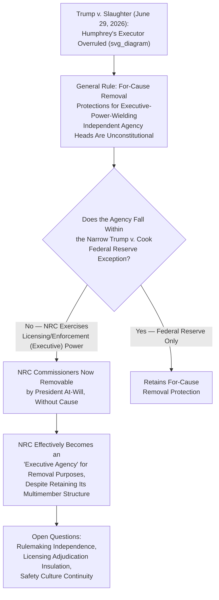

## Nuclear Regulation and NRC Independence Questions After Trump v. Slaughter

### Institutional Overview of the NRC

The Nuclear Regulatory Commission (NRC) is a five-member independent federal agency, created by the Energy Reorganization Act of 1974, which split the regulatory functions of the former Atomic Energy Commission (AEC) into a promotional arm (later folded into the Department of Energy) and a dedicated safety and licensing regulator (the NRC). The NRC licenses and regulates civilian use of nuclear materials, including commercial nuclear power reactors, radioactive materials in medicine and industry, and the storage and transport of nuclear waste, under the Atomic Energy Act of 1954 as amended.

**Key Points**

- NRC Commissioners are appointed by the President with Senate confirmation, serve staggered five-year terms, and — prior to the developments discussed below — could statutorily be removed by the President only for cause, consistent with the traditional multimember independent commission model
- The NRC's structure (multimember, bipartisan-by-practice, quasi-legislative rulemaking and quasi-judicial licensing adjudication functions) placed it squarely within the category of agencies historically understood to fall under *Humphrey's Executor v. United States* (1935), the foundational precedent protecting independent agency heads from at-will presidential removal
- Nuclear safety regulation has historically been treated as an area where insulation from short-term political pressure was considered particularly important, given the technical complexity of reactor safety determinations and the multi-decade licensing horizons involved in nuclear plant construction and operation

### *Trump v. Slaughter*: The Supreme Court Decision

**Key Points**

- On June 29, 2026, the Supreme Court decided *Trump v. Slaughter*, 609 U.S. ___ (2026), a case arising from President Trump's 2025 removal of Federal Trade Commission Commissioner Rebecca Kelly Slaughter without the statutorily required "cause" (inefficiency, neglect of duty, or malfeasance)
- In a 6-3 decision authored by Chief Justice Roberts, the Court overruled *Humphrey's Executor v. United States* (1935), holding that statutory for-cause removal protections for members of multimember independent agencies that exercise executive power violate the constitutional separation of powers, because the Constitution vests the entirety of executive power in the President, including the power to remove subordinates exercising that power
- The Court's reasoning traced back through *Myers v. United States* (1926), treating *Humphrey's Executor*'s 90-year-old exception as an anomaly inconsistent with the unitary executive theory of Article II rather than as settled, durable precedent
- A companion decision issued the same day, *Trump v. Cook*, preserved a narrow removal-protection exception specifically for Federal Reserve Governors, with the majority reasoning that the Federal Reserve occupies a unique historical position and does not exercise "executive power" in the same sense as agencies like the FTC — creating a specific, limited carve-out rather than a wholesale exception for all agencies with a monetary-policy or financial-stability rationale

### Direct Implications for the NRC

**Key Points**

- Both litigants' briefing and multiple post-decision legal analyses explicitly identified the NRC — alongside FERC, the Consumer Product Safety Commission, the Chemical Safety Board, and the Merit Systems Protection Board — as an agency whose for-cause removal protection is directly nullified by the *Slaughter* holding, since the NRC's licensing and enforcement functions constitute the kind of "executive power" the majority held could not be insulated from presidential removal
- The dissent by Justice Sotomayor, joined by Justices Kagan and Jackson, explicitly warned that the decision would allow the President to remove, without cause, the heads of numerous independent agencies including the NRC, reflecting the dissent's view that safety-and-technically-oriented multimember commissions were exactly the kind of body *Humphrey's Executor* was designed to protect
- Because the NRC was not itself a party to *Slaughter*, no NRC commissioner has necessarily been removed as a direct result of the decision as of this writing; rather, the decision eliminates the *statutory* removal protection previously available to NRC commissioners, meaning any future at-will removal attempt would no longer face a viable *Humphrey's Executor*-based legal challenge — [Inference] whether and how quickly the executive branch acts to actually remove or pressure sitting NRC commissioners following the decision is a distinct empirical and political question from the doctrinal holding itself, and should be verified against current news rather than assumed

### The Distinction: Structural Removability vs. Actual Removal

**Key Points**

- It is important to distinguish two separate questions raised by *Slaughter*'s application to the NRC: (1) the constitutional/statutory question of whether NRC commissioners *can* now be removed without cause, which the decision resolves in the affirmative, and (2) the empirical/political question of whether and when any such removal actually occurs or is threatened, which depends on subsequent executive action
- [Inference] Commentary shortly following the decision (including analysis published approximately one month after the ruling) framed the NRC as having lost its "structural independence" as a categorical, immediate legal matter — describing the Commission as becoming a "normal" executive agency subject to direct presidential control with no nuclear-safety-specific exception — while also noting that the practical consequences for nuclear safety regulation "have yet to set in" and remained a subject of ongoing analysis rather than settled prediction
- This distinction matters for administrative law analysis: *Slaughter* changes the default legal baseline (removability), but the pace, scope, and manner in which any administration exercises this newly clarified removal authority against the NRC specifically is a separate, evolving question that requires ongoing monitoring of subsequent executive and possibly further judicial action

### Why the *Trump v. Cook* Federal Reserve Exception Does Not Extend to the NRC

**Key Points**

- The *Cook* majority's rationale for preserving Federal Reserve Governors' removal protection rested on the Federal Reserve's distinctive historical structure and its characterization as not exercising "executive power" in the constitutionally relevant sense — a rationale tied specifically to the unique quasi-private, dual public-private governance structure of the Federal Reserve System and its historical treatment
- The NRC, by contrast, exercises core executive functions unambiguously: issuing and revoking reactor operating licenses, conducting enforcement inspections, imposing civil penalties, and making binding safety determinations — functions that fall squarely within the kind of "executive power" the *Slaughter* majority held must remain subject to presidential removal authority
- [Inference] No serious post-decision analysis identified in current reporting has argued that the NRC could plausibly qualify for a *Cook*-style exception; the near-uniform expert commentary treats the NRC as falling within the general *Slaughter* rule rather than the narrow *Cook* carve-out, though this remains an area where a future test case specific to the NRC (rather than analogical reasoning from *Slaughter* itself) could theoretically clarify the boundary further

### Substantive Nuclear Safety Regulation Concerns Raised by Reduced Independence

**Key Points**

- Critics of the *Slaughter* decision's application to nuclear regulation have raised concerns that removing insulation from presidential removal could compromise the NRC's ability to make politically unpopular but safety-critical decisions — for example, delaying or denying a license renewal application, or ordering a costly safety-related shutdown — if commissioners fear removal for decisions that conflict with an administration's energy policy priorities (such as an administration favoring rapid nuclear power expansion to meet growing electricity demand)
- [Inference] This concern parallels historical rationales for insulating financial and safety regulators generally: agencies making technical, long-horizon, and occasionally economically costly safety determinations are traditionally thought to benefit from protection against short-term political pressure tied to election cycles, though reasonable disagreement exists among legal scholars and commentators about whether this policy rationale should be constitutionally dispositive versus a matter left to Congress and the political process
- Proponents of the *Slaughter* decision's broader unitary-executive rationale (including public commentary from at least one former FERC commissioner) have characterized the ruling as a correct restoration of constitutional accountability, arguing that agencies exercising binding regulatory and enforcement power over significant economic sectors should remain politically accountable through the President rather than insulated from electoral consequences

### Comparison to FERC's Parallel Situation

**Key Points**

- FERC, discussed in the preceding chapter item on wholesale electricity and gas jurisdiction, faces an essentially identical structural change as a result of *Slaughter* — as a multimember independent commission exercising executive power over ratemaking, licensing, and market oversight, FERC commissioners lose the same for-cause removal protection as NRC commissioners
- The pairing of FERC and NRC in most post-decision legal and industry commentary reflects their shared institutional design (independent multimember energy/safety commissions) and their shared practical significance for energy sector regulatory stability, since both agencies' decisions substantially affect long-horizon capital investment decisions (nuclear plant licensing, transmission and pipeline certification) that market participants have historically assumed would proceed with some insulation from single-administration political swings
- [Inference] Because both agencies now face the same reduced insulation, industry commentary has suggested that companies with significant capital committed to nuclear or FERC-jurisdictional infrastructure projects should reconsider compliance and business-planning assumptions that presumed continuity of independent-agency decision-making across administrations, treating regulatory outcomes as now more directly correlated with electoral outcomes than under the pre-*Slaughter* legal regime

### Open Administrative Law Questions Following the Decision

**Key Points**

- **Scope of removal authority versus decisional independence**: *Slaughter* addresses the President's removal power but does not, on its face, alter the NRC's statutory adjudicatory and rulemaking procedures (formal licensing hearings, Atomic Safety and Licensing Boards, notice-and-comment rulemaking under the Administrative Procedure Act); an open question is whether reduced removal insulation will, in practice, alter how the NRC exercises this still-intact procedural framework
- **Effect on pending and future licensing proceedings**: Whether parties to NRC licensing adjudications (utilities, intervenors, states) will raise new arguments regarding due process or agency bias in light of commissioners' altered relationship to the President is an emerging litigation question not yet resolved by existing case law specific to the NRC
- **Congressional response**: Because *Slaughter* is a constitutional holding rather than a statutory interpretation, Congress cannot simply amend the Atomic Energy Act or Energy Reorganization Act to restore for-cause removal protection for NRC commissioners; any legislative response would need to operate within the constitutional framework the Court has now established, a significantly more constrained avenue for preserving agency independence than existed before the decision
- [Inference] Given how recently the decision was issued relative to any specific NRC-focused test case, litigation and scholarly analysis addressing these NRC-specific questions is still developing; the most current NRC-specific legal and institutional developments should be verified against subsequent case law and NRC/administration actions rather than assumed to follow a predetermined trajectory from the *Slaughter* holding alone

### Broader Doctrinal Significance: The End of the "Quasi-Legislative/Quasi-Judicial" Exception

**Key Points**

- *Humphrey's Executor*'s core doctrinal innovation was distinguishing "quasi-legislative" and "quasi-judicial" agency functions (protectable from at-will removal) from purely "executive" functions (not protectable) — a distinction the *Slaughter* majority rejected as unworkable and inconsistent with the unitary vesting of executive power in Article II
- This holding effectively confirms and completes a doctrinal trajectory visible in earlier decisions narrowing *Humphrey's Executor*, including *Free Enterprise Fund v. Public Company Accounting Oversight Board* (2010) and *Seila Law LLC v. Consumer Financial Protection Bureau* (2020), both of which treated *Humphrey's Executor* as a "limited exception" applicable only to traditional multimember commissions with defined, limited functions rather than a broad general principle — *Slaughter* is best understood as the culmination of this narrowing line rather than an abrupt doctrinal departure
- [Inference] Because the *Slaughter* majority's reasoning rests on a general theory of unitary executive power rather than any nuclear-safety-specific or energy-specific analysis, the decision's application to the NRC is essentially a mechanical consequence of the agency's classification as an executive-power-wielding multimember commission, rather than a product of any deliberate policy judgment by the Court specifically about nuclear safety regulation

### Comparative Note: Philippine Nuclear Regulatory Independence

**Key Points**

- The Philippines does not currently operate a commercial nuclear power fleet, though nuclear energy has periodically been revisited as a policy option (including renewed interest reflected in recent Department of Energy and legislative discussions), and Philippine nuclear regulatory functions are primarily vested in the Philippine Nuclear Research Institute (PNRI) under the Department of Science and Technology, alongside broader energy policy coordination through the Department of Energy
- [Inference] Because the Philippines operates under a unitary presidential system without the specific line of U.S. constitutional separation-of-powers jurisprudence governing removal protections for independent multimember commissions (a doctrinal area specific to the U.S. constitutional structure and its Article II executive vesting clause), the *Humphrey's Executor*/*Slaughter* line of cases has no direct doctrinal analogue in Philippine administrative law; Philippine regulatory agency heads generally serve at the President's pleasure as a matter of ordinary administrative law and civil service structure rather than through a comparable independent-agency removal-protection framework requiring constitutional adjudication
- This contrast is useful for illustrating how the specific constitutional architecture of separated powers in a presidential system can generate uniquely American doctrinal battles (unitary executive theory, independent agency removal protection) that do not necessarily recur in other presidential systems with different foundational constitutional text and historical development, even where both systems share a broadly presidential structure

### Related Topics

- FERC jurisdiction over wholesale electricity and natural gas markets (parallel independent-agency structure)
- *Humphrey's Executor v. United States* and the historical development of independent agency doctrine
- *Seila Law v. CFPB* and *Free Enterprise Fund v. PCAOB* as the doctrinal bridge to *Slaughter*
- *Trump v. Cook* and the Federal Reserve independence exception
- Unitary executive theory and Article II removal power jurisprudence
- Nuclear licensing procedure and Atomic Safety and Licensing Boards under the Atomic Energy Act
- Administrative Procedure Act rulemaking and adjudication requirements as distinct from removal-power questions
- The Philippine Department of Energy and PNRI institutional framework for nuclear policy