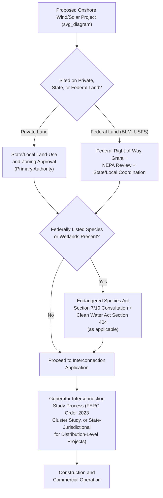

## Renewable Energy Permitting and Offshore Wind Development

### Conceptual Framework

Renewable energy permitting encompasses the multi-layered federal, state, and local approval processes required to site, construct, and operate wind, solar, and other renewable generation facilities. Offshore wind development presents a particularly complex permitting profile because it uniquely combines federal ocean jurisdiction, multi-agency environmental review, interstate transmission interconnection, and — unlike most onshore renewable projects — near-total dependence on a single federal leasing and permitting authority for the underlying site itself.

**Key Points**

- Onshore renewable projects (solar, onshore wind) are permitted primarily through state and local land-use authority when sited on private land, with federal involvement triggered mainly by federal land use, federal funding/tax credit compliance, Endangered Species Act consultation, or interstate transmission interconnection
- Offshore wind projects sited in federal waters are permitted almost entirely through federal processes, because the seabed and water column beyond state jurisdictional boundaries (generally 3 nautical miles from shore) fall under exclusive federal jurisdiction under the Outer Continental Shelf Lands Act
- Both onshore and offshore renewable development share common permitting bottlenecks: environmental review timelines, interconnection queue delays (see the companion item on transmission siting and interconnection), and cumulative multi-agency approval requirements that have become central to broader "permitting reform" policy debates

### Onshore Renewable Permitting: The Layered Jurisdictional Structure

**Key Points**

- State and local siting authority over onshore wind and solar varies enormously by jurisdiction — some states maintain centralized state-level siting boards with authority to override local zoning objections, while others leave siting authority entirely with county/municipal governments, producing significant project-by-project variability in approval timelines and local opposition dynamics
- Local zoning and land-use battles have become an increasingly significant onshore renewable development bottleneck, with county-level moratoria, setback ordinance changes, and ballot initiatives in various jurisdictions materially affecting project viability independent of any state or federal approval status
- Federal Endangered Species Act compliance for onshore wind frequently centers on avian and bat mortality (particularly for eagles and certain bat species), with the U.S. Fish and Wildlife Service's Eagle Take Permit program providing a specific regulatory mechanism allowing incidental eagle mortality within permitted limits, subject to required avoidance and minimization measures

### Offshore Wind: Foundational Federal Jurisdictional Framework

**Key Points**

- The Outer Continental Shelf Lands Act (OCSLA), as amended by the Energy Policy Act of 2005 (adding Section 8(p)), grants the Department of the Interior — through the Bureau of Ocean Energy Management (BOEM) — exclusive authority to lease areas of the Outer Continental Shelf for renewable energy development, filling a jurisdictional gap that previously left offshore wind siting in federal waters without a clear statutory leasing framework
- BOEM's offshore wind program encompasses the full project lifecycle: identifying and leasing "Wind Energy Areas" through competitive lease auctions, reviewing Construction and Operations Plans (COPs), and conducting the environmental review required before construction may begin
- State jurisdiction extends only to state waters (generally the first 3 nautical miles from shore, except Texas and the Gulf Coast of Florida, which extend to 9 nautical miles under historical statehood-era boundary agreements), meaning most utility-scale offshore wind projects — sited farther offshore for wind resource and visual/conflict reasons — fall entirely within BOEM's federal leasing jurisdiction

### The BOEM Offshore Wind Leasing and Permitting Sequence

**Example — Standard Multi-Stage Process**

1. **Area identification and Wind Energy Area (WEA) designation** — BOEM identifies and designates areas for potential leasing following an intergovernmental task force process involving affected states, other federal agencies, and stakeholder input
2. **Competitive lease auction** — BOEM conducts a competitive auction (sealed bid or ascending clock format) for leases within designated WEAs, with successful bidders acquiring exclusive rights to develop the leased area subject to subsequent regulatory approval
3. **Site assessment** — the lessee conducts site characterization studies (geophysical, geotechnical, biological, archaeological) required to support the subsequent construction application
4. **Construction and Operations Plan (COP) submission** — the lessee submits a detailed COP describing the specific project design, turbine layout, cable routing, and operational parameters
5. **NEPA environmental review** — BOEM prepares an Environmental Impact Statement (EIS) or, for smaller projects, potentially an Environmental Assessment, evaluating the COP's environmental effects
6. **Interagency consultation** — parallel review under the Endangered Species Act (National Marine Fisheries Service and U.S. Fish and Wildlife Service), Marine Mammal Protection Act, National Historic Preservation Act, and Coastal Zone Management Act consistency review with affected states
7. **COP approval and construction** — upon completion of environmental review and interagency consultation, BOEM issues a Record of Decision and approves the COP, allowing construction to proceed

### Coastal Zone Management Act Consistency Review: The Federal-State Interface

**Key Points**

- The Coastal Zone Management Act (CZMA) requires that federal agency activities affecting a state's coastal zone, including BOEM's offshore wind leasing and COP approval decisions, be consistent "to the maximum extent practicable" with that state's federally approved Coastal Management Program, even where the specific offshore activity itself occurs entirely within federal waters beyond the state's own jurisdictional boundary
- This creates a significant point of state leverage over otherwise federally-controlled offshore wind projects: a state can object to a project's consistency determination, potentially triggering formal mediation through the Department of Commerce or, in contested cases, protracted litigation over whether the project adequately accounts for state coastal policy objectives (fisheries protection, viewshed/visual impact, navigation)
- [Inference] CZMA consistency review has become one of the more significant sources of delay and negotiation leverage in offshore wind permitting precisely because it gives coastal states a substantive review role over projects sited in federal waters that they would not otherwise have jurisdiction to directly regulate, and the practical significance of this leverage point varies considerably depending on a given state's political posture toward the specific project

### Endangered Species Act and Marine Mammal Protection Act Compliance

**Key Points**

- Offshore wind construction and operation raise distinct marine species concerns not present in onshore renewable permitting, particularly regarding the North Atlantic right whale (a critically endangered species with a range overlapping several major U.S. offshore wind lease areas) and other marine mammals potentially affected by pile-driving noise during turbine foundation installation
- ESA Section 7 consultation between BOEM and the National Marine Fisheries Service typically results in a Biological Opinion establishing specific mitigation requirements — seasonal construction restrictions, real-time acoustic monitoring, vessel speed restrictions, and protected species observers — intended to avoid jeopardizing listed species during construction
- Marine Mammal Protection Act authorization (an "Incidental Harassment Authorization" or "Incidental Take Regulation" from NMFS) is typically required in parallel with ESA consultation, addressing anticipated incidental take of marine mammals (primarily through underwater noise) during pile-driving and other construction activities
- [Inference] North Atlantic right whale mitigation requirements have been a particular focus of litigation and advocacy group scrutiny in several major East Coast offshore wind projects, given the species' critically low population and documented mortality events, though the specific mitigation measures and their adequacy remain contested among project developers, environmental groups, and fishing industry stakeholders in ongoing administrative and judicial proceedings

### Fisheries and Navigation Conflicts

**Key Points**

- Offshore wind lease areas frequently overlap with commercial and recreational fishing grounds, generating a distinct category of permitting conflict centered on economic displacement and gear conflict rather than purely ecological harm — addressed through BOEM's environmental review process but also through direct compensation and mitigation agreements negotiated between developers and affected fishing interests
- Turbine layout and spacing requirements (commonly a standardized grid pattern, such as one-nautical-mile spacing in a uniform east-west/north-south orientation) have been influenced significantly by U.S. Coast Guard navigation safety input, seeking to preserve predictable transit corridors for vessel traffic through wind energy areas
- [Inference] Fisheries compensation fund structures and specific mitigation agreement terms vary by project and region, reflecting negotiated outcomes between developers and affected fishing associations/state fisheries agencies rather than a single uniform federal compensation standard, and the adequacy of these arrangements remains a subject of ongoing debate within affected fishing communities

### Transmission Interconnection for Offshore Wind

**Key Points**

- Offshore wind projects require export cable infrastructure connecting the offshore substation to an onshore point of interconnection, a process that itself requires separate permitting for the export cable's onshore landfall (typically state/local coastal permitting) and the interconnecting transmission utility's own interconnection study process
- Some coastal states and regional planning processes have begun exploring "offshore transmission backbone" or coordinated transmission approaches — sharing offshore transmission infrastructure across multiple wind projects rather than requiring each project to build an individual export cable — intended to reduce cumulative environmental impact (fewer cable crossings) and improve grid reliability through networked rather than radial offshore transmission topology
- FERC Order No. 1920's long-term regional transmission planning requirements (discussed in the companion transmission siting item) explicitly contemplate offshore wind interconnection needs as part of the anticipated generation resource mix that transmission providers must plan for, reflecting growing regulatory recognition that offshore wind's transmission needs require coordinated advance planning rather than purely project-by-project interconnection processing

### Federal Investment Tax Credit and Production Tax Credit Interface with Permitting

**Key Points**

- Federal tax incentives (Investment Tax Credit and Production Tax Credit under the Internal Revenue Code, as modified by subsequent federal energy and tax legislation) have historically been a major driver of renewable project economics, and changes to eligibility requirements, credit phase-down schedules, or "beginning of construction" safe harbor rules can materially affect project timing decisions independent of the underlying environmental/siting permitting process
- [Inference] Because federal tax credit policy has been subject to significant legislative change in recent years, and because credit eligibility often depends on project-specific "beginning of construction" determinations that interact with permitting milestones, current tax credit terms and their interaction with any specific project's permitting timeline should be verified against current Internal Revenue Service guidance and applicable federal statute rather than assumed static

### Permitting Reform Debates and Recent Legislative/Regulatory Developments

**Key Points**

- Renewable energy permitting timelines — particularly the multi-year NEPA environmental review process common to both onshore federal-land projects and offshore wind — have been a central focus of bipartisan "permitting reform" legislative proposals in recent years, seeking to establish firmer review timelines, reduce duplicative agency review, and limit the scope of litigation challenges to completed environmental reviews
- [Inference] Given the highly active and politically contested nature of federal permitting reform legislation and executive action affecting both offshore wind leasing policy and renewable energy tax incentives, the specific current state of federal offshore wind leasing pace, permitting timelines, and applicable incentive structures should be verified against current BOEM announcements, Department of Interior policy, and recent federal legislation rather than assumed to reflect any particular historical baseline, as this area has experienced substantial policy volatility across recent administrations

### State-Level Offshore Wind Procurement Mandates

**Key Points**

- Several coastal states have enacted statutory procurement mandates requiring their utilities to contract for specified quantities of offshore wind generation by defined target dates, functioning as a demand-side driver for offshore wind development independent of BOEM's supply-side leasing process
- These state procurement processes typically involve state public utility commission or energy office administered competitive solicitations, resulting in long-term power purchase agreements between offshore wind developers and state utilities — a state-jurisdictional commercial contracting layer operating alongside, but analytically distinct from, the federal BOEM leasing and permitting process
- [Inference] The pace and stability of state offshore wind procurement mandates has varied considerably by state and over time, with some states revising downward or delaying procurement targets in response to project cost increases, supply chain constraints, or changed federal policy conditions, meaning current state procurement commitments should be verified against each specific state's current statutory and regulatory framework rather than assumed stable

### Administrative Law Dimensions Distinctive to Offshore Wind Permitting

**Key Points**

- **Cumulative impact analysis under NEPA**: Because multiple offshore wind lease areas are often clustered within the same regional ocean space, environmental review increasingly requires cumulative impact analysis addressing the combined effect of multiple projects rather than evaluating each project in isolation — a technically complex and litigation-prone element of offshore wind NEPA review
- **Standard of review for BOEM leasing and COP decisions**: Judicial review of BOEM's offshore wind decisions proceeds under ordinary APA arbitrary-and-capricious review, with litigation frequently focused on the adequacy of BOEM's NEPA analysis, ESA consultation, and consideration of fisheries/navigation impacts — offshore wind projects have faced numerous legal challenges from environmental groups (concerned about marine mammal and avian impacts), fishing industry associations, and, in some cases, coastal community or tourism-industry opponents citing visual/aesthetic impacts
- **Interagency coordination challenges**: The multiplicity of federal agencies with a review or consultation role (BOEM, NMFS, USFWS, Coast Guard, Army Corps of Engineers for cable crossings, and state coastal management agencies via CZMA) creates significant coordination complexity, and permitting reform proposals have frequently focused on formalizing lead-agency coordination mechanisms to reduce sequential rather than parallel agency review

### Comparative Note: Philippine Renewable Energy Permitting Framework

**Key Points**

- The Philippines addresses renewable energy siting primarily through the Renewable Energy Act of 2008 (RA 9513), which establishes a Renewable Energy Service/Operating Contract system administered by the Department of Energy, alongside standard DENR environmental compliance certification requirements and LGU-level permitting for land-based projects
- Offshore wind development in the Philippines is a comparatively nascent area, with the DOE having issued offshore wind service contracts and preliminary policy frameworks; because the Philippines' offshore wind regulatory framework is still developing relative to the mature U.S. BOEM leasing model, [Inference] current Philippine offshore wind permitting requirements, lease award status, and applicable environmental review procedures should be verified against current DOE issuances rather than assumed to mirror the more established U.S. framework described above
- The Philippines' unitary governmental structure means offshore wind permitting does not face the specific federal-state CZMA consistency review dynamic present in the U.S. system, though DENR environmental review and National Commission on Indigenous Peoples free and prior informed consent requirements (where applicable to coastal ancestral domains) present analogous multi-agency coordination challenges within a differently structured institutional framework

### Related Topics

- Transmission siting, interconnection, and grid reliability regulation (interconnection process shared with onshore/offshore renewables)
- FERC jurisdiction and Order No. 1920 regional transmission planning for offshore wind
- Endangered Species Act Section 7 consultation and Biological Opinion mitigation requirements
- Coastal Zone Management Act consistency review and state-federal offshore jurisdiction disputes
- NEPA cumulative impact analysis for clustered offshore energy development
- Federal Investment Tax Credit and Production Tax Credit eligibility and "beginning of construction" rules
- State renewable portfolio standards and offshore wind procurement mandates
- The Philippine Renewable Energy Act (RA 9513) and DOE service/operating contract system