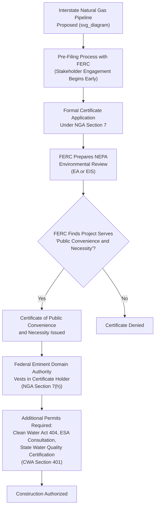

## Pipeline Siting and Fossil Fuel Infrastructure Approval

### Conceptual Framework

Pipeline siting and fossil fuel infrastructure approval encompasses the distinct regulatory pathways governing natural gas pipelines, oil pipelines, and associated facilities such as export terminals and compressor stations. Unlike electric transmission siting (fragmented across state jurisdictions) or offshore wind (concentrated in a single federal leasing authority), fossil fuel pipeline regulation follows a bifurcated statutory structure: interstate natural gas pipelines are governed by a comprehensive federal certification regime under the Natural Gas Act, while oil pipelines are regulated through a substantially different and more fragmented combination of state eminent domain law, federal cross-border permitting (for international pipelines), and safety regulation.

**Key Points**

- Natural gas pipeline regulation is unified under FERC's Natural Gas Act Section 7 certification authority, which includes the power of eminent domain delegation, federal preemption of most state and local siting objections, and integrated environmental review — a comparatively centralized regulatory model
- Oil pipeline siting, by contrast, lacks an equivalent federal certification/eminent domain framework for most domestic interstate oil pipelines, leaving eminent domain and siting authority largely to state law, which produces significant state-by-state variation in pipeline developers' land acquisition and siting processes
- Both pipeline types intersect significantly with federal environmental review (NEPA), and both have become central battlegrounds in climate change litigation questioning whether downstream greenhouse gas emissions from transported fossil fuels must be considered in the federal approval's environmental analysis

### Natural Gas Pipeline Certification Under NGA Section 7

**Key Points**

- Under NGA Section 7, FERC must find that a proposed interstate pipeline is required by the "present or future public convenience and necessity" before issuing a certificate — a standard FERC has interpreted through its 1999 Certificate Policy Statement, which balances the project's benefits (typically evidenced by long-term precedent agreements/contracts with shippers) against its adverse effects on landowners, existing pipelines, and the environment
- Once FERC issues a certificate, NGA Section 7(h) grants the certificate holder federal eminent domain authority to acquire necessary rights-of-way through condemnation proceedings in federal district court, even over the objection of state or local governments — a significant and comparatively rare grant of private eminent domain power tied directly to a federal regulatory certification
- FERC's certification decision operates as the central "hub" approval around which numerous parallel federal and state permits must be obtained, including Clean Water Act Section 404 permits (wetland/waterway crossings) from the Army Corps of Engineers, Endangered Species Act consultation, and state water quality certification under Clean Water Act Section 401

### The Clean Water Act Section 401 State Veto Point

**Key Points**

- CWA Section 401 requires that any federally permitted activity that may result in a discharge into navigable waters obtain water quality certification from the state in which the discharge originates, certifying that the activity will comply with state water quality standards
- This creates a significant state leverage point over otherwise federally-certificated interstate pipelines: a state can deny, condition, or simply decline to act on a Section 401 certification request, potentially blocking or substantially delaying pipeline construction despite FERC's approval — a dynamic that has generated extensive litigation regarding the scope and limits of state Section 401 authority
- The scope of permissible state Section 401 review, and the consequences of state inaction (waiver versus effective denial through delay), has been the subject of significant EPA rulemaking changes and litigation across different presidential administrations, reflecting the section's status as one of the most consequential and contested state-federal jurisdictional interfaces in pipeline approval; [Inference] because EPA's Section 401 implementing regulations have been revised multiple times in recent years in response to shifting policy priorities, the current regulatory scope of state certification authority and permissible review timelines should be verified against the currently effective EPA rule rather than assumed static

### Downstream and Upstream Greenhouse Gas Emissions in NEPA Review

**Key Points**

- A central and evolving legal question in pipeline certification is whether FERC's NEPA environmental review must quantify and consider the greenhouse gas emissions associated with the ultimate combustion of the gas the pipeline will transport ("downstream emissions") and the emissions associated with producing that gas ("upstream emissions"), as opposed to limiting review strictly to the direct physical/environmental effects of pipeline construction and operation itself
- *Sierra Club v. FERC* (D.C. Circuit, 2017), often referred to in connection with the Sabal Trail pipeline, held that FERC's NEPA review must consider a pipeline's downstream greenhouse gas emissions where those emissions are a reasonably foreseeable effect of the FERC-authorized project, particularly where the pipeline is designed to serve specific identified downstream power plants
- Subsequent litigation and FERC policy statements have continued to refine the scope of this obligation, addressing questions such as how to attribute emissions when a pipeline serves multiple undetermined end uses, what methodology should be used to quantify significance, and whether FERC must adopt a specific greenhouse gas significance threshold — [Inference] this remains an unsettled and actively litigated area of pipeline administrative law, with the specific scope of required climate analysis continuing to evolve through ongoing D.C. Circuit and other circuit court decisions that should be checked for current status

### Oil Pipeline Siting: The Fragmented State-Law Model

**Key Positions — Contrast with Natural Gas Framework**

- Unlike interstate natural gas pipelines, most domestic interstate oil (crude and refined product) pipelines lack an equivalent comprehensive federal siting certification and eminent domain statute; oil pipeline companies typically must rely on state eminent domain statutes, which vary considerably in scope, procedural requirements, and the substantive standard applied to determine whether a private pipeline company's taking serves a sufficiently "public use" to satisfy state (and ultimately federal, via the Takings Clause) constitutional requirements
- Federal Energy Regulatory Commission jurisdiction over oil pipelines under the Interstate Commerce Act (as later amended) is limited primarily to rate regulation (ensuring interstate oil pipeline transportation rates are just and reasonable) rather than a comprehensive siting certification analogous to NGA Section 7 — meaning FERC's oil pipeline role is substantially narrower than its natural gas pipeline role
- This fragmentation means oil pipeline projects crossing multiple states must separately satisfy each state's eminent domain and siting requirements, producing significantly greater variability, and in politically contested projects, materially different outcomes state-by-state, compared to the unified federal process available to natural gas pipelines

### Case Study: The Dakota Access Pipeline and State/Tribal Consultation Disputes

**Key Points**

- The Dakota Access Pipeline (DAPL) illustrates the oil pipeline permitting model's distinct federal touchpoints: while most of the pipeline's route crossed private and state land subject to state permitting, its crossing of federal land and the Missouri River near Lake Oahe (a U.S. Army Corps of Engineers-managed reservoir) required a federal Clean Water Act Section 404 permit and an easement grant from the Corps
- Litigation surrounding DAPL centered significantly on whether the Corps' environmental review adequately consulted with the Standing Rock Sioux Tribe and adequately analyzed the risk of a pipeline spill affecting the Tribe's water supply and treaty-protected resources, with federal courts at different points ordering additional environmental review (including a court-ordered Environmental Impact Statement) even after the pipeline had begun operating
- [Inference] The DAPL litigation history illustrates a recurring pattern in fossil fuel infrastructure siting disputes: because oil pipelines often require only a narrow federal touchpoint (a single water crossing permit or federal land easement) rather than comprehensive federal certification, the adequacy of that narrow federal review becomes an outsized focus of subsequent litigation, in contrast to natural gas pipelines where FERC's comprehensive certificate is more likely to be the central and singular point of legal challenge

### Cross-Border Pipeline Permitting: Presidential Permits

**Key Points**

- Pipelines crossing an international border (into or out of the United States) require a Presidential Permit issued under authority derived from the President's constitutional foreign affairs power, historically delegated to and processed by the Department of State (for pipelines) — a distinct approval mechanism not found in either the NGA or purely domestic oil pipeline contexts
- The Keystone XL pipeline (proposed to cross from Canada into the United States) became the most prominent example of Presidential Permit litigation and political controversy, with successive presidential administrations reversing prior Presidential Permit decisions (denial, approval, and subsequent revocation) based on differing climate and energy policy priorities, illustrating the Presidential Permit's distinctive vulnerability to being overturned by simple subsequent executive action rather than requiring the more procedurally insulated agency rulemaking or adjudication processes applicable to FERC certificates
- [Inference] Because Presidential Permit decisions for cross-border pipelines are exercises of executive discretion rather than agency adjudication under a specific statutory public-interest standard comparable to NGA Section 7, judicial review of Presidential Permit decisions has historically been more limited than review of FERC certificate decisions, though the exact scope of any judicial review available for a specific Presidential Permit action depends on the specific procedural posture and claims raised

### Pipeline Safety Regulation: PHMSA's Distinct Role

**Key Points**

- The Pipeline and Hazardous Materials Safety Administration (PHMSA), within the Department of Transportation, regulates pipeline safety standards (design, construction materials, corrosion control, leak detection, operator qualification) for both natural gas and hazardous liquid (oil) pipelines under the Pipeline Safety Act, operating as an entirely separate regulatory track from FERC's certification/siting authority or state eminent domain processes
- PHMSA's safety jurisdiction is largely preemptive of state pipeline safety regulation for interstate pipelines, though states can obtain certification to regulate intrastate pipeline safety under PHMSA-approved state programs, creating a federal-state division specific to safety regulation that operates independently of the separate siting/certification jurisdictional questions
- Pipeline safety incidents (ruptures, leaks, explosions) trigger PHMSA investigation and can result in corrective action orders, but PHMSA's authority does not extend to revoking a pipeline's underlying siting certificate or right to operate in the way FERC or a state siting authority's approval revocation might, reflecting the analytically distinct nature of safety regulation from siting/certification authority

### LNG Export Terminal Approval: A Hybrid Jurisdictional Model

**Key Points**

- Liquefied Natural Gas (LNG) export terminal approval requires both a FERC Section 3 authorization under the NGA (for the terminal facility itself, analogous to but statutorily distinct from Section 7 pipeline certification) and a separate Department of Energy authorization to export natural gas, reflecting a bifurcated jurisdictional structure unique to LNG export facilities
- DOE's export authorization determination depends on whether the destination country has a free trade agreement with the United States (in which case export approval is effectively automatic/non-discretionary under the statute) or lacks such an agreement (in which case DOE must make a discretionary "public interest" determination, a process that has been the subject of significant political controversy, including a widely publicized pause on new non-FTA LNG export authorizations by one presidential administration that a subsequent administration then reversed)
- [Inference] Given the significant policy volatility surrounding non-FTA LNG export authorization decisions across recent administrations, the current status of any pending LNG export authorization determinations, and DOE's current substantive approach to the public interest standard, should be verified against current DOE actions and announcements rather than assumed to reflect any specific historical policy baseline

### Climate Litigation and the "Social Cost of Carbon" in Infrastructure Review

**Key Points**

- Beyond the pipeline-specific downstream emissions litigation discussed above, fossil fuel infrastructure approval generally has become a focal point for broader climate litigation strategies challenging federal agencies' NEPA analyses for failing to adequately quantify or weigh climate impacts, including disputes over whether and how agencies should apply an estimated "social cost of carbon" or other greenhouse gas cost metric in their public interest or NEPA balancing determinations
- [Inference] The legal status and required use of social cost of carbon methodologies in federal infrastructure review has been the subject of significant litigation and shifting executive branch guidance across different presidential administrations, and given this volatility, the currently applicable methodology and its legal mandatory status (as opposed to discretionary agency practice) should be verified against current federal guidance and any controlling judicial decisions rather than assumed settled

### Eminent Domain and the Public Use Requirement: Comparative Analysis

| Dimension | Natural Gas Pipelines (NGA Section 7) | Oil Pipelines (State Law) |
| --- | --- | --- |
| Federal certification requirement | Yes — FERC Certificate of Public Convenience and Necessity required | No comprehensive federal siting certificate |
| Eminent domain source | Federal (NGA Section 7(h)), exercised in federal court | State eminent domain statutes, exercised in state court |
| Public use standard | FERC's "public convenience and necessity" finding satisfies federal public use requirement | Varies by state; some states require demonstrated "public use" or "common carrier" status determination |
| Federal preemption of state/local siting objections | Substantial — FERC certification generally preempts conflicting state/local siting denial | Limited — states retain primary siting authority absent a specific federal touchpoint (federal land, water crossing) |
| Primary review agency | FERC (certification) + Army Corps/EPA (environmental permits) | State PUC/siting board (varies) + Army Corps for water crossings |

### Administrative Law Doctrines Distinctive to Pipeline Infrastructure Review

**Key Points**

- **"Hard look" doctrine in NEPA review**: Courts reviewing FERC or Corps of Engineers environmental review for pipeline projects apply the "hard look" standard requiring the agency to demonstrate genuine, reasoned consideration of environmental consequences, a standard that has been the vehicle for most successful pipeline NEPA challenges (including the downstream emissions cases discussed above)
- **Segmentation doctrine**: NEPA prohibits agencies from artificially "segmenting" a larger connected project into smaller pieces to avoid triggering more comprehensive environmental review of the project's full cumulative impact — a doctrine frequently invoked by pipeline opponents arguing that a project has been improperly divided into separately-permitted segments to minimize the apparent scope of environmental review
- **Nationwide Permits under the Clean Water Act**: The Army Corps of Engineers' use of streamlined "Nationwide Permits" (particularly Nationwide Permit 12, historically covering utility line and pipeline crossings) to authorize numerous water crossings along a pipeline route without individual case-by-case permit review has been repeatedly challenged in litigation, with several court decisions invalidating or limiting Nationwide Permit 12's application to specific major pipeline projects on the grounds that aggregate cumulative impacts across many crossings were not adequately considered

### Comparative Note: Philippine Pipeline and Fossil Fuel Infrastructure Approval

**Key Points**

- The Philippines lacks a direct statutory analogue to FERC's NGA Section 7 certification framework; pipeline and fossil fuel infrastructure projects (including LNG import terminals, which have become increasingly significant given the Malampaya gas field's declining output) are approved through a combination of DOE service/operating contracts, DENR Environmental Compliance Certificate requirements under PD 1586, and applicable LGU permits, without a dedicated federal-style eminent domain delegation comparable to NGA Section 7(h)
- [Inference] Because the Philippines is expanding LNG import infrastructure to replace declining domestic Malampaya gas production, current Philippine pipeline and LNG terminal permitting requirements and any recent DOE policy issuances specific to this transition should be verified against current DOE and DENR guidance rather than assumed to follow a static historical framework, given the active and evolving nature of Philippine energy infrastructure policy in this area
- This comparison illustrates that even jurisdictions without a comprehensive federal pipeline certification framework analogous to the NGA must still coordinate environmental, energy-contract, and local government approval processes for fossil fuel infrastructure — the specific institutional design differs from the U.S. bifurcated gas/oil model, but the underlying multi-agency coordination challenge is structurally similar

### Related Topics

- FERC jurisdiction over wholesale electricity and natural gas markets (NGA Section 7 certification's home statute)
- Transmission siting, interconnection, and grid reliability regulation (comparative electric infrastructure siting model)
- NEPA "hard look" doctrine and cumulative/segmentation analysis
- Clean Water Act Section 401 state certification authority and EPA implementing regulation history
- Presidential Permits and cross-border energy infrastructure (Keystone XL case history)
- PHMSA pipeline safety regulation and its jurisdictional separation from siting authority
- LNG export authorization under DOE's free-trade-agreement and public-interest standards
- The Philippine DOE service/operating contract system and post-Malampaya LNG infrastructure development