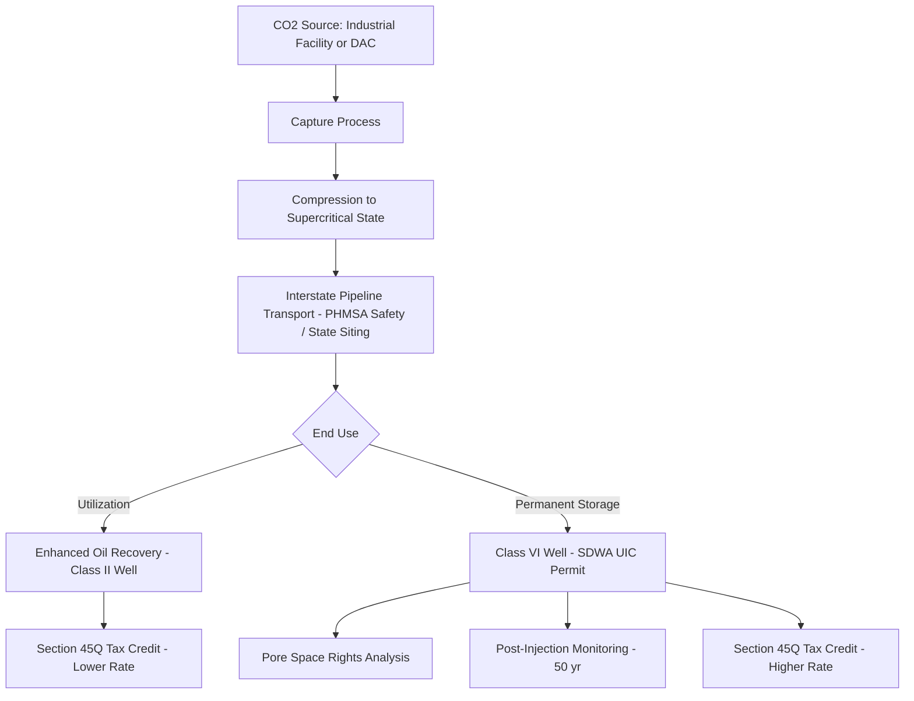
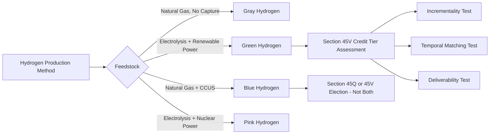

## Carbon Capture, Hydrogen, and Other Emerging Energy Technologies

### Overview and Regulatory Context

Emerging energy technologies sit at the intersection of environmental law, energy regulation, tax policy, and administrative permitting. Unlike mature energy sectors (oil and gas, conventional power generation), these technologies often lack a single dedicated regulatory framework, forcing regulators to adapt existing statutes — the Clean Air Act (CAA), Safe Drinking Water Act (SDWA), Clean Water Act (CWA), and Natural Gas Act (NGA) — to novel physical and chemical processes. This creates significant regulatory uncertainty, jurisdictional overlap, and permitting complexity that administrative lawyers must navigate.

The three technology clusters covered here — carbon capture, utilization, and storage (CCUS); hydrogen (production, transport, and use); and other emerging technologies (long-duration storage, small modular reactors, direct air capture) — share common legal themes: (1) classification disputes (is this waste, a pollutant, or a commodity?), (2) permitting under legacy statutes not designed for the technology, (3) federal-state jurisdictional friction, and (4) heavy reliance on tax incentives and subsidies as the primary demand driver rather than organic market forces.

### Carbon Capture, Utilization, and Storage (CCUS)

#### Technical Process Overview

CCUS involves three discrete stages, each triggering distinct legal regimes:

1. **Capture** — CO2 is separated from industrial exhaust streams (post-combustion, pre-combustion, or oxy-fuel combustion) or directly from ambient air (Direct Air Capture, or DAC).
2. **Transport** — Captured CO2 is compressed into a supercritical state and moved via pipeline (occasionally rail or ship) to a storage or utilization site.
3. **Storage/Utilization** — CO2 is either injected into deep geologic formations for permanent sequestration, or used as a feedstock (enhanced oil recovery, concrete curing, synthetic fuels).

#### Class VI Underground Injection Control (UIC) Permitting

The central regulatory chokepoint for geologic sequestration is the **Class VI well permit** under the SDWA's UIC program (40 C.F.R. Part 146, Subpart H).

**Key Points**

- Class VI wells are a distinct well class created specifically for CO2 sequestration, separate from Class II wells used for oil and gas-related injection (including CO2 for enhanced oil recovery, which typically remains Class II unless the primary purpose shifts to storage).
- EPA retains default primacy over Class VI permitting, but can delegate ("primacy") to states that demonstrate an equivalent program. As of the mid-2020s, states including North Dakota, Wyoming, Louisiana, and West Virginia have obtained Class VI primacy, allowing state-level permitting instead of EPA Region review.
- Permit applications require extensive technical demonstrations: area of review (AoR) modeling, geologic characterization of confining zones, financial responsibility instruments (for corrective action, closure, and 50-year post-injection monitoring), and emergency/remedial response plans.
- Permitting timelines have historically run 2-4 years at the EPA level, a frequently cited bottleneck; state primacy programs are promoted as a means of accelerating review.

**Example**

A Midwest ethanol consortium seeking to sequester fermentation-derived CO2 must (1) file a Class VI application with either EPA Region 5 or, if the well is sited in a primacy state, the state agency; (2) conduct AoR modeling showing the injected CO2 plume and pressure front will not endanger underground sources of drinking water (USDWs); (3) post financial assurance covering long-term stewardship; and (4) obtain separate CWA/CAA permits for any surface facilities.

#### Pore Space and Subsurface Property Rights

[Inference] Because CO2 sequestration is a relatively new subsurface use, most states lack a fully settled body of case law on **pore space ownership** — whether the right to inject and store CO2 in subsurface geologic formations belongs to the surface owner, the mineral estate owner, or is a distinct severable estate.

- A majority of states addressing the question by statute (e.g., Wyoming, North Dakota, Montana) have declared that pore space ownership vests in the surface estate owner unless expressly conveyed otherwise.
- This creates a live disjunction with mineral estate dominance doctrine, under which mineral owners historically enjoy an implied easement to use as much of the surface (and subsurface) as reasonably necessary for mineral development — raising conflict questions when a CO2 storage operator's subsurface plume intersects with an active oil/gas lease.
- Pooling and unitization statutes (analogous to oil and gas compulsory pooling) have been enacted in several states to allow a CCUS operator to compel non-consenting pore space owners within a storage unit to participate, subject to compensation — designed to prevent a single holdout from blocking large-scale sequestration projects.

#### Interstate CO2 Pipeline Regulation

CO2 pipelines occupy an unusual jurisdictional gap:

- Unlike natural gas pipelines (regulated by FERC under the NGA) or oil pipelines (regulated by FERC under the Interstate Commerce Act), **interstate CO2 pipelines for sequestration purposes are not comprehensively regulated by FERC** for rates and terms of service in the same manner.
- Safety regulation falls to the Pipeline and Hazardous Materials Safety Administration (PHMSA) under 49 C.F.R. Part 195, which historically classified CO2 pipelines by phase (gaseous vs. supercritical/liquid); PHMSA has been engaged in rulemaking to update safety standards following high-profile pipeline incidents.
- Siting authority for interstate CO2 pipelines defaults largely to state-level eminent domain and certificate-of-need processes, which vary considerably — some states extend common-carrier eminent domain powers to CO2 pipeline developers, others do not, producing a patchwork that complicates multi-state pipeline networks (the "CO2 pipeline buildout" problem frequently discussed in Midwest ethanol-to-sequestration projects).

#### Federal Tax Incentives: Section 45Q

**Key Points**

- Internal Revenue Code Section 45Q provides a per-metric-ton tax credit for qualified carbon capture and sequestration.
- The Inflation Reduction Act of 2022 substantially increased credit values and lowered qualifying capture thresholds, while extending the construction commencement deadline.
- Credit amounts differ based on end use: geologic sequestration without utilization generally receives a higher credit rate than EOR or utilization pathways, though the IRA narrowed this gap somewhat.
- 45Q interacts with direct pay and transferability provisions added by the IRA, allowing certain entities (including tax-exempt and governmental entities, for direct pay; and generally for transferability) to monetize credits without traditional tax equity structures.
- [Unverified] Specific current credit dollar amounts and threshold tonnage requirements should be verified against the current Internal Revenue Code text and IRS guidance, as these figures have been subject to legislative amendment and are subject to further change.

#### NEPA and Environmental Review

Federally funded or federally permitted CCUS projects (e.g., those requiring a federal Class VI permit issued by EPA directly, or receiving Department of Energy funding) trigger National Environmental Policy Act (NEPA) review, requiring an Environmental Assessment (EA) or Environmental Impact Statement (EIS) addressing induced seismicity risk, groundwater impacts, and environmental justice considerations for surrounding communities — an area of active litigation as environmental justice groups have challenged CCUS hub permitting on grounds of inadequate community engagement and cumulative impact analysis.

### Hydrogen

#### Production Pathways and the "Color" Taxonomy

Hydrogen is colorless as a molecule, but industry and regulatory shorthand classifies it by production method and associated carbon intensity:

- **Gray hydrogen** — produced via steam methane reforming (SMR) of natural gas, with no carbon capture; the current dominant global production method.
- **Blue hydrogen** — SMR or autothermal reforming (ATR) paired with CCUS to capture process emissions.
- **Green hydrogen** — produced via electrolysis powered by renewable electricity, splitting water into hydrogen and oxygen.
- **Pink hydrogen** — electrolysis powered by nuclear generation.
- [Inference] These color categories are industry/policy shorthand rather than fixed legal terms of art in most statutes; regulatory and tax frameworks increasingly use quantitative carbon-intensity (CI) scoring instead of color labels, since actual lifecycle emissions vary significantly by feedstock, electricity grid mix, and methane leakage assumptions.

#### Section 45V Clean Hydrogen Production Credit

**Key Points**

- IRC Section 45V, added by the Inflation Reduction Act, provides a tiered per-kilogram tax credit for clean hydrogen production, scaled inversely to the lifecycle greenhouse gas emissions of the production process (measured in CO2-equivalent per kilogram of hydrogen).
- The Treasury/IRS rulemaking implementing 45V has been a focal point of extensive comment and controversy, particularly around three conditions commonly referred to as "three pillars" for electrolytic (green) hydrogen to qualify for the highest credit tier:
  - **Incrementality** — the clean electricity used must generally come from new, additional generation resources rather than diverting existing clean generation from the grid.
  - **Temporal matching** — the clean electricity must be matched to hydrogen production on a time-correlated basis (moving toward hourly matching over an implementation phase-in period).
  - **Deliverability** — the generation resource must be located in a region deliverable to the electrolyzer (typically defined by regional grid/balancing authority boundaries).
- [Unverified] The precise phase-in timeline for hourly matching and specific regional deliverability definitions should be verified against final Treasury regulations in effect at the time of research, as this rulemaking has evolved through proposed and final rule stages.
- The 45V credit generally cannot be stacked with the 45Q carbon capture credit for the same hydrogen production process (a taxpayer must elect one or the other for a given facility).

**Example**

An electrolytic hydrogen developer proposing to co-locate a new wind farm with an electrolyzer must demonstrate: (1) the wind farm is a new, incremental resource (not an existing facility being repurposed), (2) hourly generation data matches hydrogen production timing once the applicable matching requirement takes effect, and (3) the wind farm sits within a qualifying deliverability region relative to the electrolyzer — all documented and attested to under IRS recordkeeping rules to substantiate the claimed credit tier.

#### Pipeline Safety and Blending

Hydrogen introduces distinct engineering and regulatory issues for existing natural gas infrastructure:

- **Hydrogen embrittlement** — hydrogen molecules are smaller than methane and can permeate and weaken certain steel pipeline materials over time, raising safety concerns for blending hydrogen into existing natural gas pipeline networks above certain concentration thresholds.
- PHMSA regulates hydrogen pipeline safety under 49 C.F.R. Part 192 (for gaseous hydrogen, treated similarly to natural gas) and is engaged in ongoing rulemaking specific to hydrogen blending limits, given that most existing pipeline infrastructure was engineered and certified for natural gas alone.
- State public utility commissions face novel questions about whether blended or dedicated hydrogen delivered through regulated gas utility infrastructure falls within traditional public utility ratemaking and cost-recovery frameworks.

#### Hydrogen Hubs and Federal Funding

The Bipartisan Infrastructure Law authorized the Department of Energy's Regional Clean Hydrogen Hubs (H2Hubs) program, funding regional hydrogen production, transport, and end-use networks. **Key Points**:

- Recipients must navigate NEPA review as a condition of federal funding, in addition to underlying state and federal permits for individual facility components (electrolyzers, pipelines, storage).
- Hub projects have drawn environmental justice scrutiny, particularly where blue hydrogen (fossil-fuel-based with CCUS) hubs are proposed near environmental justice communities, prompting community benefit agreement requirements as a condition of federal funding in several hub awards.

### Other Emerging Energy Technologies

#### Long-Duration Energy Storage (LDES)

- Includes technologies beyond conventional lithium-ion batteries: flow batteries, compressed air energy storage (CAES), thermal storage, and gravity-based storage.
- Regulatory treatment of storage as a distinct asset class (rather than generation or transmission) has been a recurring FERC and state public utility commission issue; FERC Order No. 841 required RTOs/ISOs to establish market rules allowing electric storage resources to participate in wholesale capacity, energy, and ancillary services markets.
- Standalone storage's classification for interconnection queue purposes and cost allocation continues to be litigated and clarified at both FERC and state levels.

#### Small Modular Reactors (SMRs)

- SMRs are licensed by the Nuclear Regulatory Commission (NRC), primarily under 10 C.F.R. Part 52 (combined construction and operating license) and increasingly under Part 53, a newer risk-informed, technology-inclusive licensing framework the NRC has developed specifically to accommodate advanced reactor designs, including SMRs, that differ substantially from traditional large light-water reactors.
- **Key Points**: SMR licensing raises distinct administrative law questions around design certification reuse (standardized designs pre-approved for repeated deployment), reduced emergency planning zone (EPZ) requirements proposed for smaller reactors, and NRC's phased licensing approach intended to reduce regulatory risk for first-mover developers.
- [Inference] Because Part 53 and related SMR-specific guidance remain in active development and early application, specific procedural timelines and evidentiary standards should be treated as evolving rather than settled administrative practice.

#### Direct Air Capture (DAC)

- A subset of carbon capture distinguished by capturing CO2 directly from ambient air rather than a concentrated industrial point source, typically using large fan-and-sorbent or liquid-solvent systems.
- DAC facilities still require Class VI UIC permits if paired with geologic storage, and are eligible for the higher-tier 45Q credit rate applicable to direct air capture (which IRA set at a materially higher per-ton rate than point-source capture, reflecting the higher cost and lower CO2 concentration DAC must process).
- The Department of Energy's Regional DAC Hubs program (also funded under the Bipartisan Infrastructure Law) parallels the hydrogen hub structure, again layering NEPA review atop underlying state/federal permitting.

### Cross-Cutting Administrative Law Themes

#### Major Questions Doctrine Exposure

[Inference] Given the Supreme Court's application of the major questions doctrine in *West Virginia v. EPA* (2022) to constrain EPA's authority to mandate generation-shifting under the CAA, emerging energy technology regulations that rely on ambitious or novel readings of existing statutory authority (for example, aggressive interpretations of CAA authority to indirectly mandate CCUS deployment, or expansive SDWA authority over pore space) carry litigation risk under similar reasoning, though courts have not uniformly applied the doctrine to every agency action in this space, and its precise boundaries remain contested.

#### State Primacy and Cooperative Federalism

Both Class VI UIC primacy and potential future federal-state splits in hydrogen pipeline safety oversight reflect a broader cooperative federalism pattern in U.S. environmental law: federal minimum standards administered through delegated state programs, creating variation in permitting speed, technical rigor, and public participation procedures across states — a recurring point of comparison in administrative law coursework alongside CAA State Implementation Plans (SIPs) and CWA NPDES state permitting delegation.

#### Environmental Justice and Public Participation

Across CCUS, hydrogen, and DAC hub siting, environmental justice objections have centered on: (1) inadequate public notice and comment periods for technically dense permit applications, (2) cumulative impact concerns where new infrastructure is sited near existing pollution burdens, and (3) disputes over whether federal funding conditions (community benefit agreements, labor and equity commitments) are legally enforceable commitments or non-binding policy aspirations. [Inference] The enforceability question is likely to generate continued administrative and judicial disputes as more hub projects move from award to construction phases.

### Illustrative Regulatory Pathway (SVG Diagram)

<svg xmlns="http://www.w3.org/2000/svg" viewBox="0 0 900 460">
\<style\>
.box { fill: #f0f4f8; stroke: #2c3e50; stroke-width: 2; }
.boxalt { fill: #e8f0e8; stroke: #2c3e50; stroke-width: 2; }
.txt { font-family: Arial, sans-serif; font-size: 13px; fill: #1a1a1a; }
.txtsmall { font-family: Arial, sans-serif; font-size: 11px; fill: #333333; }
.title { font-family: Arial, sans-serif; font-size: 16px; fill: #1a1a1a; font-weight: bold; }
.arrow { stroke: #2c3e50; stroke-width: 2; fill: none; marker-end: url(#arrowhead); }
\</style\>
<text x="450" y="28" text-anchor="middle" class="title">CCUS Project Permitting Pathway (svg_diagram)</text>
<rect x="30" y="55" width="180" height="60" class="box" />
<text x="120" y="80" text-anchor="middle" class="txt">Project Design</text>
<text x="120" y="98" text-anchor="middle" class="txtsmall">Capture + Pipeline + Well</text>
<rect x="260" y="55" width="180" height="60" class="boxalt" />
<text x="350" y="80" text-anchor="middle" class="txt">Class VI UIC Permit</text>
<text x="350" y="98" text-anchor="middle" class="txtsmall">EPA or Primacy State</text>
<rect x="490" y="55" width="180" height="60" class="box" />
<text x="580" y="80" text-anchor="middle" class="txt">Pipeline Siting</text>
<text x="580" y="98" text-anchor="middle" class="txtsmall">State Eminent Domain / PHMSA</text>
<rect x="720" y="55" width="150" height="60" class="boxalt" />
<text x="795" y="80" text-anchor="middle" class="txt">Pore Space Rights</text>
<text x="795" y="98" text-anchor="middle" class="txtsmall">State Property Law</text>
<line x1="210" y1="85" x2="255" y2="85" class="arrow" />
<line x1="440" y1="85" x2="485" y2="85" class="arrow" />
<line x1="670" y1="85" x2="715" y2="85" class="arrow" />
<rect x="30" y="170" width="180" height="60" class="box" />
<text x="120" y="195" text-anchor="middle" class="txt">NEPA Review</text>
<text x="120" y="213" text-anchor="middle" class="txtsmall">If Federal Nexus</text>
<rect x="260" y="170" width="180" height="60" class="boxalt" />
<text x="350" y="195" text-anchor="middle" class="txt">Financial Assurance</text>
<text x="350" y="213" text-anchor="middle" class="txtsmall">Closure + 50yr Monitoring</text>
<rect x="490" y="170" width="180" height="60" class="box" />
<text x="580" y="195" text-anchor="middle" class="txt">Public Comment</text>
<text x="580" y="213" text-anchor="middle" class="txtsmall">EJ + Community Input</text>
<rect x="720" y="170" width="150" height="60" class="boxalt" />
<text x="795" y="195" text-anchor="middle" class="txt">Permit Issuance</text>
<text x="795" y="213" text-anchor="middle" class="txtsmall">Or Denial / Appeal</text>
<line x1="120" y1="115" x2="120" y2="165" class="arrow" />
<line x1="210" y1="200" x2="255" y2="200" class="arrow" />
<line x1="440" y1="200" x2="485" y2="200" class="arrow" />
<line x1="670" y1="200" x2="715" y2="200" class="arrow" />
<rect x="260" y="290" width="380" height="70" class="box" />
<text x="450" y="318" text-anchor="middle" class="txt">Construction and Injection Operations</text>
<text x="450" y="338" text-anchor="middle" class="txtsmall">AoR Modeling Validation, MRV Plan, Section 45Q Credit Claim</text>
<line x1="795" y1="230" x2="795" y2="270" class="arrow" />
<line x1="795" y1="270" x2="450" y2="270" class="arrow" />
<line x1="450" y1="270" x2="450" y2="285" class="arrow" />
<rect x="300" y="400" width="300" height="50" class="boxalt" />
<text x="450" y="422" text-anchor="middle" class="txt">Post-Injection Site Care</text>
<text x="450" y="438" text-anchor="middle" class="txtsmall">50-Year Monitoring, Site Closure Certification</text>
<line x1="450" y1="360" x2="450" y2="395" class="arrow" />
</svg>

### Conclusion

Carbon capture, hydrogen, and adjacent emerging energy technologies illustrate a recurring administrative law pattern: rapidly evolving technology outpacing purpose-built statutory frameworks, forcing regulators to stretch legacy environmental statutes (SDWA, CAA, NGA equivalents) to fit novel physical processes. Practitioners must track parallel developments across at least four regulatory tracks simultaneously — federal environmental permitting (EPA/Class VI), federal safety regulation (PHMSA/NRC), state property and utility law (pore space, pipeline siting, ratemaking), and federal tax policy (45Q, 45V) — while anticipating that major questions doctrine challenges, primacy delegation disputes, and environmental justice litigation will continue to shape how quickly these technologies can be permitted and deployed at scale.

**Related Topics**

- Underground Injection Control (UIC) program and Safe Drinking Water Act primacy delegation generally
- Federal Power Act and Natural Gas Act jurisdictional boundaries (FERC vs. state PUC authority)
- Major questions doctrine post-*West Virginia v. EPA* and its application to energy regulation
- NEPA environmental review procedures and categorical exclusions
- Environmental justice mapping tools and cumulative impact analysis in permitting
- Mineral estate dominance doctrine and subsurface property conflicts
- Renewable Portfolio Standards and Clean Electricity Standards interaction with hydrogen/CCUS incentives
- NRC advanced reactor licensing reform (10 C.F.R. Part 53)
- Environmental justice community benefit agreements in federal grant conditions