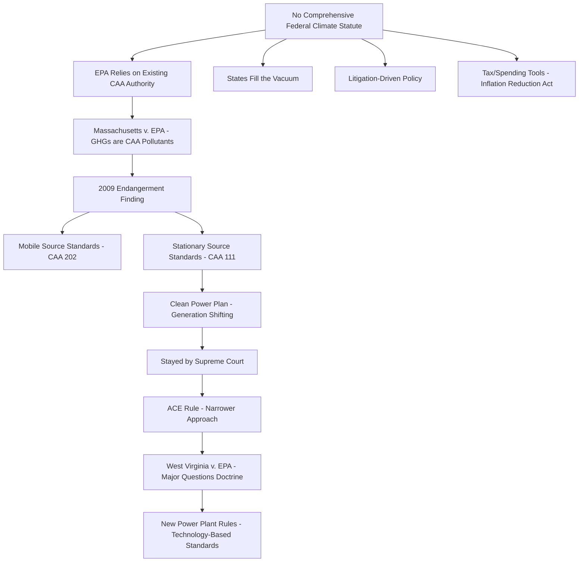

## The Absence of Comprehensive Federal Climate Legislation and Its Regulatory Consequences

### Overview

The United States has never enacted an economy-wide statute directly regulating greenhouse gas (GHG) emissions comparable to the Clean Air Act's treatment of criteria pollutants or the Clean Water Act's treatment of water pollutants. No federal cap-and-trade program, carbon tax, or comprehensive climate statute has been enacted at the national level, despite multiple legislative attempts. This legislative gap has not left the field unregulated — instead, it has produced a fragmented, litigation-heavy regulatory landscape built on: (1) EPA's use of existing Clean Air Act authority to regulate GHGs as a "pollutant" through statutory reinterpretation and rulemaking, (2) state-level climate programs filling the vacuum with significant interstate variation, (3) an unusually large role for federal courts in defining the scope of agency authority, and (4) a shift toward using tax and spending policy (rather than direct regulation) as the primary tool of federal climate policy, exemplified by the Inflation Reduction Act of 2022.

This topic is foundational to understanding U.S. climate law because nearly every other doctrine in the field — *Massachusetts v. EPA*, the Clean Power Plan litigation, *West Virginia v. EPA*, state common-law nuisance suits, and the IRA's incentive-based architecture — is a direct downstream consequence of Congress's failure to legislate comprehensively.

### The Legislative History of Failed Comprehensive Climate Bills

**Key Points**

- The most prominent attempt was the **American Clean Energy and Security Act of 2009** (Waxman-Markey), which passed the House of Representatives but died in the Senate without a floor vote. It proposed an economy-wide cap-and-trade system for GHG emissions modeled loosely on the CAA's Acid Rain Program.
- Earlier and later cap-and-trade and carbon-pricing proposals (e.g., various Senate carbon tax and fee-and-dividend bills) similarly failed to achieve the 60-vote threshold needed to overcome Senate filibuster rules.
- [Inference] The recurring failure pattern reflects several structural factors frequently cited in the legislative and political science literature: the Senate filibuster's supermajority requirement, regional economic disparities in fossil fuel dependence creating cross-party and intra-party opposition, and the diffuse, long-term nature of climate costs relative to concentrated, near-term costs imposed on specific industries and regions.
- The Inflation Reduction Act (2022) represents the most significant federal climate-related legislation to date, but it is fundamentally different in structure from a comprehensive climate statute: it relies on tax credits, grants, and loan programs (a "carrots" approach) rather than direct emissions caps, performance standards, or a carbon price (a "sticks" or market-mechanism approach). It passed through the budget reconciliation process, which allowed Senate passage with a simple majority but constitutionally limited its content to provisions with a primarily budgetary effect (per the Senate's Byrd Rule), precluding the kind of direct regulatory mandates a comprehensive climate statute would contain.

### EPA's Reliance on Existing Clean Air Act Authority

#### *Massachusetts v. EPA* (2007) as the Foundational Case

In the absence of climate-specific legislation, the Supreme Court held in *Massachusetts v. EPA* that GHGs fall within the CAA's broad definition of "air pollutant," and that EPA therefore has authority — and, upon a proper "endangerment finding," a duty — to regulate GHG emissions from new motor vehicles under CAA Section 202(a).

**Key Points**

- This case did not create new legislative authority; it interpreted a 1970 (as amended) statute never drafted with climate change in mind, extending its scope to a pollutant class Congress did not explicitly contemplate.
- Following the decision, EPA issued its 2009 **Endangerment Finding**, concluding GHG emissions from new motor vehicles endanger public health and welfare — the factual and legal predicate that has since been used to justify GHG regulation across multiple CAA programs (mobile sources, stationary sources under the Prevention of Significant Deterioration/Title V permitting programs, and power plant performance standards).
- [Inference] Because this entire regulatory edifice rests on statutory interpretation of a decades-old law rather than a purpose-built climate statute, it remains perpetually vulnerable to challenge on textual and structural grounds — a vulnerability comprehensive legislation would have foreclosed.

#### CAA Section 111 and Stationary Source Performance Standards

CAA Section 111(d) authorizes EPA to set performance standards for existing stationary sources (such as power plants) for pollutants not otherwise regulated under the National Ambient Air Quality Standards or hazardous air pollutant programs — a provision EPA has used as its primary tool for regulating GHG emissions from the power sector, given the absence of any statute designed specifically for this purpose.

- The **Clean Power Plan** (2015) attempted to use Section 111(d) to require "generation shifting" — i.e., encouraging a shift in the overall generation mix from coal to natural gas and renewables — rather than only requiring "inside the fenceline" efficiency improvements at individual facilities. It was stayed by the Supreme Court before taking effect and never implemented.
- The Trump administration's **Affordable Clean Energy (ACE) Rule** replaced the Clean Power Plan with a narrower approach limited to heat-rate efficiency improvements at individual coal plants, rejecting generation-shifting as beyond Section 111(d) authority.
- In ***West Virginia v. EPA*** (2022), the Supreme Court held that EPA's generation-shifting approach in the Clean Power Plan implicated the **major questions doctrine** — the principle that agencies must point to clear congressional authorization for actions of vast economic and political significance — and that Section 111(d) did not clearly authorize EPA to restructure the nation's electricity generation mix.
- [Inference] *West Virginia v. EPA* is widely read as a direct consequence of the legislative gap: because Congress never enacted a statute clearly authorizing sector-wide decarbonization mandates, EPA was forced to rely on an ambiguous, decades-old provision, and the Court concluded that ambiguity could not support so consequential a regulatory program.
- Following *West Virginia v. EPA*, EPA issued new power plant GHG rules relying more narrowly on technology-based standards (e.g., carbon capture and co-firing with lower-emission fuels as the "best system of emission reduction" for existing coal and new gas plants) rather than generation-shifting, in an effort to operate within the doctrine's constraints. [Unverified] The final content, compliance deadlines, and litigation status of these rules should be verified against current EPA rulemaking dockets, as this area has continued to evolve through subsequent rulemaking and litigation cycles.

### The Major Questions Doctrine as a Structural Constraint

**Key Points**

- The major questions doctrine, substantially clarified in *West Virginia v. EPA*, holds that when an agency claims the power to make decisions of vast economic and political significance, courts will not defer to an agency's interpretation of ambiguous statutory text and instead require clear congressional authorization.
- [Inference] The doctrine functions as a structural feedback loop tied directly to the absence of comprehensive legislation: the more EPA relies on old, general statutory language to address climate change (because Congress has not supplied specific authority), the more exposed those rules become to major questions challenges, since reliance on general or ambiguous provisions is itself often treated by courts as evidence the assertion of authority is not "clearly" authorized.
- This dynamic has been extended beyond EPA rulemaking in subsequent litigation testing agency authority in adjacent areas (such as SEC climate disclosure rules and other agency climate-related actions), with parties invoking similar reasoning to challenge agency assertions of authority grounded in general statutory provisions.
- [Speculation] Some commentators argue this doctrine will make it functionally difficult for any executive agency to implement ambitious climate policy without new legislation, effectively forcing climate policy back to Congress; others dispute how broadly the doctrine will be applied going forward. This remains a contested and evolving area of administrative law scholarship and litigation.

### State-Level Regulatory Fragmentation

In the absence of federal comprehensive legislation, states have developed materially different climate regulatory regimes, producing a patchwork rather than a uniform national approach:

- **Cap-and-trade systems**: California's Cap-and-Trade Program (linked with Quebec) and the Regional Greenhouse Gas Initiative (RGGI), a multi-state Northeast/Mid-Atlantic power sector cap-and-trade program, represent functioning state/regional carbon markets in the absence of a federal equivalent.
- **Clean Electricity/Renewable Portfolio Standards**: A majority of states have enacted Renewable Portfolio Standards or Clean Electricity Standards mandating specified percentages of renewable or zero-carbon generation, with substantial variation in stringency, technology eligibility, and enforcement mechanisms.
- **State climate disclosure and reporting laws**: California's climate corporate disclosure laws (requiring large companies doing business in the state to disclose Scope 1, 2, and (on a delayed timeline) Scope 3 GHG emissions) illustrate states using corporate law and market-based disclosure mechanisms to drive climate policy nationally, given companies' practical inability to maintain separate reporting systems per state.
- **State common-law and statutory climate litigation**: Numerous states and municipalities have filed public nuisance, consumer protection, and failure-to-warn suits against fossil fuel companies seeking damages for climate-related harms, an alternative accountability mechanism that has proliferated partly because no comprehensive federal liability or compensation scheme exists.
- [Inference] This fragmentation creates significant compliance burden and legal uncertainty for multi-state businesses, and has generated its own set of preemption and dormant Commerce Clause disputes, as parties argue that state climate programs impermissibly regulate conduct outside state borders or conflict with federal authority.

### Litigation as the De Facto Policy-Making Forum

**Key Points**

- Because Congress has not legislated comprehensively, the scope, pace, and content of federal climate regulation has been substantially shaped by litigation outcomes rather than statutory text — *Massachusetts v. EPA*, the Clean Power Plan stay, *West Virginia v. EPA*, and ongoing challenges to subsequent EPA rules all functioned as de facto policy-setting events.
- This produces significant regulatory instability: major climate rules have been enacted, stayed, replaced, and re-litigated across multiple presidential administrations, with each new administration frequently rescinding or substantially revising its predecessor's climate rules through new notice-and-comment rulemaking, since no statutory floor locks in a particular regulatory approach.
- [Inference] This cycle of rulemaking, litigation, and rescission is itself a direct symptom of the underlying legislative gap: durable climate policy in the U.S. energy and environmental law literature is frequently described as requiring either new legislation or a sufficiently entrenched judicial doctrine, since executive rulemaking alone has proven unstable across administrations.

### Federal Climate Policy Through Tax and Spending: The IRA Model

Given the political and doctrinal constraints on direct regulation, federal climate policy has increasingly shifted toward the tax code and spending programs as the primary implementation vehicle:

- The Inflation Reduction Act's climate provisions operate through tax credits (e.g., Section 45Q carbon capture credits, Section 45V clean hydrogen credits, extended and modified renewable energy production and investment tax credits, and consumer/manufacturer incentives for electric vehicles and clean energy manufacturing), rather than emissions limits or performance standards.
- **Key Points on the incentive-based approach**:
  - It avoids major questions doctrine exposure to a significant degree, since Congress itself enacted the specific incentive structure through ordinary legislation (via reconciliation), rather than an agency asserting authority under an old statute.
  - It is inherently voluntary and market-driven rather than mandatory — actors respond to incentives but face no compulsory emissions ceiling, meaning the IRA does not guarantee any specific aggregate emissions outcome the way a binding cap-and-trade or performance standard system would.
  - [Inference] Because it relies on continued political and budgetary support (appropriations, credit eligibility rules, and potential future legislative amendment or repeal), the durability of IRA-based climate policy is arguably more exposed to shifts in Congressional control than a regulatory mandate embedded in a standing environmental statute would be, though repeal of enacted tax provisions also requires new legislation and faces its own political economy constraints.

### International and Comparative Context

**Key Points**

- The U.S. approach contrasts with jurisdictions that have enacted comprehensive climate framework statutes — for example, the EU's Emissions Trading System (an economy-wide cap-and-trade program established by directive) and the UK's Climate Change Act (which sets legally binding economy-wide carbon budgets).
- [Inference] The absence of a comparable binding, economy-wide U.S. federal framework has been cited in international climate negotiations and comparative law scholarship as a structural distinguishing feature of U.S. climate governance, though this is a matter of ongoing policy debate rather than a settled legal conclusion, and characterizations of relative "adequacy" across cited frameworks are contested.

### Practical and Administrative Law Implications

**Example**

A multistate manufacturing company evaluating GHG compliance risk must simultaneously track: (1) federal CAA-based rules applicable to its stationary sources (subject to ongoing litigation and potential rescission), (2) state-specific cap-and-trade or RPS obligations in any state where it operates or sells into a regulated market, (3) mandatory climate disclosure obligations under state corporate disclosure statutes if it meets applicable revenue thresholds, (4) potential exposure to state common-law nuisance or consumer protection litigation, and (5) eligibility requirements for federal tax credits under the IRA if it seeks to monetize clean energy investments — a compliance burden considerably more complex than would exist under a single comprehensive federal statute with preemptive effect.

**Conclusion**

The absence of comprehensive federal climate legislation has not resulted in a regulatory vacuum but rather in a distinctive, if unstable, alternative structure: statutory reinterpretation of the Clean Air Act, an outsized judicial role in defining the limits of agency authority (culminating in the major questions doctrine), a fragmented patchwork of state programs, extensive private and governmental litigation functioning as a substitute policy-making forum, and — most recently — a pivot toward tax and spending incentives as the primary federal climate policy tool. Each of these consequences is best understood not as an independent development but as a direct structural response to Congress's persistent inability to pass a purpose-built, economy-wide climate statute.

**Related Topics**

- *Massachusetts v. Environmental Protection Agency* (2007) — full case analysis and doctrinal legacy
- *West Virginia v. Environmental Protection Agency* (2022) and the major questions doctrine in depth
- The Clean Power Plan, ACE Rule, and post-*West Virginia* power plant GHG rules compared
- State climate litigation against fossil fuel companies (public nuisance and consumer protection theories)
- California Cap-and-Trade Program and the Regional Greenhouse Gas Initiative (RGGI)
- The Inflation Reduction Act's climate tax credit architecture (Sections 45Q, 45V, 48, 45X)
- State corporate climate disclosure statutes and SEC climate disclosure rulemaking
- Dormant Commerce Clause and preemption challenges to state climate programs
- Comparative climate law: EU Emissions Trading System and UK Climate Change Act